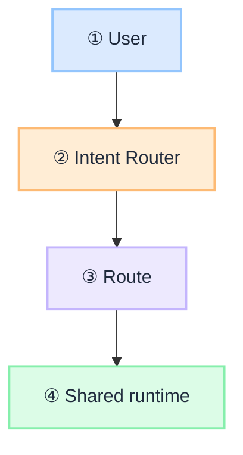

# Write insight

Two-phase workflow. **Phase 1 proposes only — no files created.** Phase 2 runs after explicit approval.

## Scope

**Insights only.** Creates and scaffolds articles under `docs/insights/`. Companion cross-links in proposals and scaffolds are **`/insights/…` only** — scan `docs/insights/**/*.mdx` for series pairs and `:::info[Builds on]` targets. Finished insights **may** also link to G.A.I.N, blueprints, and playbooks. Those docs must never link back (`docs-link-direction.mdc`).

**Folder convention:** `{YYYY-MM-DD}-{slug}/` on disk (e.g. `2026-07-02-what-is-agentic-loop/`). Series nesting: `system-design` → `docs/insights/system-design/…`; `under-the-hood` → `docs/insights/under-the-hood/…`. If both series tags are present, prefer `system-design`. URL and frontmatter `slug:` stay **without** the date or series prefix (`what-is-agentic-loop` → `/insights/what-is-agentic-loop`).

**Rule = shape.** Read `.cursor/rules/insights-article-structure.mdc` for article types and open/close requirements. This skill orchestrates creation; it does not duplicate that rule.

**Companion skills:** `@remove-draft` to publish and add inbound links from **other insights** after the article is ready. Never add links from G.A.I.N, blueprints, or playbooks.

## Invoke

- **`@write-insight`** — attach this skill, then describe the topic or paste a brief
- **`/write-insight`** — if a slash command exists

## Related rules (apply on every insight)

| Rule | Scope |
| --- | --- |
| `insights-article-structure.mdc` | Type, open/close sections, hero image |
| `site-image-chrome.mdc` | G.A.I.N mark (top left) + `jitendersharma.dev` (bottom right) on every generated PNG |
| `insights-tags.mdc` | Tag layers, counts, and IDs from `tags.yml` |
| `no-em-dash-content.mdc` | Prose in body, title, description |
| `collapsible-code-blocks-docs.mdc` | Fenced code → `<Details>` (not mermaid) |
| `mermaid-spacing-docs.mdc` | `<br/>` after every mermaid fence; color nodes with `classDef` |
| `no-links-to-draft-articles.mdc` | No inbound links from published pages while `draft: true` |
| `docs-link-direction.mdc` | Insights may link to G.A.I.N / blueprints / playbooks; never the reverse |

Tag vocabulary: `.cursor/rules/insights-tags.mdc` (source: `docs/insights/tags.yml`).

Scaffolds: [template.mdx](template.mdx) · [decision-guide example](examples/decision-guide.mdx) · [concept-primer example](examples/concept-primer.mdx)

### Mermaid diagrams (when the article has any)

Keep mermaid **visible** (do not wrap in `<Details>`). After every closing fence, put `<br/>` on its own line (`.cursor/rules/mermaid-spacing-docs.mdc`).

**Color every node.** Unstyled mermaid defaults to grey and reads as unfinished. Assign `classDef` roles so layers are visually distinct. Reuse this G.A.I.N palette (same fills as frameworks / design-intent-router):

| Role | Typical nodes | `classDef` |
| --- | --- | --- |
| Actor / input | User, client, request | `fill:#dbeafe,stroke:#93c5fd,color:#1e293b,stroke-width:2px` |
| Gate | Router, policy, PEP, safety | `fill:#ffedd5,stroke:#fdba74,color:#1e293b,stroke-width:2px` |
| Process | Routes, agents, LLM, runtime steps | `fill:#ede9fe,stroke:#c4b5fd,color:#1e293b,stroke-width:2px` |
| Shared / platform | Shared runtime, policy platform, state | `fill:#dcfce7,stroke:#86efac,color:#1e293b,stroke-width:2px` |
| Action / source | Tool execution, catalogs, sources | `fill:#fef3c7,stroke:#fcd34d,color:#1e293b,stroke-width:2px` |



Map each node to a role with `class NodeName role`. Do not invent a new hex set per article. Insights stay as a bare ` ```mermaid ` fence (no `gain-mermaid` wrapper; that is for framework pages).

---

## Phase 1 — Propose (no edits)

### 1. Gather intent

From the user brief, infer:

- Topic and audience (enterprise architect, regulated industry, etc.)
- Article type (see picker below)
- Companion pieces (primer ↔ design guide, parent ↔ deep dive)
- Whether code blocks or mermaid are likely

If the brief is too thin, ask **one** focused question (audience or decision vs breakdown).

### 2. Classify article type

Use `.cursor/rules/insights-article-structure.mdc`:

| Signal | Type |
| --- | --- |
| "how to choose", "vs", "options", "design guide" | **Decision guide** |
| "one request", "end to end", "architecture breakdown" | **Architecture breakdown** |
| "what is", "why it matters" (concept, not how-to) | **Concept primer** |
| Stages, lifecycle, "under the hood" | **Explainer** |
| Executive, maturity, "questions to ask" | **Executive / long-form** |

When unsure: **architecture breakdown** for trace/wire articles; **decision guide** for comparison matrices.

### 3. Propose slug and path

**Slug:** lowercase kebab-case, 3–6 words, stable URL (`/insights/{slug}`). Prefer topic over date. The slug does **not** include the date prefix.

**Date:** `YYYY-MM-DD` for frontmatter `date:` and the folder prefix. Use today's date unless the user specifies another publish date.

**Folder:** `docs/insights/{YYYY-MM-DD}-{slug}/` (e.g. `docs/insights/2026-07-02-what-is-agentic-loop/`). Series: `system-design` → `docs/insights/system-design/{YYYY-MM-DD}-{slug}/`; `under-the-hood` → `docs/insights/under-the-hood/{YYYY-MM-DD}-{slug}/` (`system-design` wins if both).

**File:** `{slug}.mdx` inside the dated folder (filename matches slug only; same basename as PNG)

**PNG:** `{slug}.png` co-located in the dated folder (no date in the image filename)

Check for collisions: grep `docs/insights` for existing `slug:` in frontmatter (folder name may differ).

### 4. Propose tags

Follow `.cursor/rules/insights-tags.mdc` (source: `docs/insights/tags.yml`):

| Layer | Count | IDs |
| --- | --- | --- |
| **Voice** | exactly **1** | `pov` · `arch` · `lrn` · `exp` |
| **Domain** | **exactly 1** | `system-architecture` · `platforms-engineering` · `ai-intelligence` · `governance-trust` |
| **Topic** | **1+** | `gain` · `agents` · `observability` · `policy` · `llm` · `rag` · `hallucinations` · `compliance` |

Order in frontmatter: domain → voice → topic.

### 5. Propose frontmatter

```yaml
slug: {slug}
title: {title}
description: "{one line; quote if value contains colon}"
image: ./{slug}.png
tags:
  - {domain}
  - {voice}
  - {topic-1}
  - {topic-2}
authors: [iamsharmajitender]
draft: true
homepage: false   # optional: set for series that must stay off homepage cards (e.g. Under the Hood foundations)
date: {YYYY-MM-DD}
```

Always start with **`draft: true`**. Never add inbound links from published pages until `@remove-draft`.

**Homepage cards:** `latestInsights.generated.ts` never lists drafts. Insights that should stay off the home strip even after publish must set **`homepage: false`** (see `.cursor/rules/insights-homepage.mdc`). Under the Hood Internet-foundations articles use this. Do not run sync expecting `--include-drafts` to put drafts on the homepage.

### 6. Propose section outline

Scaffold open/close from the classified type:

| Type | Open (after truncate) | Close |
| --- | --- | --- |
| Decision guide | `:::tip[THE CLAIM]` + `## The bottom line first` | `## Key takeaways` + `:::info[Builds on]` |
| Architecture breakdown | `:::tip[THE CLAIM]` | `:::tip[TAKEAWAY]` or `## Where I land` |
| Concept primer | `:::tip[THE CLAIM]` + `## The bottom line first` | `## Key takeaways` + `:::info[Builds on]` |
| Explainer | short intro; claim optional per stage | `## Final takeaway` or final `:::tip[TAKEAWAY]` |
| Executive | `## The bottom line first` | action section (questions, maturity, series link) |

**Universal skeleton (all types):**

1. Frontmatter
2. `` — hero banner, before `#` title
3. `# {title}`
4. Opening hook (1–3 paragraphs)
5. Optional type label line (`This is a **decision guide**: …`)
6. `:::tip[THE CLAIM]` (or `:::tip[THE EXECUTIVE TAKE]` for executive)
7. `<!-- truncate -->`
8. Body sections (proposed `##` headings only in Phase 1)
9. Closing per type table above

Do not stack `## Summary`, `## Key takeaways`, and `:::tip[TAKEAWAY]` with the same bullets.

### 7. Propose outbound links (insights only)

Search **`docs/insights/`** only. List **published-only** `/insights/{slug}` links for the scaffold:

| Look for | Example |
| --- | --- |
| Primer ↔ design guide pair | `what-is-intent-router` → `design-intent-router` |
| Parent ↔ deep dive | `how-llm-works-under-the-hood` → `before-training-an-llm` |
| Foundation → enforcement | `rag-is-not-a-database` → `retrieval-is-a-governed-action` |
| Same topic cluster | PGAR, agentic loop, intent router, eval engineering |

If a companion insight is still `draft: true`, use plain text + "(coming soon)" — no link.

Finished articles may also link to `/frameworks/…`, `/blueprints/…`, and `/playbooks/…`. Do not propose the reverse.

### 8. Propose hero PNG (required)

Every proposal includes a hero image spec. Phase 2 **always** generates the PNG.

| Field | Value |
| --- | --- |
| **Path** | `docs/insights/{YYYY-MM-DD}-{slug}/{slug}.png` |
| **Aspect** | 16:9 (`aspect_ratio: "16:9"` on GenerateImage) |
| **Style** | G.A.I.N infographic palette: dark navy grid background, subtle technical grid floor, blue / purple / orange accent glows, clean sans-serif title text, isometric or flat diagram nodes with connector arrows |
| **Chrome (required)** | Follow `.cursor/rules/site-image-chrome.mdc`. Bake chrome into the original GenerateImage: leave clear empty space top-left for the G.A.I.N mark and bottom-right for **jitendersharma.dev**; do not place the article title or labels in those corners. Top left: G.A.I.N mark (circle + hex wireframe + wordmark **G.A.I.N**). Bottom right: **jitendersharma.dev**. No slogan under the logo. Never **gain.inc**. Do not overlay chrome after generation. Never run overlay/compositing scripts on new heroes. |
| **Alt text** | Short, descriptive, no em dashes (matches hero `` in MDX) |
| **Concept** | One-line visual brief tied to the article claim (e.g. pipeline stages, platform ring, comparison metaphor) |

**Visual patterns by type (pick one that fits):**

| Type | Typical hero concept |
| --- | --- |
| Concept primer | Central concept node with 3–5 labeled stages or pillars around it |
| Architecture breakdown | Left-to-right pipeline or layered platform diagram |
| Decision guide | Split comparison, decision tree, or option matrix metaphor |
| Explainer | Staged lifecycle flow (step 1 → step 2 → …) |
| Executive | Maturity ladder, control loop, or governance ring around AI core |

Reference existing heroes for style consistency (read one PNG from `docs/insights/` in the same topic cluster before generating).

### 9. Present the proposal report

Use this format exactly. **Do not create files.**

```markdown
## Proposed insight: {title}

### Identity

| Field | Value |
| --- | --- |
| **Slug** | `{slug}` |
| **URL** | `/insights/{slug}` |
| **Date** | `{YYYY-MM-DD}` |
| **Folder** | `docs/insights/{YYYY-MM-DD}-{slug}/` |
| **File** | `{slug}.mdx` |
| **Type** | {decision guide \| architecture breakdown \| …} |
| **Status** | `draft: true` |

### Frontmatter

\`\`\`yaml
{full proposed frontmatter}
\`\`\`

### Tags

| Layer | Tags |
| --- | --- |
| Voice (1) | `{voice}` |
| Domain (1) | `{domain tag}` |
| Topic (1+) | `{topic tags}` |

### Section outline

1. {Opening hook — one line}
2. `:::tip[THE CLAIM]` — {one-line summary}
3. `<!-- truncate -->`
4. `## {first body section}`
5. `## {second body section}`
   …
N. {Closing section per type}

### Outbound links (insights only, published)

| Target | Section |
| --- | --- |
| `/insights/policy-governed-agent-runtime` | Opening hook |
| `/insights/what-is-agentic-loop` | `:::info[Builds on]` |
| … | … |

### Hero PNG

| Field | Value |
| --- | --- |
| **Path** | `docs/insights/{YYYY-MM-DD}-{slug}/{slug}.png` |
| **Alt** | {proposed alt} |
| **Concept** | {one-line visual brief, e.g. find/select/ground pipeline with platform ring} |
| **Chrome** | Baked into GenerateImage (not overlaid): G.A.I.N mark top left · jitendersharma.dev bottom right; empty padding in those corners |

### Checklist (will run in Phase 2)

- [ ] Dated folder `docs/insights/{YYYY-MM-DD}-{slug}/` + `{slug}.mdx` from [template.mdx](template.mdx) or type example
- [ ] `image:` + hero `![...]` both reference `./{slug}.png`
- [ ] Tags match `insights-tags` (1 domain, 1 voice, 1+ topic)
- [ ] Open/close match type in `insights-article-structure`
- [ ] No em dashes in prose (`no-em-dash-content`)
- [ ] Code blocks in `<Details>` if any (`collapsible-code-blocks-docs`)
- [ ] Mermaid: `<br/>` after fence; nodes colored with `classDef` palette (`mermaid-spacing-docs`)
- [ ] Outbound links in scaffold are `/insights/…` only (published targets)
- [ ] No inbound links from published pages to this slug while draft
- [ ] `draft: true` set
- [ ] Hero PNG `{slug}.png` generated at `docs/insights/{YYYY-MM-DD}-{slug}/{slug}.png`
- [ ] Hero PNG chrome baked into GenerateImage (not overlaid): G.A.I.N mark top left, `jitendersharma.dev` bottom right, empty corners, no `gain.inc` (`site-image-chrome`)

```

### 10. Stop and wait

End Phase 1 with:

**Reply `approve` to create the scaffold, or tell me what to change (slug, type, tags, outline). Say `abort` to cancel with no files created.**

Do not create files on vague approval alone. Require **`approve`** or explicit edit instructions followed by a second **`approve`**.

---

## Abort / cancel

If the user says **`abort`**, **`cancel`**, **`quit`**, **`exit`**, or **`never mind`**:

1. Do not create or edit any file.
2. Confirm: *Insight creation cancelled. No files were changed.*
3. End the workflow.

---

## Phase 2 — Create after approval

Only when the user sends **`approve`** (after any requested edits are reflected in the proposal).

1. **Create folder** `docs/insights/{YYYY-MM-DD}-{slug}/` if it does not exist (date from approved proposal frontmatter). If tags include `system-design`, use `docs/insights/system-design/{YYYY-MM-DD}-{slug}/`. Else if tags include `under-the-hood`, use `docs/insights/under-the-hood/{YYYY-MM-DD}-{slug}/`.
2. **Write `{slug}.mdx`** inside that folder using [template.mdx](template.mdx), filled from the approved proposal. For type-specific section placeholders, follow [examples/decision-guide.mdx](examples/decision-guide.mdx) or [examples/concept-primer.mdx](examples/concept-primer.mdx) as appropriate. If the scaffold includes mermaid, color every node with the palette in **Mermaid diagrams** above and put `<br/>` after each fence.
3. **Add `import Details from '@theme/Details';`** after frontmatter if the scaffold includes fenced code blocks.
4. **Generate hero PNG** (required on every new insight):
   - Call **GenerateImage** with `aspect_ratio: "16:9"`.
   - **Description:** combine the approved **Concept**, article **title**, and G.A.I.N style from §8. Include labeled diagram nodes, connector arrows, and the visual metaphor (e.g. find → select → ground pipeline with a platform ring for identity, policy, orchestration, observability). **Always include chrome** from `.cursor/rules/site-image-chrome.mdc`: top-left G.A.I.N mark (white circle, hex wireframe icon, wordmark G.A.I.N, no tagline underneath); bottom-right URL `jitendersharma.dev` in small white text. Leave clear empty space top-left for the G.A.I.N mark and bottom-right for jitendersharma.dev; do not place the article title or labels in those corners; bake chrome into the image; do not overlay after generation. Never `gain.inc`. Never TRUST / CONTROL / IMPACT or any three-word slogan under the logo.
   - **Do not** run overlay or compositing scripts (including `scripts/restamp-site-image-chrome.py`) on new heroes.
   - **filename:** `{slug}.png`
   - **Save target:** move or ensure the file lands at `docs/insights/{YYYY-MM-DD}-{slug}/{slug}.png` (co-located with the MDX).
   - **reference_image_paths (optional):** one existing hero from the same topic cluster for style consistency (e.g. `docs/insights/2026-06-27-rag-is-not-a-database/rag-is-not-a-database.png` for RAG articles).
   - Hero `` alt text must match the approved alt from the proposal.
5. **Do not** add inbound links from other published docs.
6. **Run checklist** (mark each item in the summary):

| Check | Rule / action |
| --- | --- |
| Dated folder `{YYYY-MM-DD}-{slug}/`, filename `{slug}.mdx`, frontmatter `slug:` matches | — |
| `image: ./{slug}.png` + hero `` | `insights-article-structure` |
| `{slug}.png` exists in the dated folder | §8 hero PNG |
| PNG has chrome baked in (not overlaid): G.A.I.N mark top left, `jitendersharma.dev` bottom right; no `gain.inc`; title/labels not in those corners | `site-image-chrome` |
| `<!-- truncate -->` after hook, before main body | `insights-article-structure` |
| Open/close sections match classified type | `insights-article-structure` |
| No em dashes in title, description, body | `no-em-dash-content` |
| Fenced code wrapped in `<Details summary="...">` | `collapsible-code-blocks-docs` |
| Mermaid not wrapped in `<Details>`; `<br/>` after fence; nodes use `classDef` palette | `mermaid-spacing-docs` |
| Outbound links are `/insights/…` only and target published routes | scope + `no-links-to-draft-articles` |
| `draft: true` present | default for new insights |

7. **Run** `node scripts/sync-published-routes.mjs` (optionally `--include-drafts` for draft **routes**/tags only). Homepage cards stay published-only and omit `homepage: false`. Confirm Under the Hood foundations are **not** in `latestInsights.generated.ts`.
8. **Summarize:** path created, type, tags, hero PNG path, what remains (body prose polish, publish via `@remove-draft`).

Do not commit unless the user asks.

---

## Article-type quick reference

Full rules: `.cursor/rules/insights-article-structure.mdc`.

| Type | Reference article |
| --- | --- |
| Decision guide | `model-hosting-options-regulated-industries.mdx`, `langchain-vs-langgraph.mdx` |
| Architecture breakdown | `policy-governed-agent-runtime.mdx`, `rag-is-not-a-database.mdx` |
| Concept primer | `what-is-intent-router.mdx`, `what-is-agentic-loop.mdx` |
| Explainer | `how-llm-work-under-the-hood.mdx`, `before-training-an-llm.mdx` |
| Executive | `eval-engineering-control-system-trustworthy-ai.mdx` |

---

## Example trigger

**User:** `@write-insight Decision guide on LLM hosting for banks`

**Agent Phase 1:** proposal with slug `model-hosting-options-regulated-industries`, tags, outline, hero spec → wait for `approve`.

**User:** `approve`

**Agent Phase 2:** create `docs/insights/2026-07-04-model-hosting-options-regulated-industries/model-hosting-options-regulated-industries.mdx`, generate `model-hosting-options-regulated-industries.png` (16:9 hero), run checklist summary.

**User:** `abort` during Phase 1 → no files created.
