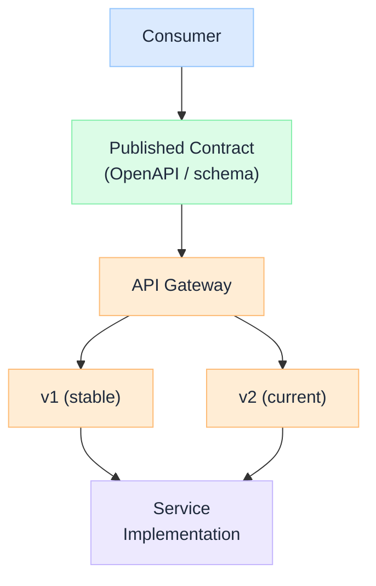

import Details from '@theme/Details';

  <h1 className="gain-doc-title">API Design</h1>
  
Contracts, versioning, and the integration boundaries that outlive their implementations.

## The API Is the Product

  An API is a promise other teams build on. Internals can be rewritten freely; the contract cannot. Good API design is therefore an exercise in <strong>deliberate constraint</strong>: exposing the smallest, most stable surface that lets consumers do their job, while keeping you free to change everything behind it. Treat the contract as the durable artifact and the code as the disposable one.

  

    <ul className="gain-checklist">
      <li>Design the contract before the code</li>
      <li>Model resources and capabilities, not tables</li>
      <li>Backward compatibility is the default</li>
      <li>Errors are part of the contract</li>
      <li>Idempotency for anything that writes</li>
      <li>Pagination, filtering, and limits from day one</li>
    </ul>
  

  

  

## Choosing a Style

  REST, GraphQL, gRPC, and async events are not competitors. They fit different shapes of problem. Most mature platforms run all of them, each at the boundary it suits, behind a consistent gateway and governance layer.

| Style | Strengths | Best fit |
| --- | --- | --- |
| **REST / JSON** | Ubiquitous, cacheable, simple to consume | Public APIs, resource CRUD, broad integration |
| **GraphQL** | Client-shaped queries, no over/under-fetching | Aggregation BFFs, rich client UIs |
| **gRPC** | Strong typing, streaming, low latency | Internal service-to-service, high throughput |
| **Async / events** | Decoupled, scalable fan-out | Notifications, integration, eventual consistency |

## Design Principles

  Write the OpenAPI / GraphQL schema / protobuf <em>before</em> the implementation. The contract drives mock servers, generated clients, validation, and review: and forces interface decisions while they're still cheap to change. Generated code from a hand-written contract beats a contract reverse-engineered from code.

  Model the consumer's mental model, not your database. Nouns for resources (<code>/orders/&#123;id&#125;</code>), HTTP verbs for actions, and clear sub-resources for relationships. When an operation genuinely isn't CRUD (e.g. <code>POST /orders/&#123;id&#125;/cancel</code>), expose it as an explicit capability rather than contorting it into a fake resource update.

  Prefer additive, backward-compatible change: new optional fields and endpoints never break clients. Reserve a new major version (URI <code>/v2</code> or header-negotiated) for genuinely breaking changes, run versions in parallel, and publish a deprecation timeline with sunset headers. Never repurpose the meaning of an existing field.

  Errors are an API surface consumers code against. Use correct status codes, a consistent machine-readable body (a stable <code>code</code>, human <code>message</code>, and a correlation ID), and document them. A standard like RFC 9457 (problem+json) saves every consumer from inventing their own parsing.

  GET, PUT, and DELETE should be idempotent; POST is not, so support client-supplied idempotency keys for creates and payments. This is what makes retries safe in an unreliable network: without it, a timed-out request becomes a duplicate charge.

  Any collection that can grow needs pagination (cursor-based scales better than offset), documented filtering and sorting, and sane default and maximum page sizes. Bolting these on after launch is a breaking change; designing them in from the start is free.

  Authenticate at the edge (OAuth2 / OIDC, scoped tokens), authorize per resource, and enforce per-consumer rate limits and quotas. Validate every input against the schema and never trust client-supplied identity. See [Governance &amp; Security](/architecture/governance-security) for the platform-level controls.

## API Governance at Scale

  With dozens of teams shipping APIs, consistency stops being a courtesy and becomes a platform capability. Governance keeps the estate coherent without becoming a bottleneck.

- **Style guide + linting**: automated checks (e.g. Spectral) catch naming, error-shape, and pagination drift in CI, before review.
- **Central catalog / portal**: a discoverable registry of contracts so teams reuse rather than reinvent.
- **Gateway as the control point**: auth, rate limiting, routing, and observability applied uniformly at the edge.
- **Lifecycle policy**: explicit rules for deprecation windows, sunset headers, and breaking-change approval.

---

For how a governed gateway fronts model and capability APIs, see the [AI Control Plane](/blueprints/control-plane) and [LLM Gateway](/blueprints/llm-gateway) blueprints. For async contracts, see [Event-Driven Systems](/architecture/event-driven-systems).
