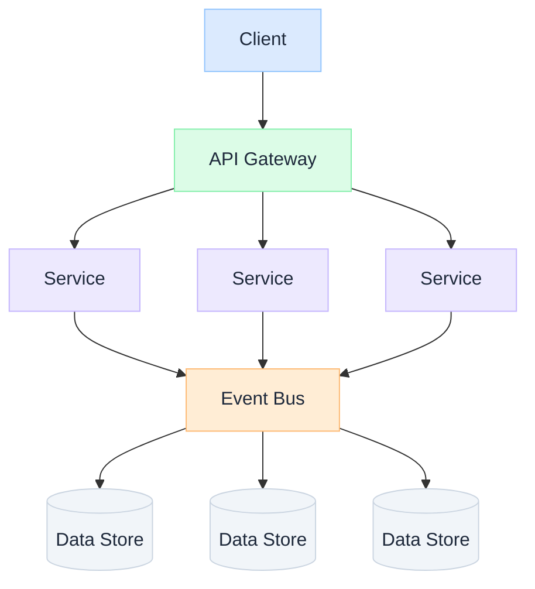

import Details from '@theme/Details';

  <h1 className="gain-doc-title">How to Architect Distributed Systems</h1>
  
Building resilient, scalable, and observable systems.

## Design for Scale and Resilience

  Modern systems rarely run on a single machine. As load, team size, and integration complexity grow, distributed architecture becomes the baseline: and the design choices you make early determine whether the system scales gracefully or becomes fragile under pressure.

  

    <ul className="gain-checklist">
      <li>Loose coupling</li>
      <li>High cohesion</li>
      <li>Fault tolerance</li>
      <li>Observability by default</li>
      <li>Event-driven execution</li>
    </ul>
  

  

  

## Key Patterns

  Decompose systems into independently deployable services with clear bounded contexts. Each service owns its data and communicates through well-defined APIs or events.

  Use events as the primary integration mechanism. Producers publish facts; consumers react asynchronously: enabling loose coupling, scalability, and resilience.

  Separate read and write models to optimize for different access patterns. Commands mutate state; queries serve optimized views: critical at scale.

  Manage distributed transactions across services using compensating actions. Sagas coordinate long-running workflows without two-phase commit overhead.

  Instrument every service with metrics, structured logs, and distributed tracing from day one. Observability is a design principle, not an afterthought.

