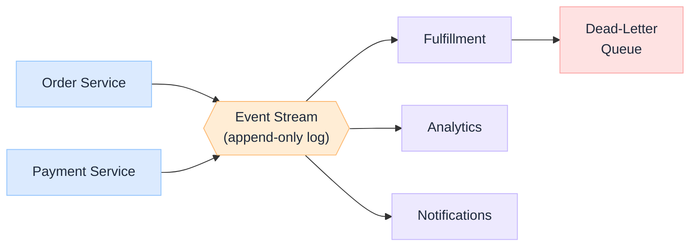

import Details from '@theme/Details';

  <h1 className="gain-doc-title">Event-Driven Systems</h1>
  
Loose coupling, streams, and asynchronous workflows at scale.

## Events as the Integration Backbone

  When teams and services multiply, synchronous request/response becomes a web of brittle dependencies: one slow service stalls a dozen callers. Events invert the relationship: producers publish facts about what happened, consumers decide what to do about them. The result is loose coupling in <strong>time</strong> (consumers process when ready), in <strong>space</strong> (producers don't know who listens), and in <strong>deployment</strong> (each side evolves independently).

  

    <ul className="gain-checklist">
      <li>Events are immutable facts, not commands</li>
      <li>Producers never know their consumers</li>
      <li>Schema is the contract: version it</li>
      <li>Idempotent consumers, always</li>
      <li>Order and delivery guarantees are explicit</li>
      <li>The log is the source of truth</li>
    </ul>
  

  

  

## Choosing a Messaging Model

  Not every async problem wants the same primitive. The first design decision is whether you need a <strong>queue</strong> (work distributed once across competing workers) or a <strong>log</strong> (an ordered, replayable history many independent consumers read at their own pace).

| Dimension | Message Queue | Event Log / Stream |
| --- | --- | --- |
| **Examples** | SQS, RabbitMQ, Azure Service Bus | Kafka, Kinesis, Pulsar |
| **Consumption** | Competing consumers, message removed | Independent consumer groups, offset-based |
| **Retention** | Until acknowledged | Time- or size-bounded, replayable |
| **Ordering** | Per-queue / per-group | Per-partition |
| **Best for** | Task distribution, RPC offload | Event sourcing, stream processing, fan-out |

## Key Patterns

  Producers emit events to a topic; any number of consumers subscribe independently. Adding a new consumer (a fraud check, a new analytics sink) requires no change to the producer. This is the foundation of fan-out: but it means producers must publish <em>well-modeled domain facts</em>, not internal implementation details that leak coupling back in.

  Persist state as an append-only sequence of events rather than overwriting rows. Current state is a left-fold over history. You gain a perfect audit trail, time-travel debugging, and the ability to derive new read models retroactively: at the cost of schema-evolution discipline and snapshotting for performance.

  Separate the write side (commands that emit events) from the read side (projections optimized for queries). Events are the bridge: the write model publishes, projections consume and materialize views. This lets reads and writes scale and evolve independently: pair it with event sourcing only when the audit and replay benefits justify the complexity.

  The classic dual-write trap: a service updates its database <em>and</em> publishes an event, but one succeeds and the other fails. The outbox pattern writes the event to an outbox table in the same local transaction as the state change, then a relay (often Change Data Capture) reliably publishes it. This is how you get at-least-once delivery without distributed transactions.

  Coordinate a long-running business transaction across services without two-phase commit. Each step emits an event that triggers the next; failures trigger compensating actions that semantically undo prior steps. Choreography (services react to each other's events) suits simple flows; orchestration (a central process manager) is clearer when the workflow is complex or needs visibility.

  Real systems deliver at-least-once, so consumers <em>will</em> see duplicates. Make handlers idempotent: dedupe on an event ID, use upserts, or track processed offsets. "Exactly-once" is achievable as an <em>effect</em> (the outcome happens once) even when delivery is at-least-once: design for the effect, not the delivery.

  A message that repeatedly fails processing must not block the partition behind it. Route it to a dead-letter queue after bounded retries (ideally with exponential backoff), alert on DLQ depth, and provide tooling to inspect and replay. Silent message loss and infinite retry loops are the two failure modes to design against.

## Streaming & Real-Time Processing

  Beyond integration, the log enables continuous computation. Stream processors (Flink, Kafka Streams, Spark Structured Streaming) treat the event stream as an unbounded table: filtering, joining, aggregating, and windowing in motion.

- **Windowing**: tumbling, sliding, and session windows turn an infinite stream into bounded aggregates.
- **Event time vs. Processing time**: late-arriving data is the norm; watermarks let you reason about completeness without waiting forever.
- **Stateful operators**: joins and aggregations hold state; checkpointing makes that state fault-tolerant and recoverable.

## Operational Concerns

  Event-driven systems trade synchronous simplicity for operational depth. The failure modes move from "the call failed" to "the consumer is lagging," "the schema drifted," and "we can't reconstruct what happened."

| Concern | What to do |
| --- | --- |
| **Schema evolution** | Use a schema registry; enforce backward/forward compatibility before publish |
| **Consumer lag** | Monitor offset lag per group; alert and autoscale consumers |
| **Observability** | Propagate correlation/trace IDs through every event header |
| **Replay & backfill** | Treat replay as a first-class operation, not an emergency hack |
| **Ordering needs** | Partition by the entity that requires ordering (e.g. customer ID) |

---

For how these patterns underpin AI request flows and agent orchestration, see the [AI Control Plane](/blueprints/control-plane) and [Agent Flow Model](/blueprints/agent-flow-model) blueprints. For published perspectives, see [Insights → Platforms & Engineering](/insights/tags/platforms-engineering).
