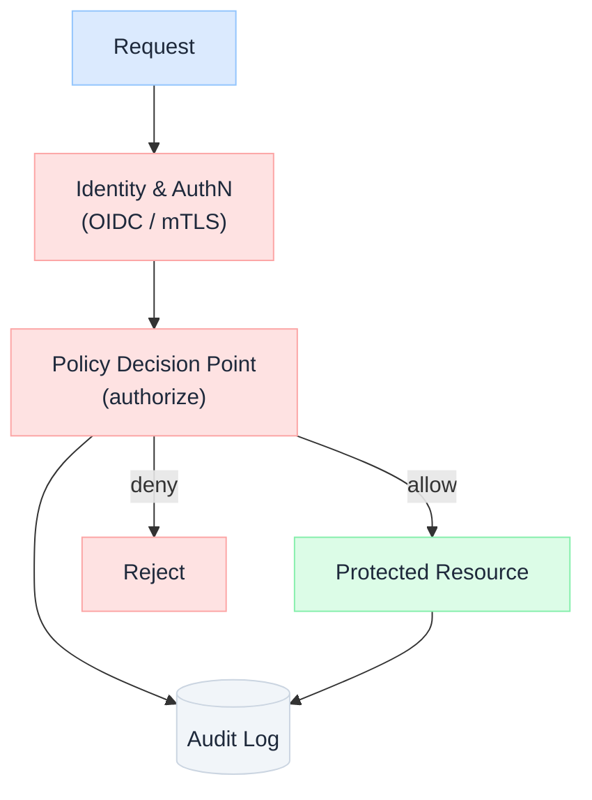

import Details from '@theme/Details';

  <h1 className="gain-doc-title">Governance &amp; Security</h1>
  
Policy, compliance, and operational trust as platform foundations: not afterthoughts.

## Trust Is an Architecture, Not a Checklist

  In regulated enterprises, a system that can't prove it is safe, compliant, and accountable can't ship: regardless of how well it performs. Governance and security are best treated as <strong>platform capabilities</strong>: controls that are designed in, enforced automatically, and observable by default. Bolted on at the end, they become friction; built in, they become a competitive advantage.

  

    <ul className="gain-checklist">
      <li>Authorization is enforced, never predicted</li>
      <li>Least privilege, by default</li>
      <li>Defense in depth: assume any layer fails</li>
      <li>Every decision is auditable</li>
      <li>Policy as code, versioned and tested</li>
      <li>Secure and compliant by default, not by reminder</li>
    </ul>
  

  

  

## The Three Pillars

  Distinct disciplines that reinforce each other: <strong>governance</strong> sets the rules and ownership, <strong>security</strong> enforces and protects, and <strong>compliance</strong> proves it to regulators and auditors.

| Pillar | Question it answers | Owns |
| --- | --- | --- |
| **Governance** | Who is accountable, and what's allowed? | Policy, ownership, risk, lifecycle |
| **Security** | How do we keep it protected? | Identity, controls, defense, response |
| **Compliance** | Can we prove it to a regulator? | Evidence, audit, attestation, residency |

## Security Patterns

  Never trust, always verify: there is no privileged "internal" network. Every request authenticates and authorizes regardless of origin, services use strong workload identity (mTLS / SPIFFE), and access is granted per-resource and per-request. The network perimeter is assumed already breached.

  Centralize authentication on an enterprise IdP (OIDC / SAML), model authorization as roles and attributes (RBAC / ABAC), and grant least privilege with time-bound, just-in-time elevation for sensitive operations. Human and machine identities are managed with equal rigor: service accounts are a common blast-radius multiplier.

  Express authorization and compliance rules as versioned, testable code (e.g. OPA / Rego, Cedar) rather than tribal knowledge in application logic. A central Policy Decision Point evaluates requests; enforcement points across the stack consult it. Policies get the same review, CI, and rollout discipline as application code.

  No credentials in code, config, or images. Broker secrets through a vault, inject short-lived tokens at runtime, rotate automatically, and define break-glass procedures. Encrypt data in transit (TLS everywhere) and at rest, with keys managed in an HSM / KMS and customer-managed keys where regulation requires.

  You can't protect what you haven't classified. Tag data by sensitivity (public, internal, confidential, regulated/PII), then drive controls from the tag: masking, tokenization, field-level encryption, residency, and retention. Classification is what lets policy make automated, defensible decisions.

  Every authentication, authorization decision, and access to sensitive data emits a tamper-evident, append-only audit event with actor, action, resource, and correlation ID. This is simultaneously a security control (detection), a compliance artifact (evidence), and an operations tool (forensics).

## Governing AI Systems

  AI adds risk surfaces traditional governance never anticipated: non-deterministic outputs, prompt injection, training-data lineage, and autonomous tool use. The principles hold: enforce, don't predict; least privilege; audit everything: but they extend into new territory.

- **Deterministic guardrails around probabilistic models**: authorization, data-access scopes, and tool permissions are enforced by deterministic policy, never delegated to the model's judgment.
- **Prompt injection & exfiltration defense**: treat all retrieved and user content as untrusted; constrain what a model can reach and emit.
- **Provenance & traceability**: record which model, prompt version, context, and data sources produced each output (the Grounded pillar of [G.A.I.N](/frameworks)).
- **Human-in-the-loop for high-risk actions**: four-eyes approval and reversibility for consequential, autonomous decisions.

## Regulatory Alignment

  Map controls to the frameworks your industry answers to, so compliance becomes evidence collection rather than a fire drill.

| Framework | Domain | Architectural implication |
| --- | --- | --- |
| **GDPR / privacy laws** | Personal data | Consent, data subject rights, residency, minimization |
| **SOC 2 / ISO 27001** | Security controls | Documented controls + continuous evidence |
| **PCI-DSS** | Payment data | Segmentation, encryption, restricted access |
| **EU AI Act** | AI risk | Risk tiering, transparency, human oversight, logging |

---

For how these controls are operationalized in the AI platform, see the [AI Control Plane](/blueprints/control-plane) (policy engine, audit) and the [G.A.I.N framework](/frameworks). For API-edge enforcement, see [API Design](/architecture/api-design). For published perspectives, see [Insights → Governance &amp; Trust](/insights/tags/governance-trust).
