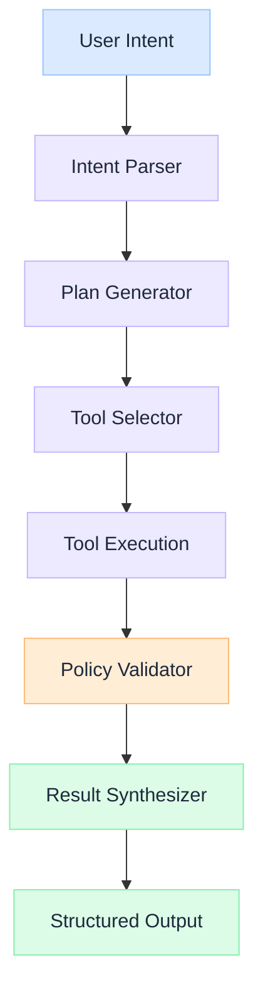

import Details from '@theme/Details';

  <h1 className="gain-doc-title">How to Model Agent Flow</h1>
  
Reference model for agent orchestration: planning, tools, memory, and policy-governed execution.

## Agent Execution Flow

  Agent behavior is predictable only when the execution flow is explicit: from intent parsing through tool selection, policy checks, and structured output delivery.

  

    <ul className="gain-checklist">
      <li>Intent parsing</li>
      <li>Plan generation</li>
      <li>Tool selection</li>
      <li>Policy validation</li>
      <li>Result synthesis</li>
    </ul>
  

  

  

## Key Patterns

  Decompose complex tasks into steps before execution. Planning reduces tool misuse and makes agent reasoning auditable.

  Match available tools to plan steps with schema validation. Explicit tool selection prevents agents from calling inappropriate or unauthorized tools.

  Check every action against business rules before and after execution. Policy validation is the governance layer that makes agents enterprise-ready.

  Combine tool outputs into structured, user-facing responses. Synthesis ensures consistency regardless of how many tools were invoked.

