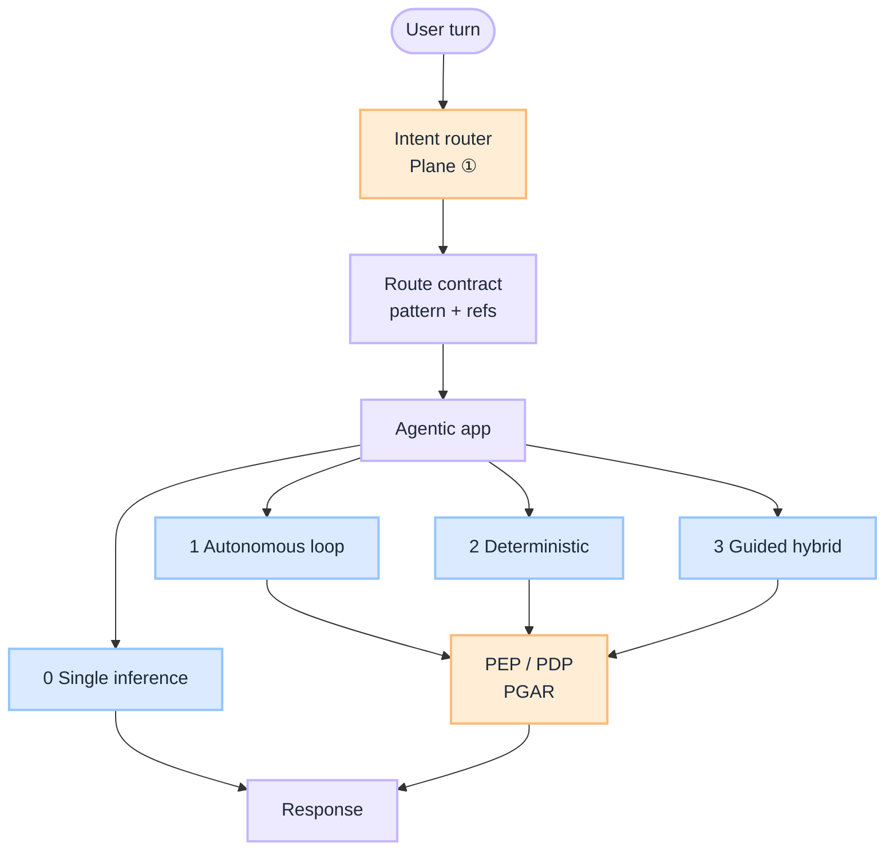
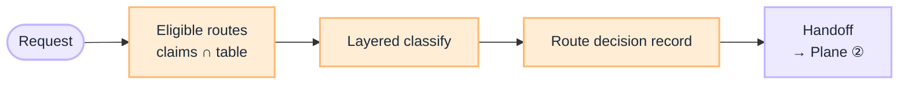
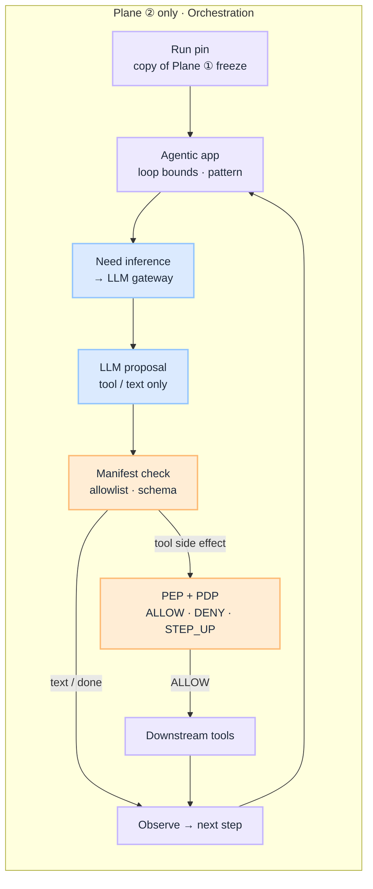
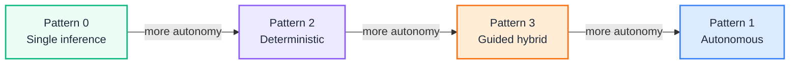
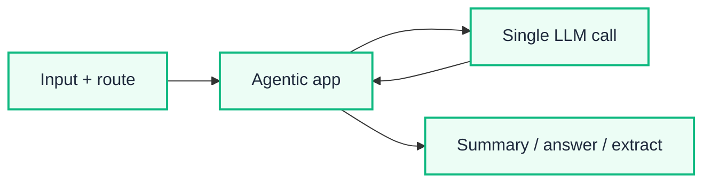
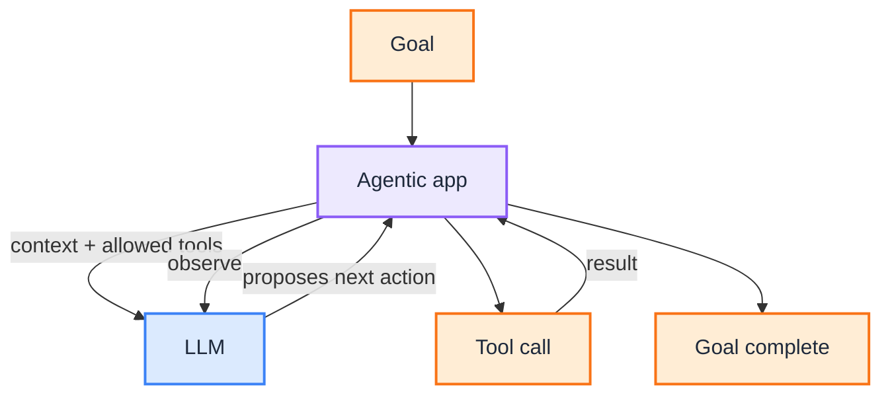
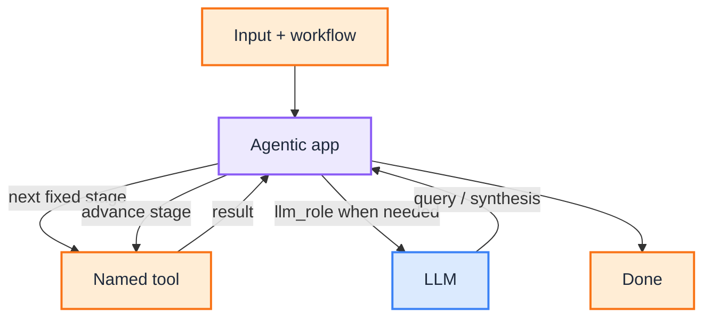
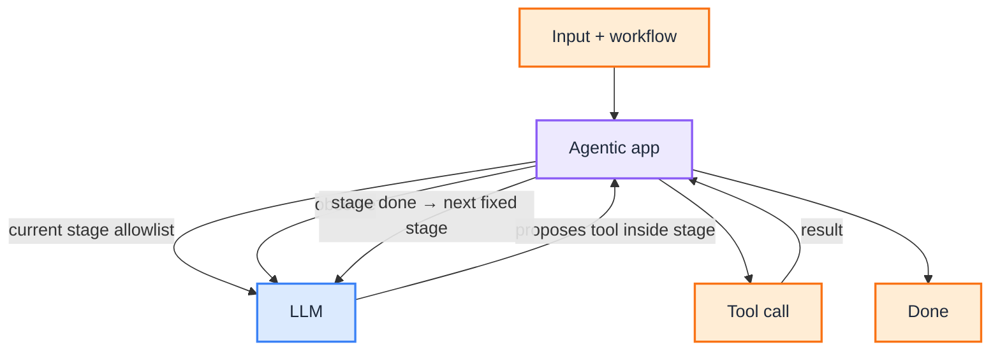

import Details from '@theme/Details';

# Agents: Intent, Orchestration, Autonomy

This is the **implementation guide** for G.A.I.N Agents. Principles live in [G.A.I.N Agents](/frameworks/gain-agents). Playbooks live under [Agents](/playbooks/agents). Policy verdicts stay in [Governance](/blueprints/governance/runtime). Model endpoint selection stays in the [LLM Blueprint](/blueprints/llm-blueprint). Versioned manifests and pinned tools live here. MCP is transport only ([MCP Blueprint](/blueprints/mcp-blueprint)).

:::tip[THE CLAIM]
**The model proposes; the system routes.** Intent at ingress, orchestration in the loop, and autonomy pattern on the route are platform decisions. Not every LLM feature is an agent: start at single inference. Escalate only when you need tools, a fixed multi-step process, or staged autonomy. Governance lives in contracts and checkpoints, not in hoping the prompt behaves.
:::

<!-- truncate -->

## What you are building

A production agent runtime is eight connected capabilities:

1. **Plane ① Intent:** versioned route table, entitlement filter, layered decide (rules may bind an event with no classifier), route decision record
2. **Plane ② Orchestration:** app copies the frozen route, writes run pin, scoped manifest, planner proposals, PEP on side effects
3. **Pattern catalog:** four execution shapes on one axis (who decides the next step)
4. **Shared contracts:** Route, Workflow, Manifest (versioned pin, schemas only), Prompt, Output, Eval (and Trace when useful)
5. **Control points:** loop budgets, stage allowlists, human gates, side-effect flags
6. **Selection rules:** escalate from Pattern 0 only when tools, order, or exploration demand it
7. **Versioning spine:** route table pins artifact ids; the **app** pins those versions on the run
8. **Inference handoff:** every LLM call goes through the [LLM gateway](/blueprints/llm-blueprint), not a hard-coded model id

The four patterns:

1. **Pattern 0 Single inference:** one LLM call, no tool loop
2. **Pattern 1 Autonomous loop:** LLM proposes the next action inside an allowlist
3. **Pattern 2 Deterministic:** designer-owned stage order; LLM never picks the next stage
4. **Pattern 3 Guided hybrid:** fixed outer stages; LLM chooses tools inside the current stage


<br/>

| Pattern | Shape | Next-step owner | When |
| --- | --- | --- | --- |
| **0** | Single inference | Designer (one call) | Summarize, Q&A, extract, classify |
| **1** | Autonomous loop | LLM inside allowlist | Research, coding, investigation |
| **2** | Deterministic | Designer (fixed stages) | Payments, KYC, claims |
| **3** | Guided hybrid | Designer outer; LLM inside stage | Contract review, regulated copilots |

| Layer | Question | Who owns |
| --- | --- | --- |
| **Intent (Plane ①)** | Which route, workflow id, and manifest? | Intent router (this blueprint) |
| **Manifests (this blueprint)** | Which tools, schemas, `pdp_action`, and pin? | Registry + route pin |
| **Autonomy (this blueprint)** | How much next-step freedom does that route allow? | Route design + agentic app |
| **PGAR (enforcement)** | May this proposed tool or side effect run? | PEP / PDP · [Governance](/blueprints/governance/runtime) |
| **Model (LLM)** | Which approved endpoint runs this call? | LLM gateway · [LLM Blueprint](/blueprints/llm-blueprint) |

## Owns / does not own

| Owns | Does not own |
| --- | --- |
| Intent routing, route table, layered classifier, `activation_target` | Model endpoint selection ([LLM Blueprint](/blueprints/llm-blueprint)) |
| Pattern definition (0-3) per route | SARAC, PEP choke points, verdicts ([Governance](/blueprints/governance/runtime)) |
| Tool manifests: schema, `pdp_action`, version pin | MCP gateway and server registry ([MCP Blueprint](/blueprints/mcp-blueprint)) |
| Workflow stage graphs and stage allowlists | Dashboard layout or infra metrics |
| Loop and stage budgets (`max_loop_steps`, `max_tool_calls`) | Full eval plane design ([Eval Blueprint](/blueprints/evaluation-blueprint)) |
| Artifact refs on the route row (prompt, schema, eval) | RAG corpora |

## Do not collapse

| Anti-pattern | Fix |
| --- | --- |
| One LLM call routes, plans, and picks model | Intent and orchestration here; endpoint in [LLM](/blueprints/llm-blueprint) |
| Intent router inside the agent loop | Plane ① at ingress only |
| Treat every LLM feature as an agent | Pattern 0 for one call with no tool loop |
| Open loop for payments / KYC / claims | Pattern 2 (or 3 with gated side effects) |
| Fixed pipeline when the path *is* the product | Pattern 1 |
| Trust the prompt to "stay in stage" | Stage allowlists + runtime filter + eval |
| Duplicate PGAR inside pattern docs | PEP on every side effect |
| Manifest lives only inside MCP | Manifest is transport-agnostic; MCP is one adapter |
| Router waits on the agent loop | Async start + `correlation_id`; the app owns the loop ([Wire agentic app](/playbooks/agents/intent-router/wire-agentic-app)) |
| Skip Plane ① because the event named the route | Rules bind `route_id`; freeze versions on start ([Session custody](/playbooks/agents/orchestration/session-custody)) |
| App re-resolves `active` after start | Copy the freeze from the async body; never look up live |

---

## Plane ①: Intent routing

**Route before the loop.** Field dictionary: [Route contract reference](/playbooks/agents/intent-router/route-contract-reference). Ops: [Route table lifecycle](/playbooks/agents/intent-router/route-table-lifecycle).

:::important[Plane ① bar]
A production intent router keeps the full route table in versioned platform config, filters by entitlements before any model sees labels, decides in layers (rules may bind a Kafka topic with no classifier), **freezes** `route_id` + versions, **async-starts** the app, and keeps `correlation_id`. The app copies that freeze into the run pin. The router stays outside the loop.
:::

### Five capabilities

1. **Route table:** versioned rows that bind `route_id`, manifest, policy profile, model tier, optional `retrieval`, optional `memory_profile`
2. **Eligible routes:** ingress claims intersect the table before classification
3. **Layered decide:** rules (including channel / event bind) → classifier → LLM fallback → safety veto
4. **Outcomes:** route, clarify, abstain, or top-k + user pick on high-risk paths
5. **Handoff:** route pin + async start with frozen pointers; app copies into the run pin. Router stays outside the loop


<br/>

This diagram is **Plane ① only**. Plane ② starts after handoff. Chat, API, and event ingress all use this path; the classifier is optional when rules already bind `route_id`. Model selection is the [LLM Blueprint](/blueprints/llm-blueprint).

### Core artifacts

| Artifact | Purpose |
| --- | --- |
| **Route contract** (table row) | `route_id`, `intent_label`, manifest ref, `policy_profile`, `model_profile`, optional `retrieval`, optional `memory_profile` |
| **Route decision record** | Per-turn audit: `route_table_version`, `eligible_routes`, `outcome`, `router_layer` |
| **Session pin** | Router: route pin + `correlation_id`. App: copy of versions + loop/token |
| **Golden intent set** | CI fixtures for representative, edge, adversarial, session stickiness |

### Route table storage

| Pattern | Regulated fit |
| --- | --- |
| **GitOps + object storage** | Strong: PR review, immutable artifacts, rollback via `active` pointer |
| **Route registry API** | Strong: runtime rollback, multi-tenant, audit |
| **Versioned file in repo** | Good pilot; rollback may need redeploy |
| **Hardcoded in app** | Demos only |

Eligible routes are computed at request time from ingress claims, not stored per user. See [Route contract reference](/playbooks/agents/intent-router/route-contract-reference) · [Route table lifecycle](/playbooks/agents/intent-router/route-table-lifecycle).

### Intent playbooks

| Playbook | Owns |
| --- | --- |
| [Route contract reference](/playbooks/agents/intent-router/route-contract-reference) | Field dictionary for route rows |
| [Route table lifecycle](/playbooks/agents/intent-router/route-table-lifecycle) | Version, promote, roll back route contracts |
| [Layered classifier](/playbooks/agents/intent-router/layered-classifier) | Rules, classifier, LLM fallback, safety |
| [Wire agentic app](/playbooks/agents/intent-router/wire-agentic-app) | Front door, decide-only handoff, event bind, clarify/abstain |
| [Routing eval CI](/playbooks/agents/intent-router/routing-eval-ci) | Golden set, release gates, incident replay |

Eval: [Eval Plane ①: Input](/playbooks/evaluation/plane-input).

### Plane ① release gates

| Change type | Offline gate | Online follow-up |
| --- | --- | --- |
| New route row | Intent accuracy ≥ baseline − 1% | Misroute rate by route |
| Route table version bump | Adversarial 100%; confusion matrix reviewed | `route_table_version` in audit |
| Classifier model change | Golden + adversarial pass | Layer 3 usage rate |
| Threshold tune | No regression on high-risk pairs | Clarify rate monitor |

---

## Plane ②: Orchestration

**Inside plan → act → observe.** After Plane ① **freezes** the route and async-starts the run, the app **copies** that freeze into the run pin. Orchestration owns session custody, tool proposals, PEP gates, validation, and synthesis.

:::important[Plane ② bar]
**The agentic app orchestrates; the LLM proposes steps; the PEP permits side effects.** This is not intent routing and not model routing.
:::

### Five capabilities

1. **Session custody:** copy frozen route versions; durable run pin (token, loop, checkpoints); never leak credentials to the model
2. **Autonomy shape:** run Pattern 0-3 from this blueprint (single call, loop, fixed stages, or guided hybrid)
3. **Inference handoff:** each plan/synthesize call goes through the [LLM gateway](/blueprints/llm-blueprint), not a hard-coded model id
4. **Proposal gate:** validate tool proposals against the scoped manifest before PEP
5. **PEP → observe:** permit side effects, execute downstream, feed results back into the loop


<br/>

This diagram is **Plane ② only**. Plane ① ends at the **route pin + async start**; the app copies the freeze. The LLM gateway sits on every inference edge.

### What this plane decides

| Decides | Does not decide |
| --- | --- |
| Next tool proposal inside a scoped manifest | Which workflow or manifest is active (Plane ①) |
| When to call PEP, validation, step-up | Which LLM endpoint serves the call ([LLM Blueprint](/blueprints/llm-blueprint)) |
| Session state, token custody, loop bounds | Entitlements at ingress (IdP + Plane ①) |

In G.A.I.N terms this is the **agent planner** inside the loop, not a second "agent router" at ingress.

### Where to build it

How much next-step freedom the route allows is the autonomy axis below. Policy enforcement for Plane ② is documented under **Governance**. How-to: [Orchestration](/playbooks/agents/orchestration).

| Resource | Purpose |
| --- | --- |
| [Orchestration](/playbooks/agents/orchestration) | Session custody, memory, autonomy shape, inference handoff |
| [Governance Blueprint](/blueprints/governance/runtime) | Five boundaries, SARAC, release gates |
| [Governance](/playbooks/governance/runtime) | Foundation, assurance, boundary |
| [Agentic app](/playbooks/governance/runtime/boundary/agentic-app) | Loop after intent route; manifest pin |
| [LLM Blueprint](/blueprints/llm-blueprint) | Gateway endpoint pick per inference |

Eval: [Action plane](/playbooks/evaluation/plane-action) · [Tool plane](/playbooks/evaluation/plane-tool).

### Plane ② playbooks

Start at [Orchestration overview](/playbooks/agents/orchestration):

| Playbook | Owns |
| --- | --- |
| [Session custody](/playbooks/agents/orchestration/session-custody) | Durable run pin, token, loop bounds |
| [Memory](/playbooks/agents/orchestration/memory) | Isolation, TTL, retrieve_only prefs and episodes |
| [Autonomy shape](/playbooks/agents/orchestration/autonomy-shape) | Pattern 0-3 from the route |
| [Inference handoff](/playbooks/agents/orchestration/inference-handoff) | Gateway call, proposal check, PEP |

Then [Runtime](/playbooks/governance/runtime): foundation (SARAC, PEP/PDP, audit), boundary. Cross-call [Manifests](/playbooks/agents/manifests/manifest-registry), [RAG](/playbooks/rag), or [Memory](/playbooks/agents/orchestration/memory) for the gated store or contract.

---

## Manifests: versioned pin, schemas only

The **manifest is versioned platform config.** The LLM sees schemas only. The PEP maps `pdp_action`. Unknown tools never become side effects. MCP is one adapter that can expose those tools; it is not the catalog. Transport lives in the [MCP Blueprint](/blueprints/mcp-blueprint).

:::important[Manifest bar]
**The agentic app loads the pinned version. The model never owns the file.** Name and args must match the manifest before PEP. Unknown tools are rejected in the app, not "tried" downstream.
:::

### Six hops

1. **Route pin:** `tool_manifest` id from the [route row](/playbooks/agents/intent-router/route-contract-reference)
2. **Load:** agentic app loads that **version**; the LLM never owns the file
3. **Propose:** model receives scoped schemas only
4. **Validate:** name and args must match the pinned manifest
5. **PEP:** `pdp_action` + resource + context; ALLOW before downstream
6. **Execute:** downstream only on ALLOW


<br/>

### Control points

| Control | Lives on | Must not |
| --- | --- | --- |
| Manifest version | Registry + session pin | Swap mid-run without policy |
| Tool `schema` | Manifest entry | Be invented in the prompt |
| `pdp_action` | Manifest entry | Differ from what PEP sends |
| Unknown tool | App reject before PEP | "Just try the call" |

Shape: [Manifest registry](/playbooks/agents/manifests/manifest-registry). Ops: [Manifest lifecycle](/playbooks/agents/manifests/manifest-lifecycle). Eval: [Plane ⑤ Tool](/playbooks/evaluation/plane-tool).

AI platform owns the registry and pin. Domain squads own tool entries. Governance owns PDP mapping of `pdp_action`.

### Manifest playbooks

| Playbook | Owns |
| --- | --- |
| [Manifest registry](/playbooks/agents/manifests/manifest-registry) | Contract shape, `pdp_action`, unknown-tool reject |
| [Manifest lifecycle](/playbooks/agents/manifests/manifest-lifecycle) | Version, promote, pin, roll back |

---

## The autonomy axis


<br/>

| Layer | Pattern 0 | Pattern 1 | Pattern 2 | Pattern 3 |
| --- | --- | --- | --- | --- |
| Business process | One step | Open | Fixed | Fixed |
| Tool sequence | None | LLM chooses | Designer chooses | Fixed stages; LLM chooses inside a stage |
| Is it an agent? | No | Yes | Workflow + LLM steps | Hybrid agent |
| Primary risk | Thin context / hallucination | Unpredictable path | Brittleness | Extra architecture |

---

## Pattern 0: Single inference

**One LLM call** through the [agentic app](/playbooks/governance/runtime/boundary/agentic-app). No Observe → Decide → Tool cycle. Clients do not call the LLM API directly.

:::important[Pattern 0 bar]
Deterministic RAG prefetch or pre/post processing around the call does not make this Pattern 1-3. If the model never chooses tools, you are still on Pattern 0.
:::

### Five capabilities

1. **Single inference:** one LLM call through the agentic app
2. **No tool loop:** the model never chooses tools
3. **Optional prefetch:** `retrieval.mode: deterministic_prefetch` stays Pattern 0
4. **Output schema:** the agentic app validates the completion
5. **No direct clients:** callers never hit the LLM API themselves


<br/>

Deterministic RAG prefetch or pre/post processing **around** the call does not make this Pattern 1-3. Declare it on the route as `retrieval: { "mode": "deterministic_prefetch", "scope": [...] }`. If the model never chooses tools, you are still on Pattern 0 (or Pattern 2 if you model `retrieve → generate` as an explicit fixed two-stage workflow).

**Prefer when:** summarize, Q&A over provided context, extract, classify, rewrite, cheap router classifier.

## Pattern 1: Fully autonomous

The route provides **allowed tools**. The **agentic app** runs the loop; the **LLM** proposes the next action. The app executes tools, observes results, and feeds them back until the goal is met or the budget is exhausted. Two runs with the same goal can take different valid paths.

:::important[Pattern 1 bar]
The agentic app owns the budget; the LLM only proposes. Cap hit stops the run even if the model wants another call.
:::

### Five capabilities

1. **Allowlist:** route provides allowed tools; the model cannot invent others
2. **LLM proposes:** next action inside the allowlist
3. **App executes:** tools run in the agentic app, not in the model
4. **Observe loop:** results feed back until goal or budget
5. **Loop budget:** `max_loop_steps` caps the whole decide → tool → observe cycle


<br/>

**Control:** `max_loop_steps` caps the whole decide → tool → observe loop (all tools combined), not per tool. Cap hit stops the run even if the model wants another call. The agentic app owns the budget; the LLM only proposes.

**Prefer when:** research, coding, investigation, exploratory document review.

## Pattern 2: Deterministic workflow

Stage order is **fixed**. The **agentic app** advances stages from the workflow artifact; the **LLM** does only the work assigned to a stage (`llm_role`), never picks the next stage. Branching is explicit in the workflow (`branch`, human gates), not inventable by the model.

:::important[Pattern 2 bar]
The agentic app owns stage order; the LLM never chooses the next step. Side-effect stages use `requires_approval` and PGAR PEP.
:::

### Five capabilities

1. **Fixed stages:** workflow artifact owns order
2. **LLM as stage worker:** `llm_role` only, never next-stage choice
3. **Explicit branches:** `branch` and human gates in the workflow
4. **No open tool-choice:** no loop inside a stage
5. **Side-effect gates:** `requires_approval` plus PEP on writes


<br/>

No open tool-choice loop inside a stage. Budget is the stage list plus retries and timeouts. Side-effect stages use `requires_approval` and PGAR PEP. The agentic app owns stage order; the LLM never chooses the next step.

**Prefer when:** payments, KYC, claims, loan processing, any mandatory order with controlled writes.

## Pattern 3: Guided hybrid

**Outer workflow fixed; reasoning inside each stage flexible.** The **agentic app** advances stages and exposes only the current stage allowlist; the **LLM** proposes tools and order inside that stage. The process never invents stages.

:::important[Pattern 3 bar]
The agentic app owns outer stage order; the LLM owns tool choice only inside a stage. Eval checks `outer_stage_order_fixed` and `no_cross_stage_tools`.
:::

### Five capabilities

1. **Fixed outer workflow:** stages never invented by the model
2. **Stage allowlist:** runtime exposes only the current stage tools
3. **In-stage autonomy:** LLM proposes tools and order inside the stage
4. **Per-stage budget:** `max_tool_calls` per stage
5. **Cross-stage block:** eval fails if tools leak across stages


<br/>

**Control:** `max_tool_calls` **per stage**. Runtime exposes only the current stage allowlist to the LLM. Eval checks `outer_stage_order_fixed` and `no_cross_stage_tools`. The agentic app owns outer stage order; the LLM owns tool choice only inside a stage.

**Prefer when:** contract review, regulatory analysis, medical review, enterprise copilots with fixed process and variable depth.

---

## Reference architecture: shared contracts

Every pattern shares the same versioning rule: the **route table** is versioned platform config; workflows, manifests, prompts, schemas, and eval suites are separate versioned artifacts the route **references**.

| Artifact | Role |
| --- | --- |
| **Route** | `route_id`, `model_profile`, `policy_profile`, optional `retrieval`, pointers to other artifacts, optional budgets |
| **Workflow** | Stage order (Patterns 2-3); stage allowlists and `max_tool_calls` (Pattern 3) |
| **Manifest** | Tool schemas and `pdp_action` / risk tier for PEP |
| **Prompt** | System/user text, optionally stage-scoped |
| **Output** | Schema id the agentic app validates against |
| **Eval** | Golden suite and checks for that pattern |
| **Trace** | Optional: record path variance for Patterns 1 and 3 |

Canonical route shape (fields appear when the pattern needs them):

<Details summary="Canonical route shape (JSON)">

```json
{
  "route_id": "example_route",
  "intent": "example_intent",
  "activation_target": "https://assistant-app.internal/v1/runs",
  "model_profile": "reasoning-standard",
  "tool_manifest": "example_v1",
  "policy_profile": "read_only_standard",
  "retrieval": { "mode": "tool", "scope": ["example-corpus"] },
  "memory_profile": {
    "conversation": "session",
    "working": "session",
    "loop": "checkpoint",
    "long_term": "retrieve_only",
    "ttl_hours": 24,
    "isolation": ["tenant", "user", "session"]
  },
  "workflow_id": "example_workflow_v1",
  "prompt_id": "example_v1",
  "output_schema_id": "example_out_v1",
  "eval_suite_id": "example_golden",
  "max_loop_steps": 12
}
```

</Details>

| Pattern | Typical row refs |
| --- | --- |
| **0** | `prompt_id`, `output_schema_id`, `eval_suite_id` (`tool_manifest: "none"`); optional `retrieval` with `mode: "deterministic_prefetch"`; optional lean `memory_profile` |
| **1** | `tool_manifest`, `prompt_id`, `max_loop_steps`, `memory_profile`, eval / output ids |
| **2** | `workflow_id`, `tool_manifest`, plus prompt / output / eval ids; `memory_profile` for stage working state |
| **3** | `workflow_id` (stage allowlists), `tool_manifest`, `memory_profile`, plus prompt / output / eval ids |

Field dictionary and lifecycle: [Route contract reference](/playbooks/agents/intent-router/route-contract-reference) · [Route table lifecycle](/playbooks/agents/intent-router/route-table-lifecycle).

### Version bumps

Bump **`route_table_version`** when a **route row** changes (pointers or policy fields), not on every artifact publish behind a stable id.

| Change | Bump `route_table_version`? |
| --- | --- |
| New or removed `route_id` | Yes |
| Row points at a new `workflow_id`, `tool_manifest`, `prompt_id`, schema, or eval id | Yes |
| `model_profile`, `policy_profile`, `retrieval`, `memory_profile`, `max_loop_steps`, `activation_target`, or entitlements on the row | Yes |
| New `manifest_version` under the **same** `manifest_id` | Often no (promote + pin on session) |
| Prompt / eval content bump while the route still references the same artifact id | Often no |

**Session pin:** at route decision (or session open), pin `route_table_version` and `manifest_version` (and the workflow id those imply). Mid-session promote must not swap an in-flight run without explicit policy.

---

## Control points (all patterns)

| Control | Patterns | Meaning |
| --- | --- | --- |
| Route + policy profile | 0-3 | Ingress chooses capability; PGAR gates side effects |
| `tool_manifest` allowlist | 1-3 | Model cannot invent tools outside the list |
| `retrieval` on the route | 0-3 | `deterministic_prefetch`: app retrieves before the LLM. `tool`: LLM may propose retrieve inside `scope`. |
| `memory_profile` on the route | 0-3 | Whether session / working / loop memory is allowed; long-term is retrieve-only unless write tools are allowlisted |
| `max_loop_steps` | 1 | Whole autonomous loop budget |
| Fixed `workflow_id` stages | 2-3 | Outer order is designer-owned |
| Stage `allowed_tools` + `max_tool_calls` | 3 | Autonomy scoped inside a stage |
| `human_gate` / `requires_approval` | 2-3 | Side effects need attestation or review |
| Output schema validation | 0-3 | Agentic app rejects malformed completions |
| Pattern-specific eval checks | 0-3 | Order, allowlist, groundedness, goal completion |

---

## Selection rules

| Signal | Prefer |
| --- | --- |
| One call is enough (summarize, Q&A, extract) | Pattern 0 |
| Unknown path is the product | Pattern 1 |
| Side effects + mandatory order | Pattern 2 |
| Fixed stages, variable depth of analysis | Pattern 3 |

**Escalate from Pattern 0 when** the model needs to search, call APIs, or iterate (Pattern 1 or 3), or when the business requires mandatory ordered stages with side effects (Pattern 2).

### Comparison matrix

| Capability | 0 Single inference | 1 Autonomous | 2 Deterministic | 3 Guided |
| --- | --- | --- | --- | --- |
| Is an agent | No | Yes | No (fixed workflow) | Yes (within stages) |
| Workflow fixed | N/A | No | Yes | Yes |
| Tool sequence fixed | N/A | No | Yes | No (within a step) |
| LLM decides next action | No | Yes | No | Yes (inside each step) |
| Easy to audit | Excellent | Weak | Excellent | Strong |
| Flexibility | Low | High | Low | Medium-High |
| Enterprise governance | Excellent | Medium | Excellent | Excellent |
| Complexity | Lowest | Medium | Low | High |

---

## Agent-to-agent calls

| Pattern | Multi-agent |
| --- | --- |
| **0** | No. One inference; no delegation. |
| **1** | Yes, dynamic. Another agent as a tool; any order. |
| **2** | Yes, fixed handoffs only (designer-defined stages). |
| **3** | Yes, governed. Specialists on the stage allowlist, or one agent per stage with fixed outer handoffs. |

| Need | Prefer |
| --- | --- |
| Dynamic "call another agent when needed" | Pattern 1 |
| Fixed "stage 1 agent → stage 2 agent" pipeline | Pattern 2 or 3 |
| Governed specialist delegation inside a stage | Pattern 3 |

---

## Release gate matrix

| Change type | Offline gate | Online follow-up |
| --- | --- | --- |
| New Pattern 0 route | Output schema + golden faithfulness / groundedness | Latency and cost per route |
| Pattern 1 manifest or `max_loop_steps` change | `tools_in_manifest_only`, goal completion, loop-cap stop | Loop-step distribution; budget-hit rate |
| Pattern 2 workflow change | `stage_order_fixed`, branch map, approval on side effects | Stage duration; gate abandonment |
| Pattern 3 stage allowlist change | `outer_stage_order_fixed`, `no_cross_stage_tools` | Cross-stage proposal blocks; depth per stage |
| Route row pointer bump | Pattern suite for that `route_id` | `route_table_version` in audit |

Eval planes: [Input](/playbooks/evaluation/plane-input) · [Tool](/playbooks/evaluation/plane-tool) · [Action](/playbooks/evaluation/plane-action) · [Outcome](/playbooks/evaluation/plane-outcome).

---

## Ownership

| Role | Owns |
| --- | --- |
| **AI platform** | Agentic app pattern runtime, budgets, session pin |
| **Domain squads** | Workflow graphs, stage allowlists, route row content |
| **Governance / compliance** | Which patterns are allowed for high-risk journeys |
| **Security / IAM** | Policy profiles and entitlements on eligible routes |
| **SRE** | Loop/stage SLOs, budget-hit alerts, rollback of route table |

## Implementation sequence

1. **Ship Pattern 0** behind the intent router for summarize / Q&A / extract ([Wire agentic app](/playbooks/agents/intent-router/wire-agentic-app)).
2. **Add PGAR** before any LLM-chosen side effects ([Governance Blueprint](/blueprints/governance/runtime)).
3. **Introduce Pattern 2** for regulated fixed journeys (workflow artifact + eval on stage order).
4. **Introduce Pattern 1 or 3** only where exploration or stage-scoped depth is required; pin manifests and budgets.
5. **Gate every route-table bump** with the pattern-specific offline suite above.

## Series index

**Playbooks**

- [Agents overview](/playbooks/agents) · [Intent Router](/playbooks/agents/intent-router) · [Orchestration](/playbooks/agents/orchestration) including [Memory](/playbooks/agents/orchestration/memory) · [Manifests](/playbooks/agents/manifests/manifest-registry)
- [Agentic app](/playbooks/governance/runtime/boundary/agentic-app)

**Related**

- [G.A.I.N Agents](/frameworks/gain-agents) · [Governance Runtime](/blueprints/governance/runtime) · [LLM Blueprint](/blueprints/llm-blueprint) · [MCP Blueprint](/blueprints/mcp-blueprint) (transport) · [Eval Blueprint](/blueprints/evaluation-blueprint) · [Enterprise AI Workflow Patterns](/insights/enterprise-ai-workflow-patterns-autonomy-vs-control) (Pattern 0-3 decision guide)
