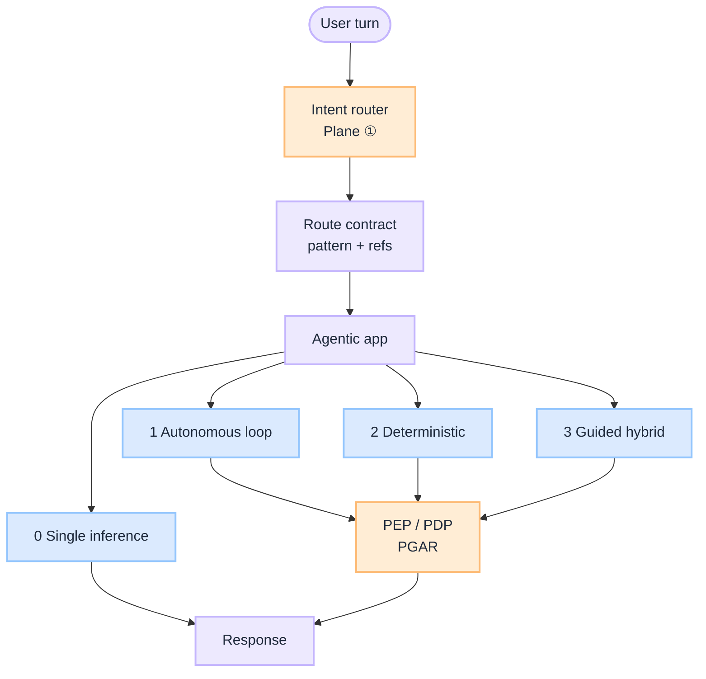
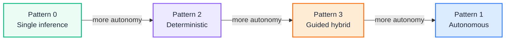
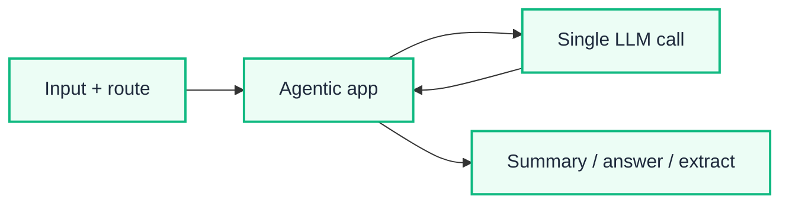
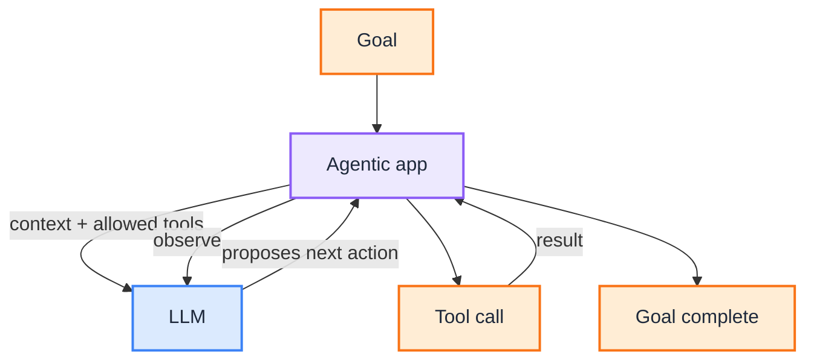
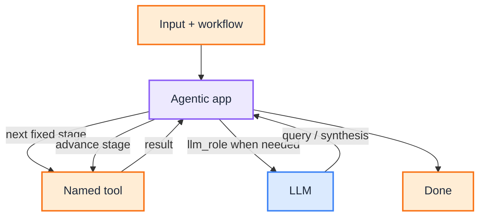
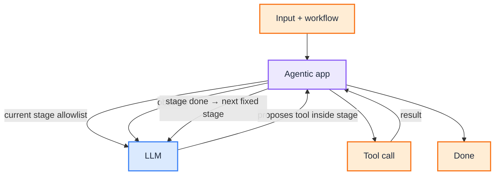

# Autonomy Blueprint: Four Patterns, One Axis

This is the **reference design** for how much autonomy the model gets after a route is chosen. The decision guide *Enterprise AI Workflow Patterns: Autonomy vs Control* (draft in local dev) explains *when* to pick each pattern. This blueprint explains *what* to standardize: four patterns on one axis, shared contracts, control points, and how this layer sits between the [Router Blueprint](/blueprints/router-blueprint) and [PGAR Blueprint](/blueprints/pgar-blueprint).

:::tip[THE CLAIM]
**Not every LLM feature is an agent. Start at single inference.** Escalate only when you need tools, a fixed multi-step process, or staged autonomy. Fix the business stages when process control matters; give the LLM autonomy inside each stage only when exploration is the product. Governance lives in contracts and checkpoints, not in hoping the prompt behaves.
:::

<!-- truncate -->

## What you are building

A production autonomy model is five connected capabilities on top of intent routing and policy enforcement:

1. **Pattern catalog:** four execution shapes on one axis (who decides the next step)
2. **Shared contracts:** Route, Workflow, Manifest, Prompt, Output, Eval (and Trace when useful)
3. **Control points:** loop budgets, stage allowlists, human gates, side-effect flags
4. **Selection rules:** escalate from Pattern 0 only when tools, order, or exploration demand it
5. **Versioning spine:** route table pins artifact ids; sessions pin versions mid-flight


<br/>

| Layer | Question | Who owns |
| --- | --- | --- |
| **Router (Plane ①)** | Which route, workflow id, and manifest? | Intent router |
| **Autonomy (this blueprint)** | How much next-step freedom does that route allow? | Route design + agentic app |
| **PGAR (Plane ② enforcement)** | May this proposed tool or side effect run? | PEP / PDP |
| **Model (Plane ③)** | Which approved endpoint runs this call? | LLM gateway |

## Owns / does not own

| Owns | Does not own |
| --- | --- |
| Pattern definition (0-3) per route | Ingress classification and entitlements ([Router](/blueprints/router-blueprint)) |
| Workflow stage graphs and stage allowlists | SARAC, PEP choke points, verdicts ([PGAR](/blueprints/pgar-blueprint)) |
| Loop and stage budgets (`max_loop_steps`, `max_tool_calls`) | Model endpoint selection ([G.A.I.N LLM](/frameworks/gain-llm)) |
| Artifact refs on the route row (prompt, schema, eval) | Dashboard layout or infra metrics |
| Pattern-specific eval checks (order, allowlist, goal) | Full eval plane design ([Eval Blueprint](/blueprints/eval-blueprint)) |

## Do not collapse

| Anti-pattern | Fix |
| --- | --- |
| Treat every LLM feature as an agent | Pattern 0 for one call with no tool loop |
| Open loop for payments / KYC / claims | Pattern 2 (or 3 with gated side effects) |
| Fixed pipeline when the path *is* the product | Pattern 1 |
| Trust the prompt to "stay in stage" | Stage allowlists + runtime filter + eval |
| Duplicate Router or PGAR inside pattern docs | Route at ingress; PEP on every side effect |

---

## The autonomy axis


<br/>

| Layer | Pattern 0 | Pattern 1 | Pattern 2 | Pattern 3 |
| --- | --- | --- | --- | --- |
| Business process | One step | Open | Fixed | Fixed |
| Tool sequence | None | LLM chooses | Designer chooses | Fixed stages; LLM chooses inside a stage |
| Is it an agent? | No | Yes | Workflow + LLM steps | Hybrid agent |
| Primary risk | Thin context / hallucination | Unpredictable path | Brittleness | Extra architecture |

---

## Pattern 0: Single inference

**One LLM call** through the [agentic app](/playbooks/pgar-runtime/boundary/agentic-app). No Observe → Decide → Tool cycle. Clients do not call the LLM API directly.


<br/>

Deterministic RAG prefetch or pre/post processing **around** the call does not make this Pattern 1-3. If the model never chooses tools, you are still on Pattern 0 (or Pattern 2 if you model `retrieve → generate` as an explicit fixed two-stage workflow).

**Prefer when:** summarize, Q&A over provided context, extract, classify, rewrite, cheap router classifier.

## Pattern 1: Fully autonomous

The route provides **allowed tools**. The **agentic app** runs the loop; the **LLM** proposes the next action. The app executes tools, observes results, and feeds them back until the goal is met or the budget is exhausted. Two runs with the same goal can take different valid paths.


<br/>

**Control:** `max_loop_steps` caps the whole decide → tool → observe loop (all tools combined), not per tool. Cap hit stops the run even if the model wants another call. The agentic app owns the budget; the LLM only proposes.

**Prefer when:** research, coding, investigation, exploratory document review.

## Pattern 2: Deterministic workflow

Stage order is **fixed**. The **agentic app** advances stages from the workflow artifact; the **LLM** does only the work assigned to a stage (`llm_role`), never picks the next stage. Branching is explicit in the workflow (`branch`, human gates), not inventable by the model.


<br/>

No open tool-choice loop inside a stage. Budget is the stage list plus retries and timeouts. Side-effect stages use `requires_approval` and PGAR PEP. The agentic app owns stage order; the LLM never chooses the next step.

**Prefer when:** payments, KYC, claims, loan processing, any mandatory order with controlled writes.

## Pattern 3: Guided hybrid

**Outer workflow fixed; reasoning inside each stage flexible.** The **agentic app** advances stages and exposes only the current stage allowlist; the **LLM** proposes tools and order inside that stage. The process never invents stages.


<br/>

**Control:** `max_tool_calls` **per stage**. Runtime exposes only the current stage allowlist to the LLM. Eval checks `outer_stage_order_fixed` and `no_cross_stage_tools`. The agentic app owns outer stage order; the LLM owns tool choice only inside a stage.

**Prefer when:** contract review, regulatory analysis, medical review, enterprise copilots with fixed process and variable depth.

---

## Reference architecture: shared contracts

Every pattern shares the same versioning rule: the **route table** is versioned platform config; workflows, manifests, prompts, schemas, and eval suites are separate versioned artifacts the route **references**.

| Artifact | Role |
| --- | --- |
| **Route** | `route_id`, `model_profile`, `policy_profile`, pointers to other artifacts, optional budgets |
| **Workflow** | Stage order (Patterns 2-3); stage allowlists and `max_tool_calls` (Pattern 3) |
| **Manifest** | Tool schemas and `pdp_action` / risk tier for PEP |
| **Prompt** | System/user text, optionally stage-scoped |
| **Output** | Schema id the agentic app validates against |
| **Eval** | Golden suite and checks for that pattern |
| **Trace** | Optional: record path variance for Patterns 1 and 3 |

Canonical route shape (fields appear when the pattern needs them):

```json
{
  "route_id": "example_route",
  "intent": "example_intent",
  "model_profile": "reasoning-standard",
  "tool_manifest": "example_v1",
  "policy_profile": "read_only_standard",
  "workflow_id": "example_workflow_v1",
  "prompt_id": "example_v1",
  "output_schema_id": "example_out_v1",
  "eval_suite_id": "example_golden",
  "max_loop_steps": 12
}
```

| Pattern | Typical row refs |
| --- | --- |
| **0** | `prompt_id`, `output_schema_id`, `eval_suite_id` (`tool_manifest: "none"`) |
| **1** | `tool_manifest`, `prompt_id`, `max_loop_steps`, eval / output ids |
| **2** | `workflow_id`, `tool_manifest`, plus prompt / output / eval ids |
| **3** | `workflow_id` (stage allowlists), `tool_manifest`, plus prompt / output / eval ids |

Worked JSON examples for each pattern live in the decision guide (draft in local dev). Lifecycle detail: [Route table lifecycle](/playbooks/router/intent-router/route-table-lifecycle) · [How to Design an Intent Router](/insights/design-intent-router).

### Version bumps

Bump **`route_table_version`** when a **route row** changes (pointers or policy fields), not on every artifact publish behind a stable id.

| Change | Bump `route_table_version`? |
| --- | --- |
| New or removed `route_id` | Yes |
| Row points at a new `workflow_id`, `tool_manifest`, `prompt_id`, schema, or eval id | Yes |
| `model_profile`, `policy_profile`, `max_loop_steps`, or entitlements on the row | Yes |
| New `manifest_version` under the **same** `manifest_id` | Often no (promote + pin on session) |
| Prompt / eval content bump while the route still references the same artifact id | Often no |

**Session pin:** at route decision (or session open), pin `route_table_version` and `manifest_version` (and the workflow id those imply). Mid-session promote must not swap an in-flight run without explicit policy.

---

## Control points (all patterns)

| Control | Patterns | Meaning |
| --- | --- | --- |
| Route + policy profile | 0-3 | Ingress chooses capability; PGAR gates side effects |
| `tool_manifest` allowlist | 1-3 | Model cannot invent tools outside the list |
| `max_loop_steps` | 1 | Whole autonomous loop budget |
| Fixed `workflow_id` stages | 2-3 | Outer order is designer-owned |
| Stage `allowed_tools` + `max_tool_calls` | 3 | Autonomy scoped inside a stage |
| `human_gate` / `requires_approval` | 2-3 | Side effects need attestation or review |
| Output schema validation | 0-3 | Agentic app rejects malformed completions |
| Pattern-specific eval checks | 0-3 | Order, allowlist, groundedness, goal completion |

---

## Selection rules

| Signal | Prefer |
| --- | --- |
| One call is enough (summarize, Q&A, extract) | Pattern 0 |
| Unknown path is the product | Pattern 1 |
| Side effects + mandatory order | Pattern 2 |
| Fixed stages, variable depth of analysis | Pattern 3 |

**Escalate from Pattern 0 when** the model needs to search, call APIs, or iterate (Pattern 1 or 3), or when the business requires mandatory ordered stages with side effects (Pattern 2).

### Comparison matrix

| Capability | 0 Single inference | 1 Autonomous | 2 Deterministic | 3 Guided |
| --- | --- | --- | --- | --- |
| Is an agent | No | Yes | No (fixed workflow) | Yes (within stages) |
| Workflow fixed | N/A | No | Yes | Yes |
| Tool sequence fixed | N/A | No | Yes | No (within a step) |
| LLM decides next action | No | Yes | No | Yes (inside each step) |
| Easy to audit | Excellent | Weak | Excellent | Strong |
| Flexibility | Low | High | Low | Medium-High |
| Enterprise governance | Excellent | Medium | Excellent | Excellent |
| Complexity | Lowest | Medium | Low | High |

---

## Agent-to-agent calls

| Pattern | Multi-agent |
| --- | --- |
| **0** | No. One inference; no delegation. |
| **1** | Yes, dynamic. Another agent as a tool; any order. |
| **2** | Yes, fixed handoffs only (designer-defined stages). |
| **3** | Yes, governed. Specialists on the stage allowlist, or one agent per stage with fixed outer handoffs. |

| Need | Prefer |
| --- | --- |
| Dynamic "call another agent when needed" | Pattern 1 |
| Fixed "stage 1 agent → stage 2 agent" pipeline | Pattern 2 or 3 |
| Governed specialist delegation inside a stage | Pattern 3 |

---

## Release gate matrix

| Change type | Offline gate | Online follow-up |
| --- | --- | --- |
| New Pattern 0 route | Output schema + golden faithfulness / groundedness | Latency and cost per route |
| Pattern 1 manifest or `max_loop_steps` change | `tools_in_manifest_only`, goal completion, loop-cap stop | Loop-step distribution; budget-hit rate |
| Pattern 2 workflow change | `stage_order_fixed`, branch map, approval on side effects | Stage duration; gate abandonment |
| Pattern 3 stage allowlist change | `outer_stage_order_fixed`, `no_cross_stage_tools` | Cross-stage proposal blocks; depth per stage |
| Route row pointer bump | Pattern suite for that `route_id` | `route_table_version` in audit |

Eval planes: [Input](/playbooks/eval-engineering/plane-input) · [Tool](/playbooks/eval-engineering/plane-tool) · [Action](/playbooks/eval-engineering/plane-action) · [Outcome](/playbooks/eval-engineering/plane-outcome).

---

## Ownership

| Role | Owns |
| --- | --- |
| **AI platform** | Agentic app pattern runtime, budgets, session pin |
| **Domain squads** | Workflow graphs, stage allowlists, route row content |
| **Governance / compliance** | Which patterns are allowed for high-risk journeys |
| **Security / IAM** | Policy profiles and entitlements on eligible routes |
| **SRE** | Loop/stage SLOs, budget-hit alerts, rollback of route table |

## Implementation sequence

1. **Ship Pattern 0** behind the intent router for summarize / Q&A / extract ([Wire agentic app](/playbooks/router/intent-router/wire-agentic-app)).
2. **Add PGAR** before any LLM-chosen side effects ([PGAR Blueprint](/blueprints/pgar-blueprint)).
3. **Introduce Pattern 2** for regulated fixed journeys (workflow artifact + eval on stage order).
4. **Introduce Pattern 1 or 3** only where exploration or stage-scoped depth is required; pin manifests and budgets.
5. **Gate every route-table bump** with the pattern-specific offline suite above.

## Series index

**Blueprints**

- [Router Blueprint](/blueprints/router-blueprint) · [PGAR Blueprint](/blueprints/pgar-blueprint) · [Eval Blueprint](/blueprints/eval-blueprint)

**Insights**

- [What Is an Intent Router](/insights/what-is-intent-router) · [How to Design an Intent Router](/insights/design-intent-router) · [Policy-Governed Agent Runtime](/insights/policy-governed-agent-runtime) · [MCP for Enterprise Business Agents](/insights/mcp-for-enterprise-business-agents)
- Decision guide: *Enterprise AI Workflow Patterns: Autonomy vs Control* (draft in local dev)

**Playbooks**

- [Intent Router](/playbooks/router/intent-router) · [Route table lifecycle](/playbooks/router/intent-router/route-table-lifecycle) · [Agentic app](/playbooks/pgar-runtime/boundary/agentic-app) · [Manifest registry](/playbooks/pgar-runtime/domain/manifest-registry)

**Frameworks**

- [G.A.I.N Agents](/frameworks/gain-agents) · [G.A.I.N LLM](/frameworks/gain-llm)
