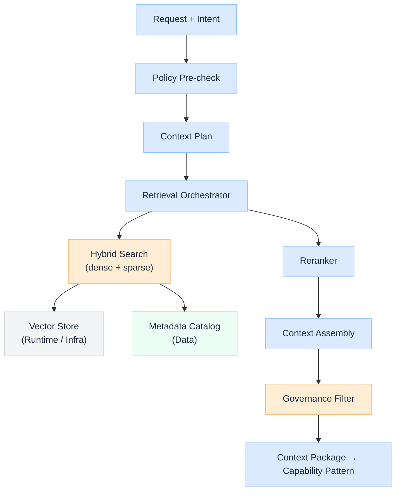
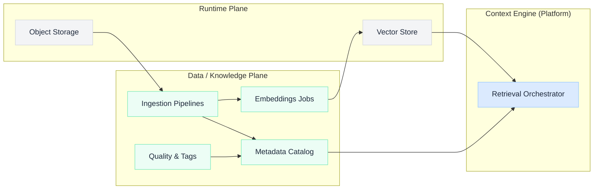

import Details from '@theme/Details';

  <h1 className="gain-doc-title">How to Model Context Engine</h1>
  

    Runtime context construction: the boundary where the data / knowledge plane meets control-plane
    orchestration.
  

  Data feeds the Context Engine. <strong>not the router</strong>. The engine assembles the right
  context for a given request: retrieved chunks, structured facts, user/session state, and governance
  filters. It sits after policy and before model routing in the standard request path.

## Ownership split

| Concern | AI Platform (Control) | Data Platform (Knowledge) |
| --- | --- | --- |
| Retrieval API and orchestration | ✓ | |
| Query planning and context assembly | ✓ | |
| Hybrid search invocation at runtime | ✓ | |
| Embeddings pipelines and re-indexing | | ✓ |
| Chunking strategy and index design | shared | shared |
| Metadata catalog and lineage | | ✓ |
| Data quality and freshness SLAs | | ✓ |
| Governance tags (PII, classification) | enforce | define |
| Vector store **hosting** | | Infra plane |
| Vector store **schema / collections** | shared | shared |

## Context Engine flow

## Context package contract (draft)

Every capability pattern (LLM, RAG, Agent) receives a **context package**: not raw retrieval dumps.

| Field | Description |
| --- | --- |
| `sources[]` | Retrieved documents with scores, chunk IDs, and citation metadata |
| `structured_facts[]` | Optional KG / SQL / API facts merged into context |
| `session_state` | Working memory pointers for multi-turn flows |
| `governance` | Applied filters, redactions, and classification labels |
| `freshness` | Index version, pipeline run ID, max staleness timestamp |
| `trace_id` | Links to observability and evaluation artifacts |

**TBD:** protobuf/JSON schema publication and versioning policy.

## Sub-components

  Maps intent + use-case profile to a retrieval strategy. Examples:

  - RAG profile: top-k hybrid, rerank depth, citation required
  - Agent profile: tool-scoped document collections only
  - Structured profile: SQL/KG lookup before vector fallback

  Planner reads **catalog metadata** (Data) but executes on **platform** runtime.

  Coordinates calls to vector stores, keyword indexes, and optional knowledge graphs. Responsibilities:

  - Parallel retrieval fan-out and timeout budgets
  - Collection routing based on tenant and data classification
  - De-duplication across overlapping chunks

  See [How to Model RAG Pipeline Layers](/blueprints/rag-architecture) for indexing and retrieval layer detail.

  Cross-encoder or lightweight LLM reranking after first-stage retrieval. Platform-owned service;
  models may run on runtime GPU pools. Highest-leverage quality lever after index design.

  Builds the final prompt-ready context window. Responsibilities:

  - Token budget allocation across sources
  - Citation ordering and structured delimiters
  - Conflict resolution when sources disagree

  **Grounded pillar:** assembly must preserve traceability to source IDs.

  Post-retrieval enforcement before context reaches the model. Applies:

  - PII redaction and masking rules from Data governance tags
  - Deny lists for collections or document classes
  - Maximum sensitivity tier per use case

  Works with [How to Model AI Control Plane](/blueprints/control-plane): policy decides *if* retrieval may run;
  governance filter decides *what* from results may pass through.

## Data plane interface

## Anti-patterns

- Application teams calling vector DBs or catalog APIs directly: bypasses policy and observability
- Data team owning request-time orchestration: blurs plane boundaries
- Router choosing retrieval collections: routing decides *model*; Context Engine decides *knowledge*
- Skipping citation metadata: breaks grounding validation and audit in regulated environments

## Related blueprints

- [How to Model AI Control Plane](/blueprints/control-plane): gateway, policy, and capability hosting
- [How to Model Data / Knowledge Plane](/blueprints/data-knowledge-plane): upstream pipelines and catalog
- [How to Model RAG Pipeline Layers](/blueprints/rag-architecture): indexing and retrieval layers in depth
