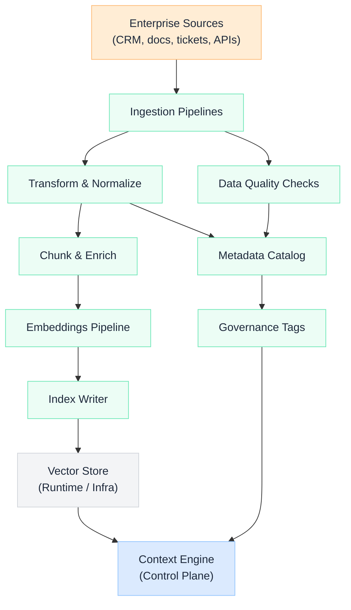

import Details from '@theme/Details';

<div className="gain-doc-header">
  <h1 className="gain-doc-title">Data / Knowledge Plane</h1>
  <div className="gain-doc-subtitle">
    Enterprise knowledge supply chain: pipelines, embeddings, catalogs, and governance tags that
    define what AI systems are allowed to know.
  </div>
</div>

<div className="gain-section-lead">
  Data provides <strong>what AI knows</strong>. This plane owns freshness, trust, and discoverability
  of enterprise knowledge: not request-time orchestration (Context Engine) or model routing
  (Control plane). Infrastructure hosts stores; Data owns content and metadata semantics.
</div>

## Plane placement

| Attribute | Value |
| --- | --- |
| **G.A.I.N pillar** | Grounded |
| **Owner** | Data Platform Team |
| **Feeds** | [Context Engine](/blueprints/context-engine) (primary consumer) |
| **Does not feed directly** | Application plane, model router |

## Knowledge supply chain

<div className="gain-diagram-wrap">



</div>

## Core components

<Details className="gain-accordion" summary="Ingestion pipelines: freshness">
  Scheduled and event-driven ingestion from enterprise source systems. Responsibilities:

  - CDC, batch, and API-based connectors
  - Idempotent writes and dead-letter handling
  - Freshness SLAs per collection (e.g. policies daily, tickets near-real-time)
  - Lineage: source system → document ID → chunk ID → embedding version

  **Boundary:** Data owns connectors to source APIs; Domain teams own source system business logic.
</Details>

<Details className="gain-accordion" summary="Embeddings pipelines: indexing">
  Batch and incremental embedding jobs that populate vector indexes. Responsibilities:

  - Embedding model selection and version pinning
  - Re-index strategies on model or chunking changes
  - Backfill orchestration and index blue/green swaps
  - Coordination with Infra for vector store capacity

  **Shared decision:** chunking strategy with Platform (Context Engine quality depends on index design).
</Details>

<Details className="gain-accordion" summary="Metadata catalog: discoverability">
  Central registry of knowledge collections AI systems may retrieve from. Each entry includes:

  - Owner domain, sensitivity tier, and retention policy
  - Schema of metadata filters (product, region, effective date)
  - Index location, embedding model version, last successful pipeline run
  - API surface for Context Engine planner (read-only at runtime)

  **TBD:** integration with enterprise data catalog (Collibra, Alation, etc.) vs. AI-native catalog.
</Details>

<Details className="gain-accordion" summary="Data quality: trust">
  Automated checks before content enters AI indexes. Examples:

  - Completeness and duplicate detection
  - Staleness alerts when SLAs breach
  - Schema drift on structured sources
  - Sample-based retrieval QA hooks feeding evaluation framework

  Quality failures should **block index promotion**, not silently degrade retrieval.
</Details>

<Details className="gain-accordion" summary="Governance tags: classification">
  Canonical labels applied at ingest time. Platform enforces at retrieval time. Tag types:

  - PII / PHI / PCI classification
  - Legal hold and geographic restriction
  - Audience scope (internal, customer-facing, regulator-ready)
  - Model training opt-in / opt-out flags

  **Security partnership:** tag definitions co-owned; Data applies at source, Platform filters at runtime.
</Details>

## Store responsibilities (Data vs Infra vs Platform)

| Store | Infra owns | Data owns | Platform owns |
| --- | --- | --- | --- |
| Vector DB | Cluster, scaling, backups | Collection schema, embedding version | Query orchestration |
| Object storage | Buckets, encryption, lifecycle | Document layout, partitioning |. |
| Knowledge graph | Hosting (if separate) | Ontology, entity resolution | Traversal at runtime |
| Operational DB replicas | Replication, HA | Read models for AI consumption |. |

## Collection lifecycle (draft)

```text
register → ingest → validate → embed → index → publish → monitor → deprecate
   ↑          ↑         ↑         ↑        ↑        ↑         ↑          ↑
 Catalog   Pipelines  Quality   Embed    Infra   Catalog   Quality   Catalog
```

**Publish gate:** a collection is not visible to Context Engine until quality checks pass and
catalog metadata is complete.

## Boundary lines (Data plane)

**Data Platform should not own:**

- Context Engine orchestration at request time
- Model routing, policy semantics, prompt templates
- Inference hosting and GPU lifecycle
- App UI, product workflows, business agent behavior

**Others should not own (Data retains):**

- Pipeline design and catalog semantics (not Infra)
- Embeddings indexing logic (not Platform)
- Governance tag definitions (not Product)

## Related blueprints

- [Context Engine](/blueprints/context-engine): downstream consumer of published collections
- [RAG Architecture](/blueprints/rag-architecture): indexing and retrieval layer patterns
- [AI Runtime Plane](/blueprints/runtime-plane): vector store and object storage hosting
- [Enterprise Operating Model](/frameworks/gain-aiom): team and plane ownership
