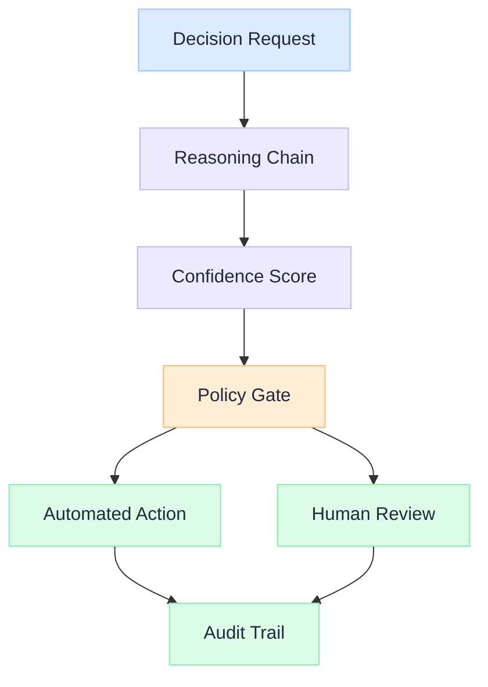

import Details from '@theme/Details';

  <h1 className="gain-doc-title">Decision Model</h1>
  
Structured decision-making patterns: reasoning chains, policy gates, and human-in-the-loop workflows.

## Decision Architecture

  AI systems make hundreds of micro-decisions per request: which tool to call, whether to escalate, how to format output. The decision model makes these choices explicit, auditable, and governable.

  

    <ul className="gain-checklist">
      <li>Reasoning chains</li>
      <li>Confidence scoring</li>
      <li>Policy gates</li>
      <li>Escalation paths</li>
      <li>Decision audit trail</li>
    </ul>
  

  

  

## Key Patterns

  Break complex decisions into explicit steps with intermediate conclusions. Chain-of-thought reasoning makes agent decisions inspectable and debuggable.

  Assign confidence levels to every decision. Low-confidence outputs trigger escalation rather than delivery: preventing silent failures in high-stakes contexts.

  Enforce business rules and compliance constraints at decision points. Policy gates convert organizational knowledge into executable architecture.

  Route high-impact or low-confidence decisions to human reviewers. HITL is not a fallback. It is a designed escalation path with clear triggers and SLAs.

