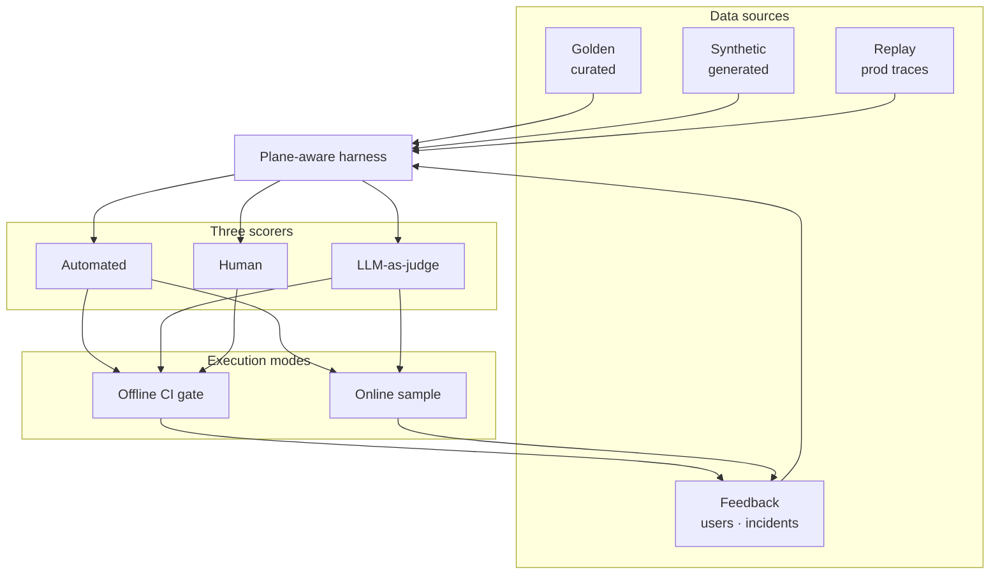

# Eval Framework Blueprint: All Planes, All Methods

This is the **implementation guide** for the Eval Engineering executive insight — *Eval Engineering: The Control System for Trustworthy AI* (not yet published). That piece explains *why* evals are the control system. This series explains *how* to build one that covers every plane, every failure mode, every data source, and every execution mode — without pretending a single end-of-pipeline score is enough.

:::tip[THE CLAIM]
**A robust eval framework scores every plane on static golden sets, synthetic cases, production replay, and user feedback — using automated checks, calibrated LLM-as-judge, and human review — in offline CI gates and online sampling — with incidents feeding the dataset continuously.**
:::

<!-- truncate -->

## What you are building

A production eval framework is six connected capabilities:

1. **Plane-aware harness** — replay production paths and score each stage, not just the final answer
2. **Data sources** — golden, synthetic, replay, and feedback loops (see below)
3. **Scoring stack** — automated checks, LLM-as-judge, human review on shared rubrics
4. **Offline gates** — CI/CD blocks promotion on regression
5. **Online eval** — sample, shadow, canary, drift detection after ship
6. **Improvement loop** — failures promote to datasets within days



## Eval modes & data sources

Scorers answer *how* you grade. Modes and sources answer *when* and *from what*.

| | **Offline (CI)** | **Online (production)** |
| --- | --- | --- |
| **Golden (static)** | Primary gate dataset | Compare drift vs baseline |
| **Synthetic** | Edge + adversarial expansion | Usually offline only |
| **Production replay** | Nightly + pre-release | Shadow path on live copies |
| **User feedback** | Promoted to golden | Real-time triage queue |
| **Decision** | Ship or reject | Drift alert · canary rollback |

Deep dives: [Golden Datasets](/playbooks/eval-engineering/golden-datasets) · [Synthetic Generation](/playbooks/eval-engineering/synthetic-generation) · [Online & Dynamic Eval](/playbooks/eval-engineering/online-dynamic)

### Static vs replay (do not conflate)

| | **Static golden** | **Production replay** |
| --- | --- | --- |
| **Origin** | Expert + sampled + synthetic | Full trace from prod |
| **Strength** | Stable regression baseline | Predicts real path behavior |
| **Weakness** | Ages without refresh | Needs trace infra + redaction |
| **Gate use** | Every PR | Model/index/tool changes + nightly |

## The three scoring methods (use all three)

| Method | Best for | Never use it alone for |
| --- | --- | --- |
| **Automated checks** | Schema, policy, latency, recall@k, tool args | Nuance, tone, partial correctness |
| **LLM-as-judge** | Grounding, completeness, reasoning at scale | Compliance sign-off, novel failures |
| **Human review** | Calibration, high-risk, audit samples | Every PR at enterprise scale |

**Calibration rule:** Humans anchor ground truth on a fixed sample. Judge tuned to κ ≥ 0.7. Automation encodes non-negotiables.

See [Human Review](/playbooks/eval-engineering/human-review) and [LLM-as-Judge](/playbooks/eval-engineering/llm-as-judge).

## Inside “automated checks” (specialized scorers)

“Automated” is not only `if json.valid`. Name these explicitly in your harness:

| Specialized scorer | Plane | vs LLM-as-judge |
| --- | --- | --- |
| **Policy / PDP replay** | Action | Deterministic verdict match |
| **Schema & type validation** | Tool, Input | Hard fail |
| **Retrieval metrics** | Context | recall@k, scope violations — math on IDs |
| **NLI / entailment** | Reasoning | Claim ↔ chunk support (optional model) |
| **Safety / injection classifiers** | Input | Trained classifier, not rubric |
| **Property / invariant tests** | All | “Never call tool X without ALLOW” |
| **Latency / cost budgets** | System | SLO assertions |

Compliance and money movement **never** rely on judge alone — policy replay + human.

## Comparative eval (pairwise)

| Mode | When |
| --- | --- |
| **Pointwise** | Default CI gate — absolute rubric thresholds |
| **Pairwise** | Pick better prompt/model when both pass pointwise |
| **Shadow pairwise** | New stack vs prod on same live inputs |

Documented in [LLM-as-Judge](/playbooks/eval-engineering/llm-as-judge).

## Eight planes, eight eval surfaces

Each plane gets its own dataset slice, rubric dimensions, and gate.

| Plane | Eval focus | Deep dive |
| --- | --- | --- |
| **① Input** | Parsing, injection, intent, PII | [Input](/playbooks/eval-engineering/plane-input) |
| **② Data** | Freshness, lineage, access | [Data](/playbooks/eval-engineering/plane-data) |
| **③ Context** | Retrieval, scope, abstention | [Context](/playbooks/eval-engineering/plane-context) |
| **④ Reasoning** | Faithfulness, conclusions, tools | [Reasoning](/playbooks/eval-engineering/plane-reasoning) |
| **⑤ Tool** | Selection, args, errors | [Tool](/playbooks/eval-engineering/plane-tool) |
| **⑥ Memory** | Isolation, TTL, leakage | [Memory](/playbooks/eval-engineering/plane-memory) |
| **⑦ Action** | Policy, authorization, audit | [Action](/playbooks/eval-engineering/plane-action) |
| **⑧ Outcome** | Task success, clarity, trust | [Outcome](/playbooks/eval-engineering/plane-outcome) |

## Golden case schema (every plane)

```json
{
  "id": "eval-2026-07-001",
  "plane": "context",
  "scenario": "representative | edge | adversarial | incident_replay",
  "status": "draft | active",
  "input": { "user_message": "...", "principal": "...", "session": "..." },
  "expected": {
    "must_retrieve": ["doc-id-1"],
    "must_not_retrieve": ["doc-id-9"],
    "abstain": false
  },
  "rubric": ["grounding", "scope", "ranking"],
  "failure_class": null,
  "source": "production_replay | synthetic | manual | user_feedback",
  "risk_tier": "low | medium | high"
}
```

Only `status: active` cases gate releases. High-risk → human regardless of judge score.

## Per-plane eval recipe

1. Define failure taxonomy for the plane
2. Instrument traces on every production request
3. Build dataset slice (representative + edge + adversarial per use case)
4. Automated checks + specialized scorers where applicable
5. Judge rubric (3–5 dimensions, anchored 1–5)
6. Calibrate judge vs human (κ ≥ 0.7)
7. Set offline gate thresholds per plane
8. Online sample + drift alerts for same plane metrics
9. Incident → case within one week

## Release gate matrix

| Change type | Planes to re-run | Offline gate | Online follow-up |
| --- | --- | --- | --- |
| Model swap | Context, Reasoning, Outcome | Golden + replay; no judge drift | Shadow 24h before full cutover |
| Prompt change | Reasoning, Outcome | Rubric ≥ baseline | Sample judge scores 48h |
| Retrieval / index | Data, Context | recall@k; scope = 0 on adversarial | Retrieval metric dashboard |
| Tool / ACL | Tool, Action | Schema 100%; PDP replay 100% | Policy violation alert |
| Memory store | Memory, Reasoning | Leakage = 0 | Session isolation monitor |

## Ownership

| Role | Owns |
| --- | --- |
| **Product / domain** | Rubrics, representative cases, business thresholds |
| **AI platform** | Harness, judge pipelines, score store, CI + online pipelines |
| **Governance** | Policy cases, audit sampling, high-risk human queue |
| **SRE / reliability** | Replay infra, drift alerts, incident-to-case SLA |

## Further reading (external)

Third-party articles, guides, and tool docs — curated by topic and mapped to each page in this series. By other practitioners, not this site.

**[Further reading (external) →](/playbooks/eval-engineering/further-reading)**

## Series index

**Foundations**
- [Golden Datasets](/playbooks/eval-engineering/golden-datasets) — curated case libraries
- [Synthetic Generation](/playbooks/eval-engineering/synthetic-generation) — scale edge & adversarial coverage
- [Online & Dynamic Eval](/playbooks/eval-engineering/online-dynamic) — post-ship sampling, shadow, canary, drift
- [Human Review](/playbooks/eval-engineering/human-review) — manual eval & calibration
- [LLM-as-Judge](/playbooks/eval-engineering/llm-as-judge) — scaled scoring & pairwise

**Plane playbooks**
- [① Input](/playbooks/eval-engineering/plane-input) · [② Data](/playbooks/eval-engineering/plane-data) · [③ Context](/playbooks/eval-engineering/plane-context) · [④ Reasoning](/playbooks/eval-engineering/plane-reasoning)
- [⑤ Tool](/playbooks/eval-engineering/plane-tool) · [⑥ Memory](/playbooks/eval-engineering/plane-memory) · [⑦ Action](/playbooks/eval-engineering/plane-action) · [⑧ Outcome](/playbooks/eval-engineering/plane-outcome)

**Reference**
- Eval Engineering (executive insight, coming soon) · [G.A.I.N Evaluation](/frameworks/gain-evaluation)
