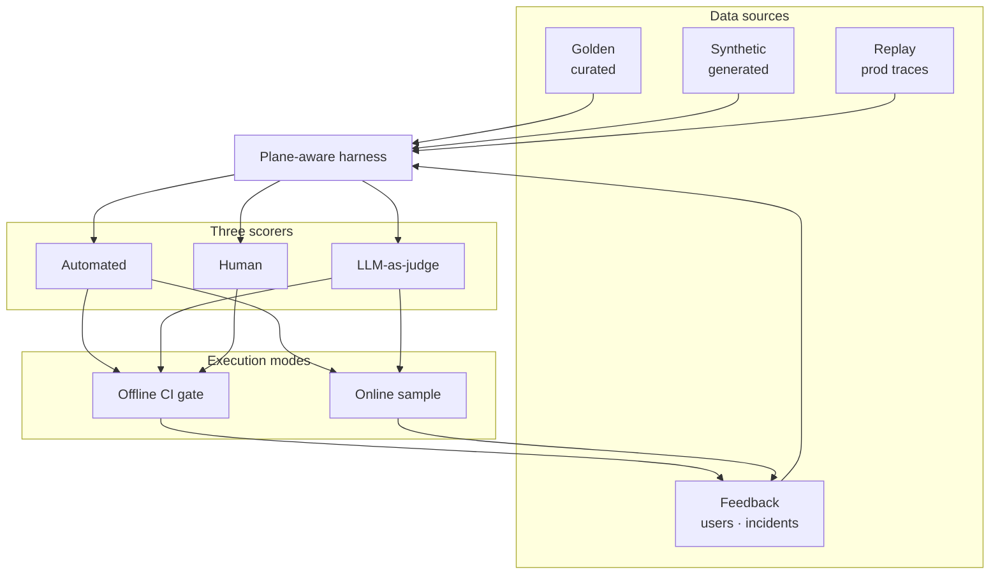

import Details from '@theme/Details';

# Evaluation Engineering: All Planes, All Methods

This is the **implementation guide** for eval engineering. Principles live in [G.A.I.N Evaluation](/frameworks/gain-evaluation). This series explains *how* to build a control system that covers every plane, every failure mode, every data source, and every execution mode, without pretending a single end-of-pipeline score is enough.

:::tip[THE CLAIM]
**A robust eval framework scores every plane on static golden sets, synthetic cases, production replay, and user feedback, using automated checks, calibrated LLM-as-judge, and human review, in offline CI gates and online sampling, with incidents feeding the dataset continuously.**
:::

<!-- truncate -->

## What you are building

A production eval framework is six connected capabilities on eight planes:

1. **Plane-aware harness:** replay production paths and score each stage, not just the final answer
2. **Data sources:** golden, synthetic, replay, and feedback loops (see below)
3. **Scoring stack:** automated checks, LLM-as-judge, human review on shared rubrics
4. **Offline gates:** CI/CD blocks promotion on regression
5. **Online eval:** sample, shadow, canary, drift detection after ship
6. **Improvement loop:** failures promote to datasets within days

The eight eval surfaces:

1. **Plane ① Input:** parsing, injection, intent, PII
2. **Plane ② Data:** freshness, lineage, access
3. **Plane ③ Context:** retrieval, scope, abstention
4. **Plane ④ Reasoning:** faithfulness, conclusions, tools
5. **Plane ⑤ Tool:** selection, args, errors
6. **Plane ⑥ Memory:** isolation, TTL, leakage
7. **Plane ⑦ Action:** policy, authorization, audit
8. **Plane ⑧ Outcome:** task success, clarity, trust


<br/>

| Plane | Eval focus | When |
| --- | --- | --- |
| **① Input** | Parsing, injection, intent, PII | Every request, before inference |
| **② Data** | Freshness, lineage, access | Index, corpus, and source changes |
| **③ Context** | Retrieval, scope, abstention | Every retrieval pack |
| **④ Reasoning** | Faithfulness, conclusions, tools | Every model plan or synthesis |
| **⑤ Tool** | Selection, args, errors | Every tool proposal |
| **⑥ Memory** | Isolation, TTL, leakage | Cross-turn and cross-session |
| **⑦ Action** | Policy, authorization, audit | Every side effect |
| **⑧ Outcome** | Task success, clarity, trust | Final user-visible result |

## Eval modes & data sources

Scorers answer *how* you grade. Modes and sources answer *when* and *from what*.

| | **Offline (CI)** | **Online (production)** |
| --- | --- | --- |
| **Golden (static)** | Primary gate dataset | Compare drift vs baseline |
| **Synthetic** | Edge + adversarial expansion | Usually offline only |
| **Production replay** | Nightly + pre-release | Shadow path on live copies |
| **User feedback** | Promoted to golden | Real-time triage queue |
| **Decision** | Ship or reject | Drift alert · canary rollback |

Deep dives: [Golden Datasets](/playbooks/evaluation/golden-datasets) · [Synthetic Generation](/playbooks/evaluation/synthetic-generation) · [Online & Dynamic Eval](/playbooks/evaluation/online-dynamic)

### Static vs replay (do not conflate)

| | **Static golden** | **Production replay** |
| --- | --- | --- |
| **Origin** | Expert + sampled + synthetic | Full trace from prod |
| **Strength** | Stable regression baseline | Predicts real path behavior |
| **Weakness** | Ages without refresh | Needs trace infra + redaction |
| **Gate use** | Every PR | Model/index/tool changes + nightly |

## The three scoring methods (use all three)

| Method | Best for | Never use it alone for |
| --- | --- | --- |
| **Automated checks** | Schema, policy, latency, recall@k, tool args | Nuance, tone, partial correctness |
| **LLM-as-judge** | Grounding, completeness, reasoning at scale | Compliance sign-off, novel failures |
| **Human review** | Calibration, high-risk, audit samples | Every PR at enterprise scale |

**Calibration rule:** Humans anchor ground truth on a fixed sample. Judge tuned to κ ≥ 0.7. Automation encodes non-negotiables.

See [Human Review](/playbooks/evaluation/human-review) and [LLM-as-Judge](/playbooks/evaluation/llm-as-judge).

## Inside “automated checks” (specialized scorers)

“Automated” is not only `if json.valid`. Name these explicitly in your harness:

| Specialized scorer | Plane | vs LLM-as-judge |
| --- | --- | --- |
| **Policy / PDP replay** | Action | Deterministic verdict match |
| **Schema & type validation** | Tool, Input | Hard fail |
| **Retrieval metrics** | Context | recall@k, scope violations: math on IDs |
| **NLI / entailment** | Reasoning | Claim ↔ chunk support (optional model) |
| **Safety / injection classifiers** | Input | Trained classifier, not rubric |
| **Property / invariant tests** | All | “Never call tool X without ALLOW” |
| **Latency / cost budgets** | System | SLO assertions |

Compliance and money movement **never** rely on judge alone: policy replay + human.

## Comparative eval (pairwise)

| Mode | When |
| --- | --- |
| **Pointwise** | Default CI gate: absolute rubric thresholds |
| **Pairwise** | Pick better prompt/model when both pass pointwise |
| **Shadow pairwise** | New stack vs prod on same live inputs |

Documented in [LLM-as-Judge](/playbooks/evaluation/llm-as-judge).

---

## Plane ①: Input

**Parse and classify before inference.** Playbook: [Input](/playbooks/evaluation/plane-input).

:::important[Plane ① bar]
If injection or ambiguous intent passes Input, no amount of retrieval quality will save the outcome.
:::

### Five capabilities

1. **Intent classification:** correct task route on the golden set
2. **Injection resistance:** no instruction override on the adversarial set
3. **PII detection:** sensitive fields flagged or redacted per policy
4. **Input schema:** malformed payloads rejected with a safe error
5. **Locale / encoding:** no corruption of non-ASCII content

Eval: [Input](/playbooks/evaluation/plane-input). Related: [Intent router](/playbooks/agents/intent-router).

---

## Plane ②: Data

**Source of truth behind the model.** Playbook: [Data](/playbooks/evaluation/plane-data).

:::important[Plane ② bar]
The vector store is a component in Data, not the whole plane. Stale sources, missing tombstones, and cross-env catalogs fail here, not in Context.
:::

### Five capabilities

1. **Freshness:** indexed version matches the authoritative source within SLA
2. **Lineage:** every chunk maps to source id, version, and transform step
3. **Access:** only entitled documents exist in the searchable set
4. **Correctness:** facts in indexed extracts match domain reference
5. **Deletion:** revoked material absent from the index within SLA

Eval: [Data](/playbooks/evaluation/plane-data).

---

## Plane ③: Context

**What reached the model for this call.** Playbook: [Context](/playbooks/evaluation/plane-context).

:::important[Plane ③ bar]
Data owns corpus health. Context owns whether this user, this question, got the right chunks in the pack.
:::

### Five capabilities

1. **Recall@k:** required docs in the top-k
2. **Precision@k:** share of top-k that is relevant
3. **Scope:** out-of-policy chunks never enter the pack
4. **Abstention:** no answer when evidence is below threshold
5. **Attribution:** cited chunks support the claims

Eval: [Context](/playbooks/evaluation/plane-context). Related: [G.A.I.N RAG](/frameworks/gain-rag).

---

## Plane ④: Reasoning

**Plan, synthesize, decide next steps.** Playbook: [Reasoning](/playbooks/evaluation/plane-reasoning).

:::important[Plane ④ bar]
Context can be perfect and reasoning can still fail. Score faithfulness (stays on evidence) separately from correctness (draws the right conclusion).
:::

### Five capabilities

1. **Faithfulness:** claims overlap supporting chunks
2. **Logical consistency:** conclusions follow from the pack
3. **Tool selection:** proposed tool matches the expected family
4. **Uncertainty:** thin evidence is expressed, not hidden
5. **Hallucination:** no unsupported claims

Eval: [Reasoning](/playbooks/evaluation/plane-reasoning).

---

## Plane ⑤: Tool

**How agents touch the real world.** Playbook: [Tool](/playbooks/evaluation/plane-tool).

:::important[Plane ⑤ bar]
Most production incidents are tool misuse, not bad prose. Schema, selection, and composition are automated gates.
:::

### Five capabilities

1. **Selection:** the correct tool from the scoped manifest
2. **Schema:** args match JSON schema
3. **Semantics:** args valid for the domain (human on money paths)
4. **Idempotency:** keys present where retries exist
5. **Allowlist:** no disallowed or invented tools

Eval: [Tool](/playbooks/evaluation/plane-tool).

---

## Plane ⑥: Memory

**State across turns, isolated by session.** Playbook: [Memory](/playbooks/evaluation/plane-memory).

:::important[Plane ⑥ bar]
Memory eval proves isolation and freshness, not how well the assistant "remembers" in a demo thread.
:::

### Five capabilities

1. **Session isolation:** User A state invisible to User B
2. **TTL expiry:** stale memory dropped per policy
3. **Consistency:** same fact across turns unless updated
4. **Write policy:** only allowed keys persisted
5. **Forget / delete:** erase propagates (GDPR and similar)

Eval: [Memory](/playbooks/evaluation/plane-memory).

---

## Plane ⑦: Action

**Proposal is not permission.** Playbook: [Action](/playbooks/evaluation/plane-action).

:::important[Plane ⑦ bar]
Eval here is mostly deterministic: PDP replay, principal match, audit-before-act. Never judge-only for money movement.
:::

### Five capabilities

1. **PDP verdict:** ALLOW, DENY, or STEP_UP matches golden scenarios
2. **Principal:** acting subject matches the token
3. **Policy pin:** `policy_version` recorded on the verdict
4. **Order:** side effect only after ALLOW
5. **Audit:** immutable record before execution

Eval: [Action](/playbooks/evaluation/plane-action). Related: [Governance Blueprint](/blueprints/governance/runtime).

---

## Plane ⑧: Outcome

**What the user sees, after every upstream plane is scored.** Playbook: [Outcome](/playbooks/evaluation/plane-outcome).

:::important[Plane ⑧ bar]
Outcome is the integration test across all planes. It is never the only test.
:::

### Five capabilities

1. **Task success:** user goal achieved (domain-defined)
2. **Completeness:** all parts of the question addressed
3. **Clarity:** actionable, unambiguous language
4. **Usefulness:** a practitioner would act on this
5. **Trust:** appropriate confidence and citations

Eval: [Outcome](/playbooks/evaluation/plane-outcome).

## Golden case schema (every plane)

<Details summary="Golden eval case schema (JSON)">

```json
{
  "id": "eval-2026-07-001",
  "plane": "context",
  "scenario": "representative | edge | adversarial | incident_replay",
  "status": "draft | active",
  "input": { "user_message": "...", "principal": "...", "session": "..." },
  "expected": {
    "must_retrieve": ["doc-id-1"],
    "must_not_retrieve": ["doc-id-9"],
    "abstain": false
  },
  "rubric": ["grounding", "scope", "ranking"],
  "failure_class": null,
  "source": "production_replay | synthetic | manual | user_feedback",
  "risk_tier": "low | medium | high"
}
```

</Details>

Only `status: active` cases gate releases. High-risk → human regardless of judge score.

## Per-plane eval recipe

1. Define failure taxonomy for the plane
2. Instrument traces on every production request
3. Build dataset slice (representative + edge + adversarial per use case)
4. Automated checks + specialized scorers where applicable
5. Judge rubric (3-5 dimensions, anchored 1-5)
6. Calibrate judge vs human (κ ≥ 0.7)
7. Set offline gate thresholds per plane
8. Online sample + drift alerts for same plane metrics
9. Incident → case within one week

## Release gate matrix

| Change type | Planes to re-run | Offline gate | Online follow-up |
| --- | --- | --- | --- |
| Model swap | Context, Reasoning, Outcome | Golden + replay; no judge drift | Shadow 24h before full cutover |
| Prompt change | Reasoning, Outcome | Rubric ≥ baseline | Sample judge scores 48h |
| Retrieval / index | Data, Context | recall@k; scope = 0 on adversarial | Retrieval metric dashboard |
| Tool / ACL | Tool, Action | Schema 100%; PDP replay 100% | Policy violation alert |
| Memory store | Memory, Reasoning | Leakage = 0 | Session isolation monitor |

## Ownership

| Role | Owns |
| --- | --- |
| **Product / domain** | Rubrics, representative cases, business thresholds |
| **AI platform** | Harness, judge pipelines, score store, CI + online pipelines |
| **Governance** | Policy cases, audit sampling, high-risk human queue |
| **SRE / reliability** | Replay infra, drift alerts, incident-to-case SLA |

## Further reading (external)

Third-party articles, guides, and tool docs, curated by topic and mapped to each page in this series. By other practitioners, not this site.

**[Further reading (external) →](/playbooks/evaluation/further-reading)**

## Series index

**Foundations**
- [Golden Datasets](/playbooks/evaluation/golden-datasets): curated case libraries
- [Synthetic Generation](/playbooks/evaluation/synthetic-generation): scale edge and adversarial coverage
- [Online & Dynamic Eval](/playbooks/evaluation/online-dynamic): post-ship sampling, shadow, canary, drift
- [Human Review](/playbooks/evaluation/human-review): manual eval and calibration
- [LLM-as-Judge](/playbooks/evaluation/llm-as-judge): scaled scoring and pairwise

**Eval planes**
- [① Input](/playbooks/evaluation/plane-input) · [② Data](/playbooks/evaluation/plane-data) · [③ Context](/playbooks/evaluation/plane-context) · [④ Reasoning](/playbooks/evaluation/plane-reasoning)
- [⑤ Tool](/playbooks/evaluation/plane-tool) · [⑥ Memory](/playbooks/evaluation/plane-memory) · [⑦ Action](/playbooks/evaluation/plane-action) · [⑧ Outcome](/playbooks/evaluation/plane-outcome)

**Reference**
- [G.A.I.N Evaluation](/frameworks/gain-evaluation)
