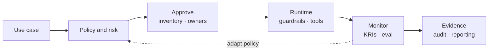

# Governance Operating: Four Questions, One Control System

[Governance](/blueprints/governance) · **Operating** · [Runtime →](/blueprints/governance/runtime)

This is the **estate operating model** for G.A.I.N Governance. Principles live in [G.A.I.N Governance](/frameworks/gain-governance). Same domain, other view: [Runtime](/blueprints/governance/runtime) (PGAR on the request path).

:::tip[THE CLAIM]
**AI Governance is how we ensure it.** Responsible AI defines outcomes. Regulatory AI defines obligations. AI Risk names what can go wrong. This blueprint is the control system across the estate: policy, inventory, approval, owners, monitoring, and evidence. It is not PEP/PDP.
:::

<!-- truncate -->

## Two views, one domain

| View | Question | Audience | Blueprint |
| --- | --- | --- | --- |
| **Operating** (this page) | How do we ensure it across the estate? | Exec, risk, compliance, enterprise architects | You are here |
| **Runtime** | How does one request stay governed on the path? | Platform, security/IAM, SRE | [Governance Runtime](/blueprints/governance/runtime) |

Do not split these into two G.A.I.N subjects. [G.A.I.N AIOM](/frameworks/gain-aiom) still answers **who owns which plane**. This page answers **which control capabilities those owners must run**.

## Layer model

```text
Should we?           →  Responsible AI   (outcomes)
Must we?             →  Regulatory AI    (obligations)
What can go wrong?   →  AI Risk          (threats and residual risk)
How do we ensure it? →  AI Governance    (this operating model)
```
<br/>

Staff Responsible, Regulatory, and Risk as sibling workstreams **under** Governance. Do not merge them into one slogan.

## Capability tree

```text
AI Governance
├── AI Strategy & Policy
├── AI Risk Management
├── Responsible AI
│   ├── Ethical · Accountable · Transparent · Explainable · Trustworthy
├── Regulatory Compliance
├── Model / AI Lifecycle Governance
├── Security & Privacy
├── Human Oversight
├── Controls & Guardrails
├── Monitoring & Assurance
└── Audit & Evidence
```
<br/>

| Capability | Ensures | Typical owner |
| --- | --- | --- |
| Strategy and policy | Intentional use; banned uses; appetite | AI Governance lead + exec sponsor |
| Risk management | Threats known, treated, residual accepted | Risk |
| Responsible AI | Outcomes match values and harm boundaries | Ethics + product + risk |
| Regulatory compliance | Obligation register mapped to controls | Legal / Compliance |
| Lifecycle | Inventory, change, retirement | AI Platform |
| Security and privacy | Attack surface and data duties | Security + Privacy |
| Human oversight | HITL where risk demands | Product + Risk |
| Controls and guardrails | Runtime enforcement | AI Platform ([Runtime](/blueprints/governance/runtime)) |
| Monitoring and assurance | Drift, quality, control health | Platform + Risk |
| Audit and evidence | Reconstructable decisions | Compliance + Platform |

## Control path

Every use case travels the same path. Runtime is one stage, not a second governance.


<br/>

- **Approve before scale:** no inventory, no owner, no go-live.
- **Runtime stage:** [Runtime blueprint](/blueprints/governance/runtime) and [Runtime playbooks](/playbooks/governance/runtime).
- **Evidence is continuous:** not a binder assembled for the auditor visit.

## Bank example: refund agent

| Lens | Operating model forces the question |
| --- | --- |
| Responsible | Fair treatment, named owners, explainability |
| Regulatory | Which obligations apply, and what proof? |
| Risk | Fraud, bias, injection, drift: mitigate and accept residual on purpose |
| **Governance** | Inventory, approval, access, runtime guardrails, monitoring, escalation, evidence pack |

Miss this page and you may have ethics slides and a policy PDF while the agent ships with no inventory entry. Miss [Runtime](/blueprints/governance/runtime) and the agent has an inventory entry but no PEP on the tool path.

## What this page is not

- Not a second G.A.I.N subject
- Not org-chart design ([AIOM](/frameworks/gain-aiom))
- Not PEP, SARAC, or five trust boundaries ([Runtime](/blueprints/governance/runtime))
- Operating how-to: [Operating playbooks](/playbooks/governance/operating) (inventory, obligation map, evidence pack)

## Related

| Resource | Use when |
| --- | --- |
| [G.A.I.N Governance](/frameworks/gain-governance) | Principles and G · A · I · N mapping |
| [G.A.I.N AIOM](/frameworks/gain-aiom) | Who owns application, control, runtime, knowledge planes |
| [Governance blueprints](/blueprints/governance) | Two views, one subject |
| [Runtime](/blueprints/governance/runtime) | Five boundaries, SARAC, three verdicts |
| [Operating playbooks](/playbooks/governance/operating) | Inventory, obligation map, evidence pack |
| [Runtime playbooks](/playbooks/governance/runtime) | Foundation, assurance, boundary |
