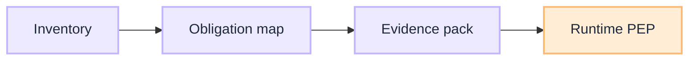

# Governance Operating: Approve Before Scale

[Governance](/blueprints/governance) · **Operating** · [Runtime →](/blueprints/governance/runtime)

This is the **estate reference design** for G.A.I.N Governance. The canonical model (layer model, capability tree, what the seven control-system rows do, control path) lives in [G.A.I.N Governance](/frameworks/gain-governance). Same domain, other view: [Runtime](/blueprints/governance/runtime) (PGAR on the request path). How-to: [Operating playbooks](/playbooks/governance/operating).

:::tip[THE CLAIM]
**Approve before scale.** No inventory, no owner, no go-live. This page is what the estate must produce before a use case hits Runtime. It is not PEP/PDP.
:::

<!-- truncate -->

## Two views, one domain

| View | Question | Audience | Blueprint |
| --- | --- | --- | --- |
| **Operating** (this page) | How do we ensure it across the estate? | Exec, risk, compliance, enterprise architects | You are here |
| **Runtime** | How does one request stay governed on the path? | Platform, security/IAM, SRE | [Governance Runtime](/blueprints/governance/runtime) |

Do not split these into two G.A.I.N subjects. [G.A.I.N AIOM](/frameworks/gain-aiom) still answers **who owns which plane**. [G.A.I.N Governance](/frameworks/gain-governance) is the operating map. This page is the estate go-live bar those owners must clear.

Canonical model: [layer model](/frameworks/gain-governance#layer-model-parent-control-system-three-workstreams) · [capability tree](/frameworks/gain-governance#capability-tree) · [what the control system does](/frameworks/gain-governance#what-the-control-system-does) · [control path](/frameworks/gain-governance#control-path).

## What the estate must produce

Each [control-system row](/frameworks/gain-governance#what-the-control-system-does) must leave an artifact on the estate before status can be `live`. Playbooks are the field lists; this table is the bar.

| Control-system row | Estate artifact before scale | How-to |
| --- | --- | --- |
| Strategy and policy | Signed appetite and banned uses for this use case | Named on the inventory row (sponsor + residual accept) |
| Lifecycle | Inventory row: owner, environment, retirement path | [Inventory](/playbooks/governance/operating/inventory) |
| Security and privacy | Data class, region, tool and corpus scope | Inventory row; Runtime enforces |
| Human oversight | HITL band on the policy profile | Product + Risk set it; [Runtime](/blueprints/governance/runtime) enforces |
| Controls and guardrails | Runtime profile pointer; PEP on the tool path | [Runtime](/blueprints/governance/runtime) |
| Monitoring and assurance | Named KRIs and eval gates | [G.A.I.N Evaluation](/frameworks/gain-evaluation) · Runtime assurance |
| Audit and evidence | Evidence pack linked from the inventory row | [Go-live evidence pack](/playbooks/governance/operating/go-live-evidence) |

## Go-live path

Every use case clears Operating, then Runtime. Runtime is one stage, not a second governance subject.

```mermaid
flowchart LR
    I["Inventory"] --> O["Obligation map"]
    O --> E["Evidence pack"]
    E --> R["Runtime PEP"]

    classDef process fill:#ede9fe,stroke:#c4b5fd,color:#1e293b,stroke-width:2px
    classDef gate fill:#ffedd5,stroke:#fdba74,color:#1e293b,stroke-width:2px

    class I,O,E process
    class R gate
```
 

1. **[Inventory](/playbooks/governance/operating/inventory):** named use case, owner, pattern, data class, go-live state.
2. **[Obligation-to-control map](/playbooks/governance/operating/obligation-to-control):** each must-we maps to a named control and an evidence artifact.
3. **[Go-live evidence pack](/playbooks/governance/operating/go-live-evidence):** what examiners get before scale.
4. **Then [Runtime](/blueprints/governance/runtime):** PEP, PDP, SARAC, five boundaries.

Status may move to `live` only when the inventory row is complete, every mapped obligation has a control that exists, PEP is on the tool path, policy scenarios pass, and a named sponsor has accepted residual risk.

Miss this page and you may have ethics slides and a policy PDF while the agent ships with no inventory entry. Miss [Runtime](/blueprints/governance/runtime) and the agent has an inventory entry but no PEP on the tool path.

## What this page is not

- Not a second G.A.I.N subject
- Not the canonical layer model or capability tree ([G.A.I.N Governance](/frameworks/gain-governance))
- Not org-chart design ([AIOM](/frameworks/gain-aiom))
- Not PEP, SARAC, or five trust boundaries ([Runtime](/blueprints/governance/runtime))
- Operating how-to: [Operating playbooks](/playbooks/governance/operating)

## Related

| Resource | Use when |
| --- | --- |
| [G.A.I.N Governance](/frameworks/gain-governance) | Principles, G · A · I · N mapping, canonical tree |
| [G.A.I.N AIOM](/frameworks/gain-aiom) | Who owns application, control, runtime, knowledge planes |
| [Governance blueprints](/blueprints/governance) | Two views, one subject |
| [Runtime](/blueprints/governance/runtime) | Five boundaries, SARAC, three verdicts |
| [Operating playbooks](/playbooks/governance/operating) | Inventory, obligation map, evidence pack |
| [Runtime playbooks](/playbooks/governance/runtime) | Foundation, assurance, boundary |
