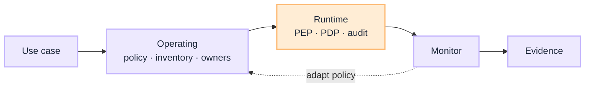

# Governance Blueprints

[Blueprints](/blueprints) · **Governance overview** · [Operating →](/blueprints/governance/operating)

Two views, one G.A.I.N subject. Operating is the estate control system. Runtime is PGAR on the request path. Principles live in [G.A.I.N Governance](/frameworks/gain-governance). Playbooks: [Governance](/playbooks/governance) ([Operating](/playbooks/governance/operating) · [Runtime](/playbooks/governance/runtime)).

:::tip[THE CLAIM]
**Do not split these into two G.A.I.N subjects.** Exec, risk, and compliance read Operating. Platform, security, and SRE read Runtime. Same domain, different question.
:::

<!-- truncate -->

## Two views

| View | Question | Audience | Blueprint |
| --- | --- | --- | --- |
| **[Operating](/blueprints/governance/operating)** | How do we ensure it across the estate? | Exec, risk, compliance, enterprise architects | Four questions, one control system |
| **[Runtime](/blueprints/governance/runtime)** | How does one request stay governed on the path? | Platform, security/IAM, SRE | Five boundaries, three verdicts |

 

PGAR gates side effects. It does not own RAG corpora, tool manifests, or the memory store. Those stay on [RAG](/blueprints/rag-blueprint), [Agents](/blueprints/agents-blueprint), and [Memory](/playbooks/agents/orchestration/memory).

## Read next

**[Operating →](/blueprints/governance/operating)** · [Runtime](/blueprints/governance/runtime) · [G.A.I.N Governance](/frameworks/gain-governance) · [Governance playbooks](/playbooks/governance)
