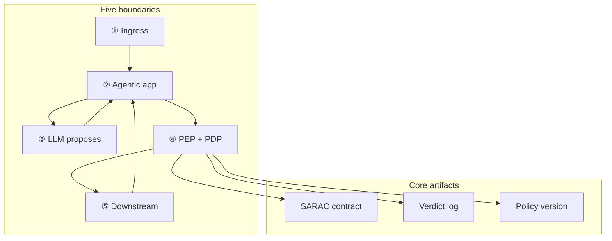

# Governance Runtime: Five Boundaries, Three Verdicts

[Governance](/blueprints/governance) · [← Operating](/blueprints/governance/operating) · **Runtime**

This is the **runtime** implementation guide for Policy-Governed Agent Runtime (PGAR). Principles live in [G.A.I.N Governance](/frameworks/gain-governance). Same domain, other view: [Operating](/blueprints/governance/operating) (estate control system). This series explains *how* to build runtime trust boundaries: token custody, PEP choke points, PDP surfaces, and immutable audit. RAG, MCP, and memory are other G.A.I.N subjects; PGAR gates their side effects.

:::tip[THE CLAIM]
**A production PGAR keeps credentials out of the LLM, gates every side effect at the PEP, returns only ALLOW / DENY / STEP_UP from the PDP, and logs the verdict before execution.**
:::

<!-- truncate -->

## What you are building

A Policy-Governed Agent Runtime is five connected capabilities on one request path:

1. **Boundary ① Ingress:** validate token, issue claims, bind every request to a principal
2. **Boundary ② Agentic app:** hold session and token; route proposals; never leak credentials to the model
3. **Boundary ③ LLM proposal:** LLM sees conversation and tool schemas only
4. **Boundary ④ PEP + PDP:** PEP asks PDP; verdict before downstream; structural choke point
5. **Boundary ⑤ Downstream:** re-auth, execute, return results to the app

 

| Boundary | Component | Decides | When |
| --- | --- | --- | --- |
| **① Ingress** | API gateway + IdP | Who is this principal, and are claims valid? | Once per request, before the loop |
| **② Agentic app** | Orchestrator | Who holds the token and routes proposals? | Entire session |
| **③ LLM proposal** | Model adapter | What did the model propose, with no authority? | Each inference |
| **④ PEP + PDP** | Policy choke point | ALLOW, DENY, or STEP_UP before any side effect? | Each tool side effect |
| **⑤ Downstream** | Target service | Does re-auth still permit this resource operation? | After ALLOW |

Audit replay is a **shared artifact** across ④ and ⑤: immutable verdict chain with policy version.

## The PGAR test

If any of these appear in your LLM payload, you have prompt governance, not PGAR:

- Bearer token or API keys
- Roles, entitlements, or limits
- Policy rule text
- PDP verdict history

The model **proposes**. The agentic app **holds authority**. The PEP **enforces**. The PDP **decides**.

## SARAC: the PDP contract

Every PEP → PDP call uses four fields:

| Field | Carries | Example |
| --- | --- | --- |
| **subject** | Who (claims from IdP) | roles, emts, limits, tenant |
| **action** | What tool / operation | `initiate_wire`, `retrieve_documents` |
| **resource** | On what target | beneficiary id, corpus, account |
| **context** | Conditions at decision time | amount, sanctions_status, approval |

Deep dive: [Policy Contracts](/playbooks/governance/runtime/foundation/policy-contracts)

## Three verdicts only

| Verdict | Meaning | PEP behavior |
| --- | --- | --- |
| **ALLOW** | Policy permits execution | Forward to downstream; log first |
| **DENY** | Policy blocks | Stop; no downstream call; log first |
| **STEP_UP** | Attestation required | Return to agentic app for step-up UX; re-evaluate with updated context |

No fourth option. No "the model felt confident."

See [PDP Policy Surfaces](/playbooks/governance/runtime/foundation/pdp-policy-surfaces) and [Step-Up & Attestation](/playbooks/governance/runtime/foundation/step-up-and-attestation).

---

## Boundary ①: Ingress

**No valid token, no agent session.** Playbook: [Ingress](/playbooks/governance/runtime/boundary/ingress).

:::important[Boundary ① bar]
Retrieval and tool paths inherit identity from ingress, not from the model. No anonymous agent sessions.
:::

### Five capabilities

1. **Token validation:** OAuth / OIDC / SAML at the edge
2. **Claims issuance:** `sub`, roles, entitlements, limits, tenant
3. **Rate limits and WAF:** abuse controls before the loop
4. **Correlation id:** every downstream decision binds to this request
5. **Principal bind:** every PEP call and audit record inherits identity from here

Playbook: [Ingress](/playbooks/governance/runtime/boundary/ingress).

---

## Boundary ②: Agentic app

**The orchestrator holds authority.** Playbook: [Agentic app](/playbooks/governance/runtime/boundary/agentic-app).

:::important[Boundary ② bar]
The agentic app is the only component that holds both the conversation and the credentials. It never sends the latter to the LLM.
:::

### Five capabilities

1. **Session custody:** hold token and pinned manifest
2. **LLM adapter:** strip auth; send conversation and tool schemas only
3. **Proposal routing:** forward tool proposals to the PEP
4. **Step-up UX:** hand off STEP_UP, re-enter with updated context
5. **Validation:** after retrieval, validate the pack before the next model call

Playbook: [Agentic app](/playbooks/governance/runtime/boundary/agentic-app). Related: [Orchestration](/playbooks/agents/orchestration).

---

## Boundary ③: LLM proposal

**The model proposes; it does not permit.** Playbook: [LLM proposal](/playbooks/governance/runtime/boundary/llm-proposal).

:::important[Boundary ③ bar]
Authority, tokens, and policy text stop at the agentic app adapter. The LLM boundary is proposal-only.
:::

### Five capabilities

1. **Schemas only:** tool definitions without credentials or entitlements
2. **Intent parse:** language understanding, not authorization
3. **Tool sequence:** planning proposals, not execution
4. **Draft copy:** user-facing explanation
5. **Unknown-tool block:** invented tools never reach PEP

Playbook: [LLM proposal](/playbooks/governance/runtime/boundary/llm-proposal).

---

## Boundary ④: PEP + PDP

**Proposal becomes permission here.** Playbook: [PEP + PDP](/playbooks/governance/runtime/boundary/pep-pdp).

:::important[Boundary ④ bar]
PEP enforces. PDP decides. Downstream never runs on DENY, and never runs on STEP_UP until re-eval returns ALLOW.
:::

### Five capabilities

1. **SARAC request:** subject, action, resource, context on every call
2. **Three verdicts only:** ALLOW, DENY, STEP_UP
3. **Audit first:** write the verdict before acting
4. **Policy pin:** `policy_version` on every record
5. **Deny-before-downstream:** no side effect on DENY or pending STEP_UP

Playbook: [PEP + PDP](/playbooks/governance/runtime/boundary/pep-pdp). Related: [Policy Contracts](/playbooks/governance/runtime/foundation/policy-contracts).

---

## Boundary ⑤: Downstream

**Re-auth, then execute, then return to the app.** Playbook: [Downstream](/playbooks/governance/runtime/boundary/downstream).

:::important[Boundary ⑤ bar]
PGAR does not replace downstream re-auth. It governs the proposal mile; nothing reaches downstream without ALLOW logged first.
:::

### Five capabilities

1. **ALLOW-only entry:** execute only after PEP ALLOW
2. **Re-authorization:** token still permits this operation on this resource
3. **Idempotency:** keys on side-effect APIs
4. **Return to app:** results go to the agentic app, never raw to the LLM
5. **Sanitize:** strip secrets before the next model turn

Playbook: [Downstream](/playbooks/governance/runtime/boundary/downstream).

## Other G.A.I.N subjects (cross-call, do not nest)

PGAR is domain-agnostic. It gates retrieve, tool execute, and memory recall. The how-to for those stores and contracts lives on the subject series:

| G.A.I.N subject | Side effect | Playbook |
| --- | --- | --- |
| **Agents** | Tool execute | [Manifest registry](/playbooks/agents/manifests/manifest-registry) · [Manifest lifecycle](/playbooks/agents/manifests/manifest-lifecycle) |
| **RAG** | Context pack | [RAG retrieval](/playbooks/rag/retrieval) |
| **Agents** | Prefs / episodes | [Memory](/playbooks/agents/orchestration/memory) |

Bridge: [Agents Blueprint](/blueprints/agents-blueprint) (manifests) · [RAG Blueprint](/blueprints/rag-blueprint) · [MCP Blueprint](/blueprints/mcp-blueprint) (transport) · [G.A.I.N RAG](/frameworks/gain-rag) · [G.A.I.N MCP](/frameworks/gain-mcp)

## Policy test scenarios (not optional)

Authorization regressions are deterministic. Build a scenario library parallel to eval golden sets:

| Scenario type | Example | Expected |
| --- | --- | --- |
| Representative | Under-limit wire | ALLOW |
| Edge | At-limit amount | STEP_UP or ALLOW per policy |
| Adversarial | Direct downstream call bypassing PEP | DENY / blocked at infra |
| Incident replay | Sanctions hit on validate | DENY, no initiate |

See [Policy Test Scenarios](/playbooks/governance/runtime/assurance/policy-test-scenarios) and [Adversarial Testing](/playbooks/governance/runtime/assurance/adversarial-testing).

Eval overlap: [Eval Plane Action](/playbooks/evaluation/plane-action) scores whether enforcement worked; PGAR playbooks explain how to build it.

## Release gate matrix

| Change type | Re-run | Offline gate | Online follow-up |
| --- | --- | --- | --- |
| New tool in manifest | Tool + PEP scenarios | Schema 100%; manifest violations 0 | Alert on unknown tool proposals |
| Policy version bump | Full PDP regression suite | Verdict match 100% on golden scenarios | Policy version pinned in audit |
| New corpus / index (RAG) | Retrieval + scope scenarios | Scope adversarial 0 leaks | Context pack audit sample |
| Step-up rule change | STEP_UP scenarios | Re-eval path 100% | Step-up completion rate monitor |
| Agent prompt / model swap | Adversarial bypass set | No unauthorized downstream calls | PEP block rate dashboard |

## Ownership

| Role | Owns |
| --- | --- |
| **Security / IAM** | IdP, token shape, entitlements model |
| **AI platform** | Agentic app, PEP integration, tool manifest |
| **Governance / compliance** | PDP policy surfaces, audit retention, examiner packs |
| **Domain teams** | Downstream re-auth, business rules in PDP context |
| **SRE** | Verdict log infra, replay tooling, choke-point monitoring |

## Implementation sequence

Start at the [Runtime playbooks overview](/playbooks/governance/runtime), then:

1. [Foundation playbooks](/playbooks/governance/runtime/foundation): SARAC, token custody, PEP/PDP, step-up, audit
2. [Assurance playbooks](/playbooks/governance/runtime/assurance/policy-test-scenarios): CI scenarios and adversarial bypass tests
3. [Boundary playbooks](/playbooks/governance/runtime/boundary) ①-⑤ in order
4. Cross-call [Manifests](/playbooks/agents/manifests/manifest-registry), [RAG](/playbooks/rag), or [Memory](/playbooks/agents/orchestration/memory) for the gated store or contract

## Further reading (external)

Third-party PDP/PEP, OAuth, and policy-engine patterns, curated and mapped to this series.

**[Further reading (external) →](/playbooks/governance/runtime/further-reading)**

## Series index

**PGAR Runtime:** [Playbooks overview](/playbooks/governance/runtime)

**Foundations**
- [Overview](/playbooks/governance/runtime/foundation) · [Policy Contracts](/playbooks/governance/runtime/foundation/policy-contracts) · [Token & Session Boundary](/playbooks/governance/runtime/foundation/token-and-session-boundary)
- [PEP Enforcement](/playbooks/governance/runtime/foundation/pep-enforcement) · [PDP Policy Surfaces](/playbooks/governance/runtime/foundation/pdp-policy-surfaces)
- [Step-Up & Attestation](/playbooks/governance/runtime/foundation/step-up-and-attestation) · [Audit & Replay](/playbooks/governance/runtime/foundation/audit-and-replay)

**Assurance**
- [Policy Test Scenarios](/playbooks/governance/runtime/assurance/policy-test-scenarios) · [Adversarial Testing](/playbooks/governance/runtime/assurance/adversarial-testing)

**Boundary playbooks**
- [Overview](/playbooks/governance/runtime/boundary) · [① Ingress](/playbooks/governance/runtime/boundary/ingress) · [② Agentic app](/playbooks/governance/runtime/boundary/agentic-app) · [③ LLM proposal](/playbooks/governance/runtime/boundary/llm-proposal)
- [④ PEP + PDP](/playbooks/governance/runtime/boundary/pep-pdp) · [⑤ Downstream](/playbooks/governance/runtime/boundary/downstream)

**Other G.A.I.N series (gated by PGAR)**
- [MCP](/playbooks/mcp) · [RAG](/playbooks/rag) · [Memory](/playbooks/agents/orchestration/memory)

**Reference**
- [Governance](/blueprints/governance) · [Operating](/blueprints/governance/operating) · [G.A.I.N Governance](/frameworks/gain-governance) · [G.A.I.N Agents](/frameworks/gain-agents)
