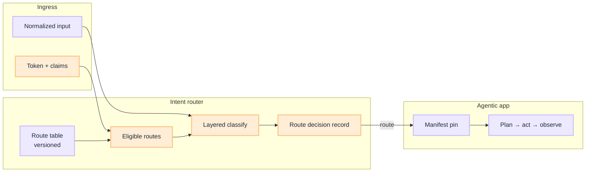

# Intent Router Blueprint: Route Before the Loop

**Plane ① of the [Router Blueprint](/blueprints/router-blueprint).** This is the **implementation guide** for [What Is an Intent Router](/insights/what-is-intent-router) and [How to Design an Intent Router](/insights/design-intent-router). Plane ② ([Orchestration](/blueprints/orchestration-plane-blueprint)) and Plane ③ ([Model routing](/blueprints/model-routing-plane-blueprint)) are separate tracks.

:::tip[THE CLAIM]
**A production intent router keeps the full route table in versioned platform config, filters by entitlements before any model sees labels, classifies in layers, emits a route decision record on every turn, and loads tool manifests only after route or user confirmation.**
:::

<!-- truncate -->

## What you are building

A production intent router is five connected capabilities:

1. **Route table:** versioned rows that bind `route_id`, manifest, policy profile, and model tier
2. **Eligible routes:** ingress claims intersect the table before classification
3. **Layered classifier:** rules → classifier → LLM fallback → safety veto
4. **Outcomes:** route, clarify, abstain, or top-k + user pick on high-risk paths
5. **Agentic handoff:** manifest pin and scoped tool schemas; router stays outside the loop

## Core artifacts

| Artifact | Purpose |
| --- | --- |
| **Route contract** (table row) | `route_id`, `intent_label`, manifest ref, `policy_profile`, `model_profile` |
| **Route decision record** | Per-turn audit: `route_table_version`, `eligible_routes`, `outcome`, `router_layer` |
| **Session pin** | `route_table_version` + `manifest_version` fixed for the session |
| **Golden intent set** | CI fixtures for representative, edge, adversarial, and session stickiness |

Decision record shape and thresholds: [How to Design an Intent Router](/insights/design-intent-router). Storage patterns: [Route table lifecycle](/playbooks/intent-router/route-table-lifecycle).

## Four playbooks

| Playbook | Owns |
| --- | --- |
| [Route table lifecycle](/playbooks/intent-router/route-table-lifecycle) | Where rows live, version, promote, and roll back |
| [Layered classifier](/playbooks/intent-router/layered-classifier) | Eligible routes, rules, classifier, LLM fallback, safety |
| [Wire agentic app](/playbooks/intent-router/wire-agentic-app) | Manifest load, clarify/abstain UX, PGAR boundary handoff |
| [Routing eval CI](/playbooks/intent-router/routing-eval-ci) | Golden set, release gates, incident replay |

Start at the [Intent Router playbooks overview](/playbooks/intent-router).

## Where this sits in the stack

Intent routing runs **after** [Ingress](/playbooks/pgar-runtime/boundary/ingress) and **before** [Agentic app](/playbooks/pgar-runtime/boundary/agentic-app). See [Router Blueprint](/blueprints/router-blueprint) for all three planes.

| Plane | Component | Blueprint |
| --- | --- | --- |
| **① Intent** | Route table, classifier | This series |
| **② Orchestration** | Agentic app, PEP loop | [Orchestration Plane](/blueprints/orchestration-plane-blueprint) · [PGAR](/blueprints/pgar-blueprint) |
| **③ Model** | LLM gateway | [Model Routing Plane](/blueprints/model-routing-plane-blueprint) · [G.A.I.N LLM](/frameworks/gain-llm) |
| **Eval** | Input plane golden set | [Eval Blueprint](/blueprints/eval-blueprint) |

## Release gate matrix

| Change type | Re-run | Offline gate | Online follow-up |
| --- | --- | --- | --- |
| New route row | Golden set + schema validation | Intent accuracy ≥ baseline − 1% | Misroute rate by route |
| Route table version bump | Full routing golden set | Adversarial 100%; confusion matrix reviewed | `route_table_version` in audit |
| Classifier model change | Golden + adversarial | Same gates; canary optional | Layer 3 usage rate |
| Manifest ref on route | Tool + routing fixtures | No silent manifest drift | Unknown tool proposals |
| Threshold tune | Golden set only | No regression on high-risk pairs | Clarify rate monitor |

## Ownership

| Role | Owns |
| --- | --- |
| **AI platform** | Route registry, classifier service, session pin contract |
| **Security / IAM** | Entitlements model that feeds eligible-routes filter |
| **Domain squads** | Route row definitions, descriptions, entity schemas |
| **Governance** | High-risk route approval, adversarial eval sign-off |
| **SRE** | Route table rollback, router latency SLOs, decision log retention |

## Implementation sequence

1. [Route table lifecycle](/playbooks/intent-router/route-table-lifecycle): define 5–8 rows, pick storage, pin `route_table_version`
2. [Layered classifier](/playbooks/intent-router/layered-classifier): eligible routes → rules → classifier → LLM fallback → safety
3. [Routing eval CI](/playbooks/intent-router/routing-eval-ci): golden set in parallel, not after launch
4. [Wire agentic app](/playbooks/intent-router/wire-agentic-app): manifest load from `route_id`; clarify/abstain without tools
5. [PGAR boundary playbooks](/playbooks/pgar-runtime/boundary): PEP and downstream on scoped manifest only

## Series index

**Intent Router:** [Playbooks overview](/playbooks/intent-router)

- [Route table lifecycle](/playbooks/intent-router/route-table-lifecycle)
- [Layered classifier](/playbooks/intent-router/layered-classifier)
- [Wire agentic app](/playbooks/intent-router/wire-agentic-app)
- [Routing eval CI](/playbooks/intent-router/routing-eval-ci)

**Reference**

- [What Is an Intent Router](/insights/what-is-intent-router) · [How to Design an Intent Router](/insights/design-intent-router)
- [G.A.I.N Agents](/frameworks/gain-agents) · [Eval Plane ①: Input](/playbooks/eval-engineering/plane-input)
- [PGAR Blueprint](/blueprints/pgar-blueprint) · [Agentic app](/playbooks/pgar-runtime/boundary/agentic-app)
