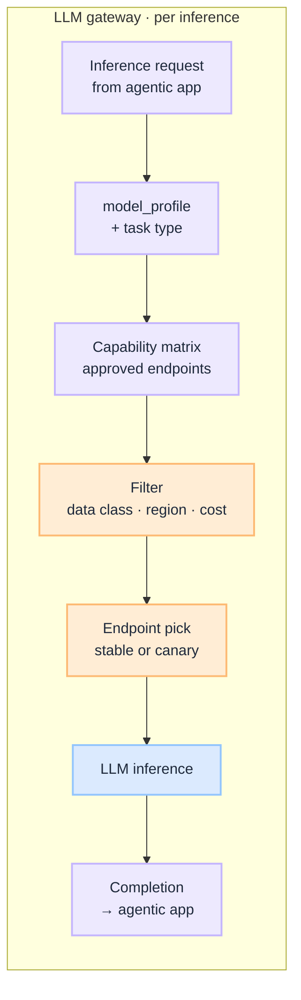

# LLM: Gateway Model Routing

This is the **implementation guide** for model routing. Principles live in [G.A.I.N LLM](/frameworks/gain-llm). Playbooks live under [LLM](/playbooks/llm). Intent dispatch and agent orchestration live in the [Agents Blueprint](/blueprints/agents-blueprint).

:::tip[THE CLAIM]
**The model does not choose which model runs.** Task-aware routing, abstention, and the capability matrix live on the gateway, not in the agent prompt.
:::

<!-- truncate -->

## What you are building

A production LLM gateway is five connected capabilities on every inference call:

1. **Task signal:** receive task type (plan, synthesize, classify) plus `model_profile` from the route
2. **Capability matrix:** filter approved endpoints by task, data class, region, and entitlements
3. **Constraint score:** apply cost, latency, and residency rules
4. **Endpoint pick:** choose stable or canary route; abstain if no approved fit
5. **Return to the agentic app:** run inference and hand the completion back to Plane ②

Plane ① on the [Agents Blueprint](/blueprints/agents-blueprint) may pin `model_profile` on the route row. The **LLM gateway** resolves that to a registry-approved endpoint.

 

This diagram is **model routing only**. It does not choose workflows (Agents Plane ①) or tools (Agents Plane ②).

## Shared rules

| Rule | Applies to |
| --- | --- |
| **Versioned platform config** | Capability matrix |
| **Pin per session or request** | Model route id |
| **Trace every decision** | Model endpoint id |
| **CI gate on change** | Model canary |
| **LLM does not own authority** | Gateway registry picks endpoint |

## Do not collapse

| Anti-pattern | Fix |
| --- | --- |
| Model choice only in the system prompt | Gateway matrix + task routing |
| Ad-hoc vendor URLs in app config | Approved endpoints only |
| One LLM call routes, plans, and picks model | Agents own intent and orchestration; this blueprint owns the endpoint |
| Canary without an eval gate | [Canary promotion](/playbooks/llm/canary-promotion) |

## What this plane decides

| Decides | Does not decide |
| --- | --- |
| Which approved model endpoint for this call | Which workflow or manifest ([Agents](/blueprints/agents-blueprint) Plane ①) |
| Cost, latency, region, data-class constraints | Which tool to propose ([Agents](/blueprints/agents-blueprint) Plane ②) |
| Canary vs stable route for a task tier | PEP verdict on side effects ([Governance](/blueprints/governance/runtime)) |

## Playbooks

Start at [LLM overview](/playbooks/llm):

| Playbook | Owns |
| --- | --- |
| [Capability matrix](/playbooks/llm/capability-matrix) | Approved models per task, data class, region |
| [Gateway task routing](/playbooks/llm/gateway-task-routing) | Plan vs synthesize vs classify; failover, cost, abstain |
| [Canary promotion](/playbooks/llm/canary-promotion) | Eval-gated model swap and rollback |

`model_profile` on the route row is a coarse tier from Plane ① only. Inference handoff from the agentic app: [Inference handoff](/playbooks/agents/orchestration/inference-handoff).

## Ownership

| Role | Owns |
| --- | --- |
| **AI platform** | LLM gateway, capability matrix |
| **Security / IAM** | Data-class routing rules |
| **Domain squads** | Use-case model requirements |
| **Governance** | Model approval, canary sign-off |
| **SRE / FinOps** | Gateway SLOs, cost attribution |

## Implementation sequence

When you have multiple models or regions: [LLM playbooks](/playbooks/llm) in order: capability matrix → gateway task routing → canary promotion.

Eval: [Reasoning plane](/playbooks/evaluation/plane-reasoning).

## Series index

**Playbooks**

- [LLM overview](/playbooks/llm) · [Capability matrix](/playbooks/llm/capability-matrix) · [Gateway task routing](/playbooks/llm/gateway-task-routing) · [Canary promotion](/playbooks/llm/canary-promotion)

**Related**

- [G.A.I.N LLM](/frameworks/gain-llm) · [Agents Blueprint](/blueprints/agents-blueprint) · [Inference handoff](/playbooks/agents/orchestration/inference-handoff) · [Eval Blueprint](/blueprints/evaluation-blueprint)
