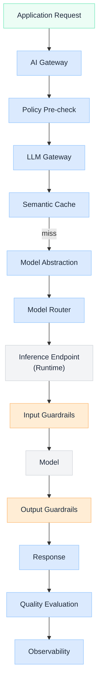

import Details from '@theme/Details';

  <h1 className="gain-doc-title">How to Model an LLM Gateway</h1>
  

    G.A.I.N LLM capability pattern: governed model access from gateway through guardrails, caching,
    and evaluation on the control plane.
  

  An LLM in production is a frozen function wrapped in architecture: not a chatbot endpoint.
  The LLM Gateway sits inside the control plane and provides a single, policy-governed path from
  application requests to runtime inference.

## Placement in the stack

| Layer | Components |
| --- | --- |
| Application | UX, workflows, domain prompts (within platform templates) |
| **LLM Gateway (this blueprint)** | Abstraction, cache, guardrails, eval hooks |
| Control plane shared | Policy engine, secrets, observability, model router |
| Runtime plane | vLLM / TGI / provider endpoints |

## LLM Gateway flow

## Sub-components

  Provider-neutral invocation interface. Responsibilities:

  - Normalize chat, completion, and structured-output APIs
  - Map platform model IDs to runtime deployments or external providers
  - Streaming, timeout, and retry semantics
  - Token usage capture for cost attribution

  See [How to Model AI Control Plane](/blueprints/control-plane) for full platform context.

  Platform-owned templates with injected domain variables from application teams. Responsibilities:

  - Schema validation on inputs and structured outputs
  - Version pinning and breaking-change detection via evaluation framework
  - System prompt immutability for regulated use cases

  **Boundary:** domain content in variables; platform owns template structure and safety shells.

  Reduce latency and cost for repeated or near-duplicate requests. Considerations:

  - Cache key: embedding of normalized prompt + model + policy context hash
  - TTL vs. freshness requirements per use case
  - Invalidation on prompt template or model version change
  - Opt-out for sensitive or unique regulatory queries

  **TBD:** Redis vs. dedicated vector cache; cache hit rate SLOs.

  Pre- and post-inference safety and compliance checks. Examples:

  - Prompt injection detection and PII scrubbing on input
  - Refusal patterns, toxicity, and off-topic filtering on output
  - Structured output validation (JSON schema, enum constraints)
  - Block-and-escalate vs. rewrite policies

  Works with Policy Engine: guardrails are specialized classifiers; policy is authoritative deny.

  Graceful behavior when primary inference fails. Strategies:

  - Secondary model in routing chain (smaller/faster/cheaper)
  - Cached stale response with disclosure flag
  - Human escalation queue for high-value flows
  - Hard fail with audit event for regulated deny paths

  **Native pillar:** reliability is architectural, not operational luck.

  LLM Gateway invokes sibling capability patterns when intent requires:

  - **RAG:** delegate to Context Engine before generation: [How to Model RAG Pipeline Layers](/blueprints/rag-architecture)
  - **Agents:** hand off to agent runtime: [How to Model Agent Execution Flows](/blueprints/agent-flow-model)
  - **Tools:** function-calling through Tool Registry with policy scopes

  Gateway orchestrates **which pattern** runs; it is not a monolithic chatbot.

  Every response path emits artifacts for offline and online evaluation:

  - Prompt version, model version, latency, token count
  - Guardrail trigger counts
  - Sampled human review queue for high-risk use cases
  - Regression dataset triggers on deploy

  Feeds Adaptive pillar via product KPIs and platform tuning loops.

## Model selection matrix (draft)

| Workload | Typical model tier | Routing priority |
| --- | --- | --- |
| High-volume FAQ / classification | Small, fast | Cost, latency |
| Customer-facing generation | Medium + guardrails | Quality, safety |
| Regulated decision support | Approved list only | Policy, audit |
| Batch extraction | Batch-optimized endpoint | Throughput |
| Code / reasoning agents | Large reasoning | Quality, tool support |

**TBD:** formal model registry with approval workflow and residency tags.

## Anti-patterns

- Application teams importing vendor SDKs and API keys directly
- Using LLM Gateway as a passthrough with no policy, cache, or observability
- Combining routing, retrieval, and generation in one untested prompt chain
- Skipping output validation for structured business actions

## Related blueprints

- [How to Model AI Control Plane](/blueprints/control-plane): hosting context for all platform components
- [How to Model Context Engine](/blueprints/context-engine): when LLM calls require grounded context
- [How to Model AI Runtime Plane](/blueprints/runtime-plane): inference endpoints and GPU pools
- [How to Model RAG Pipeline Layers](/blueprints/rag-architecture): retrieval-before-generation path
