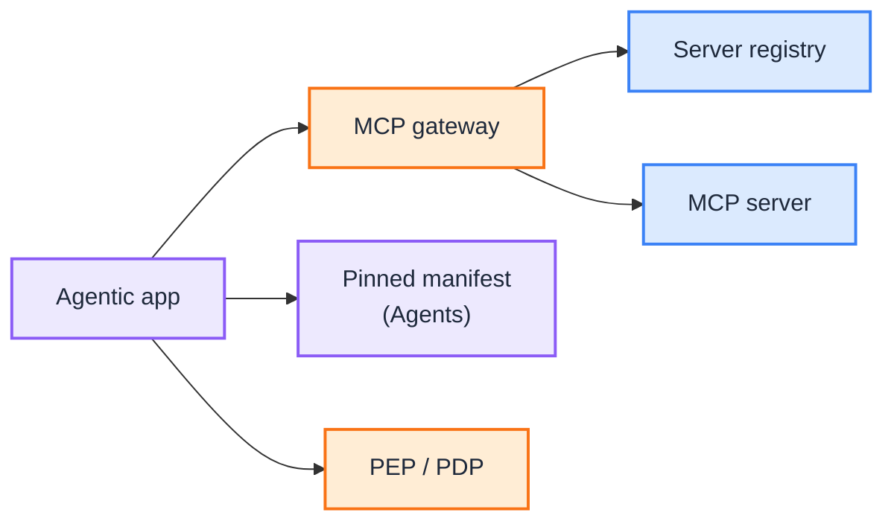

# MCP: Transport, Gateway, Registry

This is the **reference design** for MCP as **transport**. Principles live in [G.A.I.N MCP](/frameworks/gain-mcp). The tool contract (what the LLM may propose) lives in the [Agents Blueprint](/blueprints/agents-blueprint) under Manifests. Playbooks: [MCP](/playbooks/mcp) (transport) · [Agents: Manifests](/playbooks/agents/manifests/manifest-registry). Policy verdicts stay in [Governance Runtime](/blueprints/governance/runtime).

:::tip[THE CLAIM]
**MCP is a governed capability surface, not the tool allowlist.** The pinned manifest is the contract. MCP, OpenAPI, and domain APIs are adapters. The client plans; the gateway permits; the server executes.
:::

<!-- truncate -->

## What you are building

An MCP path that does not become the catalog:

1. **Server registry:** which MCP servers exist, who owns them, which environments may call them
2. **Gateway:** one choke point; clients do not dial arbitrary servers
3. **Scoped exposure:** `list_tools` returns only what the **pinned manifest** already allows
4. **Invoke:** `call_tool` still hits the agentic app check, then PEP, then the server
5. **Observe:** results return to the app, not raw to the LLM without validation

 

## Owns / does not own

| Owns | Does not own |
| --- | --- |
| MCP gateway, server registry, transport auth | Tool schema, `pdp_action`, unknown-tool reject ([Agents: Manifests](/blueprints/agents-blueprint)) |
| How `list_tools` / `call_tool` are wired | PEP verdicts ([Governance Runtime](/blueprints/governance/runtime)) |
| Federation of domain MCP servers | Route pin of `tool_manifest` ([Agents](/blueprints/agents-blueprint) Plane ①) |

## Do not collapse

| Anti-pattern | Fix |
| --- | --- |
| Manifest lives only inside MCP | Manifest is transport-agnostic; MCP is one adapter |
| Client connects to any server | Gateway + server registry |
| `list_tools` dumps the whole server | Scope to the pinned manifest |
| `call_tool` skips PEP | Same hop as any other tool: app validate, then PEP |

## Playbooks

- [MCP overview](/playbooks/mcp) for transport
- [Manifest registry](/playbooks/agents/manifests/manifest-registry) · [Manifest lifecycle](/playbooks/agents/manifests/manifest-lifecycle)
- [Runtime](/playbooks/governance/runtime) for PEP/PDP
