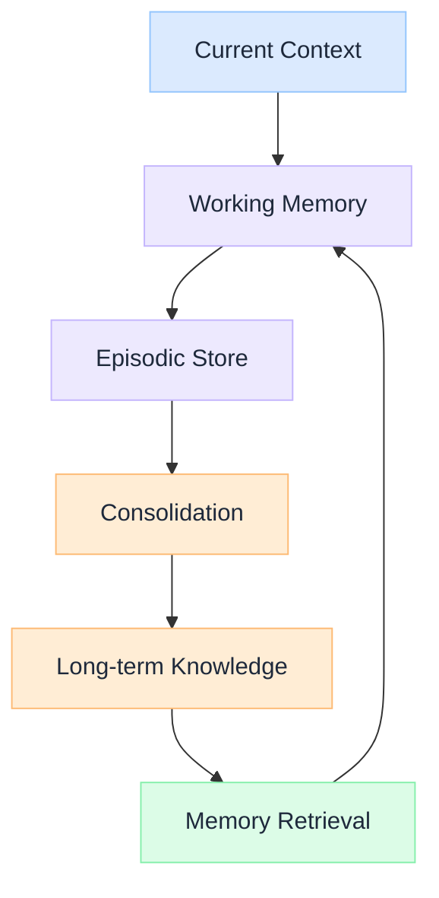

import Details from '@theme/Details';

  <h1 className="gain-doc-title">How to Model Agent Memory</h1>
  
Short-term, long-term, and episodic memory patterns for AI agents and conversational systems.

## Memory Architecture

  Agents without structured memory repeat mistakes and lose context. The memory model separates working, episodic, and long-term stores: each optimized for different access patterns and retention requirements.

  

    <ul className="gain-checklist">
      <li>Working memory</li>
      <li>Episodic history</li>
      <li>Long-term knowledge</li>
      <li>Memory consolidation</li>
      <li>Retrieval prioritization</li>
    </ul>
  

  

  

## Key Patterns

  Holds the current conversation context and active task state. Bounded by context window limits: prioritize what matters most for the current interaction.

  Stores interaction history with timestamps, outcomes, and user feedback. Enables agents to reference past conversations and learn from previous mistakes.

  Persistent facts, preferences, and learned patterns extracted from episodic memory. Consolidated periodically to prevent unbounded growth.

  Summarize and compress episodic memories into long-term knowledge. Without consolidation, memory stores grow unbounded and retrieval quality degrades.

