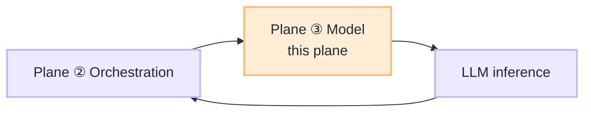

# Model Routing Plane (Router Plane ③)

**Plane ③ of the [Router Blueprint](/blueprints/router-blueprint).** After Plane ① picks a coarse `model_profile` on the route, the **LLM gateway** picks which registry-approved endpoint serves each inference call (plan, synthesize, classify fallback).

:::tip[THE CLAIM]
**The model does not choose which model runs.** Task-aware routing, abstention, and capability matrix live on the gateway, not in the agent prompt.
:::

<!-- truncate -->

## What this plane decides

| Decides | Does not decide |
| --- | --- |
| Which approved model endpoint for this call | Which workflow or manifest (Plane ①) |
| Cost, latency, region, data-class constraints | Which tool to propose (Plane ② planner) |
| Canary vs stable route for a task tier | PEP verdict on side effects |

Plane ① may pin `reasoning-standard` vs `lightweight-chat` on the route contract. Plane ③ resolves that to a concrete endpoint from the **model pool**.

## Where to build it today

| Resource | Purpose |
| --- | --- |
| **[G.A.I.N LLM](/frameworks/gain-llm)** | Gateway stack, capability matrix, adaptive canary |
| **[Intent Router Blueprint](/blueprints/intent-router-blueprint)** | `model_profile` on route rows only |

## Request position

## Playbooks (coming)

A dedicated `playbooks/model-routing` series is **not shipped yet**. Planned topics when added:

| Playbook (planned) | Topic |
| --- | --- |
| Capability matrix | Approved models per task, data class, region |
| Gateway task routing | Plan vs synthesize vs classify endpoints |
| Canary promotion | Eval-gated model swap and rollback |

Until then, use [G.A.I.N LLM](/frameworks/gain-llm) for design questions and platform ownership.

## Read next

**[G.A.I.N LLM →](/frameworks/gain-llm)** · **[Router Blueprint (three planes) →](/blueprints/router-blueprint)**
