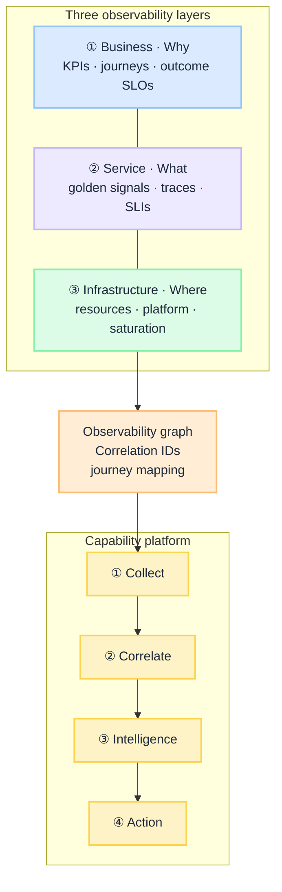
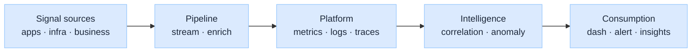

import Details from '@theme/Details';

# Observability Blueprint: Three Layers, One Graph

This is the **implementation guide** for the unified observability executive insight (*Building a Unified Observability Framework*, draft in local dev). That piece explains *why* siloed monitoring fails. This blueprint explains *what* to build: three layers, one observability graph, four capability planes, and a maturity path from reactive logs to business-aware operations.

:::tip[THE CLAIM]
**A production observability stack connects business KPIs to service traces and infrastructure signals through correlation IDs and journey mapping. Dashboards consume the graph; they do not replace it.**
:::

<!-- truncate -->

## What you are building

A unified observability framework is six connected capabilities:

1. **Business journey map:** KPIs and SLAs tied to named workflows, not orphan metrics
2. **Service instrumentation:** Golden signals, distributed traces, dependency graph, SLIs/SLOs
3. **Infrastructure telemetry:** Resource and platform health linked to service identities
4. **Observability graph:** Correlation from KPI → transaction → resource
5. **Capability platform:** Collection, correlation, intelligence, action layers
6. **Operating model:** Shared ownership across product, engineering, platform, SRE, architecture

 

Read the top row left to right: **Business → Service → Infrastructure**, then down through the **observability graph** and **capability platform**.

## The observability graph

The graph is the **unifying artifact**. It answers: when this KPI moved, which service transactions and which infra resources moved with it?

| Node | Carries | Example |
| --- | --- | --- |
| **Business event** | Journey step, outcome, principal | `checkout.payment.failed` |
| **Service span** | Operation, dependency, latency, error | `POST /payments` → `fraud.check` |
| **Infra signal** | Resource binding | `db-primary.cpu`, `pool.connections` |

### Example flow: payment success drop

| Layer | Observation |
| --- | --- |
| **Business** | Payment success rate 98% → 85% on checkout journey |
| **Service** | Payment API p95 latency up; fraud service timeouts; retry storms |
| **Infrastructure** | Database CPU 95%; connection pool exhaustion |

One incident narrative. No manual portal hopping.

:::important[AI workloads]
For agent and RAG paths, service spans must include **gateway, policy, retrieval, model, tool, and validation** hops. See [G.A.I.N Observability](/frameworks/gain-observability) and [AI Observability in Enterprise](/insights/ai-observability-in-enterprise). The graph shape is the same; the span set is richer.
:::

## Capability model

Think in **capabilities**, not tools.

| Capability | Owns | Does not own |
| --- | --- | --- |
| **① Data collection** | Metrics, logs, traces, business events at source | Dashboard layout |
| **② Correlation** | Trace IDs, journey mapping, dependency graph | Alert routing rules alone |
| **③ Intelligence** | Anomaly detection, SLO burn, trend analysis | Runbook content |
| **④ Action** | Runbooks, incident automation, remediation hooks (mature) | Business KPI definitions |

### Reference architecture (conceptual)

 

| Stage | Regulated-enterprise default |
| --- | --- |
| **Sources** | Structured logs, OTel traces, business event bus, infra agents |
| **Pipeline** | Enrichment with service identity, tenant, journey ID; redaction before persistence |
| **Platform** | Separate tiers for ops, quality, and audit retention |
| **Intelligence** | SLO burn-rate alerts, dependency-aware anomaly, business KPI thresholds |
| **Consumption** | SRE dashboards, product journey views, regulator replay exports |

## Maturity model

Observability is not binary. Use this ladder to plan investment.

:::note[Regulated-enterprise target]
Most firms should reach **L3 broadly** (business-aware, correlated graph) and **L4 on tier-1 journeys** before attempting L5. Autonomous remediation needs governance, audit trails, and blast-radius controls first.
:::

| Level | Name | Characteristics | Typical gap |
| --- | --- | --- | --- |
| **0** | Reactive | Logs only, manual debugging | No correlation |
| **1** | Monitoring | Dashboards, static alerts | Siloed layers |
| **2** | Observability | Metrics + logs + traces | Layers still disconnected |
| **3** | Business-aware | KPIs mapped to services, journey visibility | Limited prediction |
| **4** | Predictive | Anomaly detection, proactive alerts | Manual remediation |
| **5** | Autonomous ops | Automated remediation, self-healing (select paths) | Requires strong governance |

Assessment playbook: [Maturity assessment](/playbooks/observability/maturity-assessment).

## Design principles (governance rules)

| Rule | Rationale |
| --- | --- |
| Every service emits structured logs | Parsing cost and alert quality |
| Every request carries a correlation ID | Graph integrity |
| Every business KPI maps to system signals | Business-aware prioritization |
| Every alert has an owner and action | No orphan pages |
| Every dashboard answers a decision question | Prevents sprawl |
| No telemetry without purpose | Cost and compliance |

Playbook: [Governance rules](/playbooks/observability/governance-rules).

## Operating model (summary)

| Role | Owns |
| --- | --- |
| **Product** | Business KPIs, journey definitions, outcome SLOs |
| **Engineering** | Service instrumentation, SLIs, dependency accuracy |
| **Platform** | Observability infrastructure, pipelines, retention tiers |
| **SRE / reliability** | Alerting, incident response, error budgets |
| **Architecture** | Standards, correlation model, maturity roadmap |

Playbook: [Operating model](/playbooks/observability/operating-model).

## Playbook map

| Layer / topic | Playbook |
| --- | --- |
| Business journeys | [Business journey mapping](/playbooks/observability/business-journey-mapping) |
| Service golden signals | [Service golden signals](/playbooks/observability/service-golden-signals) |
| Infrastructure | [Infrastructure telemetry](/playbooks/observability/infrastructure-telemetry) |
| Correlation graph | [Correlation graph](/playbooks/observability/correlation-graph) |
| Governance | [Governance rules](/playbooks/observability/governance-rules) |
| Maturity | [Maturity assessment](/playbooks/observability/maturity-assessment) |
| Ownership | [Operating model](/playbooks/observability/operating-model) |

Start at [Observability playbooks overview](/playbooks/observability).

## Related G.A.I.N domains

| Domain | Relationship |
| --- | --- |
| [G.A.I.N Observability](/frameworks/gain-observability) | AI service-layer depth: capture, retention, audit |
| [G.A.I.N Evaluation](/frameworks/gain-evaluation) | Quality and drift consumers of telemetry |
| [PGAR audit and replay](/playbooks/pgar-runtime/foundation/audit-and-replay) | Policy verdict chain as audit-tier signal |
