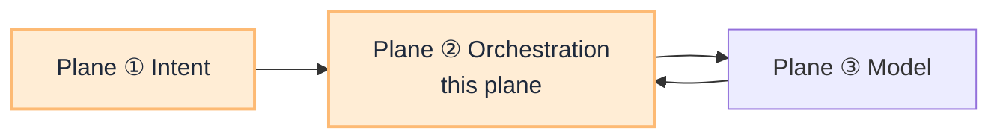

# Orchestration Plane (Router Plane ②)

**Plane ② of the [Router Blueprint](/blueprints/router-blueprint).** After Plane ① picks workflow and manifest, orchestration owns **what happens inside the loop**: session custody, tool proposals, PEP gates, validation, and synthesis.

:::tip[THE CLAIM]
**The agentic app orchestrates; the LLM proposes steps; the PEP permits side effects.** This is not intent routing and not model routing.
:::

<!-- truncate -->

## What this plane decides

| Decides | Does not decide |
| --- | --- |
| Next tool proposal inside a scoped manifest | Which workflow or manifest is active (Plane ①) |
| When to call PEP, validation, step-up | Which LLM endpoint serves the call (Plane ③) |
| Session state, token custody, loop bounds | Entitlements at ingress (IdP + Plane ① filter) |

In G.A.I.N terms this is the **agent planner** inside plan → act → observe, not a second "agent router" at ingress.

## Where to build it

This plane is **fully documented** under PGAR. Do not duplicate content here.

| Resource | Purpose |
| --- | --- |
| **[PGAR Blueprint](/blueprints/pgar-blueprint)** | Five boundaries, SARAC, release gates |
| **[PGAR Runtime playbooks](/playbooks/pgar-runtime)** | Foundation, assurance, boundary, domain recipes |
| **[Agentic app](/playbooks/pgar-runtime/boundary/agentic-app)** | Orchestration loop after intent route |
| **[Policy-Governed Agent Runtime](/insights/policy-governed-agent-runtime)** | Executive breakdown (plan → act → observe) |

## Request position

## Playbooks (existing)

Start at [PGAR Runtime overview](/playbooks/pgar-runtime):

1. [Foundation](/playbooks/pgar-runtime/foundation): SARAC, token custody, PEP/PDP, audit
2. [Boundary](/playbooks/pgar-runtime/boundary): ingress through downstream
3. [Domain](/playbooks/pgar-runtime/domain/tool-registry): manifests, RAG retrieval

Dedicated **orchestration-plane** playbooks under `/playbooks` are not planned; PGAR is the implementation track for Plane ②.

## Read next

**[PGAR Blueprint →](/blueprints/pgar-blueprint)**
