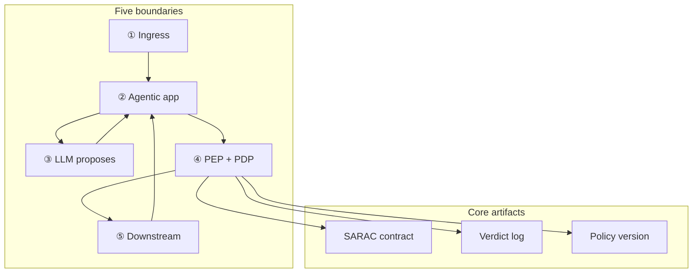

# PGAR Blueprint: Five Boundaries, Three Verdicts

This is the **implementation guide** for [Policy-Governed Agent Runtime](/insights/policy-governed-agent-runtime). The executive piece explains *why* proposal is not permission. This series explains *how* to build runtime trust boundaries: token custody, PEP choke points, PDP surfaces, immutable audit, and domain-specific enforcement (tools, retrieval, payments).

:::tip[THE CLAIM]
**A production PGAR keeps credentials out of the LLM, gates every side effect at the PEP, returns only ALLOW / DENY / STEP_UP from the PDP, and logs the verdict before execution.**
:::

<!-- truncate -->

## What you are building

A Policy-Governed Agent Runtime is five connected capabilities:

1. **Ingress trust:** validate token, issue claims, bind every request to a principal
2. **Agentic orchestration:** hold session and token; route proposals; never leak credentials to the model
3. **Proposal boundary:** LLM sees conversation and tool schemas only
4. **Policy enforcement:** PEP asks PDP; verdict before downstream; structural choke point
5. **Audit replay:** immutable verdict chain with policy version; answer examiners without chat logs

## The PGAR test

If any of these appear in your LLM payload, you have prompt governance, not PGAR:

- Bearer token or API keys
- Roles, entitlements, or limits
- Policy rule text
- PDP verdict history

The model **proposes**. The agentic app **holds authority**. The PEP **enforces**. The PDP **decides**.

## SARAC: the PDP contract

Every PEP → PDP call uses four fields:

| Field | Carries | Example |
| --- | --- | --- |
| **subject** | Who (claims from IdP) | roles, emts, limits, tenant |
| **action** | What tool / operation | `initiate_wire`, `retrieve_documents` |
| **resource** | On what target | beneficiary id, corpus, account |
| **context** | Conditions at decision time | amount, sanctions_status, approval |

Deep dive: [Policy Contracts](/playbooks/pgar-runtime/foundation/policy-contracts)

## Three verdicts only

| Verdict | Meaning | PEP behavior |
| --- | --- | --- |
| **ALLOW** | Policy permits execution | Forward to downstream; log first |
| **DENY** | Policy blocks | Stop; no downstream call; log first |
| **STEP_UP** | Attestation required | Return to agentic app for step-up UX; re-evaluate with updated context |

No fourth option. No "the model felt confident."

See [PDP Policy Surfaces](/playbooks/pgar-runtime/foundation/pdp-policy-surfaces) and [Step-Up & Attestation](/playbooks/pgar-runtime/foundation/step-up-and-attestation).

## Five boundaries, five playbooks

Each boundary gets its own implementation recipe, failure classes, and trace fields. Start with the [boundary overview](/playbooks/pgar-runtime/boundary), then read ①–⑤ in order.

| Boundary | Owns | Playbook |
| --- | --- | --- |
| **① Ingress** | Token validation, claims issuance | [Ingress](/playbooks/pgar-runtime/boundary/ingress) |
| **② Agentic app** | Session, orchestration, token custody | [Agentic app](/playbooks/pgar-runtime/boundary/agentic-app) |
| **③ LLM proposal** | Tool schemas, no credentials | [LLM proposal](/playbooks/pgar-runtime/boundary/llm-proposal) |
| **④ PEP + PDP** | Verdict before side effects | [PEP + PDP](/playbooks/pgar-runtime/boundary/pep-pdp) |
| **⑤ Downstream** | Re-auth, execute, return to app | [Downstream](/playbooks/pgar-runtime/boundary/downstream) |

## Domain extensions

PGAR is domain-agnostic. Two high-value patterns on this site:

| Domain | Side effect | Playbook |
| --- | --- | --- |
| **Tool registry** | API calls, workflows | [Tool registry](/playbooks/pgar-runtime/domain/tool-registry) · [Manifest lifecycle](/playbooks/pgar-runtime/domain/manifest-lifecycle) · [Worked example](/playbooks/pgar-runtime/domain/tool-registry#worked-example-one-proposal) |
| **RAG retrieval** | Context pack assembly | [RAG retrieval](/playbooks/pgar-runtime/domain/rag-retrieval) · [Worked example](/playbooks/pgar-runtime/domain/rag-retrieval#worked-example-one-request-step-by-step) |

Bridge reading: [PGAR with RAG](/insights/retrieval-is-a-governed-action)

## Policy test scenarios (not optional)

Authorization regressions are deterministic. Build a scenario library parallel to eval golden sets:

| Scenario type | Example | Expected |
| --- | --- | --- |
| Representative | Under-limit wire | ALLOW |
| Edge | At-limit amount | STEP_UP or ALLOW per policy |
| Adversarial | Direct downstream call bypassing PEP | DENY / blocked at infra |
| Incident replay | Sanctions hit on validate | DENY, no initiate |

See [Policy Test Scenarios](/playbooks/pgar-runtime/assurance/policy-test-scenarios) and [Adversarial Testing](/playbooks/pgar-runtime/assurance/adversarial-testing).

Eval overlap: [Eval Plane Action](/playbooks/eval-engineering/plane-action) scores whether enforcement worked; PGAR playbooks explain how to build it.

## Release gate matrix

| Change type | Re-run | Offline gate | Online follow-up |
| --- | --- | --- | --- |
| New tool in manifest | Tool + PEP scenarios | Schema 100%; manifest violations 0 | Alert on unknown tool proposals |
| Policy version bump | Full PDP regression suite | Verdict match 100% on golden scenarios | Policy version pinned in audit |
| New corpus / index (RAG) | Retrieval + scope scenarios | Scope adversarial 0 leaks | Context pack audit sample |
| Step-up rule change | STEP_UP scenarios | Re-eval path 100% | Step-up completion rate monitor |
| Agent prompt / model swap | Adversarial bypass set | No unauthorized downstream calls | PEP block rate dashboard |

## Ownership

| Role | Owns |
| --- | --- |
| **Security / IAM** | IdP, token shape, entitlements model |
| **AI platform** | Agentic app, PEP integration, tool manifest |
| **Governance / compliance** | PDP policy surfaces, audit retention, examiner packs |
| **Domain teams** | Downstream re-auth, business rules in PDP context |
| **SRE** | Verdict log infra, replay tooling, choke-point monitoring |

## Implementation sequence

Start at the [PGAR Runtime playbooks overview](/playbooks/pgar-runtime), then:

1. [Foundation playbooks](/playbooks/pgar-runtime/foundation): SARAC, token custody, PEP/PDP, step-up, audit
2. [Assurance playbooks](/playbooks/pgar-runtime/assurance/policy-test-scenarios): CI scenarios and adversarial bypass tests
3. [Boundary playbooks](/playbooks/pgar-runtime/boundary) ①–⑤ in order
4. [Tool registry](/playbooks/pgar-runtime/domain/tool-registry) and [manifest lifecycle](/playbooks/pgar-runtime/domain/manifest-lifecycle) for your agent's tool contract
5. Domain playbooks for side-effect patterns (RAG, payments)

## Further reading (external)

Third-party PDP/PEP, OAuth, and policy-engine patterns — curated and mapped to this series.

**[Further reading (external) →](/playbooks/pgar-runtime/further-reading)**

## Series index

**PGAR Runtime:** [Playbooks overview](/playbooks/pgar-runtime)

**Foundations**
- [Overview](/playbooks/pgar-runtime/foundation) · [Policy Contracts](/playbooks/pgar-runtime/foundation/policy-contracts) · [Token & Session Boundary](/playbooks/pgar-runtime/foundation/token-and-session-boundary)
- [PEP Enforcement](/playbooks/pgar-runtime/foundation/pep-enforcement) · [PDP Policy Surfaces](/playbooks/pgar-runtime/foundation/pdp-policy-surfaces)
- [Step-Up & Attestation](/playbooks/pgar-runtime/foundation/step-up-and-attestation) · [Audit & Replay](/playbooks/pgar-runtime/foundation/audit-and-replay)

**Assurance**
- [Policy Test Scenarios](/playbooks/pgar-runtime/assurance/policy-test-scenarios) · [Adversarial Testing](/playbooks/pgar-runtime/assurance/adversarial-testing)

**Boundary playbooks**
- [Overview](/playbooks/pgar-runtime/boundary) · [① Ingress](/playbooks/pgar-runtime/boundary/ingress) · [② Agentic app](/playbooks/pgar-runtime/boundary/agentic-app) · [③ LLM proposal](/playbooks/pgar-runtime/boundary/llm-proposal)
- [④ PEP + PDP](/playbooks/pgar-runtime/boundary/pep-pdp) · [⑤ Downstream](/playbooks/pgar-runtime/boundary/downstream)

**Domain playbooks**
- [Tool registry](/playbooks/pgar-runtime/domain/tool-registry) · [Manifest lifecycle](/playbooks/pgar-runtime/domain/manifest-lifecycle) · [RAG retrieval](/playbooks/pgar-runtime/domain/rag-retrieval)

**Reference**
- [Policy-Governed Agent Runtime](/insights/policy-governed-agent-runtime) · [PGAR with RAG](/insights/retrieval-is-a-governed-action) · [G.A.I.N Agents](/frameworks/gain-agents)
