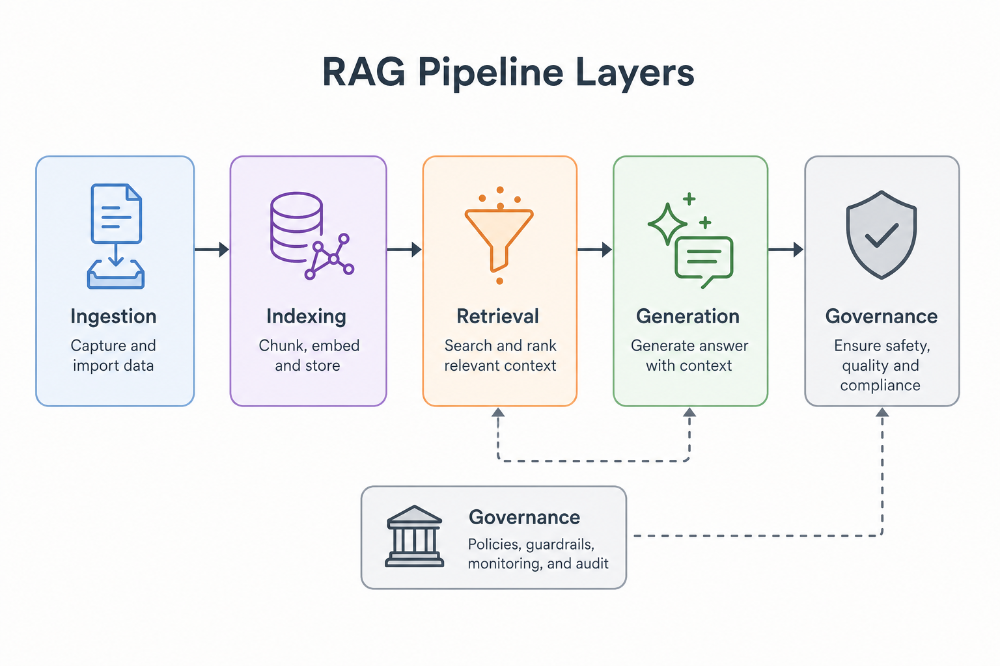
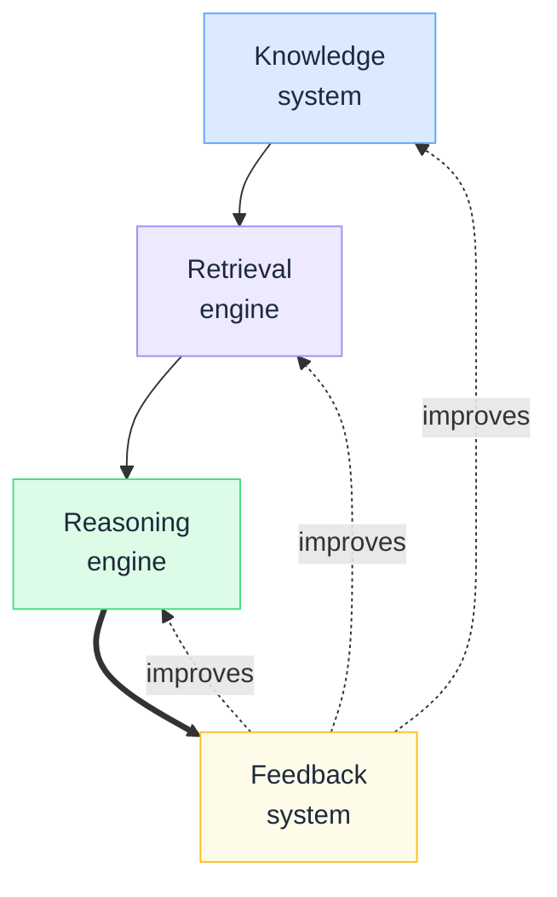
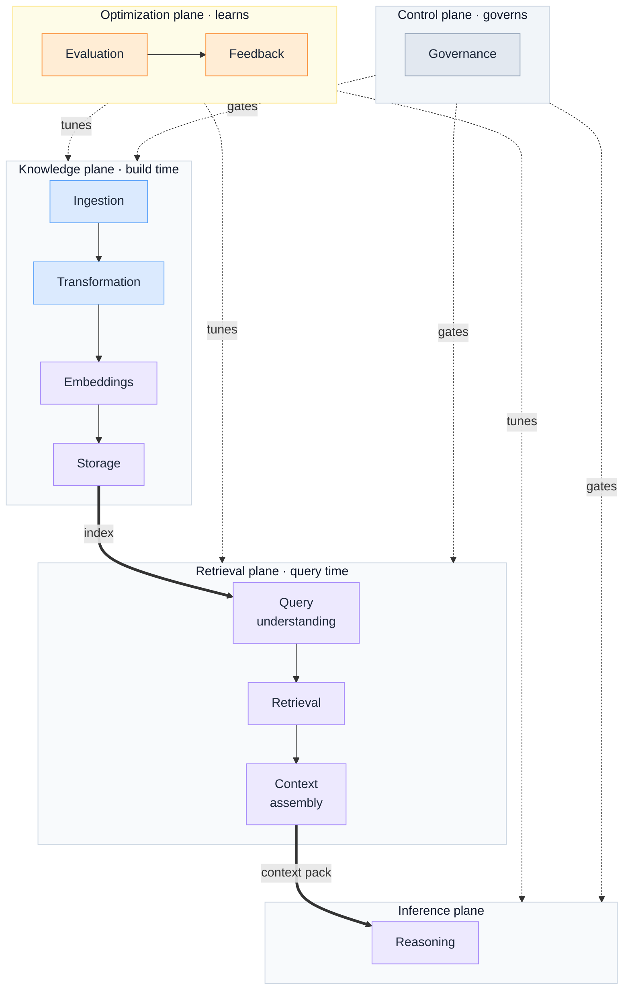
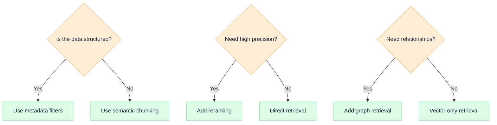
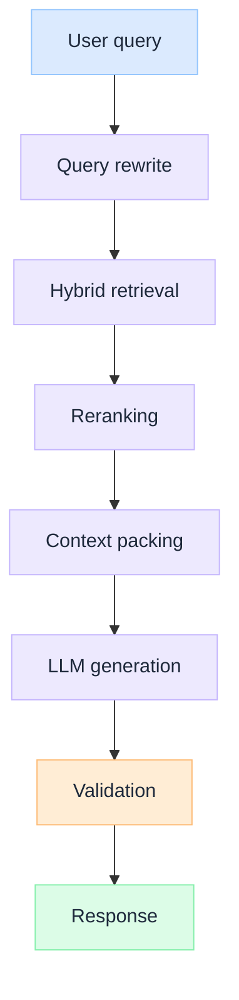

import Tabs from '@theme/Tabs';
import TabItem from '@theme/TabItem';

  <h1 className="gain-doc-title">How to Model RAG Pipeline Layers</h1>
  

    Reference model for production RAG as five planes: knowledge, retrieval, inference,
    optimization, and control: what each owns, how runtime flows through them, and the trade-offs
    at each boundary.
  

:::tip

  Production RAG is a layered distributed system, not a vector store with a prompt attached. Model it
  as five planes: a build-time <strong>Knowledge</strong> plane, a query-time{' '}
  <strong>Retrieval</strong> plane, an <strong>Inference</strong> plane that reasons, an{' '}
  <strong>Optimization</strong> plane that learns, and a <strong>Control</strong> plane that governs.
  Use this blueprint in a design review to place responsibilities, trace the runtime path, and choose
  the architecture for your precision, latency, and trust constraints.

:::

<!-- truncate -->

## Why layer RAG

  The fastest demo in AI is "retrieve top-k chunks, paste into a prompt, return the answer." It also
  fails first in production, because that single step quietly carries five different responsibilities
  and degrades on all of them at once.

At scale the cracks are predictable:

- **Freshness.** A one-off ingest script goes stale the moment a source changes. Without a build-time pipeline, the corpus drifts from reality and no one can say when.
- **Trust.** Retrieval with no identity boundary leaks across tenants. Generation with no abstention path turns thin evidence into fluent, confident wrong answers.
- **Latency.** Recall, reranking, and multi-hop reasoning each add milliseconds. Collapsed into one step, you cannot tune the budget where it matters.
- **Cost.** Embedding the whole corpus on every change, or packing oversized context on every call, burns money that layering lets you control.

Layering is the response. Each plane owns one responsibility, fails in an isolated and observable way, and emits a signal you can evaluate and audit. The motivation is not elegance. It is the ability to scale a knowledge system without losing freshness, trust, latency, or cost control.

## Mental model

Stop thinking "vector database." Think four cooperating subsystems behind one request: three on the request path, one looping quality back into them.

  

    <ul>
      <li><strong>Knowledge system</strong> — curates, transforms, and stores what the organization knows. Build-time, asynchronous, versioned.</li>
      <li><strong>Retrieval engine</strong> — finds the right evidence for one query, scoped to one principal. Query-time, latency-bound.</li>
      <li><strong>Reasoning engine</strong> — synthesizes an answer from a bounded context pack. Stateless per call; fluency without grounding is the risk.</li>
      <li><strong>Feedback system</strong> — observes outcomes and feeds quality back into the other three. Continuous; the only reason the system improves.</li>
    </ul>
  

  

  

The core idea: **RAG is a layered distributed system.** Every property you expect from distributed systems applies here too: independent failure domains, observability per layer, versioning for rollback, and trust boundaries enforced in code, not in hope.

## Layer model

  

    <ul className="gain-checklist">
      <li>Knowledge plane (build time)</li>
      <li>Retrieval plane (query time)</li>
      <li>Inference plane</li>
      <li>Optimization plane</li>
      <li>Control plane</li>
    </ul>
  

  

  

Read it top to bottom for the request path (knowledge feeds retrieval feeds inference), and read the dotted edges as cross-cutting: optimization and control attach to every plane, they are not a final step.

## The five planes

Each plane owns one responsibility. The tabs below drill into stages only when you need them: the one-line **takeaway** on each tab is enough for a design review.

<Tabs groupId="rag-plane">

<TabItem value="knowledge" label="Knowledge" default>

**Build-time pipeline.** Decides how knowledge becomes searchable; its failures are invisible until query time. *Takeaway: treat the index as versioned infrastructure: every re-embed is an eval-gated, reversible deploy.*

| Stage | Owns | Skipping it causes |
| --- | --- | --- |
| **Ingestion** | Source connectors, parsing, dedupe, source versioning | Stale corpus, lost provenance, no freshness SLA |
| **Transformation** | Chunking strategy, metadata extraction, normalization | Garbage chunks, no filter keys, broken structure |
| **Representation** | Embedding model choice, embedding versioning | No rollback on a bad re-embed, silent drift |
| **Storage** | Vector index, lexical index, hybrid layout | No hybrid recall, no versioned rollback primitive |

</TabItem>

<TabItem value="retrieval" label="Retrieval">

**Query-time evidence assembly.** Turns a question and an identity into a bounded, ranked context pack. *Takeaway: identity is enforced here, before ranking spends compute: never patched in after generation.*

| Stage | Owns | Skipping it causes |
| --- | --- | --- |
| **Query understanding** | Rewrite, expansion, intent and entity extraction | Literal matching, missed evidence, poor recall |
| **Search orchestration** | Hybrid (lexical + vector) search, ACL filter, top-k | Cross-tenant leakage, low precision candidates |
| **Reranking** | Cross-encoder scoring, score thresholds | Top-k blobs instead of the actually relevant set |
| **Context construction** | Token budget, dedupe, ordering, attribution | Bloated cost, lost citations, truncated evidence |

</TabItem>

<TabItem value="inference" label="Inference">

**Reasoning over retrieved context.** Synthesizes the answer, and is where fluency must be held to evidence. *Takeaway: citation and abstention are outcomes the system enforces, not behaviors you wish into a prompt.*

| Stage | Owns | Skipping it causes |
| --- | --- | --- |
| **Prompt orchestration** | System prompt, context injection, versioned templates | Unreproducible behavior, prompt drift |
| **Tool calls** | Function calling, retrieval-augmented actions | Static answers where the task needs live data or action |
| **Multi-hop reasoning** | Iterative retrieve-reason loops, planning | Shallow answers on questions that need decomposition |
| **Structured outputs** | Schema-constrained generation, citation binding | Free text that downstream systems cannot consume |

</TabItem>

<TabItem value="optimization" label="Optimization">

**Continuous improvement.** Why a deployed system gets better instead of decaying. *Takeaway: wire evaluation in from day one: a layer you cannot measure is a layer you cannot improve.*

| Stage | Owns | Skipping it causes |
| --- | --- | --- |
| **Evaluation** | Offline and online quality metrics, eval gates | No definition of "good," regressions ship silently |
| **Feedback loops** | Implicit and explicit signal capture, labeling | No data to improve retrieval or ranking |
| **Failure analysis** | Error clustering, root-cause by layer | Symptoms patched at the prompt, never the cause |
| **Adaptive tuning** | Reranker, chunking, and prompt iteration | Frozen quality while the corpus and queries move |

</TabItem>

<TabItem value="control" label="Control">

**Operational governance.** What makes the system safe to run in a regulated enterprise. *Takeaway: governance attaches at storage, retrieval, and output, not only the model call: if you cannot replay a request under its policy, you do not have production RAG.*

| Stage | Owns | Skipping it causes |
| --- | --- | --- |
| **Security** | Encryption, secret handling, tenant isolation | Data exposure, failed security review |
| **Access control** | Per-principal ACLs enforced at retrieval | Cross-tenant leakage, unprovable scoping |
| **Auditability** | Replayable logs of who retrieved what under which policy | No incident archaeology, failed audit |
| **Policy enforcement** | Freshness rules, content and usage policy | Stale or non-compliant answers shipped |
| **Guardrails** | Input and output validation, abstention routing | Free generation on thin or unsafe evidence |

</TabItem>

</Tabs>

## Choosing the path

The planes are fixed. The components inside them are choices. Three decisions cover most of the architecture.

Each branch is an architecture commitment, not a tuning knob. Structure decides how you chunk and filter, precision decides whether you pay for reranking, and relationship needs decide whether vectors alone are enough.

## Runtime execution

The layer model shows structure. This shows what happens on a single request.

The flow crosses three planes: rewrite through packing live in retrieval, generation in inference, and validation is the control-plane gate that decides whether the response ships or the system abstains.

## Design trade-offs

Layering does not remove the hard choices. It locates them. These are the decisions that turn the model into a concrete architecture.

| Trade-off | Choice | Default in regulated environments |
| --- | --- | --- |
| **Chunk size** | Small (precision) vs large (context) | Structure-aware chunks over fixed token windows |
| **Embedding cost** | Re-embed everything vs incremental | Versioned, incremental re-embed with eval gate |
| **Recall vs latency** | Wider candidate set vs faster response | Hybrid recall, then rerank inside the latency budget |
| **Hybrid vs graph** | Vector + lexical vs relationship traversal | Hybrid by default, graph only when relationships are core |
| **Static vs dynamic retrieval** | One pass vs iterative multi-hop | Single pass, escalate to multi-hop on low confidence |

Each row is a boundary you set deliberately, then evaluate. The plane model tells you where the decision lives. The trade-off table tells you which way to lean when truth, cost, and latency pull against each other.

## Related assets

- [How to Model Data / Knowledge Plane](/blueprints/data-knowledge-plane): upstream knowledge supply chain that feeds retrieval
- [How to Model AI Control Plane](/blueprints/control-plane): governance and policy enforcement across planes
- [RAG is not a database](/insights/rag-is-not-a-database): RAG as runtime context construction, not storage
- [G.A.I.N RAG](/frameworks/gain-rag): RAG through the G.A.I.N operating model
- [How to build enterprise RAG](/playbooks/build-enterprise-rag): step-by-step implementation
