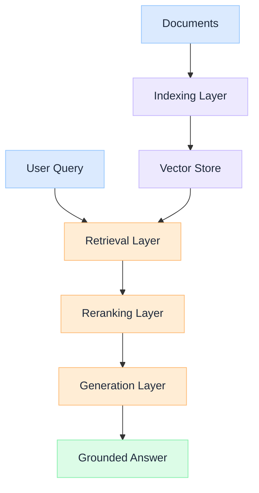

import Details from '@theme/Details';

  <h1 className="gain-doc-title">How to Model RAG Pipeline Layers</h1>
  
Reference architecture for indexing, retrieval, reranking, and generation layers.

## RAG System Layers

  A production RAG system is four distinct layers: indexing, retrieval, reranking, and generation: each with its own scaling characteristics, failure modes, and optimization levers.

  

    <ul className="gain-checklist">
      <li>Document ingestion</li>
      <li>Vector indexing</li>
      <li>Hybrid retrieval</li>
      <li>Cross-encoder reranking</li>
      <li>Grounded generation</li>
    </ul>
  

  

  

## Key Patterns

  Chunk, embed, and store documents with metadata preservation. Index design determines the ceiling on retrieval quality: no reranker can fix a bad index.

  Combine dense vector search with sparse keyword matching for hybrid retrieval. Pure semantic search misses exact matches; pure keyword search misses paraphrases.

  Apply cross-encoder models to reorder retrieved candidates by relevance. Reranking is typically the highest-ROI quality improvement in a RAG pipeline.

  Pass reranked context to the LLM with structured prompts and output validation. Generation quality depends entirely on retrieval quality upstream.

