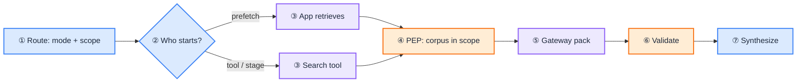

# RAG: Governed Retrieve, Validated Pack

This is the **reference design** for retrieval in production. Principles live in [G.A.I.N RAG](/frameworks/gain-rag). Playbooks live under [RAG](/playbooks/rag). Policy verdicts stay in [Governance Blueprint](/blueprints/governance/runtime).

:::tip[THE CLAIM]
**The route declares which corpora this capability may touch. The app fetches. The LLM synthesizes from a validated pack. Search is not permission.**
:::

<!-- truncate -->

## What you are building

A governed retrieval path on one request:

1. **Route pin:** `retrieval.mode` and `retrieval.scope` from the [route row](/playbooks/agents/intent-router/route-contract-reference)
2. **Who starts retrieve:** prefetch (app), named stage (workflow), or tool (LLM proposes inside allowlist)
3. **PEP:** action is retrieve; resource is one corpus in `scope`
4. **Gateway pack:** ACL, rerank, token budget, source ids
5. **Validate, then synthesize:** the app initiates validation; the model never searches the index directly

 

Customer prefs and session summaries are **not** this path. They are the memory service: [Memory](/playbooks/agents/orchestration/memory).

## Control points

| Control | Lives on | Must not |
| --- | --- | --- |
| `retrieval.mode` | Route row | Be inferred from the prompt |
| `retrieval.scope` | Route row | Widen mid-session |
| Corpus ACL | Retrieval gateway | Be a "don't search HR" instruction |
| PEP verdict | Governance | Be skipped for "read-only" search |

How the app branches per mode and pattern: [RAG retrieval](/playbooks/rag/retrieval).

## Eval and ownership

Eval: [Plane ③ Context](/playbooks/evaluation/plane-context). RAG / knowledge teams own corpora and packs. Security owns entitlements on the corpus resource. AI platform owns the pin and the PEP call.

## Playbooks

- [RAG overview](/playbooks/rag) · [RAG retrieval](/playbooks/rag/retrieval)
- [Runtime](/playbooks/governance/runtime) for PEP/PDP
- [Route contract](/playbooks/agents/intent-router/route-contract-reference) for the `retrieval` field
