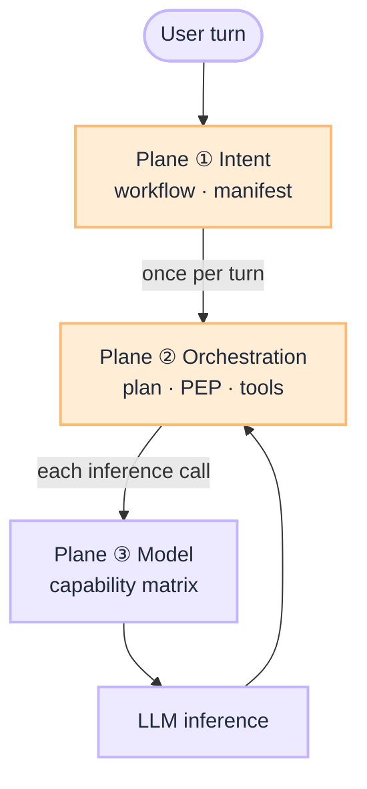
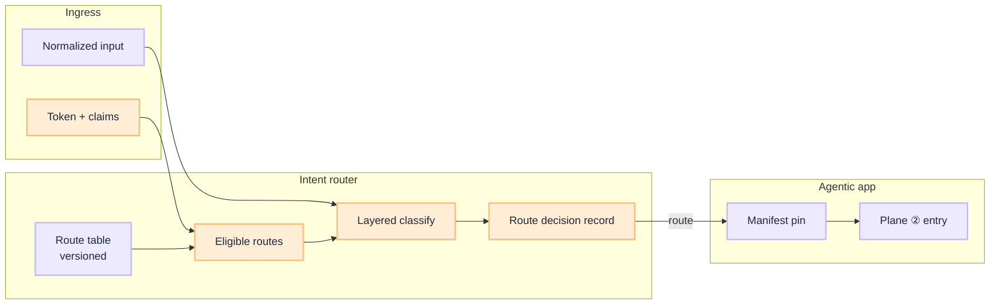

# Router Blueprint: Three Routing Planes

This is the **implementation guide** for routing in agentic systems. [What Is an Intent Router](/insights/what-is-intent-router) explains why routing belongs at ingress. This blueprint explains *how* to build all three planes: intent before the loop, orchestration inside it, and model selection at the gateway.

:::tip[THE CLAIM]
**The model proposes; the system routes.** Intent, orchestration, and model selection are separate platform decisions. Collapse them and you cannot eval, own, or audit failures in isolation.
:::

<!-- truncate -->

## What you are building

Production routing is three connected capabilities on one request path:

1. **Plane ① Intent:** versioned route table, entitlement filter, layered classifier, route decision record
2. **Plane ② Orchestration:** agentic app, scoped manifest, planner proposals, PEP/PDP on side effects
3. **Plane ③ Model:** LLM gateway, capability matrix, task-aware endpoint selection per inference call

 

| Plane | Question | When | Who acts |
| --- | --- | --- | --- |
| **① Intent** | Which workflow, agent profile, and tool manifest? | Once per turn, before the loop | **Intent router** (platform); system decides route |
| **② Orchestration** | Which step, tool proposal, and policy gate inside the workflow? | Inside plan → act → observe | **Agent planner** proposes; **PEP/PDP** permits |
| **③ Model** | Which approved model endpoint runs this call? | Per inference (plan, synthesize, classify) | **LLM gateway** (platform); registry picks endpoint |

## Shared rules (all planes)

| Rule | Applies to |
| --- | --- |
| **Versioned platform config** | Route table, manifests, capability matrix |
| **Pin per session or request** | `route_table_version`, `manifest_version`, model route id |
| **Trace every decision** | Route decision record, PEP verdict, model endpoint id |
| **CI gate on change** | Input golden set, policy scenarios, model canary |
| **LLM does not own authority** | Router/planner propose; system permits |

## Do not collapse

| Anti-pattern | Fix |
| --- | --- |
| One LLM call routes, plans, and picks model | Three planes, three eval surfaces |
| Intent router inside the agent loop | Plane ① at ingress only |
| Model choice only in the system prompt | Plane ③ at gateway |
| "Agent router" duplicates Plane ① | Intent at ingress; planner inside Plane ② |

---

## Plane ①: Intent routing

**Route before the loop.** Implementation detail: [How to Design an Intent Router](/insights/design-intent-router).

:::important[Plane ① bar]
A production intent router keeps the full route table in versioned platform config, filters by entitlements before any model sees labels, classifies in layers, emits a route decision record on every turn, and loads tool manifests only after route or user confirmation.
:::

### Five capabilities

1. **Route table:** versioned rows that bind `route_id`, manifest, policy profile, and model tier
2. **Eligible routes:** ingress claims intersect the table before classification
3. **Layered classifier:** rules → classifier → LLM fallback → safety veto
4. **Outcomes:** route, clarify, abstain, or top-k + user pick on high-risk paths
5. **Agentic handoff:** manifest pin and scoped tool schemas; router stays outside the loop

### Core artifacts

| Artifact | Purpose |
| --- | --- |
| **Route contract** (table row) | `route_id`, `intent_label`, manifest ref, `policy_profile`, `model_profile` |
| **Route decision record** | Per-turn audit: `route_table_version`, `eligible_routes`, `outcome`, `router_layer` |
| **Session pin** | `route_table_version` + `manifest_version` fixed for the session |
| **Golden intent set** | CI fixtures for representative, edge, adversarial, session stickiness |

### Route table storage

| Pattern | Regulated fit |
| --- | --- |
| **GitOps + object storage** | Strong: PR review, immutable artifacts, rollback via `active` pointer |
| **Route registry API** | Strong: runtime rollback, multi-tenant, audit |
| **Versioned file in repo** | Good pilot; rollback may need redeploy |
| **Hardcoded in app** | Demos only |

Eligible routes are computed at request time from ingress claims, not stored per user. See [Route table lifecycle](/playbooks/router/intent-router/route-table-lifecycle).

### Intent playbooks

| Playbook | Owns |
| --- | --- |
| [Route table lifecycle](/playbooks/router/intent-router/route-table-lifecycle) | Version, promote, roll back route contracts |
| [Layered classifier](/playbooks/router/intent-router/layered-classifier) | Rules, classifier, LLM fallback, safety |
| [Wire agentic app](/playbooks/router/intent-router/wire-agentic-app) | Manifest load, clarify/abstain, handoff to Plane ② |
| [Routing eval CI](/playbooks/router/intent-router/routing-eval-ci) | Golden set, release gates, incident replay |

Eval: [Eval Plane ①: Input](/playbooks/eval-engineering/plane-input).

### Plane ① release gates

| Change type | Offline gate | Online follow-up |
| --- | --- | --- |
| New route row | Intent accuracy ≥ baseline − 1% | Misroute rate by route |
| Route table version bump | Adversarial 100%; confusion matrix reviewed | `route_table_version` in audit |
| Classifier model change | Golden + adversarial pass | Layer 3 usage rate |
| Threshold tune | No regression on high-risk pairs | Clarify rate monitor |

---

## Plane ②: Orchestration

**Inside plan → act → observe.** After Plane ① picks workflow and manifest, orchestration owns session custody, tool proposals, PEP gates, validation, and synthesis.

:::important[Plane ② bar]
**The agentic app orchestrates; the LLM proposes steps; the PEP permits side effects.** This is not intent routing and not model routing.
:::

### What this plane decides

| Decides | Does not decide |
| --- | --- |
| Next tool proposal inside a scoped manifest | Which workflow or manifest is active (Plane ①) |
| When to call PEP, validation, step-up | Which LLM endpoint serves the call (Plane ③) |
| Session state, token custody, loop bounds | Entitlements at ingress (IdP + Plane ①) |

In G.A.I.N terms this is the **agent planner** inside the loop, not a second "agent router" at ingress.

### Where to build it

Plane ② is documented under **PGAR**:

| Resource | Purpose |
| --- | --- |
| [PGAR Blueprint](/blueprints/pgar-blueprint) | Five boundaries, SARAC, release gates |
| [PGAR Runtime playbooks](/playbooks/pgar-runtime) | Foundation, assurance, boundary, domain |
| [Agentic app](/playbooks/pgar-runtime/boundary/agentic-app) | Loop after intent route; manifest pin |
| [Policy-Governed Agent Runtime](/insights/policy-governed-agent-runtime) | Executive breakdown |

Eval: [Action plane](/playbooks/eval-engineering/plane-action) · [Tool plane](/playbooks/eval-engineering/plane-tool).

### Plane ② playbooks (PGAR)

Start at [PGAR Runtime overview](/playbooks/pgar-runtime):

1. [Foundation](/playbooks/pgar-runtime/foundation): SARAC, token custody, PEP/PDP, audit
2. [Boundary](/playbooks/pgar-runtime/boundary): ingress through downstream
3. [Domain](/playbooks/pgar-runtime/domain/tool-registry): manifests, RAG retrieval

---

## Plane ③: Model routing

**Per inference call.** Plane ① may pin `model_profile` on the route row. The **LLM gateway** resolves that to a registry-approved endpoint (plan, synthesize, classify fallback).

:::important[Plane ③ bar]
**The model does not choose which model runs.** Task-aware routing, abstention, and capability matrix live on the gateway, not in the agent prompt.
:::

### What this plane decides

| Decides | Does not decide |
| --- | --- |
| Which approved model endpoint for this call | Which workflow or manifest (Plane ①) |
| Cost, latency, region, data-class constraints | Which tool to propose (Plane ②) |
| Canary vs stable route for a task tier | PEP verdict on side effects |

### Where to build it today

| Resource | Purpose |
| --- | --- |
| [G.A.I.N LLM](/frameworks/gain-llm) | Gateway stack, capability matrix, adaptive canary |
| `model_profile` on route rows | Coarse tier from Plane ① only |

### Plane ③ playbooks (planned)

Dedicated `playbooks/model-routing` is **not shipped yet**. Planned topics:

| Playbook (planned) | Topic |
| --- | --- |
| Capability matrix | Approved models per task, data class, region |
| Gateway task routing | Plan vs synthesize vs classify endpoints |
| Canary promotion | Eval-gated model swap and rollback |

Until then, use [G.A.I.N LLM](/frameworks/gain-llm) for design and ownership.

---

## Ownership

| Role | Plane ① | Plane ② | Plane ③ |
| --- | --- | --- | --- |
| **AI platform** | Route registry, classifier | Agentic app, PEP integration | LLM gateway, capability matrix |
| **Security / IAM** | Entitlements for eligible routes | Token shape, IdP | Data-class routing rules |
| **Domain squads** | Route row definitions | Downstream tools, PDP context | Use-case model requirements |
| **Governance** | Adversarial eval on routing | Policy surfaces, audit | Model approval, canary sign-off |
| **SRE** | Router latency, route rollback | Verdict log, choke points | Gateway SLOs, cost attribution |

## Implementation sequence

1. **Plane ①** (when manifests differ per turn): [Intent Router playbooks](/playbooks/router/intent-router) in order: route table → eval CI in parallel → classifier → wire app
2. **Plane ②** (always for production agents): [PGAR Blueprint](/blueprints/pgar-blueprint) and [boundary playbooks](/playbooks/pgar-runtime/boundary)
3. **Plane ③** (when multiple models or regions): [G.A.I.N LLM](/frameworks/gain-llm) gateway patterns

## Series index

**Insights**

- [What Is an Intent Router](/insights/what-is-intent-router) · [How to Design an Intent Router](/insights/design-intent-router)

**Plane ① playbooks**

- [Intent Router overview](/playbooks/router/intent-router) · [Route table lifecycle](/playbooks/router/intent-router/route-table-lifecycle) · [Layered classifier](/playbooks/router/intent-router/layered-classifier) · [Wire agentic app](/playbooks/router/intent-router/wire-agentic-app) · [Routing eval CI](/playbooks/router/intent-router/routing-eval-ci)

**Plane ② playbooks**

- [PGAR Runtime](/playbooks/pgar-runtime) · [PGAR Blueprint](/blueprints/pgar-blueprint)

**Plane ③ framework**

- [G.A.I.N LLM](/frameworks/gain-llm)

**Related**

- [G.A.I.N Agents](/frameworks/gain-agents) · [Eval Blueprint](/blueprints/eval-blueprint)
