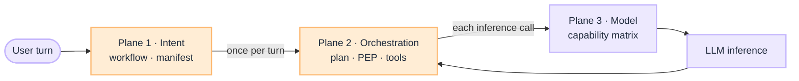

# Router Blueprint: Three Routing Planes

Enterprise stacks collapse routing into one LLM call. Production needs **three planes**: which path, which step, which model. This blueprint is the umbrella. Each plane has its own blueprint (or framework home), playbooks, eval surface, and ownership.

:::tip[THE CLAIM]
**The model proposes; the system routes.** Intent, orchestration, and model selection are separate platform decisions. Collapse them and you cannot eval, own, or audit failures in isolation.
:::

<!-- truncate -->

## One request, three planes

| Plane | Question | When | Who acts |
| --- | --- | --- | --- |
| **① Intent** | Which workflow, agent profile, and tool manifest? | Once per turn, before the loop | **Intent router** (platform); system decides route |
| **② Orchestration** | Which step, tool proposal, and policy gate inside the workflow? | Inside plan → act → observe | **Agent planner** proposes; **PEP/PDP** permits |
| **③ Model** | Which approved model endpoint runs this call? | Per inference (plan, synthesize, classify) | **LLM gateway** (platform); registry picks endpoint |

Primer: [What Is an Intent Router](/insights/what-is-intent-router) (three-way comparison table and diagram).

## Shared rules (all planes)

| Rule | Applies to |
| --- | --- |
| **Versioned platform config** | Route table, manifests, capability matrix |
| **Pin per session or request** | `route_table_version`, `manifest_version`, model route id |
| **Trace every decision** | Route decision record, PEP verdict, model endpoint id |
| **CI gate on change** | Input golden set, policy scenarios, model canary |
| **LLM does not own authority** | Router/planner propose; system permits |

## Do not collapse

| Anti-pattern | Fix |
| --- | --- |
| One LLM call routes, plans, and picks model | Three planes, three eval surfaces |
| Intent router inside the agent loop | Plane ① at ingress only |
| Model choice only in the system prompt | Plane ③ at gateway |
| "Agent router" duplicates Plane ① | Intent at ingress; planner inside Plane ② |

## Implementation order

1. **Plane ①** when manifests differ by turn or multi-workflow dispatch is required
2. **Plane ②** always for production agents ([PGAR Blueprint](/blueprints/pgar-blueprint))
3. **Plane ③** when more than one model or region is in scope ([G.A.I.N LLM](/frameworks/gain-llm))

Eval overlap: Plane ① → [Eval Input](/playbooks/eval-engineering/plane-input); Plane ② → [Action](/playbooks/eval-engineering/plane-action) / [Tool](/playbooks/eval-engineering/plane-tool); Plane ③ → model quality and canary gates on the LLM platform.

## Series index

**Plane ① Intent routing**

- [Intent Router Blueprint](/blueprints/intent-router-blueprint) · [Playbooks](/playbooks/intent-router)
- [What Is an Intent Router](/insights/what-is-intent-router) · [How to Design an Intent Router](/insights/design-intent-router)

**Plane ② Orchestration**

- [Orchestration Plane Blueprint](/blueprints/orchestration-plane-blueprint) · [PGAR Blueprint](/blueprints/pgar-blueprint) · [PGAR Runtime playbooks](/playbooks/pgar-runtime)

**Plane ③ Model routing**

- [Model Routing Plane Blueprint](/blueprints/model-routing-plane-blueprint) · [G.A.I.N LLM](/frameworks/gain-llm)
