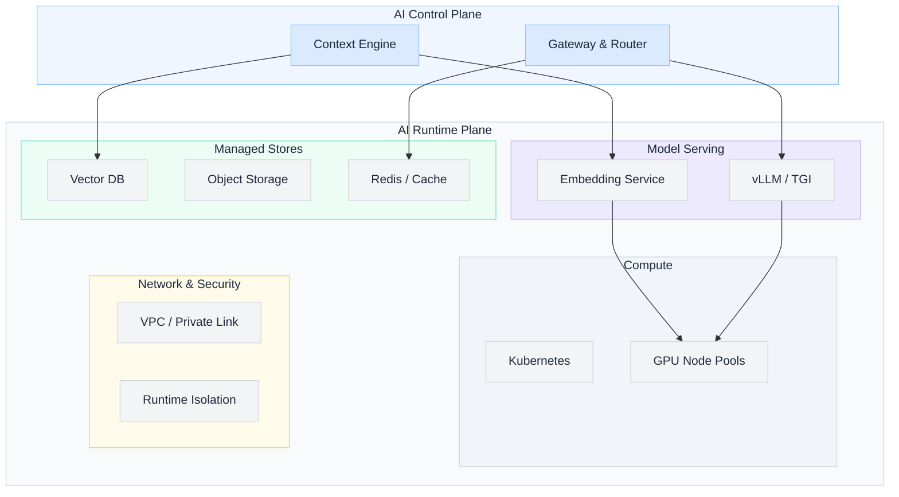

import Details from '@theme/Details';

  <h1 className="gain-doc-title">How to Model AI Runtime Plane</h1>
  

    Where AI executes: compute, networking, model serving, and managed data stores that host
    embeddings and artifacts.
  

  Infrastructure runs <strong>where AI executes</strong>. The runtime plane provides elastic compute,
  GPU pools, private networking, and managed storage that the control plane calls through stable
  endpoints. Native pillar capabilities live here: not in application or platform business logic.

## Plane placement

| Attribute | Value |
| --- | --- |
| **G.A.I.N pillar** | Native |
| **Owner** | Infrastructure / Cloud Team |
| **Consumed by** | AI Control Plane (inference, tool sidecars, observability backends) |
| **Hosts** | Vector stores, object storage, model weights, serving runtimes |

## Runtime topology

## Core components

  Unified orchestration for platform services and model serving workloads. Responsibilities:

  - Namespace isolation per environment and tenant tier
  - Resource quotas, priority classes, and spot/preemptible GPU scheduling
  - Service mesh or ingress for east-west traffic
  - GitOps deployment pipelines for infra-owned charts

  **TBD:** shared cluster vs. dedicated AI cluster vs. cluster-per-regulation-zone.

  GPU node pools sized for inference and embedding workloads. Responsibilities:

  - Model-specific instance profiles (A100, H100, L4, etc.)
  - Autoscaling on queue depth and latency SLOs
  - Driver and CUDA baseline management
  - Cost allocation tags per platform team / use case

  **Boundary:** Infra owns hardware lifecycle; Platform owns which models map to which pools.

  Private connectivity between control plane, runtime, and enterprise data sources. Responsibilities:

  - VPC design, subnets, and firewall rules
  - PrivateLink / Private Service Connect to SaaS models where used
  - Egress controls for model providers and tool endpoints
  - Cross-region replication paths for DR

  **Does not own:** API gateway policy or application routing logic.

  Durable storage for model artifacts, embedding snapshots, and evaluation datasets. Responsibilities:

  - Object storage tiers and lifecycle policies
  - Encryption at rest and customer-managed keys
  - Backup and cross-region replication SLAs
  - Capacity planning with Data plane for index growth

  **Data plane** owns document semantics; Infra owns bucket policies and durability.

  Operated vector store clusters (pgvector, Milvus, Pinecone self-hosted, etc.). Responsibilities:

  - Cluster provisioning, patching, and failover
  - Backup/restore and multi-AZ layout
  - Performance tuning (sharding, replicas, memory)
  - Network endpoints exposed to Context Engine only via private links

  **Shared:** collection schema and embedding version metadata (Data + Platform); **Infra** owns uptime.

  Horizontal and vertical scaling rules for serving and embedding services. Signals:

  - Request rate, queue depth, GPU utilization
  - p95 latency vs. platform SLOs
  - Scheduled scale-for-batch (nightly embedding jobs)

  Platform defines SLOs; Infra implements scaling mechanics.

  Defense-in-depth for AI workloads. Responsibilities:

  - Pod security standards and seccomp profiles
  - Secrets injection via vault agents (credentials owned by Platform policy)
  - Network policies restricting store and model access
  - Vulnerability scanning for container images

  **Partnership:** Security sets baseline; Infra implements; Platform consumes securely.

  Standardized inference runtimes deployed on GPU pools. Responsibilities:

  - Model artifact loading from object storage
  - Batching, streaming, and concurrent request limits
  - Health checks and graceful drain on deploy
  - Sidecar pattern for embedding models vs. generative models

  **Platform** publishes model deployment requests; **Infra** operates serving infrastructure.

## Endpoint contract (draft)

Control plane calls runtime through internal endpoints: never exposed to application teams directly.

| Endpoint type | Caller | Example |
| --- | --- | --- |
| `inference.generate` | Model router | Chat completion, structured output |
| `inference.embed` | Context Engine / Data jobs | Batch and online embeddings |
| `store.vector.query` | Context Engine | Hybrid retrieval |
| `store.object.get` | Pipelines (Data) | Raw document fetch for reprocessing |

**TBD:** mTLS, service mesh routing, and per-tenant rate limits at runtime boundary.

## Boundary lines (Runtime plane)

**Infrastructure should not own:**

- Model routing logic, prompt standards, policy semantics
- AI evaluation quality definitions
- Data pipeline design, catalog semantics, governance tags
- Context assembly or agent planning

## Related blueprints

- [How to Model AI Control Plane](/blueprints/control-plane): primary consumer of runtime endpoints
- [How to Model Context Engine](/blueprints/context-engine): vector query and embedding calls
- [How to Model Data / Knowledge Plane](/blueprints/data-knowledge-plane): index population and catalog
- [How to Model an LLM Gateway](/blueprints/llm-gateway): platform-side abstraction over inference endpoints
