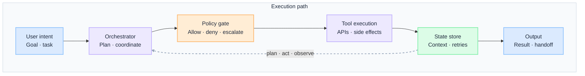
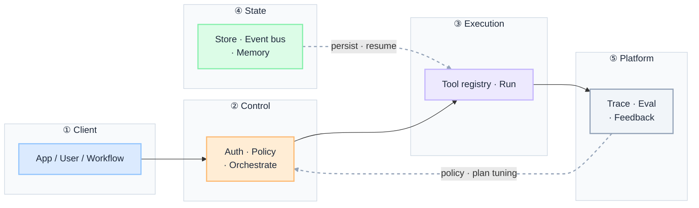
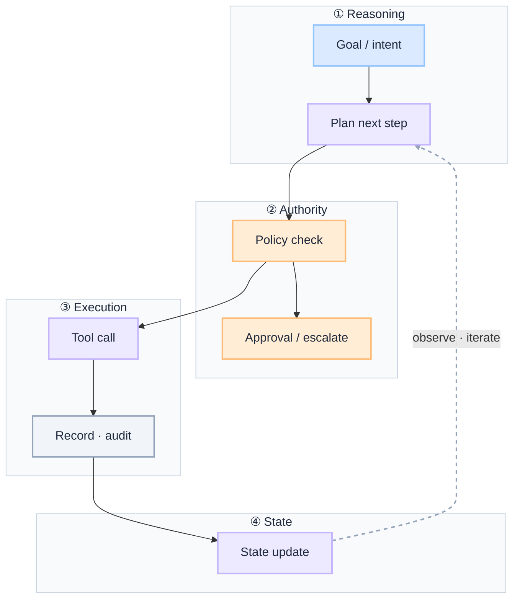

import Details from '@theme/Details';

  <h1 className="gain-doc-title">G.A.I.N Agents</h1>
  

    Why governed agents work this way: principles, patterns, team boundaries.
  

:::info[G.A.I.N Agents]
**An agent is a governed workflow with intelligence, not a free-running loop with tools.**

Enterprise teams debate frameworks and prompt loops. G.A.I.N Agents reframes the question: what may the agent do, who permits each action, how does the workflow survive failure, and how is every step traced and rolled back from day one.
:::

An agent in production is a **workflow the model helps plan**, not an autonomous actor. The model proposes the next step; policy permits it; the platform executes and records it. Autonomy is earned through policy boundaries, durable state, and observable execution — not granted by a prompt.

## How This Maps to G.A.I.N

| G.A.I.N pillar | Where it lives | Who primarily owns it |
| --- | --- | --- |
| **G · Grounded** | Policy engine, tool permissions, human approvals, audit logs | AI Platform Team |
| **A · Adaptive** | Orchestrator, state store, retries and compensation, feedback loops | AI Platform + Product / Domain Teams |
| **I · Intelligent** | Planning, tool selection, multi-step reasoning | AI Platform Team |
| **N · Native** | Agent runtime, queues and event bus, observability, quotas | Infrastructure / Cloud Team + AI Platform |

---

## Why Agents need G.A.I.N

Most production agent failures are not reasoning failures. They are architecture failures:

- The agent loop runs free, calling tools with no policy gate before side effects.
- A failed tool call has no retry, compensation, or durable state, so the workflow dies mid-flight.
- Authority lives in the prompt ("do not transfer funds") instead of in the policy engine.
- Multi-step runs have no trace, so failures stay invisible until a customer escalates.

Generic agent advice stops at "give the model tools and let it loop." **G.A.I.N Agents** maps the full execution domain: how plans are gated, how actions are authorized, how workflows persist and recover, and how every step is traced under audit, scale, and change.

**Dominant pillars for this domain:** **G** (Grounded) and **I** (Intelligent).
- Grounding is authority: what the agent may do, approve, or escalate before any tool runs.
- Intelligent is where the model earns its place: planning ambiguous steps, not owning execution.

### What G.A.I.N adds (not generic agent advice)

| G.A.I.N claim | What it means for agents |
| --- | --- |
| **Intelligence in the call; truth in the system** | The model plans. The architecture owns the policy verdict, tool authority, durable state, and audit. |
| **The model proposes; the system decides** | Planning and tool selection are model-assisted; every action passes a policy gate before it runs. |
| **Grounding is a pipeline, not a prompt** | Tool permissions, approvals, and guardrails define what an agent may do — not prompt instructions. |
| **Native is the feedback loop, not hosting** | Traces, task-success metrics, and human corrections close the loop into planning and policy. |

---

## Domain on one page

**Two views, one domain.** Application teams need the execution path; platform teams need the shared agent stack. Same governed boundary, different questions.

| View | Question | Audience |
| --- | --- | --- |
| **Execution path** | How does one goal safely become a completed, audited workflow? | App teams, feature architects |
| **Platform stack** | How does the org operate agents as shared infrastructure? | Platform, SRE, FinOps, security |

An agent is a **workflow with intelligence**, not a free-running loop. The orchestrator drives the flow; policy gates every tool call; state persists so workflows survive retries and handoffs.

### Execution path

 

- **Policy gates every tool:** the orchestrator plans; policy permits before anything executes.
- **State carries the loop:** durable context survives retries, handoffs, and the plan → act → observe cycle.

:::important[Ask before you ship]
**How do agents recover?** **Where is the policy gate?** **How do workflows persist?**

If any answer is "the model figures it out," the design is not ready for production.
:::

| Stage | Owns | Does not own |
| --- | --- | --- |
| **User intent** | Goal, task framing | Tool authority, execution |
| **Orchestrator** | Plan, coordinate steps | Permission to act, business outcome |
| **Policy gate** | Allow / deny / escalate verdict | Generating the plan |
| **Tool execution** | Side-effecting actions via the registry | Deciding whether the action was allowed |
| **State store** | Durable context, retries | Planning, policy verdict |
| **Output** | Result, handoff | Letting unaudited actions change state |

### Platform stack

Every agent path crosses the same boundaries. Intelligence lives in planning and tool selection. Authority, durable state, and audit live in the system around it.

The **control plane** is the single agent ingress: auth, policy, and orchestration before any tool runs. State persists asynchronously across steps; the platform layer keeps execution observable and measured.

 

| Layer | Owns | Does not own |
| --- | --- | --- |
| **Client** | Use-case orchestration, user session | Tool authority, runtime |
| **Control** | Auth, policy, orchestration | Business logic inside the agent |
| **Execution** | Tool registry, sandboxed runs | Policy verdict, business outcome |
| **State** | Durable store, event bus, memory | Request-time policy |
| **Platform** | Trace, eval, feedback into policy and planning | Post-hoc log spelunking |

### Demo vs production (whole stack)

One decision guide for the full path. Pillar sections assume production defaults unless noted.

| Layer | Demo default | Production default |
| --- | --- | --- |
| **Client** | Calls the model with tools inline | Calls the agent contract; no embedded tool credentials |
| **Control** | Prompt says "be careful" | Policy engine: allow / deny / escalate before every tool |
| **Execution** | Free-form function calling | Governed tool registry: typed schemas, scoped permissions, audit |
| **State** | In-memory within one process | Durable state store, event bus, idempotent retries, compensation |
| **Approval** | Model self-checks its own actions | Human approval for high-risk or irreversible actions |
| **Platform** | Print statements | Per-step traces, task-success metrics, cost and concurrency quotas |
| **Change** | Edit the prompt | Versioned agent profile + eval run + rollback tied to a change record |

---

## G.A.I.N applied to agentic systems

**Dominant pillar.** Grounding is not "a careful system prompt." It is the architecture that decides what an agent may do, from which tools, under which identity, and what requires approval before any side effect occurs.

**Components:** policy engine (allow / deny before every tool) · scoped tool permissions per agent profile and tenant · human approvals for high-risk or irreversible actions · guardrails (input / output filters, rate limits) · tamper-evident audit logs.

**Design questions:** Can the agent call this tool? Can it approve this action? Does it need escalation?

**Principle:** Agents do not own authority; the system grants it per action.

**Anti-patterns:** authority encoded in the prompt · unscoped tool access for every agent · irreversible actions with no approval gate · plans and tool calls that are not audited.

Agents fail mid-flight: tools time out, services error, runs get interrupted. Adaptive architecture persists state, retries safely, and feeds execution signals back into planning and policy.

**Components:** orchestrator with explicit handoffs and timeouts · durable state store across steps, retries, and sessions · idempotent replays, compensating actions, dead-letter handling · feedback loops on task success, policy violations, and human corrections.

**Design questions:** How do agents recover from a failed tool call? How do workflows persist across restarts? What triggers rollback or human handoff?

**Principle:** Resilient agents are designed to fail safely and learn from it.

**Anti-patterns:** in-memory state lost on restart · retries without idempotency or compensation · ignoring traces until a customer escalates.

**Co-dominant pillar.** The agent delegates ambiguity to the model and certainty to code. The LLM plans the next step; deterministic systems validate, execute, and record the outcome.

**Components:** planning (decompose goals into ordered steps and decision points) · tool selection from a governed registry · multi-step plan → act → observe loops · summarization of tool outputs into structured state.

**Design questions:** What should the model decide? What must be deterministic? When does the loop stop?

**Principle:** Intelligence plans; the system executes and decides.

**Anti-patterns:** one mega-prompt looping without bounds · tool use without authorization boundaries · planning logic scattered with no shared trace or policy.

Native agent systems run on infrastructure built for concurrent, long-running, observable workflows. Scale, latency, and reliability are platform concerns, not agent-prompt concerns.

**Components:** elastic agent runtime and tool sidecars · async queues and event bus with backpressure · distributed traces with a span per tool call · per-tenant concurrency limits, token budgets, and cost controls.

**Design questions:** How does the agent runtime scale under load? How is latency managed across multi-step workflows?

**Principle:** Agents need platform resilience; durability and observability are infrastructure, not prompts.

**Anti-patterns:** synchronous tool chains with no backpressure · observability of final outputs only · unbounded concurrency with no quota or budget cap.

### Governed autonomy flow (dominant pillar diagram)

---

## Key patterns

Reason and act in structured cycles: the agent plans, selects tools, observes results, and iterates until the task is complete or a policy boundary is reached. Bound the loop with step limits and timeouts.

Register tools with typed schemas, permission scopes, and audit trails. A governed tool registry prevents agents from executing unbounded or untraceable actions.

Enforce business rules, compliance constraints, and authorization checks before every agent action. Policy gates are the difference between a demo and a production agent.

Separate working memory, episodic history, and long-term knowledge stores. Memory architecture determines whether agents maintain context or repeat mistakes.

Orchestrate specialized agents with clear handoff protocols and shared state contracts. Multi-agent systems require explicit coordination; implicit coordination fails at scale.

---