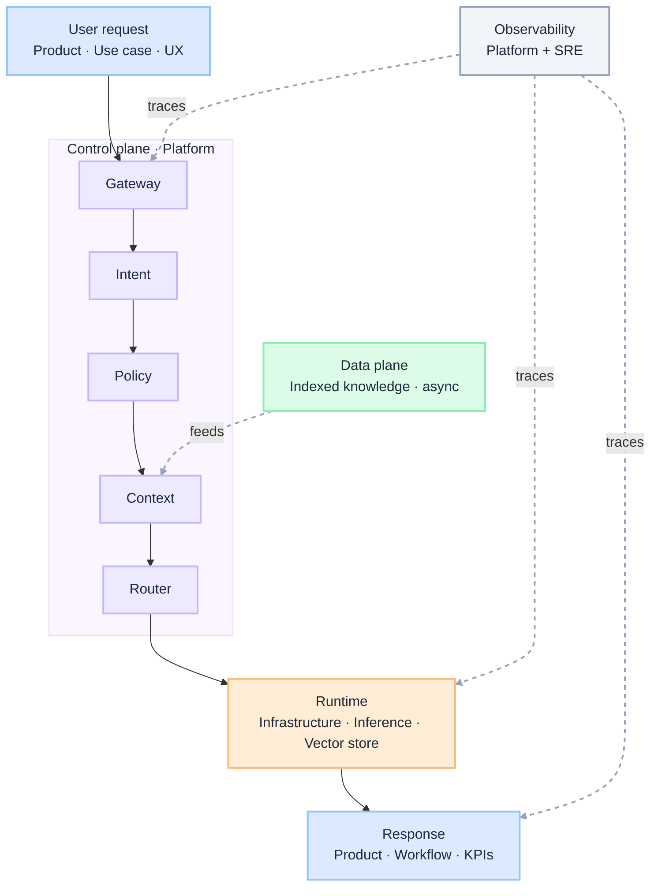

import Details from '@theme/Details';

  <h1 className="gain-doc-title">
    G.A.I.N AIOM 
    _Enterprise AI Operating Model (AIOM)_
  </h1>
  

    How to assign who builds and runs what in enterprise AI: grounded, adaptive, intelligent, native
    principles applied to team boundaries across application, control, runtime, and data / knowledge
    planes.
  

:::info[G.A.I.N AIOM]
**Enterprise AI is an operating model, not a center of excellence with a GPU budget.**

Enterprise teams debate org charts and vendor platforms. G.A.I.N AIOM reframes the question: who owns the control plane, who owns runtime, who feeds context, who carries business outcomes — and where the boundary lines must not blur.
:::

This page covers **who** and **team boundaries**. For governed-AI **why** and **principles**, start at [G.A.I.N Overview](/frameworks). For capability patterns (gateway, RAG, agents), see the [domain frameworks](/frameworks) in this section.

Enterprise AI in production is **planes with accountable owners**, not undifferentiated "AI teams" or vendor-led pilots. Each request crosses application, control, runtime, and knowledge layers; fragmentation starts when those layers share a team name but not a boundary. Start with three core planes — application, control, and runtime. In large enterprises, add a fourth **data / knowledge plane** when the data organization is mature enough to own pipelines, embeddings, and catalog separately from AI platform orchestration.

## How This Maps to G.A.I.N

| G.A.I.N pillar | Where it lives | Who primarily owns it |
| --- | --- | --- |
| **G · Grounded** | Context Engine, data pipelines, knowledge sources | Data Platform + AI Platform |
| **A · Adaptive** | Feedback loops, KPIs, workflow evolution | Product / Domain Teams |
| **I · Intelligent** | Routing, policy, agents, evaluation | AI Platform Team |
| **N · Native** | Inference runtime, GPU clusters, scaling, storage | Infrastructure / Cloud Team |

## Why Enterprise AI needs G.A.I.N AIOM

Most enterprise AI programs stall for operating-model reasons, not model reasons:

- Every product team embeds its own gateway, keys, and prompts.
- Platform and data teams argue over who owns embeddings, catalogs, and context.
- Infrastructure provisions GPUs while no one owns routing, policy, or eval at ingress.
- Observability and cost show up in dashboards with no plane-level owner to act on them.

Generic transformation advice stops at "stand up a center of excellence." **G.A.I.N AIOM** assigns **who delivers each layer**, **where accountability sits**, and **how requests cross planes** before anyone picks a model or ships a copilot.

**Dominant pillars for this domain:** **I** (Intelligent) and **G** (Grounded).
- Intelligent is who owns routing, policy, agents, and evaluation on the control plane.
- Grounded is who owns pipelines, embeddings, catalogs, and what the system is allowed to know.

### What G.A.I.N adds (not generic operating-model advice)

| G.A.I.N claim | What it means for AIOM |
| --- | --- |
| **Planes beat projects** | Application, control, runtime, and data/knowledge are separate accountabilities — not one undifferentiated "AI team." |
| **Control is not infrastructure** | Platform decides how AI is consumed; infrastructure runs where it executes. |
| **Context is not orchestration** | Data feeds the Context Engine; the control plane routes, governs, and observes. |
| **Adaptive lives in product** | Feedback loops and KPIs sit with domain teams; platform supplies shared pipes and gates. |

## The Planes

Three planes are the minimum. A fourth **data / knowledge plane** is common in large orgs where
enterprise data is a first-class function: not a sub-team of platform engineering.

  

    

      Application Plane
      Business copilots, workflows, products
      Owned by: Product / Domain Teams · Adaptive
    

    
↑ consumes

    

      AI Control Plane
      Routing, policy, observability, Context Engine orchestration
      Owned by: AI Platform Team · Intelligent
    

    
↑ runs on

    

      AI Runtime Plane
      Models, GPUs, vector stores, inference
      Owned by: Infrastructure / Cloud Team · Native
    

  

  

    
      ←
      feeds
      Context Engine
    
    

      Data / Knowledge Plane
      Pipelines, embeddings, catalogs, governance tags
      Owned by: Data Platform Team · Grounded · optional 4th plane
    

  

 

Platform decides **how** AI is used. Infrastructure runs **where** AI executes.
Data provides **what** AI knows. Product defines **why** AI exists.

| Plane | Owns (one line) | G.A.I.N pillar | Typical team |
| --- | --- | --- | --- |
| **Application** | Business outcomes, UX, workflows | Adaptive | Product / Domain |
| **Control** | How AI is consumed — gateway, policy, route | Intelligent | AI Platform |
| **Runtime** | Where AI runs — GPUs, serving, scale | Native | Infrastructure / Cloud |
| **Data / Knowledge** *(optional)* | What AI may know — pipelines, catalog, tags | Grounded | Data Platform |

## Who Owns What?

| Team / plane | Owns | Does not own |
| --- | --- | --- |
| **AI Platform** · Control | Gateway, routing, policy, context orchestration at request time, eval, observability | Business-specific prompts, app UI, product workflows, GPU lifecycle, embeddings pipelines, catalog semantics |
| **Infrastructure / Cloud** · Runtime | GPUs, serving stacks, vector DB infrastructure, networking, scaling, runtime isolation | Model routing, prompt standards, policy semantics, eval quality, pipeline design, governance tags |
| **Data Platform** · Data / Knowledge | Pipelines, embeddings indexing, metadata catalog, data quality, governance tags | Context Engine orchestration at request time, routing, prompt templates, inference hosting, app UI |
| **Product / Domain** · Application | Use cases, UX, workflows, domain agent behavior, KPIs | Direct model SDK integration, API keys, isolated prompt stacks, data pipelines, catalog and classification |

Expanded checklists by team:

  Platform owns **how AI is consumed**: not business logic.

  <ul className="gain-checklist">
    <li>AI Gateway: standard entrypoint</li>
    <li>Model abstraction layer: provider swapability</li>
    <li>Intent classifier: routing intelligence</li>
    <li>Policy engine: governance</li>
    <li>Routing engine: cost, latency, risk decisions</li>
    <li>Prompt templates: standardized invocation</li>
    <li>Tool registry: reusable enterprise tools</li>
    <li>Observability: tracing, token cost, quality</li>
    <li>Evaluation framework: benchmark and regression</li>
    <li>Secrets integration: secure model credentials</li>
  </ul>

  Infra owns **where AI runs**: not how it is orchestrated.

  <ul className="gain-checklist">
    <li>Kubernetes: compute platform</li>
    <li>GPU clusters: inference infrastructure</li>
    <li>Networking. VPC and private links</li>
    <li>Storage: embeddings and artifacts</li>
    <li>Vector databases: managed infrastructure</li>
    <li>Scaling policies: autoscaling</li>
    <li>Security hardening: runtime isolation</li>
    <li>Model serving stacks: vLLM, Hugging Face TGI</li>
  </ul>

  Data feeds the Context Engine: not the router. In mature enterprises this is a distinct plane.
  In smaller programs, merge these responsibilities into the AI Platform team (see note below).

  <ul className="gain-checklist">
    <li>Data pipelines: freshness</li>
    <li>Embeddings pipelines: indexing</li>
    <li>Metadata catalogs: discoverability</li>
    <li>Data quality: trust</li>
    <li>Governance tags: classification (PII, sensitive data)</li>
  </ul>

  Product teams **consume** the control plane: they own business outcomes.

  <ul className="gain-checklist">
    <li>Use cases: business outcomes</li>
    <li>UX. Human interaction</li>
    <li>Workflows: process logic</li>
    <li>Agent behavior: domain orchestration</li>
    <li>KPIs. ROI</li>
  </ul>

  Examples: customer support copilot, claims automation, architecture advisor.

## Flow of a Request

A single request crosses four planes in sequence. The control plane is the densest stage: gateway,
policy, and context assembly happen before any model runs. Data feeds context asynchronously;
observability spans the full path.

 

 

| Stage | Plane | Primary owner | Key actions |
| --- | --- | --- | --- |
| **User request** | Application | Product | Use case, UX |
| **Gateway → Router** | Control | Platform | Policy, context assembly, route |
| **Inference** | Runtime | Infrastructure | Model / vector execution |
| **Response** | Application | Product | Workflow, KPIs |
| **Knowledge feed** *(async)* | Data | Data Platform | Indexed context into Context Engine |
| **Trace** *(cross-cutting)* | Control + SRE | Platform | Cost, quality, audit |

## Boundary Lines

When accountability blurs, fragmentation follows. Use the ownership matrix above as the default;
this table diagnoses the most common crosses.

| When this blurs… | Typical symptom | Fix |
| --- | --- | --- |
| **Platform owns embeddings pipelines** | Router team also runs ETL and owns the catalog | Data owns index and catalog; Platform owns Context Engine orchestration |
| **Product calls the model SDK directly** | API keys in repos, no shared policy or audit path | Mandate gateway as the single ingress for every AI consumption path |
| **Infra writes routing rules** | Policy changes require cluster or serving deploys | Move routing and policy semantics to the control plane |
| **Data owns request-time routing** | Context team blocks model swaps and eval gates | Platform owns gateway, route, and policy; Data feeds indexed knowledge only |
| **Product owns isolated prompt stacks** | Duplicated governance, no eval regression path | Standardize via platform prompt templates and tool registry |

## Enterprise AI Operating Model

  

    

      Enterprise AI Council
      Strategy · investment · risk · standards
    

    

      
    

    

      

        AI Platform Team
        control plane
        Intelligent
      

      

        Cloud Platform Team
        runtime plane
        Native
      

      

        Data Platform Team
        data / knowledge plane
        Grounded
      

      

        Domain Teams
        application plane
        Adaptive
      

    

  

:::tip[Simple rule]
- If it decides **which model / under what rules** → Platform. 
- If it **runs** the model → Infrastructure.
- If it provides **business truth** → Data. 
- If it creates **business value** → Product.
:::

:::note[When to merge the Data Plane into AI Platform]
You do **not** need a separate fourth plane in every org. Use three planes plus a combined Platform
team when the program is early-stage or headcount is limited.

**Keep Data as its own plane** when the enterprise already has a data platform organization owning
pipelines, catalogs, and governance at scale: typical in large banks and regulated industries.

**Merge into AI Platform** when the same team can own Context Engine orchestration *and* embeddings
pipelines, indexing, and catalog work without splitting accountability. The boundaries in this
model still apply: only the team structure compresses.
:::

---

## G.A.I.N applied to enterprise AI operating model

**Co-dominant pillar.** Grounding in AIOM is not "feed more data to the model." It is who owns pipelines, catalogs, governance tags, and what gets indexed for the Context Engine before any request is routed.

**Components:** embeddings pipelines · metadata catalog · data quality gates · classification tags (PII, sensitivity) · freshness SLAs for knowledge sources.

**Design questions:** Who owns what enters the Context Engine? How is sensitive data excluded at source?

**Principle:** Business truth lives in the data plane; orchestration consumes it, it does not recreate it.

**Anti-patterns:** platform team building one-off ETL per use case · product teams indexing private data without catalog · data team owning routing decisions at request time.

Adaptive in AIOM is who owns KPIs, workflow evolution, and the signal that returns from production use cases into platform standards and council investment.

**Components:** domain KPIs and ROI tracking · workflow iteration loops · production feedback into eval and routing priorities · council-level standards and investment gates.

**Design questions:** Who acts when a use case degrades? How does product signal reach platform roadmaps?

**Principle:** Business value is created in the application plane; platform enables it, not the reverse.

**Anti-patterns:** platform dictating UX without domain input · pilots with no shared KPIs · frozen standards with no feedback from production.

**Co-dominant pillar.** Intelligence in AIOM is not "hire ML engineers in every squad." It is a single accountable team for gateway, routing, policy, context orchestration at request time, and evaluation.

**Components:** AI gateway · intent classifier · policy engine · routing engine · prompt templates · tool registry · eval framework · observability spine.

**Design questions:** Is there one ingress for every AI consumption path? Who approves a new model route?

**Principle:** The control plane decides how AI is consumed; nothing bypasses it.

**Anti-patterns:** product teams calling model APIs directly · policy encoded in app-specific prompts · routing logic duplicated per squad.

Native in AIOM is the runtime plane: GPUs, vector stores, networking, scaling — owned separately from orchestration semantics.

**Components:** GPU clusters · model serving stacks · vector DB infrastructure · VPC and private links · autoscaling · runtime isolation and security hardening.

**Design questions:** Can platform swap model hosts without rewriting apps? Who owns spend at the infrastructure layer?

**Principle:** Infrastructure runs where AI executes; it does not decide how it is governed.

**Anti-patterns:** platform team managing hardware lifecycle · infra team writing routing rules · cost ownership split with no attribution path.

