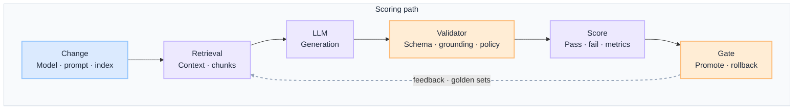

import Details from '@theme/Details';

<div className="gain-doc-header">
  <h1 className="gain-doc-title">G.A.I.N Evaluation</h1>
  <div className="gain-doc-subtitle" style={{marginTop: '-0.25rem', marginBottom: '1.75rem'}}>
    Why governed evaluation works this way: principles, patterns, team boundaries.
  </div>
</div>

:::info[G.A.I.N Evaluation]
**Evaluation is a governed quality gate, not a spreadsheet you open after launch.**

Enterprise teams debate benchmark leaderboards. G.A.I.N Evaluation reframes the question: what defines "good" for this use case, which layer catches which failure mode, and how do offline scores gate every model, prompt, and index change from day one.
:::

Evaluation in production is **a pipeline on the same path as inference**, not a one-off test suite. Scores are produced after the same stages a production request traverses — retrieval, generation, validation — so offline results predict online behavior and every change ships with a rollback trigger.

## How This Maps to G.A.I.N

| G.A.I.N pillar | Where it lives | Who primarily owns it |
| --- | --- | --- |
| **G · Grounded** | Golden criteria, policy correctness, compliance rubrics, risk thresholds | Product / Domain Teams + Governance |
| **A · Adaptive** | Offline, online, and human eval layers; regression gates; drift detection | AI Platform + Product / Domain Teams |
| **I · Intelligent** | Behavior scoring — relevance, reasoning, tool usage, grounding | AI Platform Team |
| **N · Native** | Eval datasets, replay systems, harnesses, score stores, CI integration | Infrastructure / Cloud Team + AI Platform |

---

## Why Evaluation needs G.A.I.N

Most production AI quality failures are not model failures. They are evaluation architecture failures:

- A chat benchmark substitutes for use-case-specific golden sets.
- Offline tests skip retrieval and validation, so scores do not predict production behavior.
- LLM-as-judge runs without human calibration and becomes the compliance gate.
- Eval happens in a quarterly review instead of blocking every promotion in CI/CD.

Generic eval advice stops at "build a test set and eyeball outputs." **G.A.I.N Evaluation** maps the full validation domain: how "good" is defined, how scores mirror the production path, how drift is detected, and how every layer feeds rollback and tuning under audit and change control.

**Dominant pillars for this domain:** **A** (Adaptive) and **G** (Grounded).
- Adaptive is the continuous pipeline: offline regression, online sampling, human review — evaluation as how systems learn what broke.
- Grounded is what "good" means: business rules, compliance, and risk thresholds — not generic leaderboard scores.

### What G.A.I.N adds (not generic eval advice)

| G.A.I.N claim | What it means for evaluation |
| --- | --- |
| **Intelligence in the call; truth in the system** | Models generate. The architecture owns rubrics, golden sets, pass/fail gates, and release audit. |
| **The model proposes; the system decides** | LLM-as-judge may score at scale; compliance and policy gates remain deterministic. |
| **Grounding is a pipeline, not a prompt** | Eval runs the same retrieval, generation, and validation stages as production — not output-only spot checks. |
| **Native is the feedback loop, not hosting** | Score stores, replay, and CI harnesses close the loop from production failures back into golden sets and gates. |

---

## Domain on one page

**Two views, one domain.** Application teams need the scoring path; platform teams need the shared eval stack. Same production boundary, different questions.

| View | Question | Audience |
| --- | --- | --- |
| **Scoring path** | How does one change safely prove it did not regress quality? | App teams, feature architects |
| **Platform stack** | How does the org operate evaluation as shared infrastructure? | Platform, SRE, QA, governance |

Evaluation is a **gate on the inference path**, not a parallel process. Scores mirror production stages; gates block promotion; feedback from online and human layers updates golden sets and rubrics.

### Scoring path

<br/>

<div className="gain-mermaid">



</div>

<br/>

- **Same path as production:** scores run after retrieval, generation, and validation — not on final text alone.
- **Three layers:** offline regression gates every change; online sampling catches drift; human review handles high-risk and low-confidence cases.

:::important[Ask before you ship]
**What defines "good" for this use case?** **Which layer catches which failure mode?**

If "good" is undefined or offline tests skip production stages, scores will not predict what users experience.
:::

| Stage | Owns | Does not own |
| --- | --- | --- |
| **Change** | Model, prompt, index, or agent profile version | Defining pass/fail without domain owners |
| **Retrieval** | Replay retrieval on golden inputs | Ad-hoc one-off scripts per team |
| **LLM** | Generation under the same config as production | Skipping inference when scoring output only |
| **Validator** | Schema, grounding, policy checks in the scoring path | Generating the answer being scored |
| **Score** | Metrics, rubrics, dimension breakdowns | Compliance sign-off by LLM judge alone |
| **Gate** | Promote, block, or rollback tied to thresholds | Post-hoc quarterly review as the only gate |

### Platform stack

Every eval path crosses the same boundaries. Intelligence lives in behavior scoring and judge models. Rubrics, datasets, replay, and release audit live in the system around them.

The **harness** is the single eval ingress: versioned datasets, reproducible runs, and score comparison across builds. Production sampling feeds online eval asynchronously; human review queues handle what automation cannot certify.

```mermaid
flowchart LR
    subgraph client["① Client"]
        CL["App / CI / Change record"]
    end

    subgraph harness["② Harness"]
        HW["Datasets · Run · Compare"]
    end

    subgraph execute["③ Execute"]
        EX["Replay prod path<br/>· Score"]
    end

    subgraph store["④ Score store"]
        ST["Results · Trends<br/>· Audit trail"]
    end

    subgraph plat["⑤ Platform"]
        PL["Online sample · Human queue<br/>· Drift alerts"]
    end

    CL --> HW --> EX --> ST --> PL
    PL -. "golden sets · thresholds" .-> HW

    classDef product fill:#dbeafe,stroke:#93c5fd,color:#1e293b,stroke-width:2px
    classDef gate fill:#ffedd5,stroke:#fdba74,color:#1e293b,stroke-width:2px
    classDef process fill:#ede9fe,stroke:#c4b5fd,color:#1e293b,stroke-width:2px
    classDef data fill:#dcfce7,stroke:#86efac,color:#1e293b,stroke-width:2px
    classDef audit fill:#f1f5f9,stroke:#94a3b8,color:#1e293b,stroke-width:2px

    class CL product
    class HW gate
    class EX process
    class ST data
    class PL audit

    style client fill:#f8fafc,stroke:#cbd5e1,color:#1e293b,stroke-width:1px
    style harness fill:#f8fafc,stroke:#cbd5e1,color:#1e293b,stroke-width:1px
    style execute fill:#f8fafc,stroke:#cbd5e1,color:#1e293b,stroke-width:1px
    style store fill:#f8fafc,stroke:#cbd5e1,color:#1e293b,stroke-width:1px
    style plat fill:#f8fafc,stroke:#cbd5e1,color:#1e293b,stroke-width:1px

    linkStyle 4 stroke:#94a3b8,stroke-width:2px,stroke-dasharray:5 5
```

<br/>

<div className="gain-mermaid">



</div>

<br/>

| Layer | Owns | Does not own |
| --- | --- | --- |
| **Client** | Change trigger, use-case context | Dataset curation, rubric definition |
| **Harness** | Versioned datasets, run orchestration, CI gates | Business sign-off on what "good" means |
| **Execute** | Replay production path, multi-dimensional scoring | Skipping retrieval or validation stages |
| **Score store** | Historical results, trends, release audit | Spreadsheet reconciliation |
| **Platform** | Online sampling, human queues, drift detection | Eval only at launch |

### Demo vs production (whole stack)

One decision guide for the full path. Pillar sections assume production defaults unless noted.

| Layer | Demo default | Production default |
| --- | --- | --- |
| **Client** | Manual spot-check after deploy | Every change triggers an eval run in CI/CD |
| **Harness** | Shared spreadsheet of examples | Versioned golden sets per capability (LLM, RAG, agent) |
| **Execute** | Score final output text only | Score full behavior trace on same path as production |
| **Validator** | Skipped in eval | Schema, grounding, and policy gates in scoring path |
| **Gate** | Ship and hope | Block promotion when critical dimensions drop below threshold |
| **Online** | None | Sampled production traffic, shadow scoring, drift baselines |
| **Human** | Ad-hoc review | Queues for high-risk, low-confidence, and calibration |
| **Change** | Re-run tests manually | Eval run ID tied to change record; rollback on regression |

---

## G.A.I.N applied to evaluation systems

<Details summary="G · Grounded — what defines “good”">
**Co-dominant pillar.** Grounded evaluation anchors scores in business rules and compliance — not generic benchmark leaderboards. "Good" is defined by policy, risk appetite, and domain accountability before any model is promoted.

**Components:** policy correctness (allowlists, blocklists, entitlements) · compliance checks (regulatory, classification, residency) · risk thresholds for high-impact decisions · golden criteria with use-case owner sign-off.

**Design questions:** Who signs off on what "good" means? What score blocks a release or triggers escalation?

**Principle:** Evaluation must align with business rules.

**Anti-patterns:** leaderboard scores as release criteria · LLM-as-judge as the only compliance gate · one generic golden set for every capability · rubrics defined after the first production incident.
</Details>

<Details summary="A · Adaptive — evaluation as a pipeline">
**Dominant pillar.** Adaptive evaluation runs continuously across offline, online, and human layers. Results feed rollbacks, prompt updates, retrieval tuning, and policy adjustments — evaluation is how systems learn what broke.

**Components:** offline regression on golden sets before every change · online sampling, shadow scoring, and drift detection · human review queues for edge cases and calibration · validator stage (schema, grounding, policy) in the scoring path.

**Design questions:** How often do offline runs gate deployment? What online signal triggers human review?

**Principle:** Evaluation is a pipeline, not a test.

**Anti-patterns:** eval only at launch · offline tests that skip production stages · ignoring drift until users escalate · no tie between eval run ID and change record.
</Details>

<Details summary="I · Intelligent — what is being evaluated">
Intelligent evaluation measures AI behavior end-to-end — not just final text. Relevance without correct reasoning, or fluent answers without proper tool use, still fail in production.

**Components:** relevance (did retrieval return the right context?) · correctness (factually supported and policy-compliant?) · reasoning (plan coherence, chain validity) · tool usage (correct tool, valid args, policy-respecting invocation).

**Design questions:** Are we scoring output only, or the full behavior trace? How do we eval multi-step agent and RAG flows?

**Principle:** Measure behavior, not just output.

**Anti-patterns:** BLEU or ROUGE as the only quality signal · scoring chat fluency for agent task completion · judge models without human calibration baseline.
</Details>

<Details summary="N · Native — evaluation infrastructure">
Native evaluation needs platform infrastructure: datasets, replay, and harnesses are operational systems with SLAs — not spreadsheets on a shared drive.

**Components:** versioned eval datasets with rubric metadata · replay systems that reproduce production requests against new builds · CI-integrated test harnesses and scheduled regression · score stores with trends and release gate audit trails.

**Design questions:** How are datasets versioned and owned? Can we replay last week's failures against today's build?

**Principle:** Evaluation needs operational infrastructure.

**Anti-patterns:** eval scripts owned by one engineer's laptop · no historical score trends · datasets that rot because production feedback never updates them.
</Details>

### Eval pipeline flow (dominant pillar diagram)

<br/>

<div className="gain-mermaid">

```mermaid
flowchart TB
    subgraph offline["① Offline"]
        GS["Golden set"]
        RUN["Replay prod path"]
    end

    subgraph score["② Score"]
        DIM["Dimensions · rubrics"]
        VAL["Validator gates"]
    end

    subgraph gate["③ Gate"]
        PASS["Pass · fail"]
        REL["Release block"]
    end

    subgraph live["④ Live feedback"]
        ON["Online sample"]
        HU["Human review"]
    end

    GS --> RUN --> DIM --> VAL --> PASS
    PASS --> REL
    ON --> HU
    HU -. "update golden · thresholds" .-> GS

    classDef input fill:#dbeafe,stroke:#93c5fd,color:#1e293b,stroke-width:2px
    classDef gatecls fill:#ffedd5,stroke:#fdba74,color:#1e293b,stroke-width:2px
    classDef process fill:#ede9fe,stroke:#c4b5fd,color:#1e293b,stroke-width:2px
    classDef audit fill:#f1f5f9,stroke:#94a3b8,color:#1e293b,stroke-width:2px

    class GS input
    class VAL,PASS,REL gatecls
    class RUN,DIM process
    class ON,HU audit

    style offline fill:#f8fafc,stroke:#cbd5e1,color:#1e293b,stroke-width:1px
    style score fill:#f8fafc,stroke:#cbd5e1,color:#1e293b,stroke-width:1px
    style gate fill:#f8fafc,stroke:#cbd5e1,color:#1e293b,stroke-width:1px
    style live fill:#f8fafc,stroke:#cbd5e1,color:#1e293b,stroke-width:1px

    linkStyle 7 stroke:#94a3b8,stroke-width:2px,stroke-dasharray:5 5
```

</div>

<br/>

---

## Key patterns

<Details summary="Golden datasets per capability">
Maintain separate golden sets for LLM, RAG, and agent use cases. A chat benchmark does not validate retrieval quality; a Q&A set does not validate tool orchestration.
</Details>

<Details summary="Regression gates in CI/CD">
Block promotion when offline scores drop below threshold on any critical dimension. Eval gates belong in the pipeline — not in a quarterly review.
</Details>

<Details summary="LLM-as-judge (with guardrails)">
Use models to score relevance and faithfulness at scale — but calibrate against human labels and never use a judge as the only compliance gate.
</Details>

<Details summary="Citation and grounding checks">
For RAG, score whether each claim is supported by a retrieved chunk. Grounding eval is the fastest path to measuring hallucination rate with business meaning.
</Details>

<Details summary="Agent task success metrics">
For agents, score end-to-end task completion, tool accuracy, policy violations, and steps to completion — not just whether the final message sounds right.
</Details>

---

