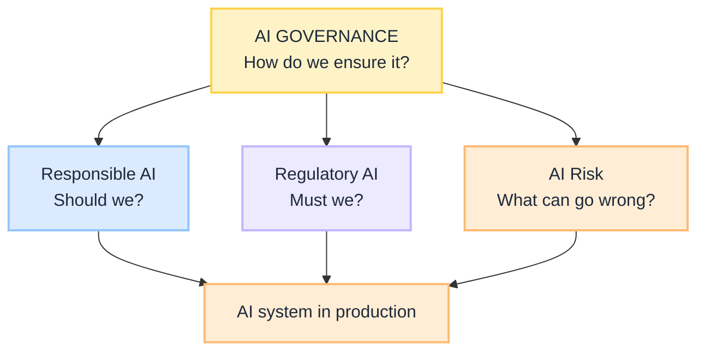
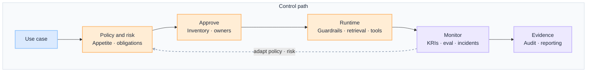

import Details from '@theme/Details';

<div className="gain-doc-header">
  <h1 className="gain-doc-title">G.A.I.N Governance</h1>
  <div className="gain-doc-subtitle" style={{marginTop: '-0.25rem', marginBottom: '1.75rem'}}>
    Why AI governance works this way: principles, control system, team boundaries.
  </div>
</div>

:::info[G.A.I.N Governance]
**AI Governance is the enterprise control system for AI, not a synonym for ethics or for the law.**

Enterprise teams debate Responsible AI slides and regulatory checklists. G.A.I.N Governance reframes the question: how do we ensure desired outcomes and mandatory obligations stay true in production, with inventory, approvals, runtime controls, monitoring, and audit evidence from day one.
:::

[G.A.I.N AIOM](/frameworks/gain-aiom) answers **who owns which plane**. G.A.I.N Governance answers **how the control system runs**: strategy and policy, risk, responsible outcomes, regulatory compliance, lifecycle, security and privacy, human oversight, guardrails, monitoring, and evidence. Companion concept primers (Responsible AI, Regulatory AI, AI Risk, What Is AI Governance) live under Insights; this page is the G.A.I.N operating map.

## How This Maps to G.A.I.N

| G.A.I.N pillar | Where it lives | Who primarily owns it |
| --- | --- | --- |
| **G · Grounded** | Obligation registers, policy packs, approved knowledge and tool scopes, harm boundaries | Governance + Legal / Compliance + Domain owners |
| **A · Adaptive** | Risk monitoring, control health, incident learning, policy and threshold updates | Risk + AI Platform + Product |
| **I · Intelligent** | Routing, abstention, guardrails, governed retrieval and tools on the request path | AI Platform Team |
| **N · Native** | Model/agent inventory, change control, audit stores, IdP and gateway enforcement | AI Platform + Security + Infrastructure |

---

## Why Governance needs G.A.I.N

Most "governance" failures are not missing principles. They are architecture and operating-model failures:

- Ethics boards exist; production agents have no inventory entry and no deny logs.
- Legal memos sit in SharePoint; runtime has no mapped controls.
- Risk workshops happen at launch; monitoring never becomes a KRI.
- Responsible, Regulatory, and Governance are used as synonyms, so nobody owns the control plane.

Generic advice stops at "stand up an AI committee." **G.A.I.N Governance** maps the full control domain: how outcomes, obligations, and risks become policy-on-the-path, lifecycle change, and auditable evidence under the same G · A · I · N claims as LLM, RAG, and Agents.

**Dominant pillars for this domain:** **G** (Grounded) and **I** (Intelligent).
- Grounded is what may be true and allowed: values, obligations, approved sources, and scoped tools.
- Intelligent is where the system decides on the path: route, abstain, enforce, escalate, not "hope the prompt behaves."

### What G.A.I.N adds (not generic governance advice)

| G.A.I.N claim | What it means for governance |
| --- | --- |
| **Intelligence in the call; truth in the system** | Models generate. Architecture owns policy verdict, inventory, attribution, and audit. |
| **The model proposes; the system decides** | Allow, deny, escalate, and tool scope are platform decisions, not system-prompt etiquette. |
| **Planes beat projects** | Governance capabilities have owners; they are not an undifferentiated "AI CoE" task list. |
| **Grounding is a pipeline, not a prompt** | Entitlements, approved corpora, and output filters define the boundary before inference. |
| **Native is the feedback loop, not hosting** | Incidents, eval gates, and control failures feed policy and risk registers continuously. |

---

## Domain on one page

**Two views, one domain.** Executives need the layer model; platform teams need the control path. Same boundary, different questions. Two blueprints under [Governance](/blueprints/governance):

| View | Question | Audience | Blueprint |
| --- | --- | --- | --- |
| **Operating** | How do we ensure it across the estate? | Exec, risk, compliance, architects | [Governance Operating](/blueprints/governance/operating) |
| **Runtime** | How does one request stay governed on the path? | Platform, security, SRE | [Governance Runtime](/blueprints/governance/runtime) |

### Layer model: principles, obligations, operating model

```text
Should we?     →  Responsible AI   (outcomes)
Must we?       →  Regulatory AI    (obligations)
What can go wrong? → AI Risk       (threats and residual risk)
How do we ensure it? → AI Governance (this page: control system)
```

<br/>

<div className="gain-mermaid">



</div>

<br/>

- **Responsible AI** defines outcomes: Ethical, Accountable, Transparent, Explainable, Trustworthy.
- **Regulatory AI** defines external must-we obligations and required evidence.
- **AI Risk** identifies, assesses, mitigates, monitors, and accepts residual risk.
- **AI Governance** operationalises all three: policy, inventory, controls, monitoring, audit.

Do not call "Governed" a Responsible AI pillar. Governance is the parent operating system; Trustworthy is the reliability/safety/security outcome under Responsible AI.

### Control path

<br/>

<div className="gain-mermaid">



</div>

<br/>

- **Approve before scale:** no inventory, no owner, no go-live.
- **Controls on the path:** [Policy-Governed Agent Runtime](/insights/policy-governed-agent-runtime), [retrieval as a governed action](/insights/retrieval-is-a-governed-action), identity-scoped context ([G.A.I.N Identity](/frameworks/gain-identity)).
- **Evidence is continuous:** [observability](/insights/ai-observability-in-enterprise) and [evaluation](/frameworks/gain-evaluation) feed assurance, not a one-off binder.

---

## Capability tree

```text
AI Governance
├── AI Strategy & Policy
├── AI Risk Management
├── Responsible AI
│   ├── Ethical
│   ├── Accountable
│   ├── Transparent
│   ├── Explainable
│   └── Trustworthy
├── Regulatory Compliance
├── Model / AI Lifecycle Governance
├── Security & Privacy
├── Human Oversight
├── Controls & Guardrails
├── Monitoring & Assurance
└── Audit & Evidence
```

| Capability | Ensures | Typical primary owner |
| --- | --- | --- |
| Strategy and policy | Intentional use; banned uses; appetite | AI Governance lead + exec sponsor |
| Risk management | Threats known, treated, residual accepted | Risk |
| Responsible AI | Outcomes match values and harm boundaries | Ethics + product + risk partners |
| Regulatory compliance | Obligation register mapped to controls | Legal / Compliance |
| Lifecycle | Inventory, change, retirement | AI Platform |
| Security and privacy | Attack surface and data duties | Security + Privacy |
| Human oversight | HITL where risk demands | Product + Risk |
| Controls and guardrails | Runtime enforcement | AI Platform |
| Monitoring and assurance | Drift, quality, control health | Platform + Risk |
| Audit and evidence | Reconstructable decisions | Compliance + Platform |

---

## Demo vs production

| Layer | Demo default | Production default |
| --- | --- | --- |
| **Principles** | Slide with five adjectives | Signed outcomes per use case |
| **Obligations** | "We will comply" | Obligation → control → evidence map |
| **Risk** | One workshop | Register + KRIs + residual accept |
| **Inventory** | Spreadsheet of pilots | System of record for models and agents |
| **Runtime** | Prompt instructions | Policy, tool allowlists, governed retrieval |
| **Monitoring** | None | Eval gates, drift, incident hooks |
| **Audit** | Screenshot pack | Versioned logs and decision lineage |

---

## G.A.I.N applied to AI governance

<Details summary="G · Grounded: what is allowed to be true">
**Dominant pillar.** Grounded governance defines harm boundaries, approved sources, entitlements, and obligation registers before a model is trusted in a workflow.

**Components:** use-case register · prohibited uses · policy packs · approved corpora and tools · fairness and privacy bars where required.

**Design questions:** Who signs what "good and allowed" means? What is banned regardless of accuracy?

**Principle:** Truth and permission live in the system, not in the prompt.

**Anti-patterns:** ethics page with no use-case register · retrieval before entitlement · "the model will be careful."
</Details>

<Details summary="A · Adaptive: governance that learns">
Adaptive governance closes the loop from incidents, eval failures, and control breaches back into policy, thresholds, and risk appetite.

**Components:** KRIs · incident postmortems tied to inventory · eval regression gates · scheduled obligation refresh.

**Design questions:** What production signal changes policy this quarter? Who owns the refresh of the obligation register?

**Principle:** Governance is a feedback system, not a launch checklist.

**Anti-patterns:** annual policy PDF only · risk workshop with no monitor stage · eval scores that never block release.
</Details>

<Details summary="I · Intelligent: decisions on the path">
**Co-dominant pillar.** Intelligent governance puts allow, deny, route, and escalate on the request path: agent runtimes, gateways, and retrieval pipelines enforce policy while the model proposes.

**Components:** intent routing bounds · guardrails · tool manifests · abstention and HITL bands · [PGAR](/insights/policy-governed-agent-runtime)-style enforcement.

**Design questions:** Where is the PEP on this path? What happens on policy deny?

**Principle:** The system decides; the model proposes.

**Anti-patterns:** shared god-mode tool credentials · no kill switch · treating jailbreak resistance as a prompt paragraph.
</Details>

<Details summary="N · Native: inventory, identity, evidence infrastructure">
Native governance inherits enterprise IdP, change systems, and audit stores. Inventory and evidence are platforms with owners, not folders on a laptop.

**Components:** model/agent inventory · change records linked to eval run IDs · gateway identity ([G.A.I.N Identity](/frameworks/gain-identity)) · immutable decision logs.

**Design questions:** Can we reconstruct last month's refund decision? Can we retire a model without tribal knowledge?

**Principle:** Assurance needs operational infrastructure.

**Anti-patterns:** shadow agents · evidence assembled only for the auditor visit · hosting choice with no shared-responsibility map ([model hosting](/insights/model-hosting-options-regulated-industries)).
</Details>

---

## Bank example: refund agent

| Lens | Governance forces the question |
| --- | --- |
| Responsible | Fair treatment, named owners, explainability, trustworthy controls as outcomes |
| Regulatory | Which banking, privacy, consumer, and AI obligations apply, and what proof? |
| Risk | Fraud, bias, injection, drift: mitigate and accept residual on purpose |
| **Governance** | Inventory, approval, access, runtime guardrails, monitoring, escalation, evidence pack |

Same use case; four questions; one control system.

---

## Key patterns

<Details summary="Separate the three questions">
Staff Responsible, Regulatory, and Risk as sibling workstreams under Governance. Do not merge them into one slogan.
</Details>

<Details summary="Obligation register per use case">
Map must-we rules to controls and artifacts before go-live. Refresh when law, product, or model changes.
</Details>

<Details summary="Inventory as system of record">
Every model, agent, and high-risk prompt pack has an owner, environment, and retirement path.
</Details>

<Details summary="Policy on the path">
Enforce with gateway, runtime, and retrieval controls. Pair with [G.A.I.N Evaluation](/frameworks/gain-evaluation) gates and observability.
</Details>

<Details summary="Residual risk is explicit">
Accepting risk is a decision with a name and a date, not silence after a green deploy.
</Details>

---

## Related

| Resource | Use when |
| --- | --- |
| [G.A.I.N AIOM](/frameworks/gain-aiom) | Who owns application, control, runtime, and knowledge planes |
| [G.A.I.N Identity](/frameworks/gain-identity) | Principal-bound context and tools |
| [G.A.I.N Evaluation](/frameworks/gain-evaluation) | Promotion gates and assurance scores |
| [Policy-Governed Agent Runtime](/insights/policy-governed-agent-runtime) | Runtime enforcement pattern |
| [Governance blueprints](/blueprints/governance) | Two views, one subject |
| [Governance Operating](/blueprints/governance/operating) | Four questions, one control system |
| [Governance Runtime](/blueprints/governance/runtime) | Five boundaries, SARAC, release gates |
| [Governance playbooks](/playbooks/governance) | Operating and runtime how-to |
| [Operating playbooks](/playbooks/governance/operating) | Inventory, obligation map, evidence pack |
| [Runtime playbooks](/playbooks/governance/runtime) | Foundation, assurance, boundary |
| [Retrieval Is a Governed Action](/insights/retrieval-is-a-governed-action) | Retrieval as a control point |
| [AI Observability in the Enterprise](/insights/ai-observability-in-enterprise) | Evidence and operational visibility |
| Insights: What Is AI Governance / Responsible / Regulatory / AI Risk | Concept primers for the layer model (publish when ready) |
