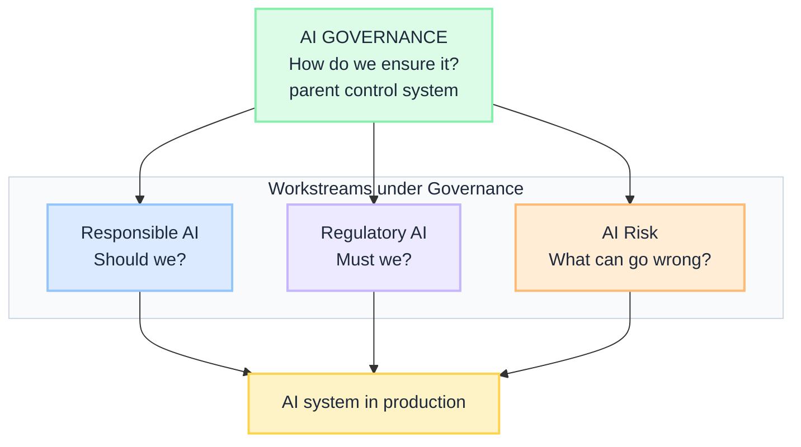
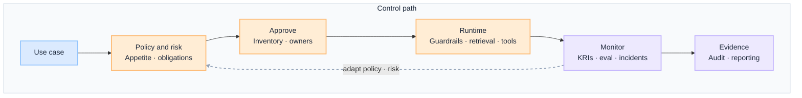

import Details from '@theme/Details';

<div className="gain-doc-header">
  <h1 className="gain-doc-title">G.A.I.N Governance</h1>
  <div className="gain-doc-subtitle" style={{marginTop: '-0.25rem', marginBottom: '1.75rem'}}>
    Why AI governance works this way: principles, control system, team boundaries.
  </div>
</div>

:::info[G.A.I.N Governance]
**AI Governance is the enterprise control system for AI, not a synonym for ethics or for the law.**

Enterprise teams debate Responsible AI slides and regulatory checklists. G.A.I.N Governance reframes the question: how do we ensure desired outcomes and mandatory obligations stay true in production, with inventory, approvals, runtime controls, monitoring, and audit evidence from day one.
:::

[G.A.I.N AIOM](/frameworks/gain-aiom) answers **who owns which plane**. G.A.I.N Governance answers **how the control system runs**: strategy and policy, risk, responsible outcomes, regulatory compliance, lifecycle, security and privacy, human oversight, guardrails, monitoring, and evidence. This page is the G.A.I.N operating map.

## How This Maps to G.A.I.N

This table is **control-capability RACI for this domain**, not AIOM plane ownership. AIOM still names who owns application, control, runtime, and knowledge planes. Rows below say which teams run each governance capability under those planes.

| G.A.I.N pillar | Where it lives in governance | Who primarily owns it |
| --- | --- | --- |
| **G · Grounded** | Obligation registers, policy packs, harm boundaries, approved source and tool scopes | Governance + Legal / Compliance + Domain owners |
| **A · Adaptive** | Risk monitoring, control health, incident learning, policy and threshold updates | Risk + AI Platform + Product |
| **I · Intelligent** | Routing, abstention, guardrails, governed retrieval and tools on the request path | AI Platform Team |
| **N · Native** | Model/agent inventory, change control, audit stores, IdP-bound identity | AI Platform + Security + Infrastructure |

AIOM **Grounded** is the knowledge plane (pipelines, corpora, what the system may know). Governance **Grounded** is permission (what the system may do). Do not merge those RACIs.

---

## Why Governance needs G.A.I.N

Most "governance" failures are not missing principles. They are architecture and operating-model failures:

- Ethics boards exist; production agents have no inventory entry and no deny logs.
- Legal memos sit in SharePoint; runtime has no mapped controls.
- Risk workshops happen at launch; monitoring never becomes a KRI.
- Responsible, Regulatory, and Governance are used as synonyms, so nobody owns the control plane.

Generic advice stops at "stand up an AI committee." **G.A.I.N Governance** maps the full control domain: how outcomes, obligations, and risks become policy-on-the-path, lifecycle change, and auditable evidence under the same G · A · I · N claims as LLM, RAG, and Agents.

**Dominant pillars for this domain:** **G** (Grounded) and **I** (Intelligent).
- Grounded is what is allowed: values, obligations, approved sources, and scoped tools.
- Intelligent is where the system decides on the path: route, abstain, enforce, escalate, not "hope the prompt behaves."

Native inventory/evidence and Adaptive KRIs are mandatory, not optional. They are not the dominant story: Grounded defines the boundary, Intelligent enforces it on the path.

### What G.A.I.N adds (not generic governance advice)

| G.A.I.N claim | What it means for governance |
| --- | --- |
| **Intelligence in the call; truth in the system** | Models generate. Architecture owns policy verdict, inventory, attribution, and audit. |
| **The model proposes; the system decides** | Allow, deny, escalate, and tool scope are platform decisions, not system-prompt etiquette. |
| **Planes beat projects** | Governance capabilities have owners; they are not an undifferentiated "AI CoE" task list. |
| **Grounding is a pipeline, not a prompt** | Entitlements, approved corpora, and output filters define the boundary before inference. |
| **Native is the feedback loop, not hosting** | Native is the infrastructure of the loop (inventory, traces, audit stores). Adaptive is who updates policy and risk from those signals. |

---

## Domain on one page

**Two views, one domain.** Executives need the layer model; platform teams need the control path. Same boundary, different questions. Two blueprints under [Governance](/blueprints/governance):

| View | Question | Audience | Blueprint |
| --- | --- | --- | --- |
| **Operating** | How do we ensure it across the estate? | Exec, risk, compliance, architects | [Governance Operating](/blueprints/governance/operating) |
| **Runtime** | How does one request stay governed on the path? | Platform, security, SRE | [Governance Runtime](/blueprints/governance/runtime) |

### Layer model: parent control system, three workstreams

AI Governance is the **parent control system**. It answers **how do we ensure it?** Responsible AI, Regulatory AI, and AI Risk are **sibling workstreams under it**, not peers of Governance. For every use case you still ask all four questions; the fourth question *is* Governance, not a fourth workstream.

Regulatory AI (the must-we question) is the same lane as **Regulatory compliance** in the capability tree.

- **Should we?** Responsible AI: outcomes. Workstream under Governance.
- **Must we?** Regulatory AI: obligations. Workstream under Governance.
- **What can go wrong?** AI Risk: threats and residual risk. Workstream under Governance.
- **How do we ensure it?** AI Governance: parent control system that runs the three workstreams.

<br/>

<div className="gain-mermaid">


```mermaid
flowchart TB
    Gov["AI GOVERNANCE\nHow do we ensure it?\nparent control system"]
    subgraph ws["Workstreams under Governance"]
        Resp["Responsible AI\nShould we?"]
        Reg["Regulatory AI\nMust we?"]
        Risk["AI Risk\nWhat can go wrong?"]
    end
    Gov --> Resp
    Gov --> Reg
    Gov --> Risk
    Resp --> Prod["AI system in production"]
    Reg --> Prod
    Risk --> Prod

    classDef platform fill:#dcfce7,stroke:#86efac,color:#1e293b,stroke-width:2px
    classDef actor fill:#dbeafe,stroke:#93c5fd,color:#1e293b,stroke-width:2px
    classDef process fill:#ede9fe,stroke:#c4b5fd,color:#1e293b,stroke-width:2px
    classDef gate fill:#ffedd5,stroke:#fdba74,color:#1e293b,stroke-width:2px
    classDef action fill:#fef3c7,stroke:#fcd34d,color:#1e293b,stroke-width:2px

    class Gov platform
    class Resp actor
    class Reg process
    class Risk gate
    class Prod action

    style ws fill:#f8fafc,stroke:#cbd5e1,color:#1e293b,stroke-width:1px
```

</div>

<br/>

- **Responsible AI** defines outcomes: Ethical, Accountable, Transparent, Explainable, Trustworthy.
- **Regulatory AI** defines external must-we obligations and required evidence.
- **AI Risk** identifies, assesses, mitigates, monitors, and accepts residual risk.
- **AI Governance** operationalises all three: policy, inventory, controls, monitoring, audit.

Do not call "Governed" a Responsible AI pillar. Governance is the parent operating system. Trustworthy is the reliability, safety, and security *outcome* under Responsible AI. Security and privacy in the capability tree is the *control* that protects that outcome.

### Control path

<br/>

<div className="gain-mermaid">


```mermaid
flowchart LR
    subgraph path["Control path"]
        direction LR
        U["Use case"]
        P["Policy and risk\nAppetite · obligations"]
        A["Approve\nInventory · owners"]
        R["Runtime\nGuardrails · retrieval · tools"]
        M["Monitor\nKRIs · eval · incidents"]
        E["Evidence\nAudit · reporting"]
    end

    U --> P --> A --> R --> M --> E
    M -. "adapt policy · risk" .-> P

    classDef product fill:#dbeafe,stroke:#93c5fd,color:#1e293b,stroke-width:2px
    classDef gate fill:#ffedd5,stroke:#fdba74,color:#1e293b,stroke-width:2px
    classDef process fill:#ede9fe,stroke:#c4b5fd,color:#1e293b,stroke-width:2px

    class U product
    class P,A,R gate
    class M,E process

    style path fill:#f8fafc,stroke:#cbd5e1,color:#1e293b,stroke-width:1px

    linkStyle 5 stroke:#94a3b8,stroke-width:2px,stroke-dasharray:5 5
```

</div>

<br/>

- **Approve before scale:** no inventory, no owner, no go-live.
- **Controls on the path:** [Governance Runtime](/blueprints/governance/runtime), identity-scoped context ([G.A.I.N Identity](/frameworks/gain-identity)), retrieval as a control point ([G.A.I.N RAG](/frameworks/gain-rag)).
- **Evidence is continuous:** [G.A.I.N Observability](/frameworks/gain-observability) and [G.A.I.N Evaluation](/frameworks/gain-evaluation) feed assurance, not a one-off binder.

---

## Capability tree

Same shape as the [layer model](#layer-model-parent-control-system-three-workstreams): AI Governance is the parent. The three workstreams hang off it. Everything else is how the parent runs (policy, inventory, controls, monitoring, evidence).

```text
AI Governance                          ← parent · How do we ensure it?
├── Workstreams
│   ├── Responsible AI                 ← Should we? (outcomes)
│   │   ├── Ethical
│   │   ├── Accountable
│   │   ├── Transparent
│   │   ├── Explainable
│   │   └── Trustworthy
│   ├── Regulatory AI                  ← Must we? (Regulatory compliance)
│   └── AI Risk                        ← What can go wrong?
└── Control system                     ← how the parent runs
    ├── AI Strategy & Policy
    ├── Model / AI Lifecycle Governance
    ├── Security & Privacy
    ├── Human Oversight
    ├── Controls & Guardrails
    ├── Monitoring & Assurance
    └── Audit & Evidence
```

### Workstreams

| Workstream | Ensures | Typical primary owner |
| --- | --- | --- |
| Responsible AI | Outcomes match values and harm boundaries | Ethics + product + risk partners |
| Regulatory AI | Obligation register mapped to controls (Regulatory compliance) | Legal / Compliance |
| AI Risk | Threats known, treated, residual accepted | Risk |

### Control system

| Capability | Ensures | Typical primary owner |
| --- | --- | --- |
| Strategy and policy | Intentional use; banned uses; appetite | AI Governance lead + exec sponsor |
| Lifecycle | Inventory, change, retirement | AI Platform |
| Security and privacy | Attack surface and data duties (control). Trustworthy is the outcome. | Security + Privacy |
| Human oversight | HITL where risk demands: Product + Risk set the band; AI Platform enforces it on the path | Product + Risk (policy) · AI Platform (PEP) |
| Controls and guardrails | Runtime enforcement | AI Platform |
| Monitoring and assurance | Drift, quality, control health | Platform + Risk |
| Audit and evidence | Reconstructable decisions | Compliance + Platform |

### What the control system does

The control system is how Governance actually runs. The three workstreams answer **what** (outcomes, obligations, residual risk). These seven rows are the machinery that keeps those answers true in production.

They follow the [control path](#control-path) on this page: policy → approve → runtime → monitor → evidence.

**AI Strategy & Policy** is the intent layer. What AI is for, what is banned, what risk appetite leadership signed. Without this, Responsible, Regulatory, and Risk have no shared rulebook. Owner: governance lead + exec sponsor.

**Model / AI Lifecycle Governance** is inventory and change. Every model, agent, and high-risk prompt pack has an owner, an environment, and a retirement path. "No inventory, no owner, no go-live." Owner: AI Platform.

**Security & Privacy** is the control that protects the Trustworthy outcome under Responsible AI. Attack surface, data duties, injection, secrets, access. Trustworthy is the result you want; this row is the work that produces it. Owner: Security + Privacy.

**Human Oversight** is HITL where risk demands it: who must see the refund, when the agent must abstain, when a human takes the wheel. Product + Risk set the band; Platform enforces it on the path.

**Controls & Guardrails** is runtime enforcement: allow, deny, route, escalate, tool allowlists, governed retrieval. This is "the system decides; the model proposes." Owner: AI Platform.

**Monitoring & Assurance** is whether production still matches policy: KRIs, eval gates, drift, incidents. This is the Adaptive loop. Owner: Platform + Risk.

**Audit & Evidence** is the reconstructable story: who approved what, why this refund, which policy version, which eval run. Not a screenshot pack for the auditor visit. Owner: Compliance + Platform.

A bank refund agent, in one pass: Strategy says refunds are in scope and fraud limits apply. Lifecycle puts the agent in inventory with an owner. Security scopes tools and data. Oversight sets the HITL band. Guardrails enforce deny or escalate on the request. Monitoring watches fraud and drift. Evidence can replay last month's decision.

The workstreams can exist as slides. These seven rows are what make them operational.

---

## Demo vs production

| Layer | Demo default | Production default |
| --- | --- | --- |
| **Principles** | Slide with five adjectives | Signed outcomes per use case |
| **Obligations** | "We will comply" | Obligation → control → evidence map |
| **Risk** | One workshop | Register + KRIs + residual accept |
| **Inventory** | Spreadsheet of pilots | System of record for models and agents |
| **Runtime** | Prompt instructions | Policy, tool allowlists, governed retrieval |
| **Monitoring** | None | Eval gates, drift, incident hooks |
| **Audit** | Screenshot pack | Versioned logs and decision lineage |

---

## G.A.I.N applied to AI governance

<Details summary="G · Grounded: what is allowed">
**Dominant pillar.** Grounded governance defines harm boundaries, approved sources, entitlements, and obligation registers before a model is trusted in a workflow. That is permission, not knowledge-plane truth (AIOM Grounded).

**Components:** use-case register · prohibited uses · policy packs · approved corpora and tools · fairness and privacy bars where required.

**Design questions:** Who signs what "good and allowed" means? What is banned regardless of accuracy?

**Principle:** Permission and approved scope live in the system, not in the prompt.

**Anti-patterns:** ethics page with no use-case register · retrieval before entitlement · "the model will be careful."
</Details>

<Details summary="A · Adaptive: governance that learns">
Adaptive governance closes the loop from incidents, eval failures, and control breaches back into policy, thresholds, and risk appetite. Native stores the signals; Adaptive decides what changes.

**Components:** KRIs · incident postmortems tied to inventory · eval regression gates · scheduled obligation refresh.

**Design questions:** What production signal changes policy this quarter? Legal / Compliance owns the obligation register; Adaptive is which signal triggers a refresh.

**Principle:** Governance is a feedback system, not a launch checklist.

**Anti-patterns:** annual policy PDF only · risk workshop with no monitor stage · eval scores that never block release.
</Details>

<Details summary="I · Intelligent: decisions on the path">
**Co-dominant pillar.** Intelligent governance puts allow, deny, route, and escalate on the request path: agent runtimes, gateways, and retrieval pipelines enforce policy while the model proposes.

**Components:** intent routing bounds · guardrails · tool manifests · abstention and HITL bands (Product + Risk set the band; Platform enforces it) · [Governance Runtime](/blueprints/governance/runtime) enforcement.

**Design questions:** Where is the PEP on this path? What happens on policy deny?

**Principle:** The system decides; the model proposes.

**Anti-patterns:** shared god-mode tool credentials · no kill switch · treating jailbreak resistance as a prompt paragraph.
</Details>

<Details summary="N · Native: inventory, identity, evidence infrastructure">
Native governance inherits enterprise IdP, change systems, and audit stores. Inventory and evidence are platforms with owners, not folders on a laptop. Native does not own gateway policy verdicts; that is Intelligent (control plane).

**Components:** model/agent inventory · change records linked to eval run IDs · gateway identity ([G.A.I.N Identity](/frameworks/gain-identity)) · immutable decision logs.

**Design questions:** Can we reconstruct last month's refund decision? Can we retire a model without tribal knowledge?

**Principle:** Assurance needs operational infrastructure.

**Anti-patterns:** shadow agents · evidence assembled only for the auditor visit · hosting choice with no shared-responsibility map.
</Details>

---

## Bank example: refund agent

| Lens | Governance forces the question |
| --- | --- |
| Responsible | Fair treatment, named owners, explainability, trustworthy controls as outcomes |
| Regulatory | Which banking, privacy, consumer, and AI obligations apply, and what proof? |
| Risk | Fraud, bias, injection, drift: mitigate and accept residual on purpose |
| **Governance** | Inventory, approval, access, runtime guardrails, monitoring, escalation, evidence pack |

Three workstream questions plus the parent control system. Same use case.

---

## Key patterns

<Details summary="Separate the three workstreams">
Staff Responsible, Regulatory, and Risk as sibling workstreams under Governance. Do not merge them into one slogan, and do not treat Governance as a fourth workstream.
</Details>

<Details summary="Obligation register per use case">
Map must-we rules to controls and artifacts before go-live. Legal / Compliance owns the register. Refresh when law, product, or model changes.
</Details>

<Details summary="Inventory as system of record">
Every model, agent, and high-risk prompt pack has an owner, environment, and retirement path.
</Details>

<Details summary="Policy on the path">
Enforce with gateway, runtime, and retrieval controls. Pair with [G.A.I.N Evaluation](/frameworks/gain-evaluation) gates and [G.A.I.N Observability](/frameworks/gain-observability).
</Details>

<Details summary="Residual risk is explicit">
Accepting risk is a decision with a name and a date, not silence after a green deploy.
</Details>

---

## Related

| Resource | Use when |
| --- | --- |
| [G.A.I.N AIOM](/frameworks/gain-aiom) | Who owns application, control, runtime, and knowledge planes |
| [G.A.I.N Identity](/frameworks/gain-identity) | Principal-bound context and tools |
| [G.A.I.N Evaluation](/frameworks/gain-evaluation) | Promotion gates and assurance scores |
| [G.A.I.N Observability](/frameworks/gain-observability) | Evidence and operational visibility |
| [G.A.I.N RAG](/frameworks/gain-rag) | Retrieval as a governed control point |
| [Governance blueprints](/blueprints/governance) | Two views, one subject |
| [Governance Operating](/blueprints/governance/operating) | Estate go-live: inventory, obligation map, evidence pack |
| [Governance Runtime](/blueprints/governance/runtime) | Five boundaries, SARAC, release gates |
| [Governance playbooks](/playbooks/governance) | Operating and runtime how-to |
| [Operating playbooks](/playbooks/governance/operating) | Inventory, obligation map, evidence pack |
| [Runtime playbooks](/playbooks/governance/runtime) | Foundation, assurance, boundary |
