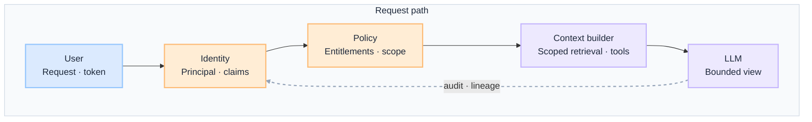
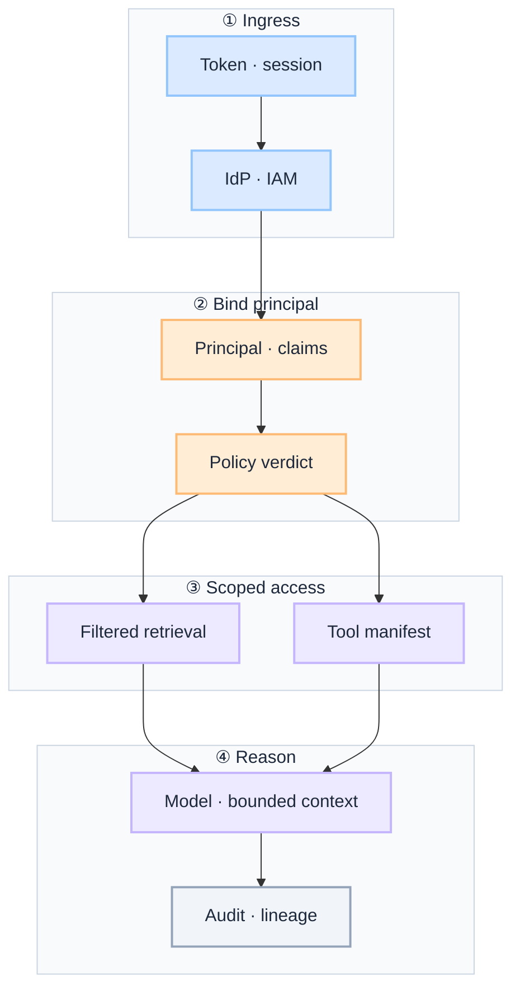

import Details from '@theme/Details';

  <h1 className="gain-doc-title">G.A.I.N Identity</h1>
  

    Why identity-aware AI works this way: principles, patterns, team boundaries.
  

:::info[G.A.I.N Identity]
**Identity is the first input to every AI decision, not a header you attach after context is built.**

Enterprise teams debate prompt personalization. G.A.I.N Identity reframes the question: who is asking, what may they retrieve and invoke, and how does entitlement shape context before the model runs — with audit on every principal-bound path from day one.
:::

Identity-aware AI in production is **principal-bound context assembly**, not a user ID in a log line. The principal is resolved at ingress; policy evaluates entitlements; retrieval and tools run within that scope; the model reasons over a bounded view — never over data the caller could not access directly.

## How This Maps to G.A.I.N

| G.A.I.N pillar | Where it lives | Who primarily owns it |
| --- | --- | --- |
| **G · Grounded** | RBAC/ABAC policies, document entitlements, tool scopes, segregation rules | Security + AI Platform |
| **A · Adaptive** | Session continuity, scope elevation, delegation, break-glass workflows | AI Platform + Product / Domain Teams |
| **I · Intelligent** | Scoped retrieval, response shaping, agent planning bounds, abstention | AI Platform Team |
| **N · Native** | IdP integration, IAM, federation, token brokering at the gateway | Infrastructure / Cloud Team + Security |

---

## Why Identity needs G.A.I.N

Most production identity failures in AI are not authentication failures. They are architecture failures:

- Retrieval runs before policy, so restricted documents leak into the context window.
- RAG becomes an exfiltration channel because indexes are not entitlement-scoped.
- Agent tools run with shared service credentials instead of principal-scoped access.
- The same question returns different answers because prompts differ — not because identity drives entitlement.

Generic identity advice stops at "add OAuth to the API." **G.A.I.N Identity** maps the full principal-bound domain: how identity is resolved, how policy gates context, how scoped retrieval and tools work, and how every path is auditable under federation, elevation, and break-glass.

**Dominant pillars for this domain:** **G** (Grounded) and **N** (Native).
- Grounding is entitlement: what this principal may retrieve, invoke, and see — evaluated deterministically, not by the model.
- Native is inheriting enterprise IdP and IAM — federation, workload identity, and token lifecycle at the gateway.

### What G.A.I.N adds (not generic identity advice)

| G.A.I.N claim | What it means for identity |
| --- | --- |
| **Intelligence in the call; truth in the system** | The model reasons. The architecture owns principal resolution, entitlement verdict, scoped context, and audit. |
| **The model proposes; the system decides** | Response detail and tool access follow policy — not prompt instructions to "be careful." |
| **Grounding is a pipeline, not a prompt** | Identity-scoped retrieval, tool manifests, and field masking define the bounded view before inference. |
| **Native is the feedback loop, not hosting** | IdP integration, token brokering, and principal-on-every-span close the loop for forensics and compliance. |

---

## Domain on one page

**Two views, one domain.** Application teams need the request path; platform teams need the shared identity stack. Same governed boundary, different questions.

| View | Question | Audience |
| --- | --- | --- |
| **Request path** | How does one principal safely receive the right context and capabilities? | App teams, feature architects |
| **Platform stack** | How does the org wire enterprise identity into every AI ingress? | Platform, security, SRE |

Identity exists **before** context. Policy evaluates the principal; the context builder retrieves only what that principal may see; the model reasons within that bounded view. Same question, three principals — manager, employee, auditor — legitimately different outcomes.

### Request path

 

 

- **Identity before context:** policy evaluates the principal; retrieval filters before the model runs.
- **No entitlement bypass:** if the user cannot access it directly, the model must not see it in context.

:::important[Ask before you ship]
**Is identity resolved before retrieval?** **Can the model access context the user could not access directly?**

If identity is late or retrieval is unscoped, the system will leak entitlements regardless of prompt quality.
:::

| Stage | Owns | Does not own |
| --- | --- | --- |
| **User** | Request, session, authentication handoff | Entitlement verdict, context assembly |
| **Identity** | Principal resolution, claims (roles, tenant, attributes) | Business logic, answer generation |
| **Policy** | Allow/deny, scope reduction, tool permissions | Generating the answer |
| **Context builder** | Scoped retrieval, tool manifests, field masking | Policy definition, IdP administration |
| **LLM** | Reasoning within allowed context | Deciding what the user may know |

### Platform stack

Every identity-aware path crosses the same boundaries. Intelligence lives in scoped reasoning and response shaping. Principal resolution, federation, and audit live in the system around it.

The **gateway** is the single identity ingress: authN, token validation, and principal binding before any retrieval or tool call. IdP and IAM are authoritative sources; the AI platform never invents a parallel user store.

```mermaid
flowchart LR
    subgraph client["① Client"]
        CL["App / Agent / Workflow"]
    end

    subgraph gateway["② Gateway"]
        GW["AuthN · IdP · Token<br/>· Principal bind"]
    end

    subgraph policy["③ Policy"]
        POL["Entitlements · scope<br/>· tool manifest"]
    end

    subgraph context["④ Context"]
        CTX["Scoped retrieval<br/>· tools"]
    end

    subgraph plat["⑤ Platform"]
        PL["Audit · trace<br/>· lineage"]
    end

    CL --> GW --> POL --> CTX --> PL

    classDef product fill:#dbeafe,stroke:#93c5fd,color:#1e293b,stroke-width:2px
    classDef gate fill:#ffedd5,stroke:#fdba74,color:#1e293b,stroke-width:2px
    classDef process fill:#ede9fe,stroke:#c4b5fd,color:#1e293b,stroke-width:2px
    classDef audit fill:#f1f5f9,stroke:#94a3b8,color:#1e293b,stroke-width:2px

    class CL product
    class GW,POL gate
    class CTX process
    class PL audit

    style client fill:#f8fafc,stroke:#cbd5e1,color:#1e293b,stroke-width:1px
    style gateway fill:#f8fafc,stroke:#cbd5e1,color:#1e293b,stroke-width:1px
    style policy fill:#f8fafc,stroke:#cbd5e1,color:#1e293b,stroke-width:1px
    style context fill:#f8fafc,stroke:#cbd5e1,color:#1e293b,stroke-width:1px
    style plat fill:#f8fafc,stroke:#cbd5e1,color:#1e293b,stroke-width:1px
```

 

 

| Layer | Owns | Does not own |
| --- | --- | --- |
| **Client** | Session handoff, use-case orchestration | IdP configuration, policy rules |
| **Gateway** | AuthN, token validation, principal on trace | Entitlement logic, retrieval filters |
| **Policy** | RBAC/ABAC, tool scopes, segregation rules | Context assembly, model inference |
| **Context** | Identity-scoped retrieval and tool manifests | Bypassing entitlements for convenience |
| **Platform** | Audit, lineage, principal on every span | Post-hoc forensics without a principal |

### Demo vs production (whole stack)

One decision guide for the full path. Pillar sections assume production defaults unless noted.

| Layer | Demo default | Production default |
| --- | --- | --- |
| **Client** | API key shared across users | Per-user or per-workload identity at ingress |
| **Gateway** | Token checked once, forgotten | Principal bound to trace; refreshed and revocable mid-session |
| **Policy** | "Do not show secrets" in the prompt | Deterministic entitlement before retrieval and tools |
| **Context** | Full index search | Retrieve as the user — indexes filtered by identity |
| **Tools** | Shared god-mode service account | Workload identity with least-privilege scopes per principal |
| **Elevation** | Permanent broad access | Just-in-time elevation, time-bound, fully audited |
| **Platform** | User ID in access logs | Principal, tenant, roles on traces, audit, and eval records |
| **Change** | New data source, no entitlement review | Entitlement mapping tied to change record and access review |

---

## G.A.I.N applied to identity-aware AI

**Dominant pillar.** Grounded identity-aware systems bind every capability to a principal — human, service, or agent. Entitlement is evaluated deterministically; the model does not decide what the user may know.

**Components:** RBAC and ABAC policies · document and data entitlements per source · tool and API scopes (MCP, agents, integrations) · segregation rules (manager vs employee vs auditor views).

**Design questions:** What can this identity retrieve, invoke, and see in a response? What must be denied regardless of how the question is phrased?

**Principle:** Identity drives entitlement.

**Anti-patterns:** entitlement enforced in the prompt · one shared index across tenants · RAG that bypasses source-system access controls · permanent god-mode service accounts.

Adaptive identity architecture threads the principal through every stage: auth at the gateway, policy before retrieval, scoped context assembly, and audit on the way out. Identity is not re-established mid-flight without explicit elevation.

**Components:** identity resolution (SSO, service account, federated token) · policy evaluation before context build · context builder with retrieval filters and tool manifests per principal · session continuity across multi-turn and agent workflows.

**Design questions:** Where is identity first bound to the request trace? How do scopes change on elevation or delegation?

**Principle:** Identity must exist before context.

**Anti-patterns:** re-resolving identity per tool call without correlation · scope that widens silently across turns · break-glass paths with no review queue.

Intelligent systems change what the model *can* reason over — not just how it phrases the answer. Context quality is identity-dependent; the same model with different scoped context produces legitimately different outcomes.

**Components:** scoped retrieval (indexes filtered before chunks reach the prompt) · response shaping (detail level, field masking, citation rules per role) · agent planning bounds (tool lists constrained by principal) · abstention when scoped context is insufficient.

**Design questions:** Does the model receive only identity-allowed context? How is ambiguity handled when scope is intentionally narrow?

**Principle:** Context quality is identity-dependent.

**Anti-patterns:** personalization via prompt only · masking in the output while leaking in context · agents that plan beyond permitted tool lists.

**Co-dominant pillar.** Native identity-aware AI inherits the enterprise IdP. It does not invent a parallel user store. Federation, workload identity, and token lifecycle are platform concerns wired at the gateway.

**Components:** SSO / OIDC for human users · IAM for service accounts and least-privilege bindings · federation for B2B and multi-org access · token brokering with short-lived tokens at the control-plane boundary.

**Design questions:** Which IdP is authoritative for humans vs machines? How are tokens refreshed and revoked mid-session?

**Principle:** AI inherits enterprise identity systems.

**Anti-patterns:** custom user tables for AI · long-lived API keys instead of workload identity · AI services that bypass corporate IdP for convenience.

### Identity-first flow (dominant pillar diagram)

 

 

---

## Key patterns

Attach resolved identity (subject, tenant, roles) to traces, audit logs, and eval records from gateway ingress. Forensics without a principal are incomplete.

Retrieval filters must mirror what the user could fetch from source systems directly. If RAG bypasses entitlements, it becomes an exfiltration channel.

Machine callers need workload identity with the same rigor as humans: scoped service accounts, not shared API keys with god-mode access.

Sensitive actions require step-up auth or approval; elevated scope is time-bound and fully audited. Permanent broad scope for convenience is a policy failure.

Emergency override paths exist but are rare, approved, logged, and reviewed. Break-glass is not a backdoor — it is a governed exception with evidence.

---
