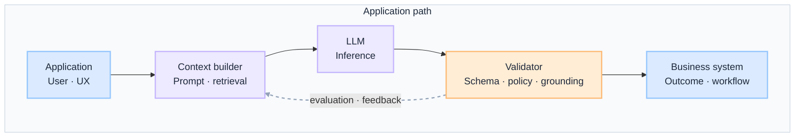
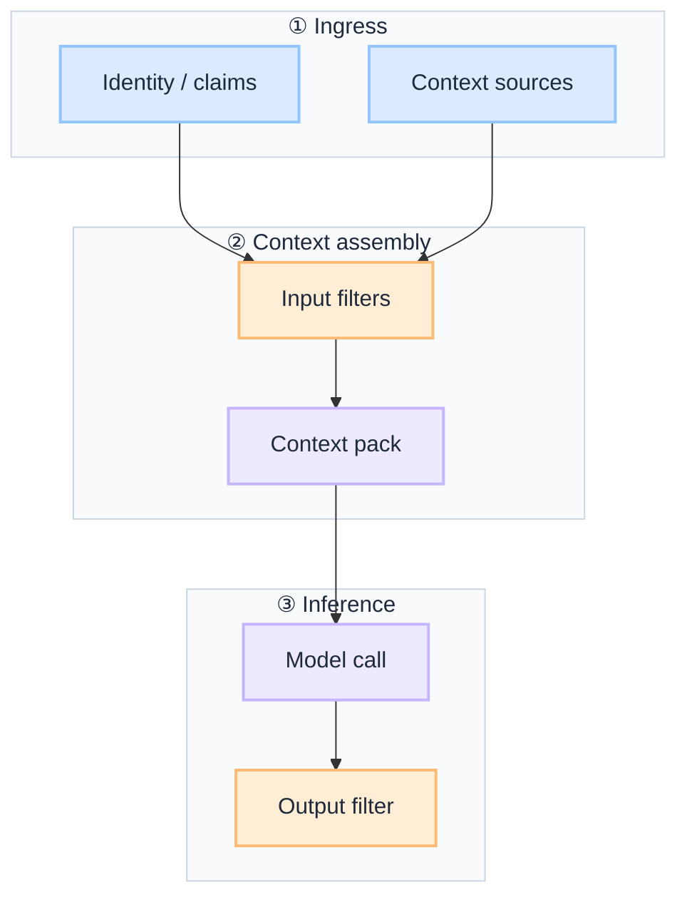

import Details from '@theme/Details';

# G.A.I.N LLM

  Why governed LLMs work this way: principles, patterns, team boundaries.

:::info[G.A.I.N LLM]
**The LLM is a governed inference service, not a chat endpoint you paste into every workflow.**

Enterprise teams debate model brands. G.A.I.N LLM reframes the question: which model, for which task, under which policy, at what cost, with what observability and rollback path from day one.
:::

An LLM in production is a **frozen function wrapped in architecture**: not a chatbot endpoint. The model is one component in a governed system, bounded by policy, validated before it reaches business logic, and operated on platform infrastructure built to scale and control cost.

## How This Maps to G.A.I.N

| G.A.I.N pillar | Where it lives | Who primarily owns it |
| --- | --- | --- |
| **G · Grounded** | Context assembly, model registry, input and output filters, prompt contracts | AI Platform Team |
| **A · Adaptive** | Eval suites, canary routing, production feedback into routing and prompts | AI Platform + Product / Domain Teams |
| **I · Intelligent** | Gateway routing, abstention, capability matrix, governed tool registry | AI Platform Team |
| **N · Native** | LLM gateway, inference runtime, trace, cost attribution, GPU clusters | Infrastructure / Cloud Team + AI Platform |

---

## Why LLM needs G.A.I.N

Most production LLM failures are not model failures. They are architecture failures:

- A chat completion API becomes the integration boundary for regulated workflows.
- Prompt text substitutes for policy enforcement.
- Model swaps ship without eval gates or rollback.
- Cost and latency show up in finance dashboards months after architecture is frozen.

Generic LLM advice stops at "pick a model and call the API." **G.A.I.N LLM** maps the full production domain: how context enters, how routing decides, how feedback closes the loop, and how the platform survives audit, scale, and model change.

**Dominant pillars for this domain:** **G** (Grounded) and **N** (Native). 
- Grounding is what the model is allowed to see and say. 
- Native is how inference runs as a governed platform service.

### What G.A.I.N adds (not generic LLM platform advice)

| G.A.I.N claim | What it means for LLM |
| --- | --- |
| **Intelligence in the call; truth in the system** | The model generates. The architecture owns context assembly, policy verdict, attribution, and audit. |
| **The model proposes; the system decides** | Routing, abstention, tool access, and escalation are not prompt tricks. They are platform decisions before and after inference. |
| **Grounding is a pipeline, not a prompt** | Identity-scoped context packs, registry-approved models, and output filters define what may enter and leave the boundary. |
| **Native is the feedback loop, not hosting** | Trace, cost, eval, and routing feedback close the loop from production back into the path below. |

---

## Domain on one page

**Two views, one domain.** Application teams need the request path; platform teams need the shared stack. Same production boundary, different questions.

| View | Question | Audience |
| --- | --- | --- |
| **Application path** | How does one request safely reach a business outcome? | App teams, feature architects |
| **Platform stack** | How does the org operate LLM as shared infrastructure? | Platform, SRE, FinOps, security |

LLMs should **augment** systems, not replace them. The model sits inside a pipeline; never as the only gate between a user and a business outcome.

### Application path

 

 

- **Validation gate:** deterministic check before anything reaches business logic.
- **Model augments:** the LLM is one step in the pipeline, not the only gate to an outcome.

:::important[Ask before you ship]
**Is the LLM on the critical path?** **Where does validation happen?**

If the answer to the first is yes and the second is unclear, the design is not ready for production.
:::

| Stage | Owns | Does not own |
| --- | --- | --- |
| **Application** | Use-case orchestration, user session | Model choice, policy verdict, raw model output to users |
| **Context builder** | Prompt contracts, retrieval, session context | Ad-hoc secrets, unaudited context assembly |
| **LLM** | Inference for ambiguous steps | Policy enforcement, business outcome |
| **Validator** | Schema, policy, grounding checks | Generating the answer |
| **Business system** | Workflow outcome, records, escalation | Letting unvalidated model text drive state changes |

### Platform stack

Every production LLM path crosses the same boundaries. Intelligence lives in the model call. Truth, policy, cost attribution, and audit live in the system around it.

The **gateway** (layer 2) is the single production ingress: auth, policy hooks, routing, and budget. Define it once here. Pillar sections below apply G · A · I · N to this stack without redefining the gateway. Deeper gateway modeling lives in the [LLM gateway blueprint](/blueprints/llm-gateway).

```mermaid
flowchart LR
    subgraph client["① Client"]
        CL["App / Agent / Workflow"]
    end

    subgraph gateway["② Gateway"]
        GW["Auth · Policy · Route · Budget"]
    end

    subgraph pool["③ Model pool"]
        MP["Approved models<br/>per use case"]
    end

    subgraph infer["④ Inference"]
        INF["Context pack · Generate<br/>· Filter"]
    end

    subgraph plat["⑤ Platform"]
        PL["Trace · Cost · Eval<br/>· Feedback"]
    end

    CL --> GW --> MP --> INF --> PL
    PL -. "routing feedback" .-> GW

    classDef product fill:#dbeafe,stroke:#93c5fd,color:#1e293b,stroke-width:2px
    classDef gate fill:#ffedd5,stroke:#fdba74,color:#1e293b,stroke-width:2px
    classDef process fill:#ede9fe,stroke:#c4b5fd,color:#1e293b,stroke-width:2px
    classDef audit fill:#f1f5f9,stroke:#94a3b8,color:#1e293b,stroke-width:2px

    class CL product
    class GW gate
    class MP,INF process
    class PL audit

    style client fill:#f8fafc,stroke:#cbd5e1,color:#1e293b,stroke-width:1px
    style gateway fill:#f8fafc,stroke:#cbd5e1,color:#1e293b,stroke-width:1px
    style pool fill:#f8fafc,stroke:#cbd5e1,color:#1e293b,stroke-width:1px
    style infer fill:#f8fafc,stroke:#cbd5e1,color:#1e293b,stroke-width:1px
    style plat fill:#f8fafc,stroke:#cbd5e1,color:#1e293b,stroke-width:1px

    linkStyle 4 stroke:#94a3b8,stroke-width:2px,stroke-dasharray:5 5
```

 

 

| Layer | Owns | Does not own |
| --- | --- | --- |
| **Client** | Use-case orchestration, user session | Model choice, policy verdict |
| **Gateway** | Auth, routing, budget, policy hooks | Business logic inside the model |
| **Model pool** | Approved models, capability matrix | Ad-hoc endpoint per team |
| **Inference** | Context assembly, generation, output filter | Compliance sign-off in a prompt |
| **Platform** | Trace, cost, eval, feedback into routing | Post-hoc spreadsheet reconciliation |

### Demo vs production (whole stack)

One decision guide for the full path. Pillar sections assume production defaults unless noted.

| Layer | Demo default | Production default |
| --- | --- | --- |
| **Client** | Calls vendor chat API directly | Calls only the gateway contract; no embedded API keys |
| **Gateway** | Skipped or API key in application config | Single ingress: auth, policy, route table, budget caps |
| **Model pool** | One latest model for everything | Registry: approved models per use case, data class, region |
| **Inference** | Ad-hoc prompt and context in client code | Identity-scoped context pack, versioned templates, output filter, abstention |
| **Platform** | Console logs or vendor dashboard | Request trace end to end, cost per tenant/use case, eval gates, feedback into routing |
| **Change** | Swap model URL | Canary route + eval run + rollback tied to change record |

---

## G.A.I.N applied to LLM systems

**Dominant pillar.** Grounding is not "better prompts." It is the architecture that decides what context the model receives, from which sources, under which identity, and what outputs are allowed to leave the inference boundary.

**Components:** model registry · governed context pipeline · input and output filters · versioned prompt and context templates tied to eval baselines.

**Design questions:** What can be generated? What must be blocked?

**Principle:** Model freedom needs operational boundaries.

**Anti-patterns:** vendor chat endpoint as integration boundary · model swaps without architecture · per-squad model and prompt sprawl · context window as substitute for retrieval and abstention.

LLM behavior drifts: models update, traffic mixes shift, new use cases piggyback on old routes. Adaptive architecture closes the loop from the platform layer back into routing, prompts, and approval gates.

**Components:** per-use-case eval suites · canary routing · production feedback into the route table · change records tied to eval run IDs.

**Design questions:** How do we know when quality degrades? What triggers rollback or human handoff?

**Principle:** Production feedback is the only benchmark that matters.

**Anti-patterns:** A/B testing without shared metrics · fine-tuning to fix routing or context assembly · ignoring traces until escalation.

The LLM does not decide which model to use, whether to answer, or which tool to invoke. The **router** does. Use intelligence where ambiguity exists; use code where certainty is required.

**Components:** task-aware routing · abstention as a first-class outcome · capability matrix · governed tool registry.

**Design questions:** Which tasks are probabilistic? Which need deterministic support alongside the model?

**Principle:** The model proposes; the system decides.

**Anti-patterns:** one mega-model for every task · tool use without authorization boundaries · routing logic scattered without shared trace or policy.

**Co-dominant pillar.** Native is the platform layer made operational: observable, attributable, multi-region, and survivable under load.

**Components:** end-to-end trace · cost attribution per tenant and use case · caching with policy-aware invalidation · multi-region residency enforced at ingress.

**Design questions:** How do we scale under load? How do we control spend without throttling the business?

**Principle:** LLM systems are infrastructure-heavy systems; Native is the feedback loop, not just hosting.

**Anti-patterns:** API keys in every service · observability of outputs only · scaling replicas without backpressure or budget caps.

### Grounded flow (dominant pillar diagram)

 

 

---

## Key patterns

Define prompts with structured inputs, output schemas, and failure modes. Prompts are API interfaces: version them, test them, and treat changes as breaking changes.

Combine LLM generation with retrieved context for grounded responses. See [G.A.I.N RAG](/frameworks/gain-rag) for retrieval patterns.

Cache semantically similar requests to reduce latency and cost. Balance hit rates against response freshness: stale cached answers erode trust faster than slow ones.

Route to alternative models, cached responses, or human escalation when primary inference fails. Fallback architecture prevents a single model outage from becoming a business outage.

Adapt base models to domain-specific tasks with curated datasets and evaluation benchmarks. Highest ROI when retrieval and prompting have reached their limits, not when routing or context assembly is broken.

---
