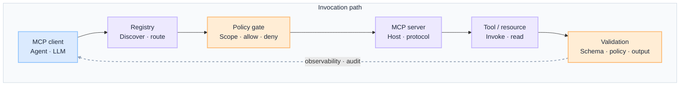
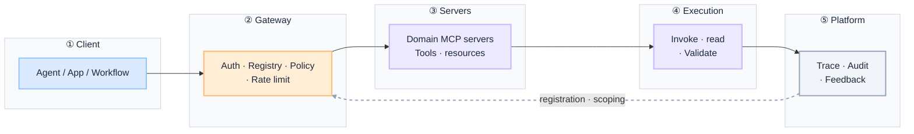
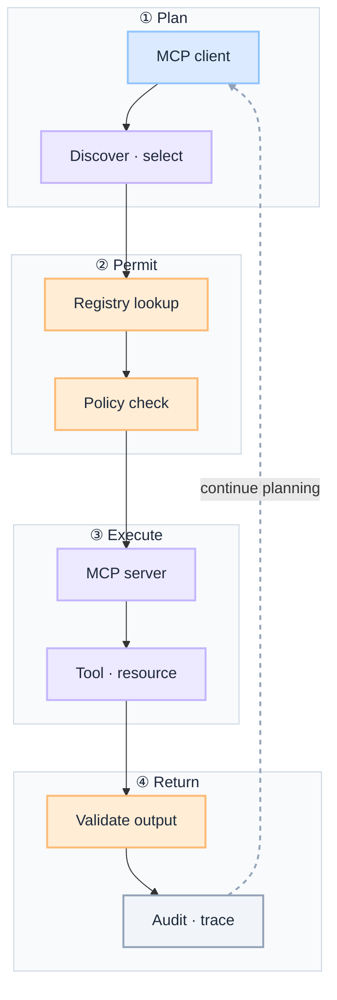

import Details from '@theme/Details';

  <h1 className="gain-doc-title">G.A.I.N MCP</h1>
  

    Why governed MCP works this way: principles, patterns, team boundaries.
  

:::info[G.A.I.N MCP]
**MCP is a governed capability surface, not a shortcut around enterprise tool policy.**

Enterprise teams debate MCP transports and server sprawl. G.A.I.N MCP reframes the question: which servers are registered, which tools are exposed per client, where policy gates invocation, and how every `list_tools`, `call_tool`, and `read_resource` is validated and audited from day one.
:::

MCP in production is **a protocol inside governed architecture**, not a wire format that bypasses governance. The client plans; the gateway permits; the server executes; validation happens before results re-enter the workflow. MCP standardizes discovery and invocation — policy decides what is allowed.

## How This Maps to G.A.I.N

| G.A.I.N pillar | Where it lives | Who primarily owns it |
| --- | --- | --- |
| **G · Grounded** | Policy engine, tool permissions, scoped manifests, human approvals, audit | AI Platform Team |
| **A · Adaptive** | Orchestrator integration, session state, retries, multi-server tool chains | AI Platform + Product / Domain Teams |
| **I · Intelligent** | Planning, tool selection, multi-step discover → invoke → observe | AI Platform Team |
| **N · Native** | MCP gateway, server hosting, queues, observability, rate limits | Infrastructure / Cloud Team + AI Platform |

---

## Why MCP needs G.A.I.N

Most production MCP failures are not protocol failures. They are architecture failures:

- Clients connect directly to arbitrary MCP servers with no registry or policy gate.
- Every agent sees every tool in the manifest — no entitlement-aware scoping.
- Tool results return to the model without schema or policy validation.
- MCP servers run as one-off processes with no trace, quota, or audit trail.

Generic MCP advice stops at "stand up a server and connect the client." **G.A.I.N MCP** maps the full integration domain: how servers are registered, how invocations are gated, how workflows chain across servers, and how every call is traced under scale, failure, and change.

**Dominant pillars for this domain:** **G** (Grounded) and **I** (Intelligent).
- Grounding is authority: what the client may list, read, and invoke — policy before execution.
- Intelligent is where the model earns its place: planning and tool selection — not owning permission or validation.

### What G.A.I.N adds (not generic MCP advice)

| G.A.I.N claim | What it means for MCP |
| --- | --- |
| **Intelligence in the call; truth in the system** | The model plans invocations. The architecture owns registry, policy verdict, validation, and audit. |
| **The model proposes; the system decides** | Discovery and planning are model-assisted; every invocation passes a policy gate before it runs. |
| **Grounding is a pipeline, not a prompt** | Scoped manifests, input/output filters, and approvals define what MCP may expose — not client prompts. |
| **Native is the feedback loop, not hosting** | Gateway traces, rate limits, and server health close the loop from production back into registration and scoping. |

---

## Domain on one page

**Two views, one domain.** Application teams need the invocation path; platform teams need the shared MCP stack. Same governed boundary, different questions.

| View | Question | Audience |
| --- | --- | --- |
| **Invocation path** | How does one tool call safely execute and return validated results? | App teams, feature architects |
| **Platform stack** | How does the org operate MCP as shared integration infrastructure? | Platform, SRE, security |

MCP is **transport and contract** inside a workflow. The client plans; the gateway permits; the server executes; validation gates what re-enters the model. Resources are read-only context; tools are side-effecting actions — policy treats them differently.

### Invocation path

 

 

- **Gateway permits:** the client plans; policy gates servers, tools, and resources before execution.
- **Validate before re-entry:** MCP is transport and contract; results are checked before they return to the workflow.

:::important[Ask before you ship]
**Which MCP servers are registered?** **Which tools are exposed per client?** **Where is validation before results return to the model?**

If clients connect to unregistered servers or every manifest is all-or-nothing, MCP becomes an unaudited backdoor.
:::

| Stage | Owns | Does not own |
| --- | --- | --- |
| **MCP client** | Plan, discover, invoke requests | Permission to act, server hosting |
| **Registry** | Approved servers, routing, manifest version | Policy verdict, business logic |
| **Policy gate** | Allow/deny, scope, escalation | Generating the plan |
| **MCP server** | Protocol host, tool/resource implementation | Client authorization |
| **Tool / resource** | Execute action or return read-only context | Deciding whether invocation was allowed |
| **Validation** | Schema, policy, output filter before re-entry | Planning the next step |

### Platform stack

Every MCP path crosses the same boundaries. Intelligence lives in planning and tool selection. Registry, gateway policy, hosting, and audit live in the system around it.

The **MCP gateway** is the single enterprise ingress: authenticate clients, enforce policy, normalize transports (stdio, SSE, streamable HTTP), and emit audit events. Domain teams own bounded servers; the platform owns registration and ingress.

 

 

| Layer | Owns | Does not own |
| --- | --- | --- |
| **Client** | Use-case orchestration, MCP client lifecycle | Server registration, policy rules |
| **Gateway** | Auth, registry lookup, policy, transport normalization | Tool implementation inside servers |
| **Servers** | Bounded domain tools and resources | Cross-domain god-server sprawl |
| **Execution** | Invoke, read, validate before return | Client planning |
| **Platform** | Trace per session and tool span, audit, feedback into scoping | Direct client-to-server connections |

### Demo vs production (whole stack)

One decision guide for the full path. Pillar sections assume production defaults unless noted.

| Layer | Demo default | Production default |
| --- | --- | --- |
| **Client** | Connects to any MCP server on localhost | Calls only registered servers through the gateway |
| **Gateway** | Skipped | Single ingress: auth, policy, rate limits, transport normalization |
| **Registry** | Ad-hoc server URLs in config | Catalog with owner, scope, environment, manifest version |
| **Manifest** | Full tool list to every client | Entitlement-aware scoped manifests per client profile |
| **Execution** | Raw tool output to the model | Schema and policy validation before re-entry |
| **State** | In-memory session | Durable session context, idempotent retries across reconnects |
| **Platform** | Print debugging | Distributed trace per MCP session; audit on every invocation |
| **Change** | Add tools without review | Server registration + manifest version + eval tied to change record |

---

## G.A.I.N applied to MCP systems

**Dominant pillar.** Grounded MCP integrations enforce authority before any tool list, resource read, or invocation crosses the enterprise boundary. The protocol connects systems; policy decides what is allowed.

**Components:** policy engine on servers, tools, and resources per client and tenant · scoped manifests (sensitive tools hidden or require elevation) · human approvals for irreversible invocations · input/output filtering on MCP messages · audit on every `list_tools`, `call_tool`, and `read_resource`.

**Design questions:** Can this client call this tool? Can it approve this action? Does it need escalation?

**Principle:** MCP exposes capability, not authority.

**Anti-patterns:** clients connecting directly to unregistered servers · all-or-nothing manifests · irreversible tools with no approval gate · unaudited invocations.

Adaptive MCP integrations survive retries, session drops, and evolving server manifests. Orchestration owns the workflow; MCP is how capability is reached — not the workflow itself.

**Components:** MCP client lifecycle inside agent or control-plane runtime · ordered tool chains across one or more servers · event bus for async results · state store for session context and tool outputs · idempotent replays, timeouts, and compensation on failed calls.

**Design questions:** How do clients recover from a failed MCP call? How do sessions persist across reconnects? How do tools chain across multiple servers?

**Principle:** MCP is a protocol inside governed workflows.

**Anti-patterns:** synchronous chains with no timeout or retry policy · state lost on reconnect · monolithic god-server instead of federated bounded contexts.

**Co-dominant pillar.** Intelligent MCP clients use the model to discover and plan invocations; deterministic systems validate arguments, enforce policy, and execute. The model interprets tool output; it does not bypass entitlements.

**Components:** planning (decompose goals into MCP steps) · tool selection from scoped manifest · multi-step discover → invoke → observe loops · summarization of resource contents and tool results for the next planning step.

**Design questions:** What should the model decide? What must be deterministic (routing, auth, validation)?

**Principle:** Intelligence plans; systems execute.

**Anti-patterns:** unbounded discover loops · mixing read-only resources and side-effecting tools without policy distinction · planning without shared trace or policy.

Native MCP deployments are platform-managed: servers are hosted, scaled, and observed like any other enterprise integration. Transport choice and gateway placement are infrastructure decisions.

**Components:** Kubernetes-hosted MCP servers with health checks and autoscaling · central MCP gateway for auth, routing, and protocol normalization · APIs and queues for async tools and backpressure · distributed traces per MCP session and tool span.

**Design questions:** How does MCP traffic scale under concurrent agent sessions? How is latency managed across multi-server tool chains?

**Principle:** MCP needs platform resilience.

**Anti-patterns:** one-off server processes on developer laptops in production · no rate limits or concurrency quotas · observability of final output only.

### Governed invocation flow (dominant pillar diagram)

 

 

---

## Key patterns

Front MCP traffic through a platform gateway: authenticate clients, enforce policy, normalize transports, and emit audit events. Product teams never connect directly to arbitrary MCP servers.

Catalog approved MCP servers with owner, scope, environment, and manifest version. Registration is the control point for what enters the enterprise tool surface — same discipline as a tool registry.

Publish different tool and resource lists per client profile, tenant, or use case. Not every agent sees every capability — manifests are entitlement-aware, not all-or-nothing.

Use **resources** for read-only context (documents, configs, account snapshots) and **tools** for actions with side effects. Mixing the two blurs policy boundaries and complicates audit.

Compose multiple domain-owned MCP servers behind one gateway. Each server owns a bounded context; the orchestrator chains calls — no monolithic god-server.

---

