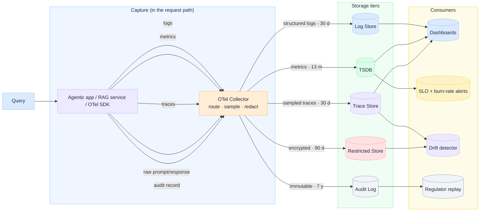

import Details from '@theme/Details';

  <h1 className="gain-doc-title">G.A.I.N Observability</h1>
  

    How to observe AI systems beyond logs: grounded, adaptive, intelligent, native principles
    applied to production telemetry and quality measurement.
  

## Design for AI Observability

  AI observability is not a dashboard. It is capture, retention, and analysis architecture. Logs
  alone cannot explain why an agent chose a tool, why a RAG answer hallucinated, or who approved a
  policy exception. G.A.I.N Observability treats every AI request as an auditable, measurable event
  on the path, not an afterthought stitched in later.

## Capture, store, consume

  Read left to right: <strong>capture → store → consume</strong>. Five signals, five storage tiers,
  five retention policies: and four consumers that ask different questions. Instrumentation lives
  in the request path; routing, sampling, and redaction happen in the OTel collector.

| Signal | Store | Retention | Primary consumer |
| --- | --- | --- | --- |
| **Structured logs** | Log store | 30 d | Operational dashboards |
| **Metrics** | TSDB | 13 mo | Dashboards, SLO burn-rate alerts |
| **Sampled traces** | Trace store | 30 d | Dashboards, drift detector |
| **Raw prompt/response** | Restricted store | encrypted, 90 d | Drift detector, quality analysis |
| **Audit record** | Audit log | immutable, 7 y | Regulator replay |

Ask before you ship: **Can you answer all four consumer questions from the right tier?** **Is
redaction happening before persistence?**

## Request-path instrumentation

  Spans and audit events must be emitted at gateway, policy, model, tool, and response boundaries.
  While context still exists. The collector fans those signals into the tiers above.

**Captured at each hop:** tokens, latency, retrieval quality, tool success/failure, policy
allow/deny, prompt lineage, and correlation IDs tying spans to audit records.

## G.A.I.N applied to observability

  Grounded observability produces evidence: not just operational noise. What you capture must
  support audit, compliance, and forensic reconstruction of AI decisions.

  **Components**

  - Prompt lineage: model, prompt version, template ID, and injected context hash
  - Policy violations: deny events, escalation triggers, and override approvals
  - Access history: who invoked which capability, tool, or data source
  - Decision trails: plan steps, tool calls, and validator outcomes in order
  - Compliance events: classification tags, residency, and retention markers

  **Design questions**

  - Can we prove what the model saw and produced?
  - Can auditors replay a decision without re-running inference?

  **Principle:** Observability is part of auditability.

  Adaptive observability instruments the live request path and feeds improvement loops. Signals
  captured late are signals lost, especially for streaming, multi-step agents, and RAG pipelines.

  **Components**

  - Gateway spans: request ingress, auth, rate limits, and correlation ID assignment
  - Model spans: token counts, latency percentiles, provider, and finish reason
  - Retrieval spans: query, chunks returned, rerank scores, and citation IDs
  - Tool spans: invocation args (redacted), success/failure, duration, and retry count
  - Eval hooks: sample production traffic into golden-set regression pipelines

  **Design questions**

  - Where does each span start and end?
  - What triggers an eval run or quality alert?

  **Principle:** Capture at the request path, not after the fact.

  Intelligent observability measures AI-specific quality: not just uptime and error rates.
  Probabilistic systems need probabilistic metrics with deterministic guardrails around them.

  **Components**

  - Hallucination rate: grounding checks, citation accuracy, and unsupported-claim detection
  - Reasoning quality: task success on eval sets, step coherence, and plan validity
  - Tool selection quality: correct tool chosen, args valid, policy-respecting invocations
  - Answer confidence: calibrated scores, abstention rates, and human-escalation frequency

  **Design questions**

  - Which quality metrics map to business risk?
  - What threshold triggers human review or rollback?

  **Principle:** AI quality must be measurable.

  Native observability is multi-store by design: five signals, five tiers, five retention policies.
  One database cannot serve operational, quality, and compliance consumers.

  **Components**

  - Log store: structured logs, 30 d retention, operational debugging
  - TSDB: metrics, 13 mo retention, SLO and year-over-year trends
  - Trace store: sampled traces, 30 d retention, latency and causality
  - Restricted store: raw prompt/response, encrypted, 90 d, drift and quality analysis
  - Audit log: immutable audit records, 7 y retention, regulator replay

  **Consumers**

  - Dashboards: logs, metrics, traces (*what is happening now?*)
  - SLO + burn-rate alerts: metrics (*are we burning error budget?*)
  - Drift detector: traces + raw prompts (*is quality eroding?*)
  - Regulator replay: audit log (*can we prove what we did?*)

  **Design questions**

  - Which tier is immutable vs erasable?
  - Where does redaction happen before persistence?

  **Principle:** AI observability is multi-store by design.

## Key patterns

  Propagate a single trace ID from gateway ingress through model, retrieval, tools, and response.
  Without it, debugging a failed agent run across ten hops is guesswork.

  Log structure and metadata liberally; log content conservatively. PII, prompts, and tool payloads
  are redacted or tokenized: lineage is preserved without exposing sensitive data.

  Define SLOs on p95 latency, error rate, grounding accuracy, and cost per successful task: not
  only pod health. AI outages often look like quality degradation before they look like 500s.

  Route a sampled fraction of live traffic through offline eval pipelines. Catch regressions from
  prompt, model, or index changes before users report them.

  Tag every inference with tenant, use case, model, and capability pattern. Cost observability is
  how platform teams stay credible with finance and product.

For component-level hooks, see [Blueprints → How to Model AI Control Plane](/blueprints/control-plane)
(observability and evaluation framework). For implementation steps, see
[Playbooks → How to Build AI Observability in Production](/playbooks/ai-observability). For the full architecture breakdown,
see [Insights → AI Observability in Enterprise](/insights/ai-observability-in-enterprise).
