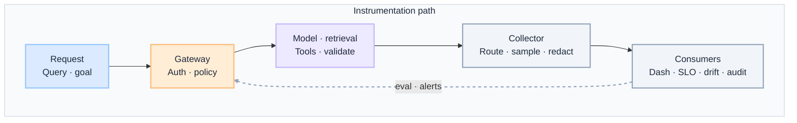
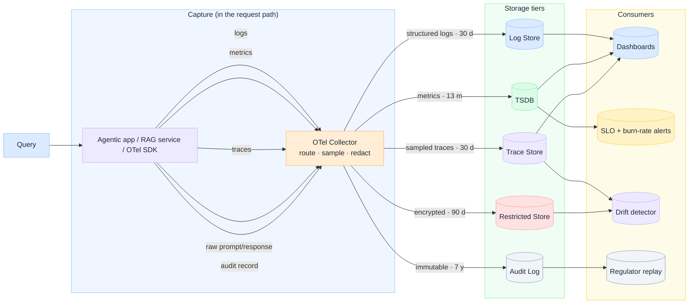
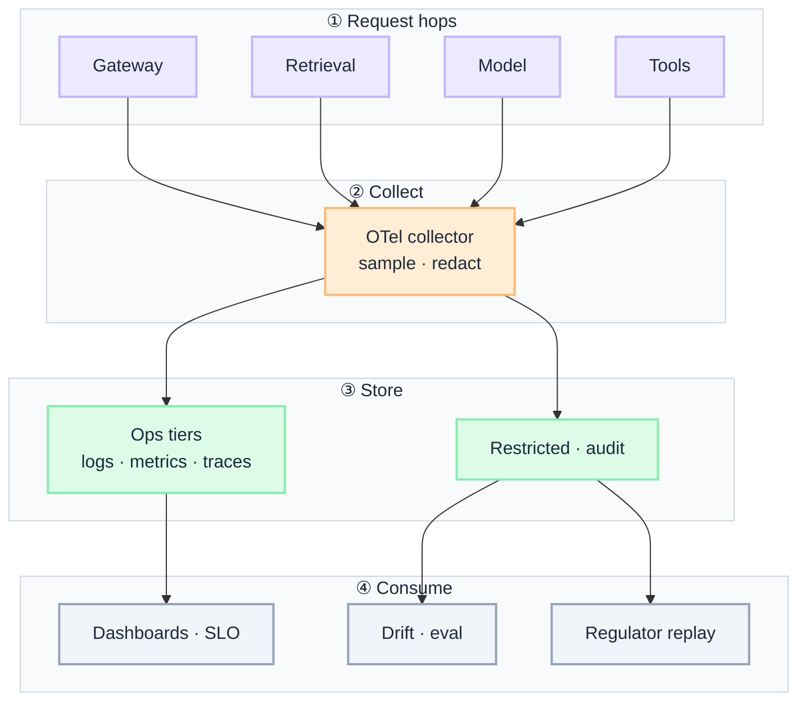

import Details from '@theme/Details';

  <h1 className="gain-doc-title">G.A.I.N Observability</h1>
  

    Why governed observability works this way: principles, patterns, team boundaries.
  

:::info[G.A.I.N Observability]
**AI observability is capture architecture on the request path, not a dashboard you add after launch.**

Enterprise teams debate which APM vendor to buy. G.A.I.N Observability reframes the question: what signals are captured at each hop, where do they land, who consumes them, and how does telemetry feed eval and rollback from day one.
:::

## Enterprise three-layer model

Large enterprises rarely fail because they lack dashboards. They fail because **business, service, and infrastructure observability evolved in silos** and nobody owns the graph between them.

| Layer | Question | Primary signals | Maps to first principles |
| --- | --- | --- | --- |
| **Business** | Why are outcomes degrading? | Journey success, conversion, revenue, business SLAs | Strategy and solution scope |
| **Service** | What is failing in the stack? | Golden signals, traces, dependencies, SLIs/SLOs | System architecture |
| **Infrastructure** | Where is degradation rooted? | CPU, memory, saturation, network, storage | System architecture (runtime) |

**Unifying rule:** every business outcome must trace to system behaviour and infrastructure state through a shared **observability graph** (correlation IDs, journey mapping, dependency links).

| G.A.I.N pillar | Role in three-layer model |
| --- | --- |
| **G · Grounded** | Audit trails, decision replay, compliance events at business and service boundaries |
| **A · Adaptive** | Drift detection, eval sampling, feedback from production into routing and prompts |
| **I · Intelligent** | Quality metrics on reasoning, tools, and outcomes, not only infra uptime |
| **N · Native** | Multi-store telemetry platform, retention tiers, cost attribution |

**This page** goes deep on **service-layer observability for AI workloads** (capture path, five signals, four consumers). For the full enterprise model (capability stack, maturity, operating model), see [Observability Blueprint](/blueprints/observability-blueprint) and [Observability playbooks](/playbooks/observability). For the AI capture architecture breakdown, see [AI Observability in Enterprise](/insights/ai-observability-in-enterprise).

---

Observability in production is **capture, retention, and routing architecture**, not a single dashboard. Logs alone cannot explain why an agent chose a tool, why a RAG answer hallucinated, or who approved a policy exception. Every AI request is an auditable, measurable event on the path.

## How This Maps to G.A.I.N

| G.A.I.N pillar | Where it lives | Who primarily owns it |
| --- | --- | --- |
| **G · Grounded** | Prompt lineage, policy violations, access history, decision trails, compliance events | Security + AI Platform |
| **A · Adaptive** | Request-path instrumentation, eval hooks, drift detection, production sampling | AI Platform + Product / Domain Teams |
| **I · Intelligent** | AI quality metrics — hallucination rate, reasoning quality, tool selection, confidence | AI Platform Team |
| **N · Native** | Multi-store telemetry, OTel collector, retention tiers, SLO and cost attribution | Infrastructure / Cloud Team + AI Platform |

---

## Why Observability needs G.A.I.N

Most production AI observability failures are not tooling failures. They are architecture failures:

- Only final model output is logged — plan steps, retrieval, and tool calls are invisible.
- Prompts and PII land in operational log stores with no redaction before persistence.
- One database serves debugging, quality analysis, and regulator replay — and serves none well.
- Quality degradation looks healthy in uptime dashboards until users escalate.

Generic observability advice stops at "add OpenTelemetry." **G.A.I.N Observability** maps the full telemetry domain: what to capture at each hop, where signals land, which consumers ask which questions, and how production data feeds eval and incident response under retention and compliance constraints.

**Dominant pillars for this domain:** **N** (Native) and **A** (Adaptive).
- Native is multi-store infrastructure: five signals, five tiers, five retention policies — operational, quality, and compliance consumers each get the right store.
- Adaptive is capture on the request path: instrumentation while context exists, feeding drift detection and eval pipelines.

### What G.A.I.N adds (not generic observability advice)

| G.A.I.N claim | What it means for observability |
| --- | --- |
| **Intelligence in the call; truth in the system** | Models generate. The architecture owns prompt lineage, policy events, traces, and audit records. |
| **The model proposes; the system decides** | Quality metrics measure behavior traces — not just whether the final message reads well. |
| **Grounding is a pipeline, not a prompt** | Retrieval spans, citation IDs, and validator outcomes are first-class signals — not post-hoc guesses. |
| **Native is the feedback loop, not hosting** | Drift detection, eval sampling, and cost attribution close the loop from production back into routing and prompts. |

---

## Domain on one page

**Two views, one domain.** Application teams need the instrumentation path; platform teams need the shared telemetry stack. Same capture boundary, different questions.

| View | Question | Audience |
| --- | --- | --- |
| **Instrumentation path** | What is captured at each hop while context still exists? | App teams, feature architects |
| **Platform stack** | How does the org route, retain, and consume AI telemetry? | Platform, SRE, FinOps, security |

Observability follows **capture → store → consume**. Instrumentation lives in the request path; routing, sampling, and redaction happen in the collector; consumers ask different questions from different tiers.

### Instrumentation path

 

 

- **Capture at the hop:** spans and audit events emit at gateway, policy, model, retrieval, tool, and response boundaries — while context still exists.
- **Redaction before persistence:** log structure liberally; log content conservatively — lineage without exposing PII.

:::important[Ask before you ship]
**Can you answer all four consumer questions from the right tier?** **Is redaction happening before persistence?**

If prompts land unredacted in operational stores or traces lack retrieval and tool spans, debugging and compliance both fail.
:::

| Stage | Owns | Does not own |
| --- | --- | --- |
| **Request** | Correlation ID assignment, user/principal context | Long-term retention policy |
| **Gateway** | Ingress spans, auth, rate limits, policy allow/deny events | Quality scoring |
| **Model / retrieval / tools** | Token counts, latency, chunks, tool success/failure | Storing raw prompts in operational logs |
| **Collector** | Route, sample, redact before write | Business logic |
| **Consumers** | Dashboards, SLOs, drift detection, regulator replay | Capturing signals after the fact |

### Platform stack

Read left to right: **capture → store → consume**. Five signals, five storage tiers, five retention policies — and four consumers that ask different questions.

 

 

| Signal | Store | Retention | Primary consumer |
| --- | --- | --- | --- |
| **Structured logs** | Log store | 30 d | Operational dashboards |
| **Metrics** | TSDB | 13 mo | Dashboards, SLO burn-rate alerts |
| **Sampled traces** | Trace store | 30 d | Dashboards, drift detector |
| **Raw prompt/response** | Restricted store | encrypted, 90 d | Drift detector, quality analysis |
| **Audit record** | Audit log | immutable, 7 y | Regulator replay |

| Layer | Owns | Does not own |
| --- | --- | --- |
| **Capture** | Spans at gateway, model, retrieval, tool, response | Storing everything in one tier |
| **Collector** | Route, sample, redact, fan-out to tiers | Retention policy definition alone |
| **Storage** | Tier-appropriate retention and access controls | Real-time alerting logic |
| **Consumers** | Dashboards, SLOs, drift, replay — each from the right tier | Post-hoc log spelunking as the primary workflow |

### Demo vs production (whole stack)

One decision guide for the full path. Pillar sections assume production defaults unless noted.

| Layer | Demo default | Production default |
| --- | --- | --- |
| **Capture** | Console logs or vendor chat dashboard | OTel SDK on every hop: gateway, retrieval, model, tools |
| **Traces** | Final response only | Span per hop with correlation ID end to end |
| **Raw content** | Full prompts in application logs | Redacted or tokenized; restricted encrypted store |
| **Audit** | None | Immutable audit log with principal, policy events, lineage |
| **Metrics** | Token count in a spreadsheet | TSDB with tenant, use case, model, cost attribution |
| **Quality** | User complaints | Drift detector on traces + restricted store; eval sampling |
| **SLOs** | Pod health only | p95 latency, error rate, grounding accuracy, cost per task |
| **Change** | Debug after incident | Baseline comparison tied to change record and eval run |

---

## G.A.I.N applied to observability systems

Grounded observability produces evidence — not just operational noise. What you capture must support audit, compliance, and forensic reconstruction of AI decisions.

**Components:** prompt lineage (model, prompt version, template ID, context hash) · policy violations (deny events, escalations, overrides) · access history (who invoked which capability) · decision trails (plan steps, tool calls, validator outcomes) · compliance events (classification, residency, retention markers).

**Design questions:** Can we prove what the model saw and produced? Can auditors replay a decision without re-running inference?

**Principle:** Observability is part of auditability.

**Anti-patterns:** logging final output only · prompts in operational log stores without redaction · no principal on audit records · traces that cannot reconstruct a multi-step agent run.

**Co-dominant pillar.** Adaptive observability instruments the live request path and feeds improvement loops. Signals captured late are signals lost — especially for streaming, multi-step agents, and RAG pipelines.

**Components:** gateway spans (ingress, auth, correlation ID) · model spans (tokens, latency, provider, finish reason) · retrieval spans (query, chunks, rerank scores, citation IDs) · tool spans (redacted args, success/failure, retries) · eval hooks (sample production traffic into regression pipelines).

**Design questions:** Where does each span start and end? What triggers an eval run or quality alert?

**Principle:** Capture at the request path, not after the fact.

**Anti-patterns:** batch export of logs hours later · no eval sampling from production · ignoring drift signals until escalation.

Intelligent observability measures AI-specific quality — not just uptime and error rates. Probabilistic systems need probabilistic metrics with deterministic guardrails around them.

**Components:** hallucination rate (grounding checks, citation accuracy) · reasoning quality (task success, plan coherence) · tool selection quality (correct tool, valid args, policy-respecting) · answer confidence (calibrated scores, abstention, human-escalation frequency).

**Design questions:** Which quality metrics map to business risk? What threshold triggers human review or rollback?

**Principle:** AI quality must be measurable.

**Anti-patterns:** infra SLOs as the only health signal · fluency mistaken for correctness · no tool-selection metrics for agents.

**Dominant pillar.** Native observability is multi-store by design: five signals, five tiers, five retention policies. One database cannot serve operational, quality, and compliance consumers.

**Components:** log store (structured logs, 30 d) · TSDB (metrics, 13 mo, SLO trends) · trace store (sampled traces, 30 d) · restricted store (raw prompt/response, encrypted, 90 d) · audit log (immutable, 7 y, regulator replay).

**Design questions:** Which tier is immutable vs erasable? Where does redaction happen before persistence?

**Principle:** AI observability is multi-store by design.

**Anti-patterns:** one store for everything · no retention differentiation · cost metrics missing tenant and use-case tags.

### Capture flow (dominant pillar diagram)

 

 

---

## Key patterns

Propagate a single trace ID from gateway ingress through model, retrieval, tools, and response. Without it, debugging a failed agent run across ten hops is guesswork.

Log structure and metadata liberally; log content conservatively. PII, prompts, and tool payloads are redacted or tokenized — lineage is preserved without exposing sensitive data.

Define SLOs on p95 latency, error rate, grounding accuracy, and cost per successful task — not only pod health. AI outages often look like quality degradation before they look like 500s.

Route a sampled fraction of live traffic through offline eval pipelines. Catch regressions from prompt, model, or index changes before users report them.

Tag every inference with tenant, use case, model, and capability pattern. Cost observability is how platform teams stay credible with finance and product.

---
