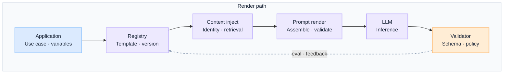
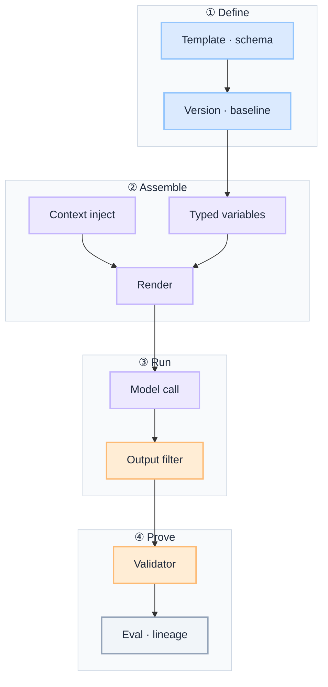

import Details from '@theme/Details';

  <h1 className="gain-doc-title">G.A.I.N Prompt</h1>
  

    Why governed prompt architecture works this way: principles, patterns, team boundaries.
  

:::info[G.A.I.N Prompt]
**A prompt is a governed contract with structured I/O, not an ad-hoc string in application code.**

Enterprise teams debate prompt engineering tricks. G.A.I.N Prompt reframes the question: which templates are versioned, which variables are typed, how context is injected under identity, and how every prompt change is eval-gated and rolled back from day one.
:::

Prompt architecture in production is **a versioned API interface to the model**, not prose scattered across services. Templates define structure; variables are typed and validated; context enters through governed pipelines; output schemas and failure modes are explicit. Policy and validation live outside the prompt text.

## How This Maps to G.A.I.N

| G.A.I.N pillar | Where it lives | Who primarily owns it |
| --- | --- | --- |
| **G · Grounded** | Prompt contracts, output schemas, context injection rules, abstention criteria | AI Platform Team |
| **A · Adaptive** | Version control, eval baselines per template, production feedback into prompts | AI Platform + Product / Domain Teams |
| **I · Intelligent** | Template selection, variable assembly, few-shot curation, structured output parsing | AI Platform Team |
| **N · Native** | Prompt registry, render service, CI integration, lineage in traces | Infrastructure / Cloud Team + AI Platform |

---

## Why Prompt needs G.A.I.N

Most production prompt failures are not wording failures. They are architecture failures:

- Prompt text is copy-pasted across services with no version, owner, or eval baseline.
- "Do not hallucinate" and "respect policy" substitute for validators and entitlement checks.
- Context is assembled ad hoc in client code instead of through identity-scoped pipelines.
- Prompt changes ship without regression gates or rollback tied to a change record.

Generic prompt advice stops at "write a better system message." **G.A.I.N Prompt** maps the full template domain: how contracts are defined, how context is injected, how outputs are validated, and how every change is measured under audit, scale, and model swap.

**Dominant pillars for this domain:** **G** (Grounded) and **A** (Adaptive).
- Grounding is the contract: structured inputs, output schemas, context injection rules, and explicit failure modes.
- Adaptive is the change loop: versioned templates, eval baselines, and production feedback into prompt updates.

### What G.A.I.N adds (not generic prompt advice)

| G.A.I.N claim | What it means for prompts |
| --- | --- |
| **Intelligence in the call; truth in the system** | The model generates. The architecture owns template versions, variable validation, context assembly, and output schema enforcement. |
| **The model proposes; the system decides** | Template selection and rendering are platform decisions; compliance and policy are not prompt tricks. |
| **Grounding is a pipeline, not a prompt** | Context enters through identity-scoped pipelines — not by pasting more text into the system message. |
| **Native is the feedback loop, not hosting** | Prompt registry, eval gates, and trace lineage close the loop from production back into template design. |

---

## Domain on one page

**Two views, one domain.** Application teams need the render path; platform teams need the shared prompt stack. Same governed boundary, different questions.

| View | Question | Audience |
| --- | --- | --- |
| **Render path** | How does one request safely assemble and validate a prompt before inference? | App teams, feature architects |
| **Platform stack** | How does the org operate prompts as shared, versioned infrastructure? | Platform, SRE, QA |

Prompts are **contracts**, not strings. Applications pass typed variables; the registry resolves templates; context injects through governed pipelines; validators check output before business logic — the model never owns policy.

### Render path

 

 

- **Contract, not prose:** templates define structure, typed variables, output schema, and failure modes.
- **Context via pipeline:** identity-scoped retrieval and filters inject context — not ad-hoc paste in client code.

:::important[Ask before you ship]
**Is the prompt versioned and owned?** **Does validation happen after inference, not inside the prompt?**

If prompts live in application repos without eval baselines, every deploy is an unmeasured experiment.
:::

| Stage | Owns | Does not own |
| --- | --- | --- |
| **Application** | Use-case variables, orchestration | Template wording, model choice |
| **Registry** | Template ID, version, owner, eval baseline | Runtime context assembly |
| **Context inject** | Identity-scoped context, retrieval results | Policy verdict, output validation |
| **Prompt render** | Assemble final prompt from template + variables + context | Business outcome |
| **LLM** | Inference for ambiguous generation | Schema enforcement, compliance |
| **Validator** | Output schema, policy, grounding checks | Generating the answer |

### Platform stack

Every prompt path crosses the same boundaries. Intelligence lives in template selection and variable assembly. Versioning, eval gates, and lineage live in the system around it.

The **prompt registry** is the single source of truth: approved templates, version history, and eval baselines. Rendering happens in platform infrastructure — not by concatenating strings in every service.

```mermaid
flowchart LR
    subgraph client["① Client"]
        CL["App / Agent / Workflow"]
    end

    subgraph registry["② Registry"]
        REG["Templates · versions<br/>· eval baselines"]
    end

    subgraph render["③ Render"]
        REN["Context inject<br/>· Assemble · validate inputs"]
    end

    subgraph infer["④ Inference"]
        INF["LLM · Output filter"]
    end

    subgraph plat["⑤ Platform"]
        PL["Trace · Eval<br/>· Feedback"]
    end

    CL --> REG --> REN --> INF --> PL
    PL -. "prompt tuning · rollback" .-> REG

    classDef product fill:#dbeafe,stroke:#93c5fd,color:#1e293b,stroke-width:2px
    classDef gate fill:#ffedd5,stroke:#fdba74,color:#1e293b,stroke-width:2px
    classDef process fill:#ede9fe,stroke:#c4b5fd,color:#1e293b,stroke-width:2px
    classDef audit fill:#f1f5f9,stroke:#94a3b8,color:#1e293b,stroke-width:2px

    class CL product
    class REG gate
    class REN,INF process
    class PL audit

    style client fill:#f8fafc,stroke:#cbd5e1,color:#1e293b,stroke-width:1px
    style registry fill:#f8fafc,stroke:#cbd5e1,color:#1e293b,stroke-width:1px
    style render fill:#f8fafc,stroke:#cbd5e1,color:#1e293b,stroke-width:1px
    style infer fill:#f8fafc,stroke:#cbd5e1,color:#1e293b,stroke-width:1px
    style plat fill:#f8fafc,stroke:#cbd5e1,color:#1e293b,stroke-width:1px

    linkStyle 4 stroke:#94a3b8,stroke-width:2px,stroke-dasharray:5 5
```

 

 

| Layer | Owns | Does not own |
| --- | --- | --- |
| **Client** | Typed variables, use-case invocation | Template authoring without registry |
| **Registry** | Versioned templates, owners, eval baselines | Ad-hoc prompt strings per service |
| **Render** | Context injection, input validation, assembly | Model routing, business logic |
| **Inference** | Generation, output filter | Compliance sign-off in prose |
| **Platform** | Prompt lineage in traces, eval gates, rollback | Post-hoc prompt archaeology in git history |

### Demo vs production (whole stack)

One decision guide for the full path. Pillar sections assume production defaults unless noted.

| Layer | Demo default | Production default |
| --- | --- | --- |
| **Client** | System prompt hardcoded in app | Calls render contract with template ID + typed variables |
| **Registry** | None; prompts in source code | Central registry with version, owner, eval baseline |
| **Context** | Paste retrieval into the prompt string | Identity-scoped context inject through governed pipeline |
| **Variables** | Untyped string interpolation | Typed schema; missing or invalid vars fail before inference |
| **Output** | Free-form text | JSON schema or structured contract; validator after inference |
| **Change** | Edit and redeploy | Version bump + eval run + rollback tied to change record |
| **Trace** | No prompt lineage | Template ID, version, and context hash on every span |

---

## G.A.I.N applied to prompt systems

**Dominant pillar.** Grounding is not "a careful system message." It is the architecture that defines structured inputs, output schemas, context injection rules, and explicit failure modes — versioned and testable like any API.

**Components:** prompt contracts (inputs, outputs, failure modes) · output schemas (JSON, enums, required fields) · context injection rules (what may enter, from which sources, under which identity) · abstention criteria when context is insufficient.

**Design questions:** What can the model be asked to produce? What must be blocked or declined?

**Principle:** Prompts are API interfaces — version them, test them, treat changes as breaking changes.

**Anti-patterns:** policy encoded in prose · secrets in prompt text · one mega-prompt for every use case · output validation skipped because "the model usually gets it right."

**Co-dominant pillar.** Prompt behavior drifts with model updates, context changes, and copy edits. Adaptive architecture ties every template version to an eval baseline and feeds production signals back into prompt design.

**Components:** semantic versioning for templates · eval baselines per template version · canary prompts alongside production versions · change records linking prompt version to eval run ID · feedback from validator failures and human corrections.

**Design questions:** What eval gate blocks a prompt promotion? How do we roll back a bad template version?

**Principle:** Every prompt change is a measured change.

**Anti-patterns:** prompt edits without regression runs · A/B prompts without shared metrics · fine-tuning to fix broken context assembly or routing.

Intelligent prompt systems select the right template for the task, assemble variables and few-shot examples, and parse structured output — the model generates; the platform owns selection and parsing logic.

**Components:** template routing by use case, intent, or capability · few-shot example curation from approved sets · variable assembly with token-budget awareness · structured output parsing and repair before validation.

**Design questions:** Who selects which template runs? How are few-shot examples governed and refreshed?

**Principle:** The platform assembles; the model generates.

**Anti-patterns:** dynamic prompt construction with no registry record · few-shot examples pulled from production without curation · parsing failures passed through to business logic.

Native prompt infrastructure is a platform service: centralized registry, render pipeline, CI integration, and lineage in every trace — not strings duplicated across repositories.

**Components:** prompt registry (templates, versions, owners, baselines) · render service (assemble, validate inputs, inject context) · CI hooks (eval on template change) · trace lineage (template ID, version, context hash per request).

**Design questions:** Where is the single source of truth for production prompts? How does render scale under load?

**Principle:** Prompt infrastructure is platform infrastructure.

**Anti-patterns:** prompts as environment variables · no render service — every team builds its own · template changes that bypass CI eval gates.

### Prompt contract flow (dominant pillar diagram)

 

 

---

## Key patterns

Define prompts with structured inputs, output schemas, and failure modes. Prompts are API interfaces: version them, test them, and treat changes as breaking changes.

Centralize templates with owner, version, eval baseline, and deprecation policy. The registry is the control point — same discipline as a model registry or tool registry.

Inject retrieval, session, and identity-scoped context through a governed pipeline — not by concatenating strings in application code. See [G.A.I.N RAG](/frameworks/gain-rag) and [G.A.I.N Identity](/frameworks/gain-identity).

Require JSON schema or typed contracts for machine-consumed outputs. Pair with a validator after inference — not with "respond in JSON" as the only enforcement.

Curate few-shot examples from approved sets with versioning and eval coverage. Examples pulled ad hoc from production traffic become stale, biased, or entitlement-leaking quickly.

---
