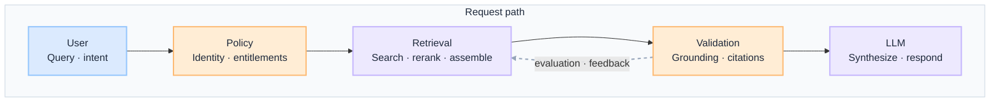
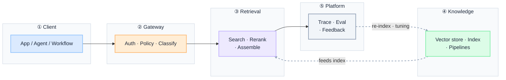
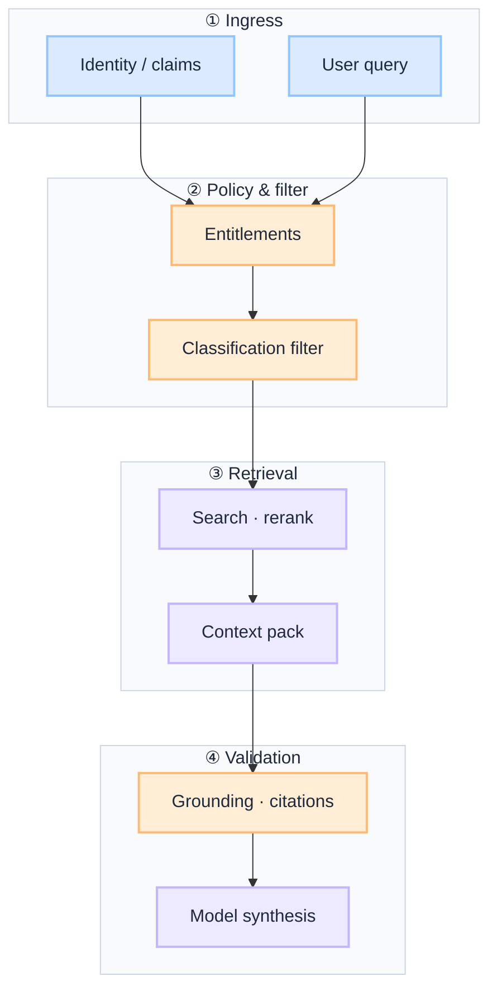

import Details from '@theme/Details';

  <h1 className="gain-doc-title">G.A.I.N RAG</h1>
  

    Why governed retrieval works this way: principles, patterns, team boundaries.
  

:::info[G.A.I.N RAG]
**RAG is a governed retrieval subsystem, not a database layer bolted onto a prompt.**

Enterprise teams debate vector stores and chunk sizes. G.A.I.N RAG reframes the question: what may be retrieved, under which identity, validated how, fed by which pipelines, with what eval and rollback path from day one.
:::

RAG in production is **runtime context construction**, not a similarity search you paste into a prompt. Retrieval is one component in a governed system: policy-bound before it runs, validated before it reaches the model, and fed by pipelines that keep knowledge fresh, complete, and searchable at scale.

## How This Maps to G.A.I.N

| G.A.I.N pillar | Where it lives | Who primarily owns it |
| --- | --- | --- |
| **G · Grounded** | Access policy, document entitlements, classification filters at retrieval time | AI Platform + Data Platform |
| **A · Adaptive** | Grounding validation, retrieval eval, feedback into chunking and reranking | AI Platform + Product / Domain Teams |
| **I · Intelligent** | Query rewriting, reranking, summarization, synthesis | AI Platform Team |
| **N · Native** | Vector stores, embedding pipelines, sync pipelines, search APIs | Infrastructure / Cloud Team + Data Platform |

---

## Why RAG needs G.A.I.N

Most production RAG failures are not retrieval-quality failures. They are architecture failures:

- Retrieval runs before policy, so restricted documents leak into the context window.
- Stale indexes serve confidently wrong answers with no freshness signal.
- No grounding validation, so the model hallucinates over thin or conflicting retrieval.
- The vector store is chosen first; freshness, lineage, and entitlements become afterthoughts.

Generic RAG advice stops at "chunk, embed, and search." **G.A.I.N RAG** maps the full retrieval domain: how policy gates context, how retrieval is assembled, how grounding is verified, and how pipelines keep knowledge trustworthy under audit, scale, and source change.

**Dominant pillars for this domain:** **G** (Grounded) and **N** (Native).
- Grounding is what may enter context, under which identity, and what is allowed to leave as a cited answer.
- Native is the pipeline layer that determines whether retrieval is current, complete, and searchable.

### What G.A.I.N adds (not generic RAG advice)

| G.A.I.N claim | What it means for RAG |
| --- | --- |
| **Intelligence in the call; truth in the system** | The model interprets retrieved context. The architecture owns policy-bound retrieval, grounding validation, citations, and audit. |
| **The model proposes; the system decides** | Query rewriting and ranking are model-assisted; what reaches the user is validated, not trusted. |
| **Grounding is a pipeline, not a prompt** | Identity-scoped retrieval, classification filters, and grounding checks define what may enter and leave the boundary. |
| **Native is the feedback loop, not hosting** | Retrieval eval, feedback, and re-indexing close the loop from production back into chunking and ranking. |

---

## Domain on one page

**Two views, one domain.** Application teams need the request path; platform teams need the shared retrieval stack. Same governed boundary, different questions.

| View | Question | Audience |
| --- | --- | --- |
| **Request path** | How does one query safely become a grounded answer? | App teams, feature architects |
| **Platform stack** | How does the org operate retrieval as shared infrastructure? | Platform, data, SRE, security |

Retrieval is a **subsystem**, not the system. Identity and policy gate what can be retrieved; validation gates what reaches the user. The LLM interprets context; it does not validate truth.

### Request path

 

 

- **Policy gates retrieval:** identity and entitlements bound what can enter context before search runs.
- **Validation gates delivery:** grounding and citations are checked before the answer reaches the user.

:::important[Ask before you ship]
**Where does policy run?** **Where is grounding validated?**

If policy runs after retrieval, or validation is skipped, the system will leak entitlements and hallucinate with confidence.
:::

| Stage | Owns | Does not own |
| --- | --- | --- |
| **User** | Query intent, user session | Retrieval policy, what enters context |
| **Policy** | Identity, entitlements, classification verdict | Generating the answer |
| **Retrieval** | Search, rerank, context assembly | Truth verification, business outcome |
| **Validation** | Grounding checks, citation requirements | Generating the answer |
| **LLM** | Synthesis of retrieved context | Validating truth, enforcing policy |

### Platform stack

Every retrieval path crosses the same boundaries. Intelligence lives in ranking and synthesis. Truth, policy, freshness, and audit live in the system around it.

The **gateway** is the single retrieval ingress: auth, policy hooks, and classification before search runs. Pipelines feed the knowledge index asynchronously; the platform layer keeps retrieval observable and measured.

 

 

| Layer | Owns | Does not own |
| --- | --- | --- |
| **Client** | Query orchestration, user session | Retrieval policy, index design |
| **Gateway** | Auth, policy, classification at ingress | Ranking semantics, business logic |
| **Retrieval** | Search, rerank, context assembly | Policy verdict, source of truth |
| **Knowledge** | Vector store, index, embedding and sync pipelines | Request-time routing and policy |
| **Platform** | Trace, retrieval eval, feedback into tuning | Post-hoc spreadsheet QA |

### Demo vs production (whole stack)

One decision guide for the full path. Pillar sections assume production defaults unless noted.

| Layer | Demo default | Production default |
| --- | --- | --- |
| **Client** | Calls the vector DB / retrieval directly | Calls only the retrieval contract; no embedded index keys |
| **Gateway** | None; retrieves whatever matches | Identity-scoped retrieval, classification filters at query time |
| **Retrieval** | Top-k similarity only | Hybrid search, rerank, assemble within token budget |
| **Knowledge** | One-off ingest, manual refresh | Scheduled / event pipelines, freshness SLAs, lineage |
| **Validation** | Model output trusted as-is | Grounding check + citations required before delivery |
| **Platform** | Eyeballing answers | Retrieval eval on golden sets, feedback capture, re-index triggers |
| **Change** | Re-embed everything ad hoc | Versioned index, eval gate, retrieval-profile rollback tied to a change record |

---

## G.A.I.N applied to RAG systems

**Dominant pillar.** Grounding is not "retrieve more documents." It is the architecture that decides what context the model receives, from which sources, under which identity, and what must never enter the window regardless of query.

**Components:** access policies (role, attribute, tenant) · document entitlements · data classification (PII, confidential, regulated) · query-time index scoping.

**Design questions:** What can this user retrieve? What must never enter context regardless of query?

**Principle:** Retrieval must respect policy boundaries before search runs.

**Anti-patterns:** retrieval before policy · classification enforced in the prompt · one shared index across tenants · context window used as a substitute for entitlement checks.

RAG quality drifts: sources change, indexes go stale, and new queries miss. Adaptive architecture closes the loop from production back into chunking, reranking, and embeddings.

**Components:** grounding validation · retrieval eval (precision, recall, citation accuracy) on golden question sets · feedback capture (failed queries, thumbs-down, escalation) tied to traces · index and profile tuning driven by eval data.

**Design questions:** How do we detect retrieval drift or stale indexes? What triggers re-indexing or a retrieval-profile rollback?

**Principle:** Production retrieval quality is measured, not assumed.

**Anti-patterns:** shipping index or chunking changes without an eval gate · trusting benchmark embedding scores over your own data · ignoring failed-query traces until escalation.

The LLM interprets and synthesizes retrieved context; it does not invent facts the index does not contain. Rewriting and ranking are model-assisted; truth is pipeline-verified.

**Components:** query rewriting (expand, disambiguate, decompose) · context ranking (relevance, recency, authority) · summarization within token limits · cited, structured synthesis.

**Design questions:** How is context ranked and truncated? How is ambiguity handled when retrieval returns conflicting sources?

**Principle:** The model proposes; the system decides what is grounded enough to deliver.

**Anti-patterns:** dumping raw top-k into the prompt · letting the model invent citations · ranking logic scattered without shared eval or trace.

**Co-dominant pillar.** Native RAG depends on reliable data infrastructure. Vector stores and embedding pipelines are not implementation details; they decide whether answers are current, complete, and searchable at scale.

**Components:** vector databases (hybrid search, metadata filtering, residency-aware hosting) · embedding pipelines (chunk, embed, index on schedule or event) · data sync pipelines with freshness SLAs and lineage · stable search APIs consumed at request time.

**Design questions:** How fresh is the data? How is indexing maintained as sources change?

**Principle:** RAG reliability depends on data pipelines, not on the store alone.

**Anti-patterns:** manual re-index as the refresh strategy · no lineage or freshness SLA · an embedding pipeline coupled to a single application.

### Grounded flow (dominant pillar diagram)

 

 

---

## Key patterns

Split documents into semantically coherent chunks with overlap and metadata preservation. Chunk size and boundary decisions directly impact retrieval precision and generation quality.

Select embedding models aligned with your domain and retrieval task. Evaluate on your own data — benchmark scores rarely predict production retrieval quality.

Combine dense (vector) and sparse (keyword) retrieval with metadata filtering. Hybrid search recovers exact-match and rare-term queries that pure similarity misses.

Apply cross-encoder or LLM-based reranking to improve precision after initial retrieval. Reranking is often the highest-leverage quality improvement in a RAG pipeline.

Validate that generated responses are supported by retrieved context before delivery. Grounding checks reduce hallucination and build user trust in production systems.

---