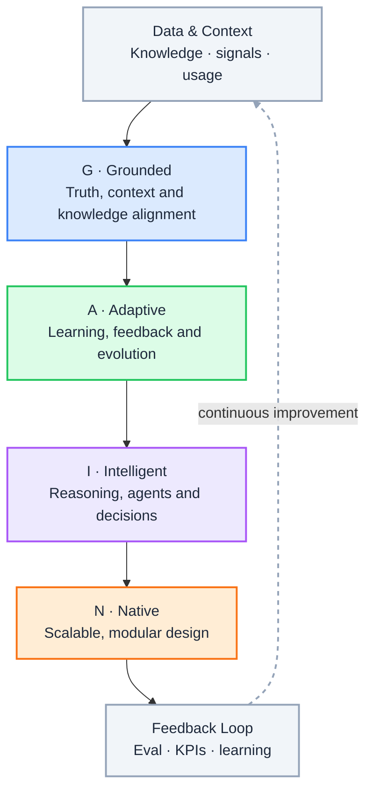

  <h1 className="gain-doc-title">G.A.I.N</h1>
  

    Governed AI-Native Systems: an operating model for enterprise AI.
  

  

    G
    Grounded
  

  
→

  

    A
    Adaptive
  

  
→

  

    I
    Intelligent
  

  
→

  

    N
    Native
  

:::info[G.A.I.N]
**Truth, control, and scale live in the system around the model — not inside it.**

Enterprise teams debate models, vendors, and org charts. G.A.I.N reframes the question: what is grounded, what adapts from production, what reasoning is delegated, and what runs as governed platform infrastructure — with accountable owners from day one.
:::

G.A.I.N is an operating framework for enterprise architecture, from cloud and platform modernization to governed agents and production AI in regulated environments. It is the **how**: principles that apply across Strategy &amp; Architecture, Platforms &amp; Engineering, AI &amp; Intelligence, and Governance &amp; Trust — ensuring AI systems are not just powerful, but reliable, adaptive, and built for the real world.

## Why G.A.I.N

Most enterprise AI failures are not model failures. They are architecture and operating-model failures:

- Pilots bypass the platform: embedded API keys, isolated prompts, no shared policy or audit path.
- Product teams ship copilots while no one owns routing, eval, or cost at ingress.
- Platform and data teams argue over context, embeddings, and catalogs with no plane-level boundary.
- Observability and spend show up in dashboards months after architecture is frozen — with no owner to act.

Generic AI advice stops at "pick a model" or "stand up a center of excellence." **G.A.I.N** maps the full production domain: how context enters, how decisions are governed, how feedback closes the loop, and who owns each layer before anyone ships to production.

:::tip
**Reading order:** [G.A.I.N AIOM](/frameworks/gain-aiom) defines who owns each plane; domain frameworks (LLM, RAG, Agents, …) apply G · A · I · N to specific capabilities.
:::

## The Core Principles

AI systems are not intelligent components. They are governed systems operating inside enterprise constraints.

  

    

      G
      

        Grounded
        Truth, context and knowledge alignment
      

    

    

      Grounded systems anchor every response in verified context. They connect models to knowledge bases, enforce citation and traceability, and align outputs with organizational truth: reducing hallucination and building trust in production AI.
    

  

  

    

      A
      

        Adaptive
        Learning, feedback and continuous evolution
      

    

    

      Adaptive systems learn from real-world usage. Feedback loops, evaluation pipelines, and human-in-the-loop workflows ensure models and agents improve over time rather than degrading silently in production.
    

  

  

    

      I
      

        Intelligent
        Reasoning, agents and decision systems
      

    

    

      Intelligent systems go beyond simple prompts. They orchestrate agents, apply reasoning chains, and make structured decisions: turning LLMs into reliable components within larger decision architectures.
    

  

  

    

      N
      

        Native
        Scalable, modular and future-ready design
      

    

    

      Native systems are built for the cloud from day one. Modular boundaries, observable pipelines, and platform-native patterns ensure AI capabilities scale with the business without becoming fragile monoliths.
    

  

## How G.A.I.N Works Together

 

 

Each pillar builds on the last: grounded context enables adaptive learning, which powers intelligent reasoning, all delivered through native, scalable architecture. The feedback loop closes the cycle — every interaction improves the system.

## What G.A.I.N Adds

Not generic AI platform advice — cross-cutting claims that show up across every domain framework.

| G.A.I.N claim | What it means |
| --- | --- |
| **Intelligence in the call; truth in the system** | Models generate. Architecture owns context, policy verdict, attribution, and audit. |
| **The model proposes; the system decides** | Routing, abstention, tool access, and escalation are platform decisions — not prompt tricks. |
| **Planes beat projects** | Application, control, runtime, and knowledge have separate owners — not one undifferentiated "AI team." |
| **Grounding is a pipeline, not a prompt** | Identity-scoped context, governed sources, and output filters define what may enter and leave the boundary. |
| **Native is the feedback loop, not hosting** | Trace, cost, eval, and routing feedback close the loop from production back into design. |
