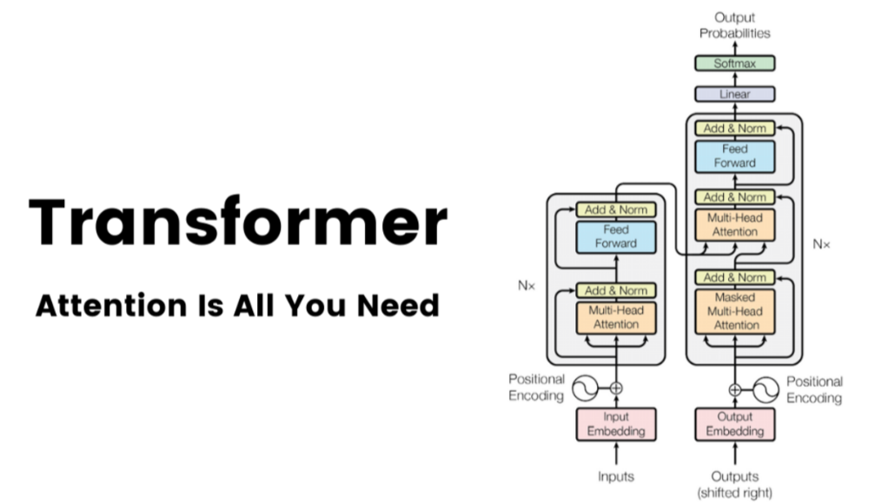
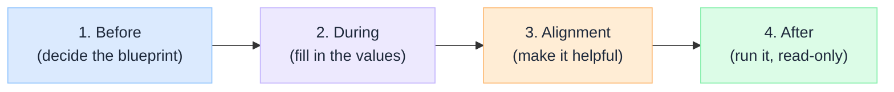
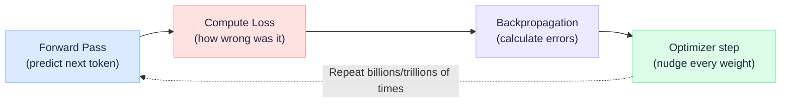
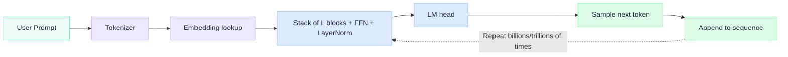

# How LLM Works Under the Hood (and why it Matters for Enterprise Architecture)

Most discussions about LLMs focus on prompts, tools, and frameworks. However, few explain how the model actually works under the hood and why that matters when building real systems.

This is a 20,000-ft view of the LLM lifecycle in four stages.

## The big picture: one model, four stages.
A model's whole life is just four stages. The shape and vocabulary are fixed first; training only fills in the values, and inference is read-only and never learns.

 

| Stage | What happens | Key ideas |
|---|---|---|
| Before | Decide the blueprint | Architecture dials set the shape, tokenizer builds the vocabulary, and parameter count is fixed. |
| During | Fill in the values | Random weights become meaningful through training: a four-step loop run millions or trillions of times. |
| Alignment | Make it helpful | Show good examples (SFT) and teach which answers are better (RLHF/DPO). |
| After | Run it, read-only | Weights are frozen (no learning); inference traverses the model geometry one token at a time. |

:::tip[TAKEAWAY]

Shape + vocabulary are fixed first. Training only fills the values. Inference never learns.

:::

<!-- truncate -->

## Stage 1 - Before training
Two human decisions are baked in before any gradient is computed.
- **Architecture dials** - hidden size, layers, heads, FFN width, vocab size.
- **Tokenizer vocabulary** - the integer alphabet the model reads and writes.

A "7B" model is 7B because of these dials. Training never grows it, and most parameters live in the FFN, not attention.

### The Architecture dials

| Hyperparameter | Example | Description |
|---|---|---|
| hidden_size(D) | 4096 | How much "thinking space" the model has for each word or idea at a given moment.  |
| num_layers(L) | 32 | How many rounds of refinement - 32 editors in a row. |
| num_heads(H) | 32 | A panel of specialists, each spotting a different pattern.|
| head_dim(D_h) | 128 | The size of each specialist's notebook.|
| ffn_hidden(D_ff) | 16,384 | The knowledge bank, where most facts are stored (~4*D).|
| vocab_size(V) | 32000| The size of the model's dictionary, the building blocks it uses to read and write language. |

:::tip[TAKEAWAY]

The model is fully sized and described before it sees a single token.

:::

## Stage 2 - During training

Learning is one four-step loop, repeated hundreds of thousands to millions of times.

1. **Forward Pass** - Predicts what comes next in a sequence, based on previous tokens.
2. **Loss** - How wrong was our prediction?
3. **Backpropagation** - Calculate how much, and how each weight contributed to the error.
4. **Optimizer step** - Update every weight, slightly adjusting each weigh.

:::note

The only thing learned here is the **next-token prediction**: the statistical relationship between tokens given their surrounding context.
Pre-training delivers languages and knowledge; it does not shape behavior (following instructions, being helpful, staying safe). No behavior is learned at this stage: that comes later, in alignment.

:::

### From random numbers to learned meaning 

| Before training (random) | After training (meaning) | 
|---|---|
|Every weight is a random number|Every weight holds a learned value|
|Output is gibberish|Output is fluent, coherent text|
|No grammar, facts, or reasoning|Grammar, facts, and reasoning emerge|
|Structure exists, meaning doesn't|Same structure: now full of meaning|

:::tip[TAKEAWAY]

Learning is the same four-step loop, running hundreds of thousands to millions of times, turning random numbers into meaning.

:::

### The roles that emerge after training
Components start as random numbers with no predefined purpose. After millions or billions of training steps, gradient descent gradually shapes them into specialized roles, learned through experience, not explicitly designed.

| Component | Role it settles into| 
|---|---|
|Embeddings|What tokens mean (lexical meaning)|
|Attention|How tokens relate: routes relevant context|
|FFNs|Transformation / "thinking". Most parameters and reasoning|
|LayerNorm|Keep signals stable and usable|
|Depth (layers)|Progressive refinement of understanding|

:::tip[TAKEAWAY]

No one designs these roles; training gradually turns them into specialist roles through learning rather than design.

:::

## Stage 3 - Alignment
A raw pre-trained model is a brilliant autocomplete, not yet a helpful assistant. Alignment is a thin, cheap layer on top of pre-training that shapes behavior.

|  | Main training| Polish (alignment)| 
|---|---|---|
|Data|Trillions of words|Thousands to millions of examples|
|Length (cost)|Weeks/months, huge cost|Short, cheap|
|What it does|Teaches knowledge|Shapes behavior|

- **SFT** - show it good (prompt, response) examples.
- **RLHF/DPO** - teach it which answer is better.

:::tip[TAKEAWAY]

Alignment turns a raw model into a helpful assistant: it shapes behavior; it doesn't add new knowledge.
:::

## Stage 4 - After training

Once training stops, **weights are frozen**: no learning, no gradients. The model is a fixed function `f(tokens) -> next token probabilities`.

During inference, the model has **no memory** of what was asked or answered before: each request starts fresh. 

:::tip[TAKEAWAY]

Training builds the geometry. Inference just navigates it one token at a time.
:::

## The Mental Model most people get wrong
- LLM ≠ continuously learning systems
- LLM ≠ dynamic knowledge base
- LLM ≠ autonomous agent

## What this means for Enterprise Systems
Understanding how LLMs actually work leads to a critical shift in how we design AI systems. The model itself is not "the system". It's a **fixed component inside a larger architecture**.

### 1. Why RAG is required
LLMs do not have access to fresh and private data. Their knowledge is fixed at training time.

**To make them useful in enterprise:**
**To make them useful in enterprise:**
- Connect them to internal data sources
- Inject context at runtime

This is why **Retrieval Augmentation (RAG)** becomes a foundational pattern.

### 2. Why agents/orchestration are external
LLMs are:
- Stateless
- Reactive
- Single-step predictors

They cannot:
- Execute workflows
- Maintain long-running state
- Coordinate systems

This is why **agentic systems and orchestration layers exist outside the model**

:::important

The intelligence is in the model and the **control** is in the system design.

:::

### 3. Why governance is outside the model
You cannot "patch" behavior inside a trained model in real time. Enterprise systems must implement:
- Guardrails
- Validation layers
- Monitoring and evaluation
- Policy enforcement

All of these sit **around the model, not inside it**

### 4. Why inference cost dominates
Training is:
- One-time
- Expensive but amortized

Inference is:
Inference is:
- Continuous
- Scales with usage

:::important
For enterprise systems:
Cost = traffic * tokens * latency requirements
:::

### 5. Why scale and cost must be designed upfront
Because LLMs don't learn in production, every interaction requires:
- Full inference execution
- Token processing (input+output)
- External system calls (RAG /agents)

This means:
- Cost scales with usage, not with training
- Latency compounds across system layers
- Poor design = exponential cost growth

In real systems, if not handled correctly:
- RAG increases token usage
- Agents introduce multiple-step execution
- Orchestration adds round trips

:::important

Training is a **one-off capital cost**; inference is the **ongoing operational cost**. Also, without careful design, AI systems become **unpredictable and expensive at scale**

:::

## Final Takeaway

The model provides intelligence and the system provides control.

Modern AI architecture is not “LLM design” It is “system design around a frozen model”

Traffic × Tokens × Latency

:::tip[TAKEAWAY]

Treat the LLM as frozen dependency; engineer everything else around it.

:::

