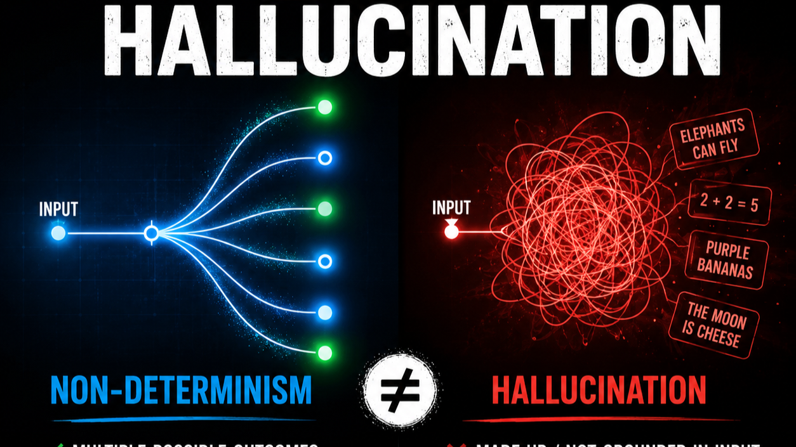
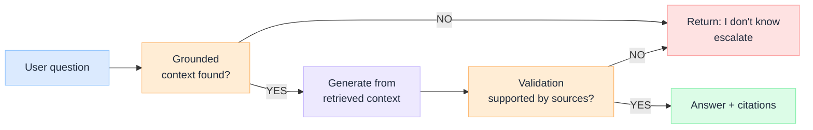
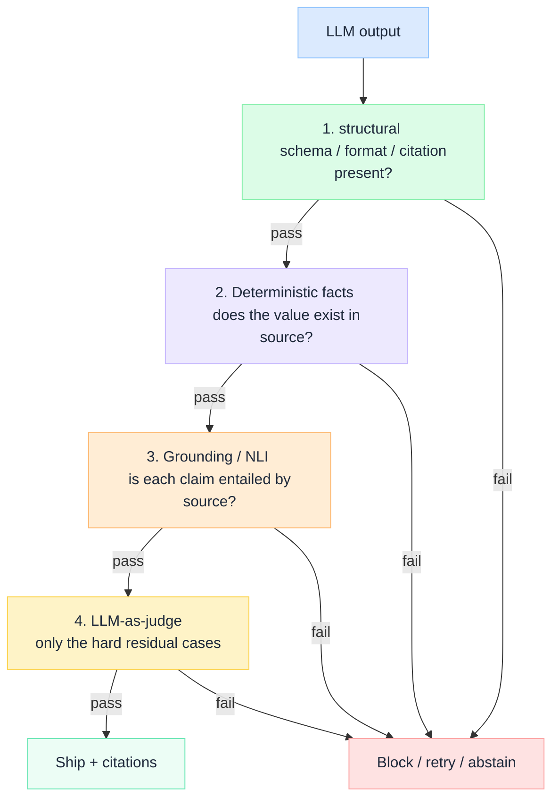

# "Hallucinations" is a System Design Problem, not a Model Problem

Every time a model invents a citation, the conversation jumps to "which model hallucinates less?". That's the wrong question. The model did exactly what it was built to do. Everyone's focused on **picking the model that hallucinates least**.

The thing that will actually decide whether your AI system is trustworthy is **the architecture you wrap around the model** – grounding, retrieval, validation, and an explicit path to "I don't know".

A hallucination isn't a bug the next checkpoint will patch. It's the **expected behavior** of a frozen, probabilistic next-token predictor asked a question it has no grounded answer for. Treating it as a model defect means you keep waiting for a fix that isn't coming. Treating it as a design problem means you can actually solve it today.

:::tip[ THE CLAIM]
Hallucination is not the model failing. It's the model succeeding at the wrong objective – fluent continuation – in a system that never gave it the right one: grounded truth.
:::

<!-- truncate -->
## Why the model was never going to save you

A trained model is a **frozen function**: `f(tokens) -> next-token probabilities`. It has no live knowledge, no source of truth, and no built-in concept of “I don't actually know this”. Three properties make hallucinations structural, not accidental:

|Property of the model |Consequence|
|----------------------|-----------|
|**Frozen at training time**| No access to fresh, private or post-cutoff facts - it fills gaps from priors|
|**Optimized for fluency, not truth**| The objective was plausible next token, never verified fact|
|**No native abstention**| “Confidently wrong” scores the same as confident and right unless the system checks|

So when you ask something outside what it learned, it doesn't error out - it produces the most statistically plausible continuation. That continuation is often fluent, well-formatted, and wrong. The model isn't broken. It's doing precisely what next-token prediction does.

The model invents a citation because inventing a plausible continuation is the only thing it was ever built to do - truth was never in its objective, so it has to be in your architecture.

:::note
A bigger or newer model shifts where the cliff is, not that there is a cliff. You're buying a lower hallucination rate, not a guarantee. Rates don't survive contact with a regulator, an auditor, or a customer who was given a fake policy number.
:::

## Why this is a design problem (the enterprise lens)
If the model can't be the source of truth, **the system has to be**. That reframes hallucinations from "model quality" to "system design" - and design is something you control.

- **Grounding is an architecture choice, not a model feature**. RAG exists precisely because the model's knowledge is frozen. Inject the right context at runtime and the model is *continuing from facts* instead of *inventing from priors*. No retrieval layer = you've delegated truth to a frozen function and hoped.
- **Validation lives outside the model**. Guardrails, schema/grounding checks, and citation verifications sit *around* the model - you can't patch behaviors inside frozen weights in real time. The system decides what's allowed to reach the user, not the model.
- **"I don't know" must be an engineered path**. Models don't volunteer abstention. Confidence thresholds, retrieval-coverage checks, and explicit fallbacks are what turn a confident guess into an honest "I can't answer that from sources I have."
- **Cost and governance ride on this**. An ungrounded answer in a bank, a hospital, or a legal workflow isn't a quality blip - it's liability. Design decides whether a wrong answer is impossible to surface or merely cheap to retry.

:::important
The **intelligence** is in the model. The **truth** is in the system. If your architecture has no component that owns "is this actually true and supported?", then nothing does - and the model will happily fill the silence.
:::

## Non-determinism is not hallucination

This is the objection we hear most, and it's the strongest argument for the design framing - not against it. But it actually bundles two different things together. 

    ### Different answers ≠ Hallucinations

    ||**Non-determinism**|**Hallucination**|
    |-|------------------|-----------------|
    |What it is|Different wording for the same question|A *confident false claim*|
    |Cause|**Sampling** (temperature, top-p) picks among probable tokens|No grounded fact, so it continues from priors|
    |Your control|Yes - set `temperature=0`|Only via grounding + verification|

    The model never stores "an answer". Each step it produces a **probability distribution** over the next token, then *samples* from it. At `temperature > 0` you are rolling a weighted dice every token - hence different phrasings. Set `temperature = 0` (greedy decoding) and it becomes **near-deterministic**: same input -> same output.
     
    `(near, because floating-point rounding and GPU batching cause tiny variations - an engineering detail, not the core issue.)`
     
    So "different answers each time" is a **knob you control**, not proof the model is reliable.

    ### There is no 100% surety – and that’s the whole point

Grounding does not guarantee a correct answer. It shifts the probability mass. Without context, the most-probable continuation comes from *fuzzy* training priors (high risk). With the right context in the prompt, the most-probable continuation becomes *"paraphrase what's in front of me" (much lower risk)*. You move from maybe ~70% to 95% - **never to 100%**.
     
So where does the surety come from? **Not the model - a separate verifier**. The thing that generates the answer must not be the thing that decides it's trustworthy. A grounded model gives you a good draft - 95%; design decides what happens to the other 5%, whether it silently reaches your user or gets caught and blocked.
:::note
You can't make a frozen, sampling-based function promise truth - so reliability **has to** be engineered around it. The model's lack of a guarantee is the reason design exists, not a reason to wait for a better model.
:::

## What “designing for it” actually looks like
Those four principles become one concrete pipeline. You don't eliminate hallucinations by hoping - you **box it in** with layers, each on catching what the last let through.

- **Retrieve before you generate** - give the model facts to continue from, not a blank page.
- **Constrain the output** - structural formats, required citations, schema validation.
- **Verify against the source** - does everything claim trace back to retrieved evidence?
- **Make abstention first-class** - "no grounded answer" is a valid, designed outcome, not a failure.
- **Observe in production** - log groundedness and unsupported claim rates the way you'd log latency, Hallucination is a measurable system metric, not a vibe.

## How to actually build the verifier
"Add a verifier" is easy to say. The trap is building one that just re-asks the same model "are you sure?" - it'll rationalize its own output. A good verifier follows two rules and one ordering.

**Rule 1 - independent from the generator.** The thing that *checks* the answer must not be the thing that wrote it. Use deterministic code, a retrieval system, or a *separate* model call that sees only the claim + the source - never the original reasoning.

**Rule 2 - verify atomic claims, not paragraph** "Mostly right" hides one wrong clause. Decompose the answer into individual facts and check each one against evidence.

**The ordering - cheapest, most deterministic checks first, expensive models last, on the reside only:**

|**Layer**|**Mechanism**|**Catches**|**Cost**|
|---------|--------------|----------|--------|
|**1. Structural**|JSON schema, constrained decoding|No citations, malformed output|~Free|
|**2. Deterministic Facts**|Exact/fuzzy match against source|Invented numbers, IDs, dates, quotes|~Free|
|**3. Grounding (NLI)**|Small entailment model per claim|Unsupported or contradicted claims|Cheap|
|**4. LLM-as-judge**|*Separate* model|Nuanced cases the rest can't settle|Expensive|

The verifier doesn't make the system perfect. It converts a *silent, confident, wrong answer* into a caught-and-blocked one - turning an unbounded risk into a **measurable error rate with a fallback**. That conversation is exactly what you can put in front of an auditor.

## Where I actually land

My point is: I'm not saying models don't matter, or that one model is as good as another. Picking a stronger model genuinely lowers the baseline rate.
 
I am saying: a better model **reduces** hallucinations; only better **design** lets you **bound and govern** it. If your reliability strategy is "wait for the next model," you've outsourced your most important architectural decision to someone else's release schedule - and you still won't be able to promise an auditor anything.
 
Stop asking "which model hallucinates the least?" Start asking **"what in the system owns the truth, and what happens when it doesn't have an answer?"**

:::tip[TAKEAWAY]
Hallucination is the model doing its job inside a system that forgot to do its own. Engineer grounding, validation, and abstention around the frozen model - that's where reliability is actually built.
:::

