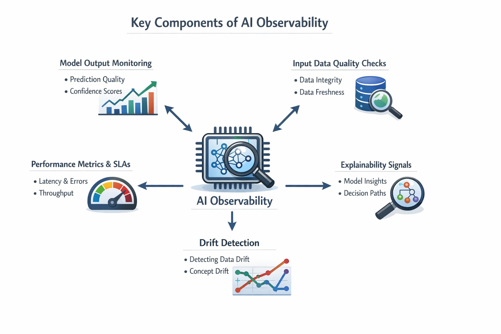
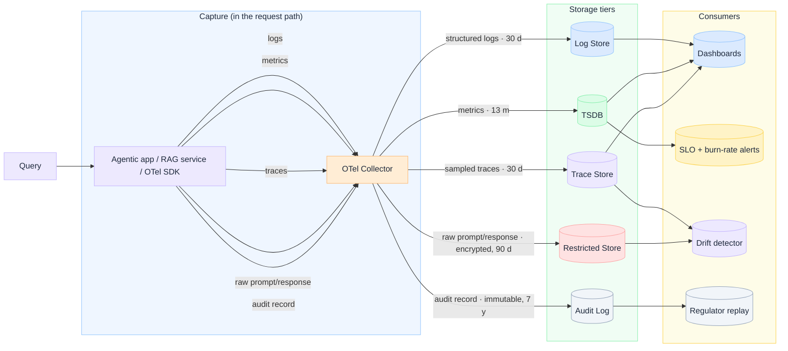
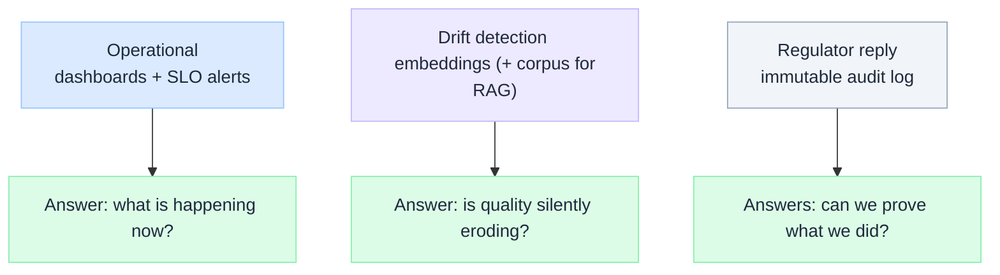

# AI Observability in Enterprise

Everyone says "monitor your AI in production". Almost nobody draws the system that does it. "Add Observability" is a slogan until you can say **exactly what gets captured, where it lands, how long it lives, and who reads it.**

This is an **architecture breakdown** - capture in the request path, fan-out into purpose-built storage tiers, and four very different consumers reading off them. The headline: AI observability isn't one thing. It's **five signals with five retention policies feeding four jobs**, and the regulator-facing ones look nothing like the dashboard-facing ones.
:::tip[THE CLAIM]
AI observability is not "a dashboard". It's a **capture-and-retention architecture**: each signal (logs, metrics, traces, raw prompts, audit records) has a different consumer, a different retention window, and a different blast radius if you get it wrong.
::: 

<!-- truncate -->

## The whole system on one page

Read it left to right: **capture -> store -> consumer**. The rest of this piece is just the reasoning behind each arrow.

:::note[This isn't only for AI]
The `capture->store->consume` backbone here isn't AI-specific. Swap the **Agentic app/ RAG service** node for a microservice, a VM-hosted app, or a cots product and the skeleton is unchanged: emit OTel signals, fan them out to tiers wit deliberate retention, feed operational / SLO/ audit consumers. Only **two boxes are the AI-specific part**, 
the *raw prompt/response* store and the *drift detector*. Drop those and you're left with a perfectly standard service-observability architecture. So you don't need a different observability sta for non-agentic systems, you just need fewer arrows the same one.
:::

## 1. Capture lives in the request path - and that's the hard constraint
The app: an agent, a RAG service, any LLM system: emits **five signals** through an OTel SDK into an **OTel collector** on the hot path: **logs, metrics, traces** (standard OpenTelemetry) plus **raw prompt/response** and **audit records** (governed, AI-specific). Two design consequences fall out immediately:
- **Instrumentation is not free.** Every signal you emit costs latency and money on the request path. That's why the boring signals (metrics) are cheap and always-on, while the expensive ones (traces, raw payloads) are **sampled** or **gated**.
- **The Collector is the control point.** Routing, sampling, redaction, and fan-out happen *once*, in the Collector - not scattered across app code. This is where you strip PII before it every reaches a long-lived store.

:::note
Using vendor neutral **OpenTelemetry** at the capture layer is the decision that keeps your backwards swappable. The signals are standardized; where they land is a routing config, not a rewrite.
:::

## 2. Five Signal, Five storage tiers, five retention policies

This is the part most "monitoring" setups collapse into on bucket - and it's exactly where AI system's differ from ordinary services. **Retention is a governance decision, not a storage default**.
|**Signal**|**Store**|**Retention**|**Why this window**|
|----------|---------|-------------|-------------------|
|**Structured Logs**|Log store|**30 d**|Operational debugging; cheap to keep short, noisy to keep long|
|**Metrics**|Time Series DB (TSDB)|**13 mo**|Trend + year-over-year comparison, tiny per-point cost|
|**Sampled Traces**|Trace store|**30 d**|Latency/causality debugging; full traces are expensive, so sample|
|**Raw prompt/response**|Restricted store|**encrypted, 90 d**|Sensitive content: quality/drift analysis, tightly access-controlled|
|**Audit record**|Audit log|**immutable, 7 y**|Compliance evidence: must survive, must not be editable|

The two dotted arrows in the diagram matter. **Raw prompt/response** and **audit records** are not routine telemetry - they are **sensitive, governed** signals. One is encrypted and short-lived; the other is immutable and kept for years. Treating either like a normal log is how you end up with PII in a debug dashboard or a compliance gap at audit time.

:::important
If your "observability" stores everything in one tier with one retention setting, you have made a governance decision by accident. The raw-prompt store and the audit log have **opposite** requirements *short + erasable vs long + immutable* and conflating them fails both.
:::

## 3. Four consumers, four different questions
Storage isn't the point; the questions you can answer are. Each consumer reads a different tier.
- **Dashboards** (logs + metrics + traces) - *what is the system doing right now*? The operational view.
- **SLO + burn-rate alerts** (metrics) - *are we spending our error budget too fast?* Pages a human before users feel it.
- **Drift detector** (traces + raw prompts + embeddings) - *is the input distribution moving away from what we tested - and from RAG, is the retrieval corpus drifting too*? This is the AI-specific one; model quality erodes silently as the world changes.
- **Regulatory replay** (audit log) - *can we reconstruct exactly what the system did, months later, for someone who wasn't there?* The immutable trail.

The split is the insight: **operational health, model-quality erosion, and provable accountability are three different jobs.** A latency dashboard tells you nothing about drift. A drift detector can't satisfy an auditor. You need all three, fed by the right tiers.

## Why this is an architecture problem, not a tooling purchase
You can buy dashboard. You cannot buy the **decision** in this diagram.
- **What to sample** (trace, raw payloads) vs **always capture** (metrics): a latency/cost trade off.
- **where redaction happens** (the collector, before persistence): a privacy boundary. 
- **Which tier is immutable** (the audit log): a compliance commitment you design in, not bolt on.
- **What "healthy" means**  (the SLOs and drift thresholds): domain knowledge no tool ships with.

:::note
This is the same thesis as ["Hallucination" is a design problem:](./hallucinations-is-a-system-design-problem-not-model-problem) reliability lives in the **system around the model.** Observability is how you *measure* that reliability: groundedness, unsupported-claim rate and drift become metrics you log the way you'd log latency.
:::

## The precise position

Most teams stand up a metrics dashboard, call it "AI observability," and move on. That covers exactly one of the four consumer above and not the two that regulators and quality erosion will eventually make you care about.

The architecture that actually holds up captures **five signals with deliberate retention**, redacts **at the collector** and feeds **four distinct consumers**: operational, budget, drift and audit. The diagram isn't decoration; it's the set of decisions you will be asked to defend.

:::tip[TAKEAWAY]
"Monitor your AI" is a slogan. **Capture five signals, route them to tiers with deliberate retention, and feed four consumers, dashboards, SLO alerts, drift detection, and regulatory replay.** That's the system, everything else is a dashboard pretending to be a strategy.
:::
