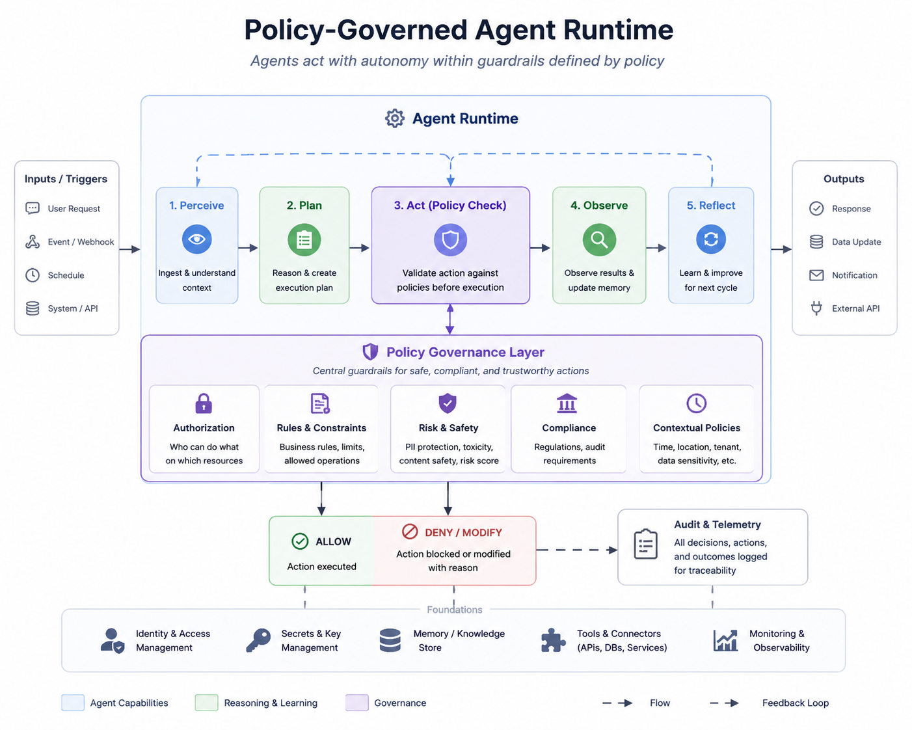
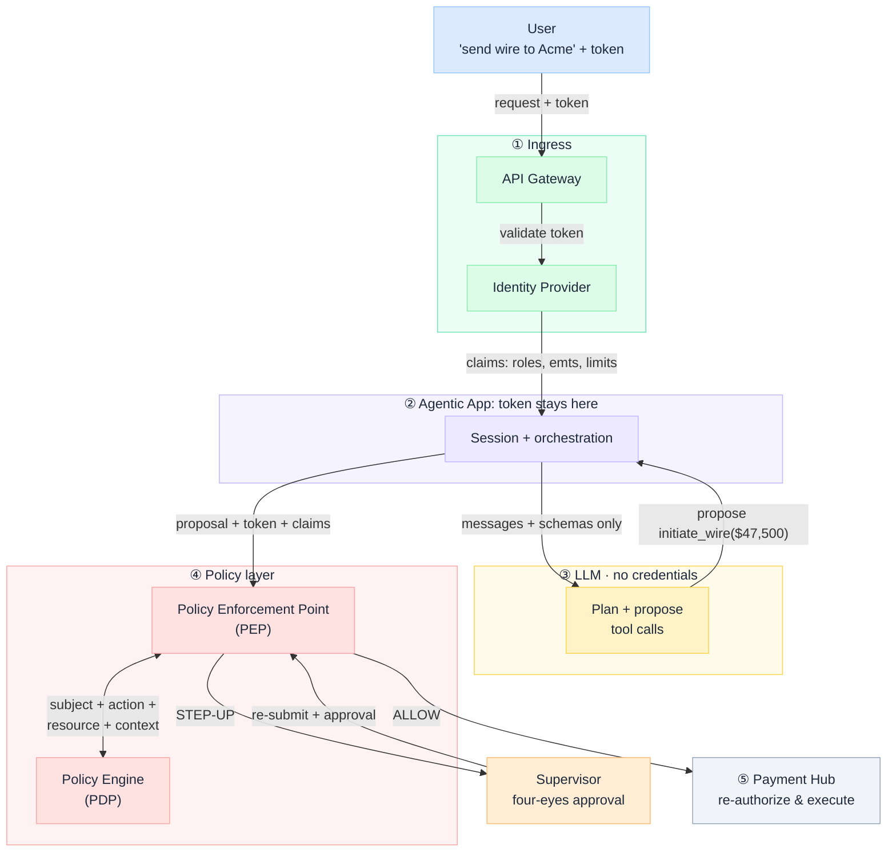
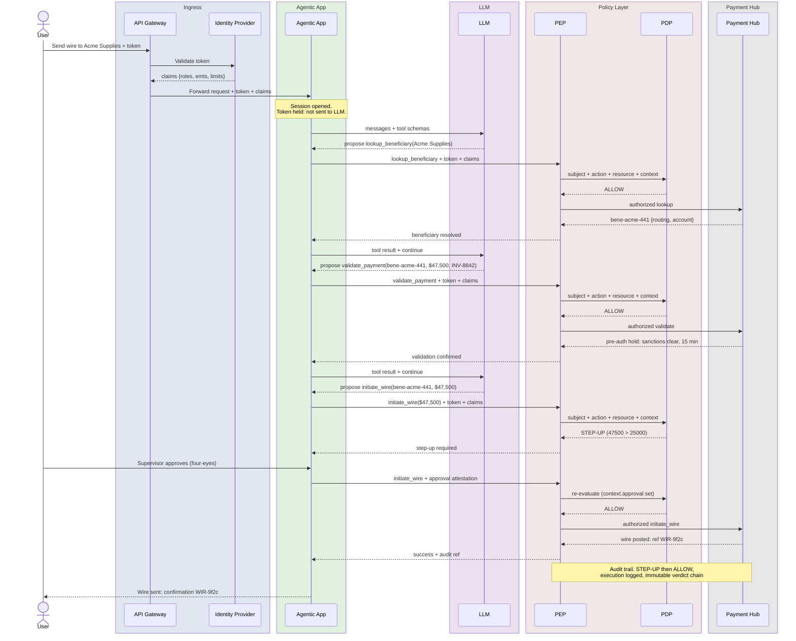

import Details from '@theme/Details';



# Policy-Governed Agent Runtime

Enterprise teams, especially in **banking and other regulated industries**, are connecting agents to operational tools: payment rails, core banking APIs, KYC workflows, trade settlement. Most production designs still leave undefined where **token**, **identity**, and **policy** state live during execution. The failure mode is not "the model misbehaved." It is "we cannot prove who authorized what, with which policy, before money moved."

This is an **architecture breakdown** of runtime trust boundaries. The LLM operates on conversation and tool schemas only. The Identity Provider owns claims. The Policy Engine (PDP) returns verdicts. The Policy Enforcement Point (PEP) gates every tool invocation and forwards only what policy allows.

:::tip[THE CLAIM]
**Proposal is not permission.** An agent **proposes** tool calls. Governance **decides** whether they run. Policy in the prompt or the weights is not enforcement: it's a suggestion the model may ignore.

In a Policy-Governed Agent Runtime (PGAR), the token and policies stay out of the LLM. The model proposes. The PEP enforces. The PDP decides. Governance lives on the execution path, not in the system message: the same separation banks already enforce between a teller's screen and the authorization engine behind a wire transfer.
:::

<!-- truncate -->

## The whole system on one page

Five trust boundaries. Token and policy never cross the LLM boundary (③).

- **① Ingress** (API Gateway + Identity Provider): receives the request, validates the token, issues claims
- **② Agentic App**: holds the session and token; **never** sends either to the LLM
- **③ LLM**: gets conversation + tool schemas only; proposes a tool call
- **④ Policy layer** (PEP + PDP): receives the proposal + token; PDP returns a verdict
- **⑤ Downstream** (Payment Hub): PEP calls only on **Allow**; service re-authorizes



Read it across those five boundaries: **ingress → agentic app → LLM proposes → PEP asks PDP → downstream executes**. Most agent security stops at ② and never builds a real ④ or ⑤ re-auth. The rest of this piece walks that path: why prompt guardrails and per-API auth fail, then one wire request traced end to end with the contracts underneath.

## Why prompt guardrails aren't authorization

**Proposal is not permission.** Most production agents today are **prompt-governed**: rules in the system message, hope in the middle, tools at the end. That works until someone asks a regulator, a security team, or a compliance officer to explain *why* an agent initiated a $47,500 wire without four-eyes approval, or released a payment to a beneficiary that failed sanctions screening.

| | Prompt-based guardrails | PGAR |
|---|---|---|
|**Where policy lives**| System prompt / fine-tuned behavior | PDP, enforced by PEP, outside the model |
|**Enforcement**| Probabilistic: model may comply | Deterministic. PEP blocks or allows on PDP verdict |
|**Token handling**| Often in context or env-injected | Agentic App + PEP only; never in LLM input |
|**Auditability**| "The model was told not to" | Structured PEP/PDP decision log per proposal |
|**Prompt injection resistance**| Weak: attacker rewrites the "rules" | Strong: attacker cannot see or rewrite PDP rules |
|**Failure mode**| Silent violation | Explicit deny or step-up |
|**Regulatory posture**| Hard to defend under model-risk or operational-resilience scrutiny | Verdict chain, policy version, and immutable audit: the artifacts examiners ask for |

In banking terms: prompt guardrails are like posting "do not exceed transaction limits" on the break-room wall. PGAR is the core authorization engine that actually holds or releases the payment.

:::important[AUTHORIZATION ≠ PROMPTING]
Prompt guardrails shape behavior: tone, format, abstention. They are **not** a substitute for authorization. PGAR owns the layer guardrails were never built to hold.
:::

### Why per-API authorization isn't enough

*We already authorize every REST call. Isn't that enough?*

In microservices, deterministic code calls authorized APIs. Agents insert a **probabilistic orchestrator**: the LLM proposes tool calls (what, in what order, with what arguments) before any request leaves the runtime. Per-API auth decides whether `POST /wires` may run; it does not govern whether the **agent should have proposed** that wire for $47,500 without four-eyes attestation, or whether a multi-step chain (`lookup` → `validate` → `initiate`) satisfies compound policy across amount limits, sanctions context, and approval state. API access logs show that a call succeeded; they do not record **which policy version allowed the proposal before side effects**. PGAR does not replace downstream re-auth: Payment Hub still checks the token. The PEP governs the **proposal mile** between model output and API invocation, and writes the verdict chain examiners expect.

### Prediction vs. truth on the execution path

Regulated systems need both: in different places. The LLM is a **predictor**: it infers intent, sequences tool calls, and drafts user-facing language. That is appropriate work for a probabilistic model. **Authorization is not prediction.** Whether $47,500 exceeds a $25,000 limit, whether a beneficiary cleared sanctions, whether four-eyes attestation is present: these are boolean facts evaluated against policy, not continuations the model might get right most of the time.

| Task | Who owns it | Why |
|---|---|---|
| Parse "send wire to Acme for INV-8842" | LLM (proposal) | Intent and phrasing: prediction is fine |
| Decide if officer may initiate wire | PDP (verdict) | Entitlement: must be deterministic |
| Compare amount to `wire.auto_approved` | PDP (verdict) | Limit check: arithmetic, not fluency |
| Screen beneficiary against sanctions | Payment Hub + PDP | External truth: the model has no source |
| Record who approved before funds move | PEP (audit) | Evidence: cannot be inferred |

Put limits, entitlements, and sanctions in the prompt and you have delegated **truth to a predictor**. PGAR keeps prediction upstream (what to propose) and truth on the execution path (whether it may run). Treating "the model usually respects the rules" as authorization evidence fails model-risk and operational-resilience review: not because the model is bad, but because examiners require **replayable verdicts**, not plausible behavior.

:::important[PREDICTION VS. TRUTH]
**Intelligence in the LLM. Truth in the PDP.** Never conflate proposal with permission on the path that moves money, data, or regulatory scope.
This is the same thesis as ["Hallucination" is a design problem](./hallucinations-is-a-system-design-problem-not-model-problem): reliability and control live in the **system around the model**. PGAR is what that looks like when the system needs to **authorize actions**, not just validate answers.

:::


## Corporate wire: one request through five boundaries

The overview diagram shows five trust boundaries; the sequence below walks every hop inside them.

User says: *"Send $47,500 to Acme Supplies for invoice INV-8842: use our operating account."* The LLM sees three tool schemas. `lookup_beneficiary`, `validate_payment`, `initiate_wire`. With no authority attached. This request exercises all three: **lookup** the payee, **validate** the payment (limits, sanctions, cut-off), **initiate** the wire. The PDP watches three risk triggers the model never sees: **amount above auto-approval limit** (STEP-UP), **scope or entitlement violation** (DENY), and **sanctions or high-risk corridor hit** (DENY or STEP-UP).

When something goes wrong: or during a scheduled review: compliance and regulators do not ask "what did the model intend?" They ask:

:::note[WHAT EXAMINERS ASK]
- **Which policy version decided?** Every PEP log must carry `pgar.payments.wire/v3` (or equivalent), not "the system prompt from Tuesday."
- **Was execution blocked until attestation?** Proof that STEP-UP fired and ALLOW came only after supervisor four-eyes, not after the model "felt confident."
- **Can you replay the verdict chain without model logs?** Subject, action, resource, context, verdict: immutable, before side effects. Chat transcripts are discovery; PEP/PDP records are evidence.

Prompt-governed agents struggle on all three. PGAR is built to answer them by construction.
:::



**Step-up is a PDP verdict, not a model feature.** The model was never wrong for proposing $47,500: it was never given the $25,000 auto-approval limit. The PEP surfaces STEP-UP, the Agentic App owns four-eyes approval UX, and only a subsequent **Allow** reaches the Payment Hub. That attestation is what lands in the compliance archive: who authorized the exception, against which policy version, before a single dollar moved.

### When the PDP says DENY

:::important[EXPLICIT DENY, NOT SILENT VIOLATION]
The sequence above walks STEP-UP. The same architecture handles the case regulators care about most. App forwards `validate_payment` to the PEP. Payment Hub returns `sanctions_status: hit`. PEP asks the PDP; verdict is **DENY**. The flow stops: `initiate_wire` is never proposed to execution, no amount argument, no model override, no "we told it not to." The audit record shows DENY with policy version and redacted context **before** any funds move. Prompt-governed agents fail silently here: the model may still propose the wire, or explain around the block in fluent language, with no immutable evidence that authorization was refused. PGAR turns that into an explicit, replayable block: the failure mode AML and sanctions examiners expect when a control trips.
:::

## From diagram to contracts

If you can answer examiner questions from PEP/PDP logs alone, you have PGAR. If you need the chat transcript, you don't. The sequence diagram is the story; these payloads are the contracts that make the verdict chain replayable.

Every PDP evaluation uses the same four-field shape: **who** (subject), **what** (action), **on what** (resource), **under what conditions** (context).

Click each block to expand. Collapsed by default.

### 1. Token and claims stay in the Agentic App

<Details summary="Token and claims (JSON)">

The token never enters the LLM request. It stays in the session and attaches to every Agentic App → PEP → Payment Hub call.

```json
{
  "token": "eyJhbGciOiJSUzI1NiIs...",
  "claims": {
    "iss": "https://idp.bank.example",
    "sub": "officer-123",
    "email": "jitender@bank.example",
    "act": { "sub": "officer-123" },
    "sct": { "type": "access" },
    "roles": ["corporate_banking_officer", "payments_initiator"],
    "emt_iat": 1718812800,
    "emt_exp": 1718899200,
    "emts": {
      "payments.lookup": true,
      "payments.validate": true,
      "payments.wire.initiate": true
    },
    "limits": {
      "wire.auto_approved": 25000,
      "wire.above_requires": "supervisor_four_eyes"
    },
    "portfolio_accounts": ["acct-operating-4412"],
    "iat": 1718812800,
    "exp": 1718816400
  }
}
```

</Details>

### 2. What the LLM actually sees

<Details summary="LLM request payload (JSON)">

This is the payload that crosses the Agentic App → LLM boundary. Notice what's missing.

```json
{
  "messages": [
    { "role": "user", "content": "Send $47,500 to Acme Supplies for invoice INV-8842: use our operating account." }
  ],
  "tools": [
    {
      "name": "lookup_beneficiary",
      "parameters": { "payee_name": "string", "invoice_ref": "string" }
    },
    {
      "name": "validate_payment",
      "parameters": { "beneficiary_id": "string", "amount": "number", "source_account": "string", "reference": "string" }
    },
    {
      "name": "initiate_wire",
      "parameters": { "beneficiary_id": "string", "amount": "number", "source_account": "string", "reference": "string" }
    }
  ]
}
```

</Details>

No `Authorization` header. No `roles`, `emts`, or `limits`. No policy text.

:::important[THE PGAR TEST]
If any of those appear in your LLM payload, you don't have PGAR. You have prompt governance.
:::

### 3. What the PEP sends to the PDP

The PEP doesn't send natural language to the PDP. It maps session **claims** into **subject**, adds the tool proposal as **action**, **resource**, and **context**, and calls the PDP.

| Field | Source | Carries |
|---|---|---|
|**subject**| Session `claims` (see above) | Who: same identity, roles, entitlements, and limits held in the Agentic App |
|**action**| Tool proposal name | What. `lookup_beneficiary`, `validate_payment`, `initiate_wire` |
|**resource**| Tool proposal target | On what: beneficiary, source account, wire payment |
|**context**| Proposal + runtime state | Conditions. `amount`, `sanctions_status`, `approval` |

<Details summary="PEP → PDP authorization request (JSON)">

```json
{
  "subject": {
    "iss": "https://idp.bank.example",
    "sub": "officer-123",
    "email": "jitender@bank.example",
    "act": { "sub": "officer-123" },
    "sct": { "type": "access" },
    "roles": ["corporate_banking_officer", "payments_initiator"],
    "emt_iat": 1718812800,
    "emt_exp": 1718899200,
    "emts": {
      "payments.lookup": true,
      "payments.validate": true,
      "payments.wire.initiate": true
    },
    "limits": {
      "wire.auto_approved": 25000,
      "wire.above_requires": "supervisor_four_eyes"
    },
    "portfolio_accounts": ["acct-operating-4412"],
    "iat": 1718812800,
    "exp": 1718816400
  },
  "action": "initiate_wire",
  "resource": {
    "type": "wire_payment",
    "beneficiary_id": "bene-acme-441",
    "source_account": "acct-operating-4412",
    "reference": "INV-8842"
  },
  "context": {
    "amount": 47500,
    "sanctions_status": "clear",
    "approval": null
  }
}
```

</Details>

After step-up, the same request returns with `context.approval` set to `{ "type": "supervisor_four_eyes", "attestation_id": "apr-9f2c" }`. And the PDP re-evaluates.

### 4. Policy rules: three verdicts, no fourth option

<Details summary="Wire payment policy rules (JSON)">

The PDP runs one policy surface. Three outcomes only: **ALLOW**, **DENY**, **STEP_UP**. No "the model said it was fine."

```json
{
  "policy_id": "pgar.payments.wire",
  "default_decision": "DENY",
  "rules": [
    {
      "decision": "DENY",
      "when": {
        "action": ["initiate_wire", "validate_payment"],
        "subject.emts.payments.wire.initiate": false
      }
    },
    {
      "decision": "DENY",
      "when": {
        "action": ["validate_payment", "initiate_wire"],
        "context.sanctions_status": "hit"
      }
    },
    {
      "decision": "ALLOW",
      "when": {
        "action": "lookup_beneficiary",
        "subject.emts.payments.lookup": true
      }
    },
    {
      "decision": "ALLOW",
      "when": {
        "action": "validate_payment",
        "subject.emts.payments.validate": true,
        "context.sanctions_status": "clear"
      }
    },
    {
      "decision": "ALLOW",
      "when": {
        "action": "initiate_wire",
        "context.amount.lte": "subject.limits.wire.auto_approved",
        "context.sanctions_status": "clear"
      }
    },
    {
      "decision": "STEP_UP",
      "when": {
        "action": "initiate_wire",
        "context.amount.gt": "subject.limits.wire.auto_approved",
        "context.approval": null
      }
    },
    {
      "decision": "ALLOW",
      "when": {
        "action": "initiate_wire",
        "context.amount.gt": "subject.limits.wire.auto_approved",
        "context.approval.present": true,
        "context.sanctions_status": "clear"
      }
    }
  ]
}
```

</Details>

OPA, Cedar, your IAM PDP, or an internal rules engine can implement this surface: the requirement is **structured input, deterministic output**, evaluated by the PDP, not natural-language policy in a system prompt.

### 5. The PEP. Structural, not conventional

The PEP sits between *proposal* and *execution*. The Agentic App cannot call the Payment Hub directly: every path goes through the PEP, which runs the same four steps on every proposal:

1. **Receive the input**: the tool proposal (`initiate_wire` to `bene-acme-441` for $47,500, no approval yet), the bearer token, and the subject's claims.
2. **Assemble and ask the PDP**: map proposal and claims into the subject/action/resource/context request and call the PDP. Here the PDP returns **STEP_UP**, reason `wire_above_auto_approved`.
3. **Write the audit record**: every verdict is logged with the subject, action, resource, redacted context, the policy version that decided it (`pgar.payments.wire/v3`), and the verdict itself: immutable, before any side effect.

:::note[DECISION FIRST, EXECUTION SECOND]
This is the record operational-resilience and model-risk reviewers expect: verdict logged before any side effect: no retroactive narrative.
:::

4. **Act on the verdict**: only **ALLOW** reaches the Payment Hub; **STEP_UP** returns a step-up-required response to the Agentic App; **DENY** returns a refusal. In this case the PEP responds *not executed, step-up required*. The wire never touched the payment rail.

:::important[STRUCTURAL ENFORCEMENT]
If the Agentic App can call downstream services **without** passing through the PEP, you don't have enforcement: you have a suggestion. The choke point must be structural, not conventional.
:::

## Why this is an architecture problem, not a sprint item

You can buy an agent framework in an afternoon. You cannot buy the **boundary decisions** PGAR requires: those are architecture commitments someone will have to defend to security, finance, internal audit, and regulators.

:::note[WHO MUST DEFEND THIS]
In a bank, that conversation happens with model-risk management, second-line compliance, and the teams who already own payment authorization: not only with the squad shipping the chatbot.
:::

| Engineering thinks… | Architecture decides… |
|---|---|
|"Put the wire limit in the system prompt"| Where policy is evaluated. PDP, deterministically, on structured input at the PEP |
|"The model will learn to respect the rules"| What the LLM is allowed to see: schemas yes, credentials and entitlements no |
|"We'll add auth later"| Whether every path to downstream services goes through the PEP or some paths bypass it |
|"Identity is the IdP team's problem"| How claims flow to the PDP without ever reaching the LLM |
|"Logging is a nice-to-have"| Which PEP/PDP decisions are immutable audit events vs. sampled debug traces |
|"One team owns the agent"| Who owns the gateway, identity, policy, and service boundaries: four different stakeholders, often four different lines of defense in a regulated firm |

PGAR is the control surface for *actions* in a governed agent stack: intelligence stays in the LLM, control in the PEP + PDP, and every verdict is an audit-grade event, not a sampled trace.

**Implementation series:** [PGAR Blueprint](/blueprints/pgar-blueprint) · [PGAR Runtime playbooks](/playbooks/pgar-runtime) · [PGAR with RAG](/insights/retrieval-is-a-governed-action)

:::tip[TAKEAWAY]
**Proposal is not permission.** The LLM proposes. The Agentic App holds the token. The PDP decides. The PEP enforces. Downstream services re-authorize. That is PGAR: governance as architecture, not as a paragraph in the system prompt.

If the Agentic App can reach downstream without the PEP, you have a demo, not governed production.
:::
