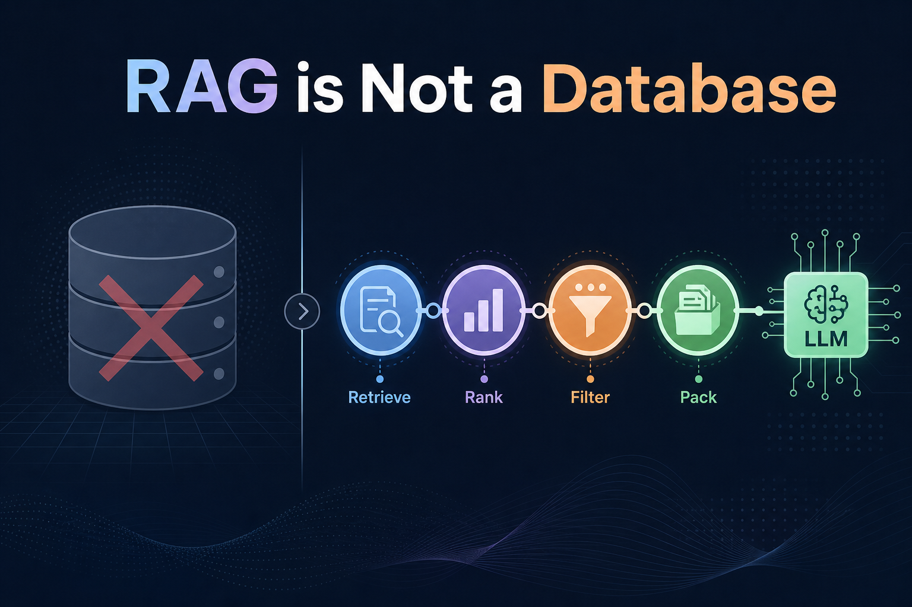
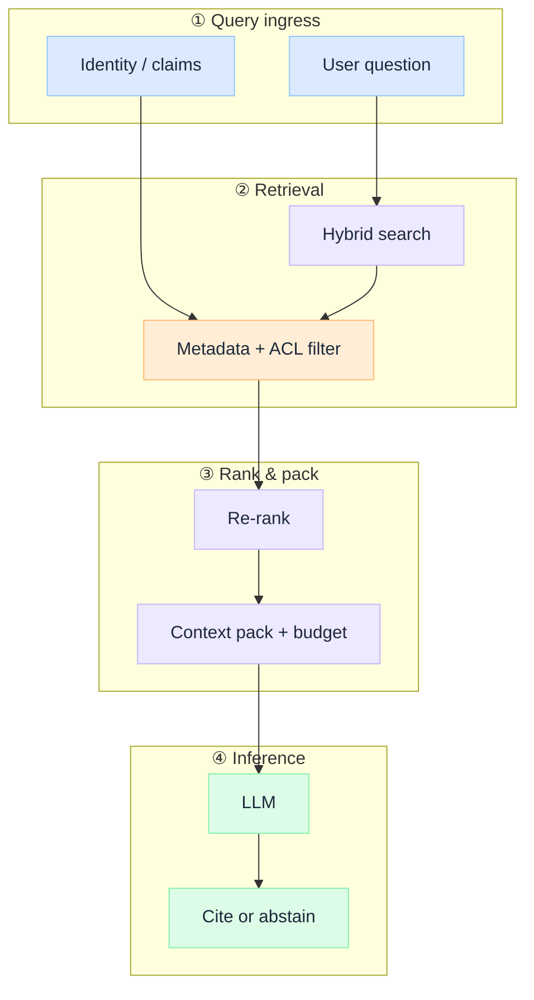

 

# RAG Is Not a Database

*Runtime context construction for the right principal, on this request, with replay.*

A team ships RAG, passes the demo, and three weeks later a user retrieves a document they were never allowed to see. The vector store did its job. The architecture was never there to stop it.

I see the same root cause every time: teams ask which vector database to buy before they have defined what "retrieval" means in their system. In practice that looks like: Pinecone or pgvector chosen in week one, data engineering owns ingest, product owns the chatbot, and **`similarity_search(k=5)`** ships from the notebook as "production RAG." Nobody owns **query-time governance**.

That question assumes RAG is a data layer: ingest documents, embed them, query at runtime, paste chunks into a prompt. Storage solved, problem solved.

It is not. The vector index is a **candidate store**. The **application owns truth** at query time: who may see which chunks, which survive ranking, and whether the model may answer at all. In audit, RAG is not "search." It is **evidence assembly with identity and replay**.

This is an **architecture breakdown** of what RAG actually is in production. For principles, see [G.A.I.N RAG](/frameworks/gain-rag).

:::info[Related]
**Foundation insight.** When agents propose `retrieve_*` tools, continue to [Retrieval Is a Governed Action](/insights/retrieval-is-a-governed-action) for PEP/PDP enforcement on that path.
:::

:::tip[THE CLAIM]
**RAG is not a database. It is runtime context construction:** a governed pipeline that assembles the right evidence, for the right principal, at query time, before inference begins.

Buying a vector DB answers **where chunks live**, not **who may see them or when the model may answer**. Treating RAG as storage leads teams to optimize embedding models and chunk sizes while skipping the layers that decide whether the answer is grounded.
:::

<!-- truncate -->

## Why the database mental model fails

The database framing is seductive because it maps to familiar CRUD workflows. Ingest PDFs. Chunk. Embed. Store. Query. Ship.

Production RAG does not look like that. At query time the system must:

1. **Scope retrieval to identity** (not every user sees every chunk)
2. **Retrieve candidates** (often hybrid: lexical + vector + metadata filters)
3. **Rank and filter** (relevance is not cosine similarity alone)
4. **Pack context** (budget tokens, dedupe, attribute sources)
5. **Decide whether to answer** (abstain when evidence is thin)

None of those steps live inside the vector store. The store holds vectors and metadata. The **pipeline** owns truth boundaries.

| | Database mental model | RAG as context construction |
| --- | --- | --- |
| **Primary job** | Persist and return stored records | Assemble governed evidence for one inference call |
| **Success metric** | Query latency, index size | Grounded answer with attributable sources |
| **Identity** | Often ignored until audit | Scoped retrieval per principal from day one |
| **Failure mode** | Empty result set | Fluent hallucination with no abstention gate |
| **Ops focus** | Reindex when docs change | Eval harness, freshness, access policy, replay |
| **Who owns quality** | Data engineering | Application + platform architecture |

The gap shows up in regulated environments first. An auditor does not ask which vector DB you picked. They ask: **who retrieved what, under which policy, and what did the model see?** A database answer does not satisfy that question. A pipeline with identity-scoped retrieval, ranked context packs, and structured attribution does.

### Two failure modes (do not conflate them)

A database mindset treats both as "bad query results." A pipeline mindset treats them as **different design problems**:

| Failure | What happened | System response |
| --- | --- | --- |
| **Empty retrieval** | Nothing worth citing | **Abstain**; do not let the model guess |
| **Wrong retrieval** | Something plausible, not true | **Ranking, thresholds, attribution**; cite or refuse |

Symptoms in production map cleanly: **leakage** when identity never bound retrieval; **confident wrong cites** when cosine similarity passed but ranking did not; **no replay story** when you have index stats and chat logs but not the assembled context pack. Same root cause: the pipeline was never designed, only the index.

## What actually runs at query time

RAG is not "fetch top-k chunks." It is a short-lived assembly line that produces a **context pack**: the bounded input the model is allowed to reason over.

Four boundaries, one request:

- **① Ingress:** bind the question to a principal. Retrieval without identity is a data leak waiting for production traffic.
- **② Retrieval:** candidate generation, not final context. Hybrid search and ACL filters shrink the candidate set before ranking spends compute.
- **③ Rank & pack:** re-ranking is where most quality wins hide. Token budgeting and deduplication turn "top-k blobs" into a coherent evidence pack.
- **④ Inference:** the model reasons over the pack. Citation and abstention are system outcomes, not prompt wishes.

:::important[The storage boundary]
**The vector index stores candidates. It does not store truth.**

Truth is the outcome of the full pipeline: scoped retrieval, ranked evidence, attributed context, and an explicit decision to answer or abstain. Optimizing the index without designing these layers is how teams ship fluent wrong answers at scale.
:::

## Demo vs production

| Layer | Demo default | Production default |
| --- | --- | --- |
| **Identity** | Single shared index | Per-principal ACL on every retrieval path |
| **Retrieval** | Vector top-k | Hybrid search + metadata filters + freshness rules |
| **Ranking** | Skipped ("similarity is enough") | Re-ranker + score thresholds + dedupe |
| **Context pack** | Concatenate chunks | Token budget, source attribution, versioned templates |
| **Output** | Model free-text | Cite sources or abstain; log what entered the pack |
| **Change** | Re-embed when someone notices drift | Eval gate on index updates; replay for regulators |

The demo path works in a notebook. The production path is what survives the first compliance review.

## The procurement reframe

Wrong question: "Which vector database?" Right questions:

- **Identity:** how does each retrieval path bind to the caller's claims?
- **Audit:** what gets logged in the context pack for replay?
- **Abstention:** when evidence falls below threshold, do you stop or guess?

Freshness and scope answer to the pipeline too. Stale embeddings, document versions, who-may-see-what-today, sources spread across CRM, tickets, and policy engines: none of that lives in one datastore. Which is the whole point.

Context construction is necessary. In **agentic RAG** it is also a **governed action**: the model or orchestrator proposes a search; policy decides whether it runs and which corpus may enter context. That is where [Retrieval Is a Governed Action](/insights/retrieval-is-a-governed-action) picks up — this insight defines the pipeline; PGAR defines enforcement when agents propose `retrieve_*` tools.

Vector stores matter. Chunking matters. The mistake is stopping there. Trustworthy teams treat the index as **input to a pipeline**, not the product. They design identity binding, ranking thresholds, context-pack logging, and abstention before they debate embedding dimensions.

Stop asking "which vector database?" Start asking **"what assembles evidence for this principal, on this request, and what do we do when that assembly fails?"**

:::tip[TAKEAWAY]
**RAG is not a database. It is runtime context construction** scoped to identity, ranked for relevance, packed for the model, and auditable end to end.

In a demo, retrieval is a query. In production, retrieval is architecture.
:::
